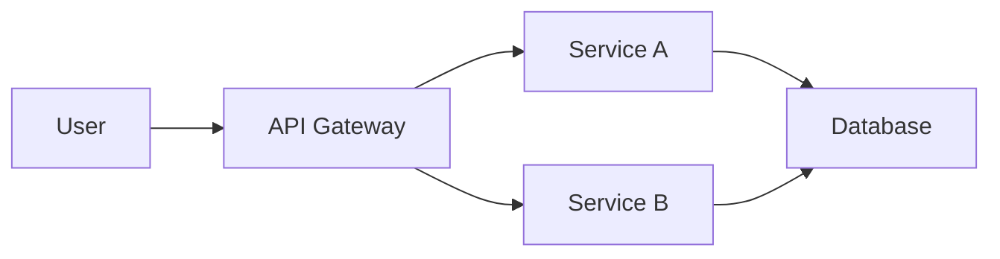

# Super Saiyan Mode: Documentation Sites

**Platform**: Static site generators (Jekyll, Hugo, MkDocs, Sphinx, Docusaurus, etc.)

## Docs Philosophy

Documentation is a product:
- **Fast**: <2s load time
- **Searchable**: Full-text search
- **Readable**: Typography matters
- **Navigable**: Clear structure
- **Accessible**: WCAG AA compliance
- **Beautiful**: Visual appeal aids comprehension

**Goal**: Make docs a joy to read and navigate

## Technology Stack

### Jekyll (Ruby)
```bash
gem install jekyll bundler
```

### Hugo (Go)
```bash
brew install hugo  # Mac
```

### MkDocs (Python)
```bash
pip install mkdocs mkdocs-material
```

### Docusaurus (React)
```bash
npx create-docusaurus@latest
```

## Docs Super Saiyan Features

### 1. Beautiful Typography 📖

```css
/* Typography scale */
:root {
  /* Font families */
  --font-heading: 'Inter', -apple-system, sans-serif;
  --font-body: 'Inter', -apple-system, sans-serif;
  --font-code: 'JetBrains Mono', 'Fira Code', monospace;

  /* Font sizes (fluid typography) */
  --text-xs: clamp(0.75rem, 0.7rem + 0.25vw, 0.875rem);
  --text-sm: clamp(0.875rem, 0.8rem + 0.375vw, 1rem);
  --text-base: clamp(1rem, 0.95rem + 0.25vw, 1.125rem);
  --text-lg: clamp(1.125rem, 1.05rem + 0.375vw, 1.25rem);
  --text-xl: clamp(1.25rem, 1.15rem + 0.5vw, 1.5rem);
  --text-2xl: clamp(1.5rem, 1.35rem + 0.75vw, 1.875rem);
  --text-3xl: clamp(1.875rem, 1.65rem + 1.125vw, 2.25rem);
  --text-4xl: clamp(2.25rem, 1.95rem + 1.5vw, 3rem);

  /* Line heights */
  --leading-tight: 1.25;
  --leading-snug: 1.375;
  --leading-normal: 1.5;
  --leading-relaxed: 1.625;
  --leading-loose: 2;
}

/* Apply to docs */
body {
  font-family: var(--font-body);
  font-size: var(--text-base);
  line-height: var(--leading-relaxed);
  color: #1f2937;
}

h1, h2, h3, h4, h5, h6 {
  font-family: var(--font-heading);
  font-weight: 700;
  line-height: var(--leading-tight);
  margin-top: 2em;
  margin-bottom: 0.5em;
}

h1 { font-size: var(--text-4xl); }
h2 { font-size: var(--text-3xl); }
h3 { font-size: var(--text-2xl); }

code {
  font-family: var(--font-code);
  font-size: 0.9em;
}
```

### 2. Color System 🎨

```css
/* Super Saiyan Docs Palette */
:root {
  /* Light mode */
  --color-bg: #ffffff;
  --color-surface: #f9fafb;
  --color-border: #e5e7eb;
  --color-text: #1f2937;
  --color-text-muted: #6b7280;
  --color-primary: #3b82f6;
  --color-secondary: #8b5cf6;
  --color-accent: #06b6d4;
  --color-success: #10b981;
  --color-warning: #f59e0b;
  --color-error: #ef4444;
}

/* Dark mode */
@media (prefers-color-scheme: dark) {
  :root {
    --color-bg: #0f172a;
    --color-surface: #1e293b;
    --color-border: #334155;
    --color-text: #f1f5f9;
    --color-text-muted: #94a3b8;
  }
}
```

### 3. Smooth Page Transitions ✨

```css
/* Page transitions */
@view-transition {
  navigation: auto;
}

/* Fade between pages */
::view-transition-old(root),
::view-transition-new(root) {
  animation-duration: 0.3s;
}
```

### 4. Interactive Code Blocks 💻

```html
<!-- Syntax highlighted with copy button -->
<div class="code-block">
  <div class="code-header">
    <span class="language">python</span>
    <button class="copy-btn">Copy</button>
  </div>
  <pre><code class="language-python">
def hello():
    print("Hello, World!")
  </code></pre>
</div>

<style>
.code-block {
  position: relative;
  background: #1e293b;
  border-radius: 0.5rem;
  overflow: hidden;
  margin: 1.5rem 0;
}

.code-header {
  display: flex;
  justify-content: space-between;
  align-items: center;
  padding: 0.5rem 1rem;
  background: #334155;
  border-bottom: 1px solid #475569;
}

.copy-btn {
  padding: 0.25rem 0.75rem;
  background: #3b82f6;
  color: white;
  border: none;
  border-radius: 0.25rem;
  cursor: pointer;
  transition: background 0.2s;
}

.copy-btn:hover {
  background: #2563eb;
}

pre code {
  display: block;
  padding: 1rem;
  overflow-x: auto;
}
</style>
```

### 5. Search with Algolia/Lunr 🔍

```javascript
// Instant search
const search = instantsearch({
  indexName: 'docs',
  searchClient: algoliasearch('APP_ID', 'API_KEY'),
});

search.addWidgets([
  instantsearch.widgets.searchBox({
    container: '#search-box',
    placeholder: 'Search docs...',
    autofocus: true,
    cssClasses: {
      form: 'search-form',
      input: 'search-input',
      submit: 'search-submit',
    },
  }),

  instantsearch.widgets.hits({
    container: '#hits',
    templates: {
      item: `
        <article>
          <h3><a href="{{url}}">{{#helpers.highlight}}{ "attribute": "title" }{{/helpers.highlight}}</a></h3>
          <p>{{#helpers.snippet}}{ "attribute": "content" }{{/helpers.snippet}}</p>
        </article>
      `,
    },
  }),
]);

search.start();
```

### 6. Navigation with Auto-Sidebar 📑

```yaml
# MkDocs navigation (mkdocs.yml)
nav:
  - Home: index.md
  - Getting Started:
    - Installation: getting-started/installation.md
    - Quick Start: getting-started/quickstart.md
    - Configuration: getting-started/configuration.md
  - User Guide:
    - Basic Usage: guide/basics.md
    - Advanced Features: guide/advanced.md
    - Best Practices: guide/best-practices.md
  - API Reference:
    - Core: api/core.md
    - Utils: api/utils.md
  - About:
    - Changelog: about/changelog.md
    - Contributing: about/contributing.md
```

### 7. Callouts & Admonitions 📢

```markdown
!!! note "Did you know?"
    You can use keyboard shortcuts to navigate the docs!
    Press `/` to focus the search bar.

!!! tip "Pro Tip"
    Enable dark mode for late-night coding sessions.

!!! warning "Breaking Change"
    Version 2.0 introduces breaking API changes.
    See migration guide.

!!! danger "Deprecated"
    This feature is deprecated and will be removed in v3.0.
```

```css
/* Admonition styles */
.admonition {
  padding: 1rem;
  margin: 1.5rem 0;
  border-left: 4px solid;
  border-radius: 0.25rem;
  background: var(--color-surface);
}

.admonition.note {
  border-color: #3b82f6;
  background: #eff6ff;
}

.admonition.tip {
  border-color: #10b981;
  background: #ecfdf5;
}

.admonition.warning {
  border-color: #f59e0b;
  background: #fffbeb;
}

.admonition.danger {
  border-color: #ef4444;
  background: #fef2f2;
}

.admonition-title {
  font-weight: 700;
  margin-bottom: 0.5rem;
  display: flex;
  align-items: center;
  gap: 0.5rem;
}
```

### 8. Version Selector 📌

```html
<div class="version-selector">
  <button class="version-btn">
    v2.0 (Latest)
    <svg class="icon" width="16" height="16">
      <use href="#chevron-down" />
    </svg>
  </button>
  <div class="version-dropdown">
    <a href="/v2.0/">v2.0 (Latest)</a>
    <a href="/v1.5/">v1.5</a>
    <a href="/v1.0/">v1.0 (LTS)</a>
  </div>
</div>
```

### 9. Dark Mode Toggle 🌙

```javascript
// Dark mode toggle
const themeToggle = document.querySelector('#theme-toggle');
const html = document.documentElement;

// Check saved preference or system preference
const savedTheme = localStorage.getItem('theme');
const systemTheme = window.matchMedia('(prefers-color-scheme: dark)').matches ? 'dark' : 'light';
const theme = savedTheme || systemTheme;

html.setAttribute('data-theme', theme);

themeToggle.addEventListener('click', () => {
  const current = html.getAttribute('data-theme');
  const next = current === 'dark' ? 'light' : 'dark';

  html.setAttribute('data-theme', next);
  localStorage.setItem('theme', next);
});
```

### 10. Responsive Images & Diagrams 🖼️

```markdown
<!-- Responsive images -->
{: .responsive-img }

<!-- Mermaid diagrams -->


## Docs Enhancement Checklist

✅ **Every docs site should have:**

### Content:
- [ ] Clear homepage with value prop
- [ ] Quick start guide (< 5 minutes)
- [ ] Comprehensive user guide
- [ ] API reference
- [ ] Examples and tutorials
- [ ] FAQ section
- [ ] Changelog

### Navigation:
- [ ] Logical sidebar structure
- [ ] Breadcrumbs
- [ ] Previous/Next page links
- [ ] Search functionality
- [ ] Table of contents (on-page)
- [ ] Mobile-friendly menu

### Visual:
- [ ] Beautiful typography
- [ ] Consistent color palette
- [ ] Syntax highlighting
- [ ] Dark mode support
- [ ] Responsive design
- [ ] Fast load times (<2s)

### Accessibility:
- [ ] WCAG AA compliance
- [ ] Keyboard navigation
- [ ] Skip links
- [ ] Alt text for images
- [ ] Proper heading hierarchy
- [ ] High contrast text

### Features:
- [ ] Copy code buttons
- [ ] Version selector
- [ ] Edit on GitHub links
- [ ] Feedback widgets
- [ ] Related pages suggestions
- [ ] Print-friendly CSS

## MkDocs Material Theme Config

```yaml
# mkdocs.yml with Material theme
theme:
  name: material
  palette:
    # Light mode
    - scheme: default
      primary: blue
      accent: cyan
      toggle:
        icon: material/brightness-7
        name: Switch to dark mode

    # Dark mode
    - scheme: slate
      primary: blue
      accent: cyan
      toggle:
        icon: material/brightness-4
        name: Switch to light mode

  features:
    - navigation.instant      # SPA-like navigation
    - navigation.tracking     # URL updates
    - navigation.tabs         # Top-level tabs
    - navigation.sections     # Expandable sections
    - navigation.expand       # Auto-expand sections
    - navigation.indexes      # Section index pages
    - toc.follow              # TOC follows scroll
    - toc.integrate           # TOC in sidebar
    - search.suggest          # Search suggestions
    - search.highlight        # Highlight matches
    - search.share            # Share search link
    - content.code.copy       # Copy code button
    - content.tabs.link       # Linked content tabs

plugins:
  - search
  - minify
  - git-revision-date-localized

markdown_extensions:
  - pymdownx.highlight        # Syntax highlighting
  - pymdownx.superfences      # Code blocks
  - pymdownx.inlinehilite     # Inline code
  - pymdownx.tabbed           # Content tabs
  - pymdownx.emoji            # Emoji support
  - admonition                # Callouts
  - attr_list                 # Add attributes
  - def_list                  # Definition lists
  - footnotes                 # Footnotes
  - toc:
      permalink: true         # Heading anchors
```

## Performance Optimization

```bash
# Minify HTML/CSS/JS
npm install -g html-minifier clean-css-cli uglify-js

# Optimize images
npm install -g sharp-cli

# Generate static search index
mkdocs build --strict

# Deploy to fast CDN
# Netlify, Vercel, Cloudflare Pages, GitHub Pages
```

## Summary

Docs Super Saiyan is about:
- 📖 Beautiful, readable typography
- 🔍 Fast, accurate search
- 🎨 Consistent visual design
- 📱 Mobile-friendly layouts
- 🌙 Dark mode support
- ⚡ Lightning-fast load times
- ♿ Full accessibility

Make documentation that users actually want to read! 🔥✨
