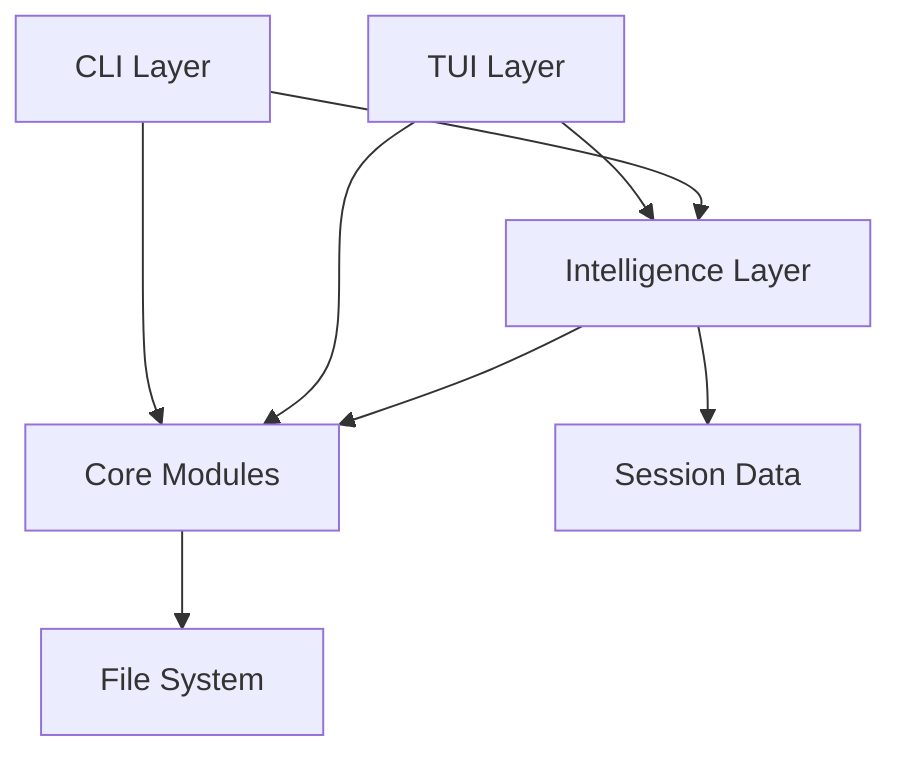
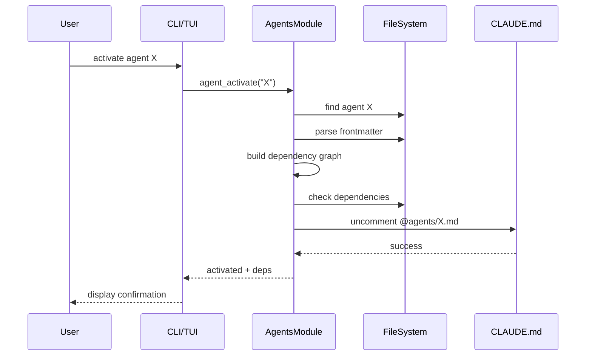
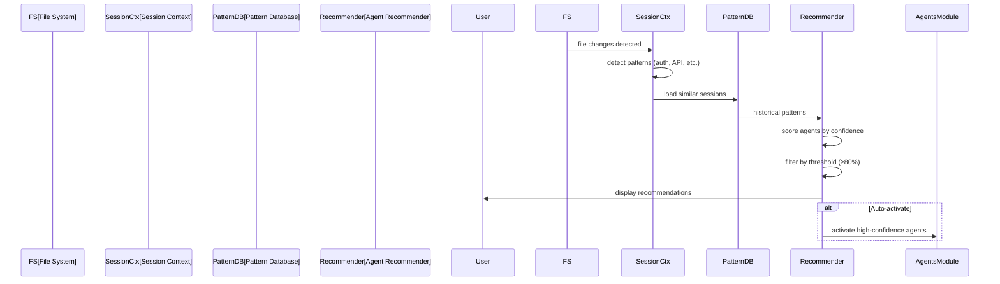

# Cortex Architecture

## System Overview

The Cortex is a comprehensive context management system for Claude Code, providing intelligent automation, workflow orchestration, and a rich terminal user interface (TUI). The system is built in Python and follows a modular architecture with clear separation of concerns.

### Core Purpose

- **Context Management**: Organize and activate modes, agents, rules, and skills
- **Intelligent Automation**: AI-powered recommendations and auto-activation
- **Interactive TUI**: Rich terminal interface for exploring and managing context
- **CLI Workflows**: Command-line tools for automation and scripting

## High-Level Architecture

```
┌─────────────────────────────────────────────────────────────────┐
│                          User Interface Layer                    │
├─────────────────┬───────────────────────────────────────────────┤
│   CLI (cli.py)  │         TUI (tui/main.py)                     │
│  - argparse     │  - Textual framework                          │
│  - Commands     │  - 9 interactive views                        │
│  - Workflows    │  - Command palette                            │
└────────┬────────┴───────────────────┬───────────────────────────┘
         │                            │
         ▼                            ▼
┌─────────────────────────────────────────────────────────────────┐
│                      Intelligence Layer                          │
├─────────────────────────────────────────────────────────────────┤
│  intelligence.py                                                 │
│  - Context detection (file types, auth, API, tests)             │
│  - Pattern learning (session history)                           │
│  - Agent recommendations (confidence scoring)                   │
│  - Auto-activation (high-confidence triggers)                   │
│  - Workflow prediction (based on patterns)                      │
└────────────────────────────┬────────────────────────────────────┘
                             │
                             ▼
┌─────────────────────────────────────────────────────────────────┐
│                        Core Business Logic                       │
├──────────┬──────────┬──────────┬──────────┬─────────┬──────────┤
│ agents   │  skills  │  modes   │  rules   │profiles │scenarios │
│  .py     │   .py    │   .py    │   .py    │  .py    │   .py    │
├──────────┼──────────┼──────────┼──────────┼─────────┼──────────┤
│ workflows│   mcp    │  base    │ context_ │doctor   │components│
│   .py    │   .py    │   .py    │ export.py│  .py    │   .py    │
└────────────────────────────┬────────────────────────────────────┘
                             │
                             ▼
┌─────────────────────────────────────────────────────────────────┐
│                         Data Layer                               │
├─────────────────────────────────────────────────────────────────┤
│  File System:                                                    │
│  - ~/.cortex/ (user config)                                     │
│  - modes/, agents/, rules/, skills/ (markdown files)            │
│  - inactive/ (disabled components)                              │
│  - data/ (metrics, sessions, ratings)                           │
│                                                                  │
│  Formats:                                                        │
│  - YAML frontmatter (metadata)                                  │
│  - Markdown (content)                                           │
│  - JSON (metrics, state)                                        │
│  - SQLite (ratings database)                                    │
└─────────────────────────────────────────────────────────────────┘
```

## Component Breakdown

### 1. User Interface Layer

#### CLI (`claude_ctx_py/cli.py`)

**Purpose**: Command-line interface for scripting and automation

**Key Functions**:

- Command routing (argparse-based)
- Subcommand organization (mode, agent, skill, workflow, etc.)
- Integration with core modules
- Output formatting (rich text)

**Command Structure**:

```
cortex <command> <subcommand> [options]

Examples:
  cortex mode activate Brainstorming
  cortex agent list --active
  cortex ai recommend
  cortex tui
```

#### TUI (`claude_ctx_py/tui/main.py`)

**Purpose**: Interactive terminal UI for exploration and management

**Architecture**:

- Built on Textual framework (reactive TUI)
- Single-page app with view switching
- 9 primary views (0-8) + command palette

**Views**:

1. **Agents (0)** - List and manage agents with dependency visualization
2. **Modes (1)** - Activate/deactivate behavior modes
3. **Rules (2)** - Manage rule modules
4. **Skills (3)** - Browse and rate skills
5. **Workflows (4)** - Execute multi-step workflows
6. **Scenarios (5)** - Run test scenarios
7. **Profiles (6)** - Load context profiles
8. **MCP Servers (7)** - Manage MCP integrations
9. **AI Assistant (8)** - View recommendations and auto-activate

**Key Features**:

- Command palette (Ctrl+P) for fuzzy search
- Real-time updates and notifications
- Keyboard-driven navigation
- Export functionality

### 2. Intelligence Layer

#### AI System (`claude_ctx_py/intelligence.py`)

**Purpose**: Context-aware automation and learning

**Core Classes**:

1. **`SessionContext`**
   - Tracks current session state
   - Detects file changes, types, directories
   - Identifies code patterns (auth, API, tests, frontend/backend)
   - Monitors errors and failures

2. **`AgentRecommendation`**
   - Suggests agents with confidence scores (0.0-1.0)
   - Provides reasoning and urgency levels
   - Determines auto-activation eligibility
   - Tracks context triggers

3. **`PatternLearner`**
   - Learns from session history
   - Identifies successful agent combinations
   - Builds pattern database
   - Improves recommendations over time

4. **`WorkflowPredictor`**
   - Predicts agent sequences
   - Estimates duration and success probability
   - Based on historical patterns

**Data Flow**:

```
File Changes → Context Detection → Pattern Matching → Recommendations
                     ↓                     ↓                ↓
              Session Context    Pattern Database   Auto-Activation
```

### 3. Core Business Logic

#### Module Organization (`claude_ctx_py/core/`)

**`base.py`** - Shared utilities

- File system operations
- Markdown parsing
- Front matter extraction
- Color formatting
- ANSI code handling

**`agents.py`** - Agent management

- Agent activation/deactivation
- Dependency graph building
- Agent validation
- Metadata parsing

**`skills.py`** - Skill management

- Skill discovery and validation
- Metrics tracking
- Rating system
- Community integration
- Analytics and trending

**`modes.py`** - Mode management

- Mode activation/deactivation
- CLAUDE.md integration
- Intelligent mode selection

**`rules.py`** - Rule management

- Rule activation/deactivation
- Rule composition

**`workflows.py`** - Workflow orchestration

- Multi-step execution
- State management
- Resume/stop functionality

**`scenarios.py`** - Scenario testing

- Test scenario execution
- Validation and preview
- State tracking

**`profiles.py`** - Profile management

- Profile templates (minimal, frontend, backend, etc.)
- Profile save/load
- Context export

**`mcp.py`** - MCP server integration

- Server discovery
- Configuration validation
- Documentation access
- Diagnostic tools

**`context_export.py`** - Context export

- Component collection
- Export formatting
- Clipboard integration

**`doctor.py`** - System diagnostics

- Health checks
- Configuration validation
- Issue detection

### 4. Data Layer

#### File System Structure

```
~/.cortex/
├── CLAUDE.md              # Main config (active components)
├── modes/                 # Available modes
│   ├── Brainstorming.md
│   ├── Super_Saiyan.md
│   └── ...
├── agents/                # Available agents
│   ├── code-reviewer.md
│   ├── test-automator.md
│   └── ...
├── rules/                 # Rule modules
│   ├── workflow-rules.md
│   ├── quality-gate-rules.md
│   └── ...
├── skills/                # Skill definitions
│   ├── api-design-patterns.md
│   ├── python-testing-patterns.md
│   └── ...
├── inactive/              # Disabled components
│   ├── modes/
│   ├── agents/
│   └── ...
├── data/                  # Runtime data
│   ├── metrics/           # Session metrics (JSON)
│   ├── sessions/          # Session history (JSON)
│   └── skill-ratings.db   # SQLite database
└── profiles/              # Profile templates
    ├── minimal.yaml
    ├── frontend.yaml
    └── ...
```

#### Metadata Format (YAML Frontmatter)

```yaml
---
name: agent-name
description: Brief description
dependencies:
  - other-agent
  - another-agent
priority: high
auto_activate: true
triggers:
  - pattern: "*.test.js"
  - context: "testing"
---

# Agent Content (Markdown)
...
```

## Data Flow

### Context Detection Flow

```
1. File System Watcher (optional)
   ↓
2. Detect Changes (files, types, directories)
   ↓
3. Build SessionContext
   - Parse file types
   - Detect code patterns (auth, API, etc.)
   - Count errors/failures
   ↓
4. Pattern Matching
   - Load pattern database
   - Match current context to patterns
   ↓
5. Generate Recommendations
   - Score agents by relevance
   - Calculate confidence (0.0-1.0)
   - Determine urgency
   ↓
6. Auto-Activation (≥80% confidence)
   - Activate agents
   - Update CLAUDE.md
   - Notify user
```

### Agent Activation Flow

```
1. User Request (CLI or TUI)
   ↓
2. Resolve Agent File
   - Check active/inactive dirs
   - Parse frontmatter
   ↓
3. Dependency Resolution
   - Build dependency graph
   - Check for missing deps
   - Recursive activation
   ↓
4. Update CLAUDE.md
   - Uncomment @agents/name.md
   - Backup previous version
   ↓
5. Notify Success
   - Show activated agents
   - Display dependencies
```

### TUI View Switching Flow

```
1. Key Press (0-8 or Ctrl+P)
   ↓
2. View Identifier
   - Number key → direct view
   - Ctrl+P → command palette
   ↓
3. Load View Data
   - Query core modules
   - Build table/display
   ↓
4. Render View
   - Textual reactive update
   - Apply styles (TCSS)
   ↓
5. Wait for Input
   - Navigation keys
   - Action keys (Enter, Space, etc.)
```

## Technology Stack

### Core Dependencies

- **Python 3.9+** - Runtime
- **argcomplete** - Shell completion
- **rich** - Terminal formatting
- **textual 0.47+** - TUI framework
- **PyYAML** - YAML parsing
- **psutil** - System monitoring

### Development Dependencies

- **pytest** - Testing framework
- **pytest-cov** - Coverage reporting
- **pytest-mock** - Mocking support
- **mypy** - Type checking
- **black** - Code formatting

### External Integrations

- **Claude Desktop** - MCP server integration
- **Git** - Version control (agent dependencies)
- **SQLite** - Ratings database

## Design Patterns

### Separation of Concerns

- **UI Layer**: No business logic, only presentation
- **Intelligence**: No direct file I/O, delegates to core
- **Core**: No UI code, only business logic
- **Data**: No logic, only storage/retrieval

### Dependency Injection

- Core modules accept directory paths as parameters
- No hardcoded paths in business logic
- Environment variable override support

### Plugin Architecture

- Agents, modes, rules, skills are markdown files
- Metadata in YAML frontmatter
- Easy to add/remove without code changes

### Event-Driven TUI

- Textual reactive properties
- Message passing between components
- No polling, event-driven updates

## Key Workflows

### 1. New Agent Activation

```
User → CLI/TUI → agents.py → Dependency Graph → CLAUDE.md Update
```

### 2. AI Recommendation

```
File Changes → SessionContext → PatternLearner → AgentRecommendation → UI
```

### 3. Workflow Execution

```
User → workflows.py → Scenario Steps → Agent Activation → Status Tracking
```

### 4. Skill Rating

```
User → TUI (Ctrl+R) → skills.py → SQLite DB → Analytics Update
```

## Configuration System

### Primary Config: CLAUDE.md

- Human-readable markdown
- HTML comments for inactive items
- `@` references for file inclusion
- Hierarchical structure (core → rules → modes → agents)

### Component Metadata

- YAML frontmatter in each markdown file
- Standard fields: name, description, dependencies, priority
- Custom fields per component type

### Runtime Data

- JSON for metrics and sessions
- SQLite for ratings
- File-based state (no daemon)

## Extension Points

### Adding New Components

1. Create markdown file in appropriate directory
2. Add YAML frontmatter with metadata
3. Reference in CLAUDE.md (optional)
4. Component auto-discovered by CLI/TUI

### Adding TUI Views

1. Add view class in `tui/main.py`
2. Register in view switcher
3. Add key binding
4. Implement data loading and rendering

### Adding Intelligence Rules

1. Extend `PatternLearner` with new detection logic
2. Add trigger patterns to agent frontmatter
3. Update confidence scoring algorithm

## Performance Considerations

### File System Operations

- Lazy loading of markdown files
- Caching of parsed frontmatter
- Incremental updates to CLAUDE.md

### TUI Responsiveness

- Async data loading where possible
- Progressive rendering
- Debounced search inputs

### Intelligence System

- Pattern database kept small (recent sessions only)
- Confidence scoring optimized for speed
- Background learning (no blocking)

## Testing Strategy

See [Testing Workstream](../workstreams/ws1-testing/) for detailed test plan.

**Current Coverage**: ~15% (baseline)
**Target Coverage**: 80% (by Week 8)

**Test Categories**:

- Unit tests: Core business logic
- Integration tests: CLI workflows
- TUI tests: View rendering and interactions
- End-to-end: Full workflows

## Diagrams

### Component Dependency Graph



### Agent Activation Sequence



### Intelligence Recommendation Flow



## Further Reading

- [Contributor Guide](../guides/development/) (planned)
- [API Reference](../reference/) (planned)
- [TUI Development Guide](../guides/development/tui/) (planned)
- [Intelligence System Deep Dive](../guides/development/AI_INTELLIGENCE_GUIDE.md)
