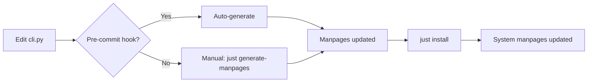

# Manpage Auto-Generation

## Overview

Manpages for `cortex` are now **automatically generated** from the CLI's argparse definitions, ensuring they stay in sync with the actual command interface.

## ✨ What Changed

### Before

- Manpages were manually written and maintained
- Easily became outdated when CLI changed
- Last update dates: Nov 12, 2025 (workflow), Dec 6, 2025 (main/tui)

### After  

- Manpages auto-generated from `claude_ctx_py/cli.py`
- Always reflect current CLI structure
- Date automatically set to generation time
- Integrated into build/install workflow

## 🔧 New Files

### Generator Script

- **`scripts/generate-manpages.py`** - Python script that reads argparse definitions and generates `.1` manpage files

### Git Hooks

- **`.githooks/pre-commit`** - Auto-regenerates manpages when CLI changes (optional setup)

### Documentation

- **`docs/reference/README.md`** - Guide for manpage generation workflow

## 🎯 Usage

### Manual Generation

```bash
# Via Just
just generate-manpages

# Direct execution
python3 scripts/generate-manpages.py
```

### Automatic Generation

Manpages are automatically regenerated during:

1. **Installation**

   ```bash
   just install
   ./scripts/deprecated/install.sh
   ```

2. **Manpage-only install**

   ```bash
   just install-manpage
   ```

3. **Git commits** (if hook enabled)

   ```bash
   git config core.hooksPath .githooks
   # Now manpages regenerate on CLI changes
   ```

## 📄 Generated Manpages

| File | Description | Source |
|------|-------------|--------|
| `cortex.1` | Main CLI reference | Main parser in `cli.py` |
| `cortex-tui.1` | TUI subcommand | `tui` subparser |
| `cortex-workflow.1` | Workflow commands | `workflow` subparser |

## 🔄 Workflow



## 🛠️ Customization

### Modifying Generation

Edit `scripts/generate-manpages.py` to:

- Change manpage format/sections
- Extract version from `pyproject.toml` (TODO)
- Add more subcommand manpages
- Enhance help text formatting

### Adding Subcommands

To generate manpages for new subcommands:

1. Add to `subcommands` list in `generate-manpages.py`:

   ```python
   subcommands = [
       ("tui", "Interactive TUI for agent management"),
       ("workflow", "Workflow management commands"),
       ("newcommand", "New command description"),  # Add this
   ]
   ```

2. Regenerate:

   ```bash
   just generate-manpages
   ```

## ✅ Benefits

1. **Always Current** - Manpages can't drift from implementation
2. **Less Maintenance** - No manual editing of troff syntax
3. **Consistent** - All manpages follow same structure
4. **Automated** - Part of normal dev workflow
5. **Versioned** - Generation date automatically updated

## 🚀 Future Enhancements

- [ ] Extract version automatically from `pyproject.toml`
- [ ] Generate manpages for all subcommands dynamically
- [ ] Add EXAMPLES sections with real usage patterns
- [ ] Generate HTML/markdown versions alongside `.1` files
- [ ] Add manpage validation/linting

## 📚 References

- [Man page format (groff)](https://man7.org/linux/man-pages/man7/groff_man.7.html)
- [argparse documentation](https://docs.python.org/3/library/argparse.html)
- Generator: `scripts/generate-manpages.py`
- CLI definitions: `claude_ctx_py/cli.py`

## 🧪 Testing

```bash
# View locally without installing
man docs/reference/cortex.1

# Check formatting
groff -man -Tascii docs/reference/cortex.1 | less

# After installation
man cortex
man cortex-tui
man cortex-workflow
```

## 📝 Notes

- Generated files are tracked in git
- Pre-commit hook is **optional** - configure if desired
- Manual edits to `.1` files will be overwritten on next generation
- Generation is fast (<1 second) and safe to run frequently
