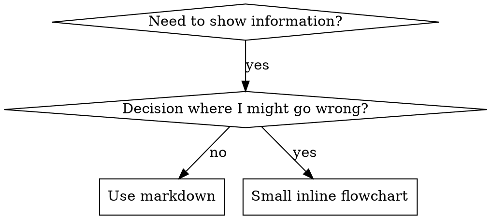

# Code Examples and Flowcharts

## Flowchart Usage



**Use flowcharts ONLY for:**
- Non-obvious decision points
- Process loops where you might stop too early
- "When to use A vs B" decisions

**Never use flowcharts for:**
- Reference material → Tables, lists
- Code examples → Markdown blocks
- Linear instructions → Numbered lists
- Labels without semantic meaning (step1, helper2)

See @graphviz-conventions.dot for graphviz style rules.

## Code Examples

**One excellent example beats many mediocre ones**

Choose most relevant language:
- Testing techniques → TypeScript/JavaScript
- System debugging → Shell/Python
- Data processing → Python

**Good example:**
- Complete and runnable
- Well-commented explaining WHY
- From real scenario
- Shows pattern clearly
- Ready to adapt (not generic template)

**Don't:**
- Implement in 5+ languages
- Create fill-in-the-blank templates
- Write contrived examples

You're good at porting - one great example is enough.

## Anti-Patterns

### ❌ Narrative Example
"In session 2025-10-03, we found empty projectDir caused..."
**Why bad:** Too specific, not reusable

### ❌ Multi-Language Dilution
example-js.js, example-py.py, example-go.go
**Why bad:** Mediocre quality, maintenance burden

### ❌ Code in Flowcharts
```dot
step1 [label="import fs"];
step2 [label="read file"];
```
**Why bad:** Can't copy-paste, hard to read

### ❌ Generic Labels
helper1, helper2, step3, pattern4
**Why bad:** Labels should have semantic meaning
