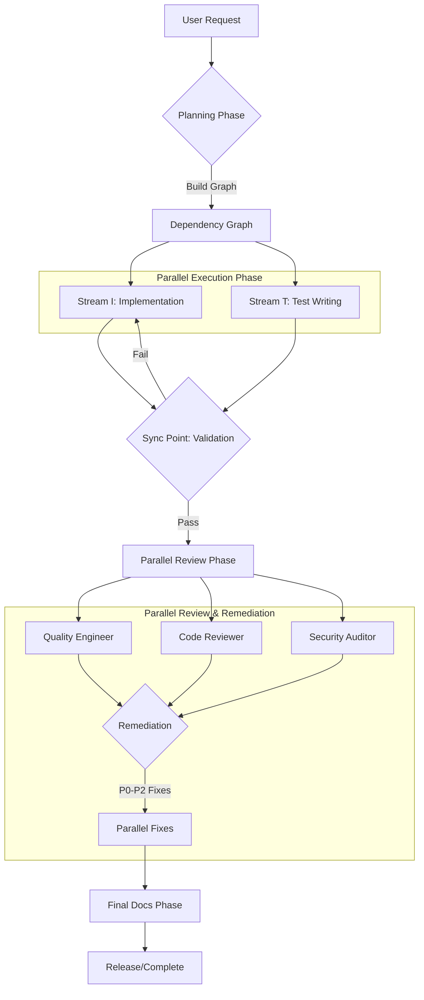

# Parallel Workflow Enforcer - Complete Guide

## ✅ Project-Level Parallel Orchestration

**Script:** `hooks/parallel-workflow-enforcer.sh`
**Scope:** Project-wide (Planning, Implementation, Testing, Release, Documentation)
**Enforcement:** Strict Parallel Execution & Mandatory Deliverables

---

## Executive Summary

The Parallel Workflow Enforcer is a strict supervisor hook that transforms Claude Code from a serial executor into a **parallel orchestration engine**. It mandates that independent workstreams run simultaneously, enforces high-bar quality gates, and strictly prohibits "intent-only" deliverables.

**Key Capabilities:**
1.  **Global Concurrency:** Planning, Implementation, and Review happen in parallel streams where possible.
2.  **Strict Deliverables:** "I have implemented..." is rejected unless files exist on disk (`ls -l` verified).
3.  **AI Auto-Activation:** Automatically pulls in specialized agents (e.g., `security-auditor`, `react-specialist`) based on context.
4.  **Project-Level Gates:**
    *   **Test Coverage:** 85-95%
    *   **Doc Score:** ≥ 8/10
    *   **Code Review:** P0-P2 Mandatory Fixes

---

## The Parallel Protocol



---

## Workstream Definitions

### 1. Planning Workstream
**Goal:** Identification of independent subtasks.
- **Entry:** Project scope or feature request.
- **Activity:** Construct dependency graph, populate task queue.
- **Exit:** Validated Plan with identified parallel streams.

### 2. Implementation & Testing (Concurrent)
**Goal:** Code and Tests are written simultaneously.
- **Stream I (Implementation):** Writes the feature code.
- **Stream T (Testing):** Writes the test suite based on the spec/plan.
- **Sync Point:** Tests are run against the implementation.
- **Gate:** Coverage must be between **85-95%**.

### 3. Review & Remediation (Mandatory Parallelism)
**Goal:** All eyes on code at once; all fixes at once.
- **Protocol:** `quality-engineer`, `code-reviewer`, and AI-activated specialists review SIMULTANEOUSLY.
- **Remediation:**
    - **P0-P2:** Mandatory parallel fixes.
    - **P3 (Low):** Optional.
    - **Deferred:** Must be logged in `DEFERRED.md`.

### 4. Documentation (Final Gate)
**Goal:** Comprehensive artifact generation.
- **Agents:** `tutorial-engineer`, `api-documenter`, `technical-writer`, `mermaid-expert`.
- **Gate:** `docs-architect` must give a score of **≥ 8/10**.
- **Outputs:**
    - `docs/projects/{plans,activity}`
    - `docs/architecture`
    - Mermaid diagrams (PNG embedded)

---

## Anti-Pattern Prevention

This hook strictly forbids the **"Intent vs. Deliverable Trap"**:

> *The agent says "I have implemented the feature" but only wrote a plan or a summary, with no actual code files created.*

**Enforcement:**
1.  **Proof of Work:** `ls -l` must verify file existence.
2.  **Execution:** Tests must actually RUN (`pytest`), not just be written.
3.  **Prohibition:** It is a FAILURE to mark a task complete without tangible artifacts.

---

## Configuration

Edit `hooks/parallel-workflow-enforcer.sh` to adjust:

```bash
COVERAGE_MIN=85            # Minimum coverage %
COVERAGE_TARGET=95         # Target coverage %
DOCS_SCORE_MIN=8.0         # Minimum documentation score (0-10)
CODE_REVIEW_REQUIRED=true  # Mandatory Phase 3
```

---

## Triggers

The hook activates on broad keywords beyond just implementation:
*   "plan", "roadmap"
*   "implement", "build", "code"
*   "test", "review"
*   "document", "diagram"
*   "release", "deploy"

---

## Example Scenario

**User:** "Plan and build the new User Notification System."

**Claude (Enforced):**
1.  **Activates:** Core agents + `notification-specialist` (via AI).
2.  **Planning:** Creates a dependency graph showing that *Email Service* and *SMS Service* are independent.
3.  **Execution:**
    *   Launches *Email Service Implementation* agent.
    *   Launches *Email Service Tests* agent.
    *   Launches *SMS Service Implementation* agent.
    *   *All run in parallel.*
4.  **Review:**
    *   `security-auditor` checks for PII leaks.
    *   `code-reviewer` checks patterns.
    *   *Reviews happen in one batch.*
5.  **Remediation:** Fixes 3 Critical issues in parallel.
6.  **Docs:** `mermaid-expert` generates the architecture diagram; `docs-architect` scores the API docs (8.5/10).
7.  **Completion:** Lists all created files and test logs.
