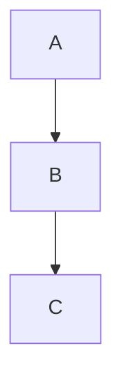
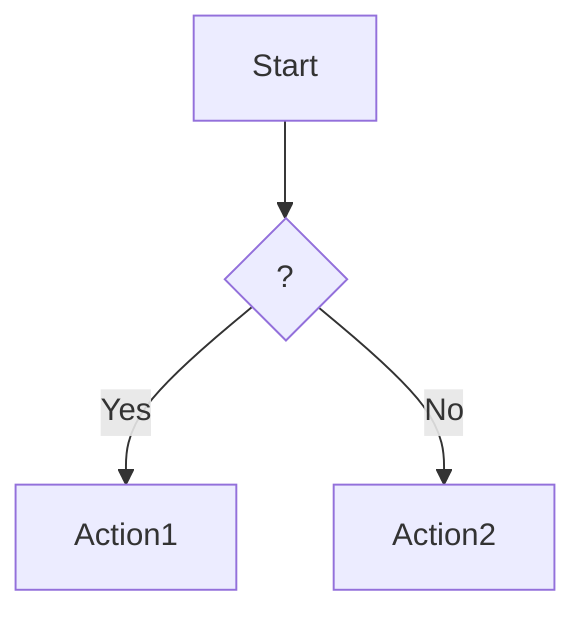
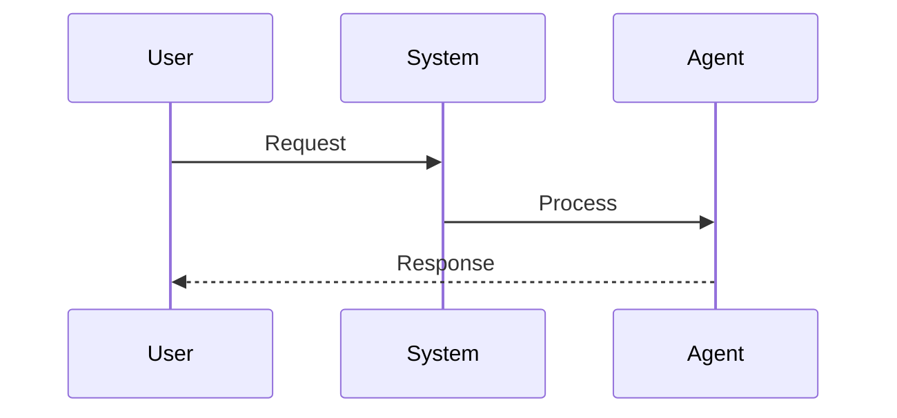
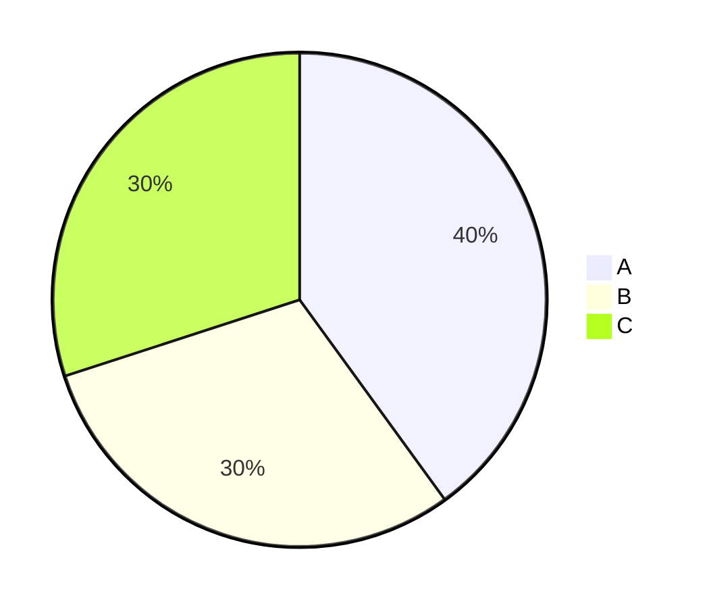
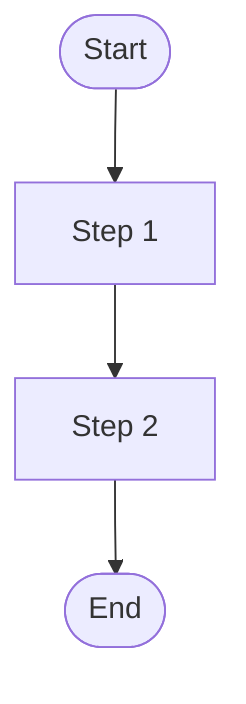
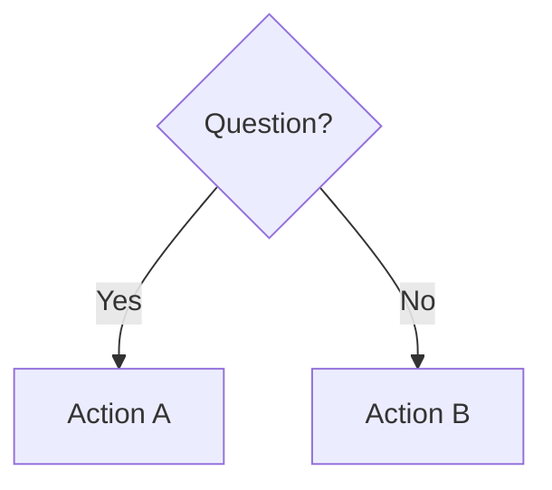
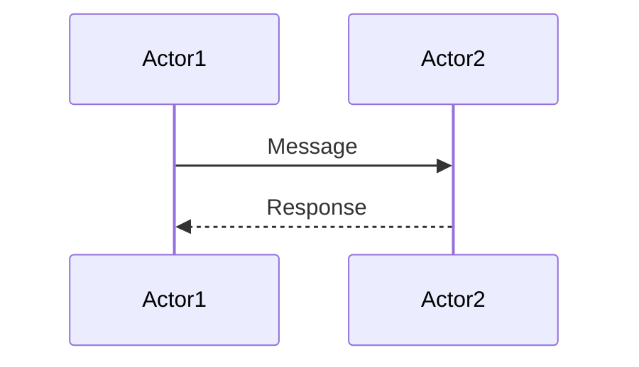

# Architecture Diagrams Documentation

Visual guides for understanding the cortex three-layer automation system.

---

## 📚 Available Diagrams

### 1. **architecture-diagrams.md** - Comprehensive Diagrams

**Purpose**: Deep dive into system architecture with 10+ Mermaid diagrams

**Contents**:

- System Architecture Overview (full stack)
- Command → Mode → Workflow Flow (sequence diagram)
- Mode Activation Flow (flowchart)
- Workflow Execution Flow (detailed flowchart)
- Refactoring Example: End-to-End (full flow)
- Decision Tree: Which Layer to Use?
- System Statistics (pie chart)
- Mode + Workflow Compatibility Matrix
- Legend and Quick Start Guide

**Best for**:

- Understanding how the system works
- Learning integration patterns
- Architecture reviews
- Onboarding new developers

**View**: `cat ~/.cortex/docs/architecture-diagrams.md`

---

### 2. **quick-reference.md** - One-Page Cheat Sheet

**Purpose**: Fast lookup for common tasks and patterns

**Contents**:

- Three-layer system overview (ASCII diagram)
- Common commands quick lookup table
- Behavioral modes comparison table
- Workflows comparison table
- Decision guide ("Which command should I use?")
- Integration patterns
- Command namespaces reference
- TUI keyboard shortcuts
- Typical workflows
- Quality gates checklist
- Tips & best practices
- System statistics

**Best for**:

- Daily reference during development
- Quick command lookup
- Pattern examples
- Workflow selection

**View**: `cat ~/.cortex/docs/quick-reference.md`

---

## 🎯 How to Use These Diagrams

### For Learning

**First Time Users**:

1. Start with `quick-reference.md` → Get overview
2. Try a simple command → `/refactor:analyze src/`
3. Read `architecture-diagrams.md` → Understand how it works
4. Experiment with workflows → `/workflow:run feature-development`

**Visual Learners**:

1. Open `architecture-diagrams.md`
2. Focus on sequence diagrams and flowcharts
3. Follow the "Refactoring Example: End-to-End" diagram
4. Study the decision tree for guidance

### For Reference

**During Development**:

- Keep `quick-reference.md` open
- Use command lookup tables
- Reference integration patterns
- Check keyboard shortcuts

**For Troubleshooting**:

- Review flow diagrams in `architecture-diagrams.md`
- Check compatibility matrix
- Verify workflow steps
- Understand mode behaviors

### For Teaching

**Onboarding New Developers**:

1. Show system architecture overview
2. Explain three layers with ASCII diagram
3. Walk through a real example (refactoring flow)
4. Provide quick-reference.md as cheat sheet

**Architecture Reviews**:

1. Present system architecture diagram
2. Show component distribution (pie chart)
3. Explain integration patterns
4. Discuss compatibility matrix

---

## 🔍 Diagram Index

### System Architecture

- **File**: architecture-diagrams.md
- **Section**: "System Architecture Overview"
- **Shows**: All layers and their relationships
- **Format**: Mermaid graph TB (top-bottom)

### Flow Diagrams

- **File**: architecture-diagrams.md
- **Sections**:
  - Command → Mode → Workflow Flow (sequence)
  - Mode Activation Flow (flowchart)
  - Workflow Execution Flow (flowchart)
  - Refactoring Example (graph TB)

### Decision Aids

- **File**: architecture-diagrams.md
- **Section**: "Decision Tree: Which Layer to Use?"
- **Shows**: Interactive decision-making process
- **Format**: Mermaid flowchart TD

### Quick Reference

- **File**: quick-reference.md
- **Sections**: All tables and ASCII diagrams
- **Shows**: Commands, modes, workflows at a glance
- **Format**: Markdown tables and ASCII art

---

## 📖 Reading the Diagrams

### Mermaid Diagram Types

**Graph (TB/TD)**: Top-to-bottom flow



- Shows hierarchical relationships
- Good for system architecture
- Shows data flow direction

**Flowchart (TD)**: Decision flows



- Shows decision points
- Good for processes
- Shows conditional logic

**Sequence Diagram**: Interaction over time



- Shows temporal order
- Good for protocols
- Shows message passing

**Pie Chart**: Distribution



- Shows proportions
- Good for statistics
- Shows relative sizes

### Color Coding

Diagrams use consistent color coding:

| Color | Meaning | Usage |
|-------|---------|-------|
| Light Blue (#e1f5ff) | User/Input | User actions, inputs |
| Light Red (#ffe1e1) | Commands | Slash commands layer |
| Light Orange (#fff3e1) | Modes | Behavioral modes layer |
| Light Green (#e8f5e9) | Workflows | Workflow processes |
| Light Purple (#f3e5f5) | Agents/Tools | Execution layer |
| Green (#c8e6c9) | Success | Completed, success states |
| Red (#ffcdd2) | Error/Block | Failures, blocking states |

### Symbols

| Symbol | Meaning |
|--------|---------|
| → | Direct flow |
| -.-> | Influences/Uses |
| -->> | Return value |
| ↓ | Sequential step |
| ⚡ | Fast/Optimized |
| ✅ | Complete/Success |
| ❌ | Failure/Error |
| 🔄 | In Progress |
| ⏸️ | Paused/Waiting |

---

## 🛠️ Creating Custom Diagrams

### Tools

**Mermaid Live Editor**: <https://mermaid.live/>

- Online editor for Mermaid diagrams
- Real-time preview
- Export to PNG/SVG/Markdown

**VS Code**: Install "Markdown Preview Mermaid Support"

- Preview diagrams in editor
- Edit and see changes live

**Command Line**: `mermaid-cli` (mmdc)

```bash
npm install -g @mermaid-js/mermaid-cli
mmdc -i input.md -o output.png
```

### Templates

**Simple Flow**:

```markdown


```

**Decision Tree**:
```markdown


```

**Sequence**:
```markdown


```

---

## 📋 Checklist for Diagram Updates

When system changes, update diagrams:

- [ ] Add new commands to command namespace lists
- [ ] Update mode count if new modes added
- [ ] Update workflow count if new workflows added
- [ ] Update system statistics (pie chart)
- [ ] Update compatibility matrix for new integrations
- [ ] Update quick reference tables
- [ ] Update examples with new patterns
- [ ] Regenerate any outdated flow diagrams
- [ ] Update color coding if new categories added
- [ ] Update legend with new symbols

---

## 🎓 Learning Path

### Beginner (Day 1)
1. Read quick-reference.md overview
2. Try 3 simple commands
3. Understand the three layers

### Intermediate (Week 1)
1. Study system architecture diagram
2. Learn mode activation patterns
3. Try a workflow
4. Read integration patterns

### Advanced (Month 1)
1. Study all flow diagrams
2. Understand compatibility matrix
3. Create custom workflows
4. Design new integration patterns

---

## 📞 Getting Help

**Can't find what you need?**
- Check quick-reference.md first
- Then explore architecture-diagrams.md
- Look at specific flow diagrams
- Review examples section

**Need more diagrams?**
- Identify what you need
- Use Mermaid templates above
- Follow color coding conventions
- Add to appropriate file

**Have suggestions?**
- What diagrams are missing?
- What's confusing?
- What would help?

---

## 📊 Diagram Coverage

| Topic | Quick Ref | Arch Diagrams | Status |
|-------|-----------|---------------|--------|
| System Overview | ✅ ASCII | ✅ Mermaid | Complete |
| Commands | ✅ Tables | ✅ Detailed | Complete |
| Modes | ✅ Tables | ✅ Flows | Complete |
| Workflows | ✅ Tables | ✅ Flows | Complete |
| Integration | ✅ Patterns | ✅ Examples | Complete |
| Decision Making | ✅ Guide | ✅ Tree | Complete |
| Statistics | ✅ Numbers | ✅ Charts | Complete |
| Compatibility | ✅ Tips | ✅ Matrix | Complete |

---

*For more information, see:*
- `~/.cortex/docs/architecture-diagrams.md` - Comprehensive diagrams
- `~/.cortex/docs/quick-reference.md` - Quick lookup
- `~/.cortex/docs/README.md` - General documentation index
