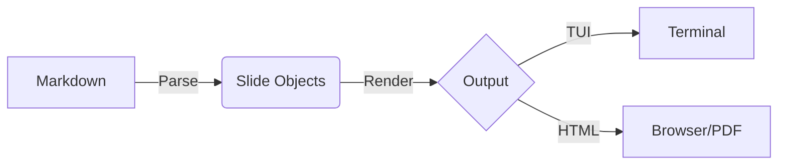

layout: title
logo: https://textual.textualize.io/img/textual.png
# CLI Presenter
## The Ultimate Terminal Presentation Tool

---
layout: default
logo: https://textual.textualize.io/img/textual.png
# Features Overview

- **Markdown Based**: Write simple, portable slide decks.
- **TUI & HTML**: Present in the terminal, export to the web.
- **Rich Content**: Support for images, code blocks, and diagrams.
- **Themable**: Custom CSS for both terminal and PDF.

---
layout: center
# Centered Layout
This content is centered vertically and horizontally.
Great for quotes or big impact statements.

> "Simplicity is the ultimate sophistication."

---
layout: default
# Code Highlighting

```python
def hello_world():
    print("Hello from CLI Presenter!")
```

---
layout: default
# Mermaid Diagrams



---
layout: title
# Thank You
Run `cli-presenter export template.md` to see these diagrams in action!
