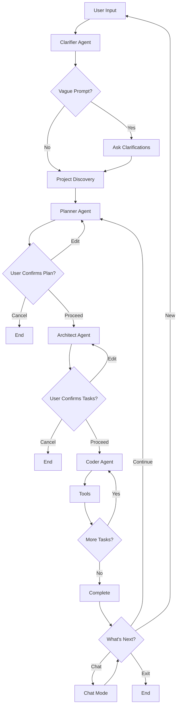
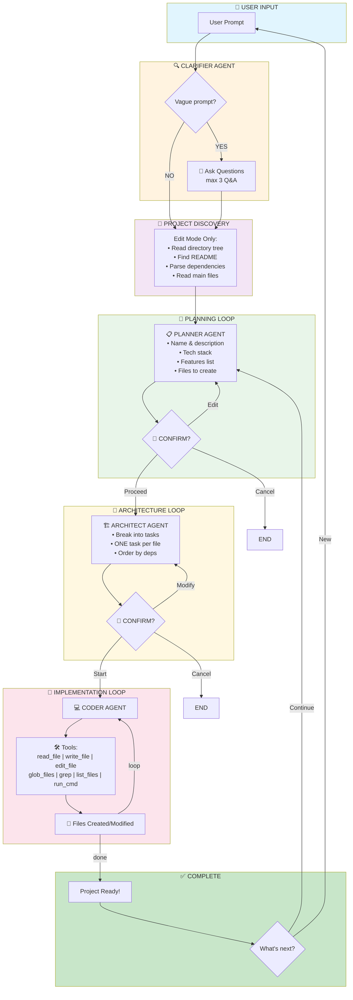

# Coder Buddy - AI-Powered Coding Assistant

[](https://pypi.org/project/coder-buddy/)
[](https://pypi.org/project/coder-buddy/)
[](https://pypi.org/project/coder-buddy/)
[](https://pypi.org/project/coder-buddy/)

A Claude Code-style AI coding assistant built with LangGraph and OpenAI GPT-4o that transforms natural language prompts into complete, working projects. Supports both creating new projects from scratch and modifying existing codebases.

**Open Source** - Free to use, modify, and distribute under the MIT License.

```
+-----------------------------------------------------+
|    CCCCC   OOOOO   DDDD    EEEEE   RRRR             |
|   C       O     O  D   D   E       R   R            |
|   C       O     O  D    D  EEEE    RRRR             |
|   C       O     O  D   D   E       R  R             |
|    CCCCC   OOOOO   DDDD    EEEEE   R   R            |
|                                                     |
|           Coder Buddy - AI Assistant                |
+-----------------------------------------------------+
```

## ✨ Features

### Core Capabilities
- **🏗️ Multi-Agent Architecture** - Specialized agents (Clarifier, Planner, Architect, Coder) orchestrated by LangGraph
- **🤖 Multi-Provider Support** - Use OpenAI, Anthropic Claude, Google Gemini, Groq, or OpenRouter
- **🎨 Beautiful Terminal UI** - Rich formatting with spinners, progress indicators, panels, and syntax highlighting
- **⚡ Real-time Streaming** - Stream tokens as the AI thinks and writes code
- **📺 Live Command Output** - Real-time buffered streaming of shell command output (npm install, builds, etc.)
- **🔄 Build & Edit Modes** - Create new projects from scratch OR modify existing codebases
- **🔍 Smart Project Discovery** - Auto-detects project structure before planning modifications
- **❓ Intelligent Clarification** - Asks clarifying questions for vague prompts
- **👥 Human-in-the-Loop** - Review and approve/edit plans before implementation
- **💬 Interactive Chat** - Discuss your project with full context awareness
- **📁 Dynamic Project Folders** - Projects created in named directories (e.g., `todo-app/`, `snake-game/`)
- **🛠️ Comprehensive Tools** - File operations, pattern matching, content search, shell commands
- **🔐 Sandboxed Execution** - All operations confined to project root
- **⚙️ Permission System** - Strict mode (asks confirmation) or permissive (automatic)

### Advanced Features
- ✅ **Plan Confirmation** - Review architecture before building
- ✏️ **Edit Instructions** - Request changes to plan/architecture mid-workflow
- 🎯 **Precise Editing** - `edit_file()` for exact string replacement
- 🔎 **File Discovery** - `glob_files()` for pattern matching
- 🔍 **Content Search** - `grep()` with regex support
- 📋 **Post-Completion Options** - Chat, continue editing, or start new project
- 📖 **Run Instructions** - Detailed step-by-step guide with copy-paste commands
- 🚀 **Auto-Launch** - Opens projects in browser or starts servers

## 🚀 Installation

### Prerequisites

- Python 3.12+
- API key for your chosen LLM provider

### Option 1: Install from PyPI (Recommended)

```bash
pip install coder-buddy

# Set your API key
export OPENAI_API_KEY=sk-your-key-here

# Run
coder-buddy
```

### Option 2: Install from Source

```bash
# Clone the repository
git clone https://github.com/garodisk/CodeBuddy.git
cd CodeBuddy

# Install with uv (recommended)
uv sync

# Or install with pip
pip install -e .

# Create .env file with your API key
echo "OPENAI_API_KEY=sk-your-key-here" > .env
```

## 🤖 Supported LLM Providers

Coder Buddy supports multiple LLM providers. Set via environment variables:

| Provider | Install Command | Environment Variables |
|----------|----------------|----------------------|
| **OpenAI** (default) | `pip install coder-buddy` | `OPENAI_API_KEY` |
| **Anthropic Claude** | `pip install coder-buddy[anthropic]` | `ANTHROPIC_API_KEY`, `LLM_PROVIDER=anthropic` |
| **Google Gemini** | `pip install coder-buddy[gemini]` | `GOOGLE_API_KEY`, `LLM_PROVIDER=gemini` |
| **Groq** | `pip install coder-buddy[groq]` | `GROQ_API_KEY`, `LLM_PROVIDER=groq` |
| **OpenRouter** | `pip install coder-buddy` | `OPENROUTER_API_KEY`, `LLM_PROVIDER=openrouter` |
| **All providers** | `pip install coder-buddy[all]` | Set provider-specific keys |

### Example: Using Claude

```bash
pip install coder-buddy[anthropic]
export ANTHROPIC_API_KEY=sk-ant-your-key
export LLM_PROVIDER=anthropic
coder-buddy
```

### Example: Using Groq (Fast & Free)

```bash
pip install coder-buddy[groq]
export GROQ_API_KEY=gsk-your-key
export LLM_PROVIDER=groq
coder-buddy
```

### Custom Model

Override the default model with `LLM_MODEL`:

```bash
export LLM_PROVIDER=openai
export LLM_MODEL=gpt-4-turbo
coder-buddy
```

## 📖 Usage

### Quick Start

```bash
# Install
pip install coder-buddy

# Set your API key (choose one)
export OPENAI_API_KEY=sk-your-key-here      # For OpenAI
# OR
export ANTHROPIC_API_KEY=sk-ant-your-key    # For Claude
export LLM_PROVIDER=anthropic

# Run
coder-buddy
```

### Interactive Mode (Build or Edit)

```bash
coder-buddy
```

This starts the REPL with interactive mode selection:

```
What would you like to do?

1) Build a new project - Start from scratch
2) Edit an existing project - Modify existing code

Choice [1-2]:
```

Then describe what you want to build:

```
What would you like to build?
Describe your project (e.g., 'a todo app with React' or 'snake game in Python')

>
```

**Build Mode Examples:**
```
> Create a snake game in Python with pygame
> Build a REST API with FastAPI and SQLite
> Make a React todo app with Tailwind CSS
```

**Edit Mode Examples:**
```
> Add dark mode toggle to the settings
> Implement JWT authentication
> Add database migration system
```

### Single Prompt Mode

```bash
coder-buddy --prompt "Create a calculator web app"
```

### CLI Options

```bash
coder-buddy --mode build              # Explicitly use build mode
coder-buddy --mode edit --root ./my-project  # Edit existing project
coder-buddy --permission strict       # Ask before dangerous operations
coder-buddy --permission permissive   # Allow all operations
coder-buddy --recursion-limit 150     # Set graph recursion limit
```

### Commands in REPL

| Command | Description |
|---------|-------------|
| `/new` | Start a new project (re-select build/edit mode) |
| `/status` | Show current mode and settings |
| `/help` | Show all commands |
| `/clear` | Clear the screen |
| `/exit` | Exit the application |

### Chat Commands (in Chat Mode)

| Command | Description |
|---------|-------------|
| `/done` | Exit chat and finish |
| `/continue` | Continue building this project (switch to edit mode) |
| `/new` | Start a new project |
| `/help` | Show chat commands |

## 🏗️ Architecture

### LangGraph Multi-Agent Flow



### Detailed Agent Pipeline



### Key Design Principles

| Principle | Description |
|-----------|-------------|
| 🔄 **Human-in-the-Loop** | User confirms/edits at every major step |
| 📁 **ONE Task Per File** | Architect creates exactly one task per file |
| 🔍 **Discovery Before Planning** | Edit mode reads project structure first |
| 🛡️ **Sandboxed Execution** | All file ops confined to project root |
| ⚠️ **Dangerous Command Blocking** | Blocks rm -rf, sudo, etc. in strict mode |

---

## 🔧 Tools

### File Operations

| Tool | Signature | Description |
|------|-----------|-------------|
| `read_file` | `(path: str) -> str` | Read file contents |
| `write_file` | `(path: str, content: str) -> str` | Write/create files |
| `edit_file` | `(path: str, old_str: str, new_str: str) -> str` | **NEW**: Precise string replacement (old_str must appear exactly once) |
| `list_files` | `(directory: str) -> str` | List files recursively |
| `get_current_directory` | `() -> str` | Get project root path |

### Discovery & Search

| Tool | Signature | Description |
|------|-----------|-------------|
| `glob_files` | `(pattern: str, max_results: int = 100) -> str` | **NEW**: Find files by glob pattern |
| `grep` | `(pattern: str, path: str, max_results: int = 50, ignore_case: bool) -> str` | **NEW**: Search with regex |

### Execution

| Tool | Signature | Description |
|------|-----------|-------------|
| `run_cmd` | `(cmd: str, cwd: str?, timeout: int?) -> dict` | Run shell command with real-time output streaming and permission check |

### Sandbox Protection

All tools use path validation to prevent escape:

```python
def safe_path_for_project(path: str) -> pathlib.Path:
    root = get_project_root()
    p = (root / path).resolve()
    # Ensure p is within root
    if root.resolve() not in p.parents and root.resolve() != p:
        raise ValueError("Attempt to write outside project root")
    return p
```

This prevents:
- Path traversal: `../../etc/passwd`
- Absolute paths: `/etc/passwd`
- Symlink escape: `link → /etc`

---

## 🎯 Modes

### Build Mode
- **Use Case**: Create new projects from scratch
- **Workflow**: Plan → Confirm → Architect → Confirm → Code
- **Tools**: Full write access to new project directory
- **Default**: Yes

```bash
uv run python main.py --mode build
```

### Edit Mode
- **Use Case**: Modify existing projects
- **Workflow**: Discover → Plan → Confirm → Architect → Confirm → Code
- **Tools**:
  - `read_file()` to understand existing code
  - `edit_file()` for precise modifications
  - `glob_files()` and `grep()` to find relevant code
  - `write_file()` for new files only
- **Special**: Project discovery runs first

```bash
uv run python main.py --mode edit --root ./my-project
```

---

## ⚙️ Permission Modes

### Strict Mode (Default)
- Asks for confirmation before:
  - Overwriting existing files
  - Running dangerous commands (`rm -rf`, `sudo`, etc.)
- Safe for learning and experimentation

```bash
uv run python main.py --permission strict
```

### Permissive Mode
- Allows all operations without confirmation
- Faster execution
- Use only when fully trusting the agent

```bash
uv run python main.py --permission permissive
```

---

## 🤖 Workflow Examples

### Example 1: Build Mode with Clarification

```
> todo app

[!] Your request needs some clarification...

Clarification Questions

Q1. What is the main purpose/goal of this project?
A1: A simple app to manage daily tasks

Q2. What are the key features or functionalities needed?
A2: Add tasks, mark complete, delete, filter by status

Q3. Any specific requirements or constraints?
A3: Should work offline with local storage

[+] Clarifications collected!

[*] Planning project...
```

Then user reviews plan and can:
1. ✓ Proceed with building
2. ✎ Edit the plan ("Use React instead")
3. ✗ Cancel and restart

### Example 2: Edit Mode Project Discovery

```
> Add authentication to the project

[*] Discovering Project Structure

[>] Reading project structure...
[>] Looking for README...
[>] Looking for dependency files...
[>] Looking for main code files...

[+] Project discovery complete! Found 5 key items.

[*] Planning project...
```

Agent now knows about existing code and suggests modifications to:
- models/User.js
- routes/auth.js
- middleware/authenticate.js

### Example 3: Post-Completion Chat

```
[+] Project generated successfully!

Generated Files
+-- src/
+-- styles/
+-- index.html

📂 Project Location
/home/user/projects/my-app

--- How to Run Your Project ---

1. Open Terminal & Navigate to Project:
   cd /home/user/projects/my-app

2. Install Dependencies:
   npm install

3. Start the Server:
   npm start

✓ Opened in browser!

--- What's Next? ---

What would you like to do?

1) 💬 Chat - Ask questions about the project
2) 🔧 Continue - Keep building on this project
3) 🆕 New Project - Start something new
4) 👋 Exit - Done for now

Choice [1-4]: 1

--- Chat Mode ---

Chat> How do I add a new feature?

You: A feature typically involves...
```

---

## 📊 State Schema

### GraphState (TypedDict)

```
GraphState
┌────────────────────────────────────────┐
│ user_prompt: str                       │
│ plan: Plan                             │
│ task_plan: TaskPlan                    │
│ coder_state: CoderState                │
│ messages: list[BaseMessage]            │
│ status: str                            │
├─ NEW FIELDS ────────────────────────────┤
│ mode: str  ("build" | "edit")          │
│ project_root: str  (absolute path)     │
│ permission_mode: str  ("strict" | ...) │
│ edit_instruction: Optional[str]        │
│ clarification_questions: Optional[]    │
│ clarification_answers: Optional[]      │
│ project_context: Optional[str]         │
└────────────────────────────────────────┘
```

### New Models

```python
class ClarificationRequest(BaseModel):
    questions: list[str]  # 1-3 questions to ask user
    reason: str  # Why these questions are needed
```

---

## 📁 Project Structure

```
CodeBuddy/
├── main.py                 # Entry point, REPL, modes
│   ├── main()
│   ├── repl()
│   ├── run_agent()
│   ├── select_mode_interactive()
│   ├── chat_about_project()
│   ├── post_completion_menu()
│   ├── show_run_instructions()
│   └── handle_command()
│
├── pyproject.toml          # Project config (uv)
├── .env                    # API keys
├── README.md               # This file
│
└── agent/
    ├── __init__.py
    │
    ├── graph.py            # LangGraph orchestration
    │   ├── clarifier_agent()     # NEW: Detect vague prompts
    │   ├── discover_project()    # NEW: Read existing project
    │   ├── planner_agent()
    │   ├── planner_confirm_node()  # NEW: Review plan
    │   ├── architect_agent()
    │   ├── architect_confirm_node() # NEW: Review architecture
    │   ├── coder_agent()
    │   └── agent (compiled graph)
    │
    ├── states.py           # Pydantic models
    │   ├── File
    │   ├── Plan
    │   ├── ImplementationTask
    │   ├── TaskPlan
    │   ├── CoderState
    │   ├── ClarificationRequest  # NEW
    │   └── GraphState
    │
    ├── tools.py            # LangChain tools
    │   ├── read_file
    │   ├── write_file
    │   ├── edit_file        # NEW: Precise editing
    │   ├── list_files
    │   ├── glob_files       # NEW: Pattern matching
    │   ├── grep             # NEW: Content search
    │   ├── get_current_directory
    │   ├── run_cmd (with permission checks)
    │   ├── set_permission_mode()
    │   ├── is_dangerous_command()
    │   └── safe_path_for_project()
    │
    ├── prompts.py          # System prompts
    │   ├── planner_prompt()      (mode-aware)
    │   ├── architect_prompt()    (mode-aware)
    │   └── coder_system_prompt() (mode-aware)
    │
    └── ui.py               # Terminal UI (Rich)
        ├── TerminalUI class
        ├── spinner()
        ├── stream_text()
        ├── tool_panel()
        ├── diff_panel()     # NEW: Show edits
        ├── file_tree()
        ├── todo_list()
        ├── prompt()
        ├── confirm()
        └── [colored messages]
```

---

## 🔐 Permission System

### Dangerous Commands

The following patterns are blocked in strict mode:

```python
DANGEROUS_PATTERNS = [
    r"rm\s+-rf",           # rm -rf
    r"sudo\s+",            # sudo
    r"chmod\s+777",        # chmod 777
    r"curl.*\|\s*sh",      # curl | sh
    r"wget.*\|\s*sh",      # wget | sh
    r"dd\s+if=",           # dd if= (disk operations)
    r"mkfs\.",             # mkfs (format disk)
    r":(){ :|:& };:",      # fork bomb
    r">\s*/dev/sd",        # redirect to disk
    r"mv.*\s+/dev/null",   # mv to /dev/null
]
```

### Permission Flow

```
Agent runs command
    ↓
Is permission mode "strict"?
    ├─ YES → Check if command matches DANGEROUS_PATTERNS
    │         ├─ YES → Show warning, ask user confirmation
    │         │        ├─ User says YES → Execute
    │         │        └─ User says NO → Block
    │         └─ NO → Execute
    └─ NO (permissive) → Execute immediately
```

---

## 🎨 Terminal UI

Built with [Rich](https://rich.readthedocs.io/):

| Component | Usage | Example |
|-----------|-------|---------|
| Spinner | During LLM calls | `[*] Planning project...` |
| Streaming | Real-time output | Tokens print as they generate |
| Panels | Tool output | `[READ] file.py` in box |
| Diff Panel | **NEW** Edit visualization | Shows old/new with colors |
| Trees | File listings | Project structure |
| Messages | Status updates | `[+] Success` / `[!] Warning` |
| Prompts | User input | `> Your request:` |
| Confirmations | **NEW** Yes/No choice | `Overwrite? [y/N]` |
| Tables | Lists | Task list with checkboxes |

---

## 🚀 Advanced Features

### Clarification System

For vague prompts (< 10 words, no tech stack, generic), automatically asks:

```python
is_vague = (
    word_count < 10 or
    (not has_tech_stack and has_generic_phrases)
)

if is_vague:
    # Ask max 3 clarification questions
    questions = llm.generate_clarifications(prompt)
    # User provides answers
    enhanced_prompt = f"{prompt}\n\nQ&A:\n{qa_pairs}"
```

### Edit File Tool

Enables precise editing in edit mode:

```python
edit_file("models/User.js", old_str=<search>, new_str=<replace>)
# - Must find old_str exactly once
# - Shows diff panel before writing
# - Maintains code consistency
```

### Project Discovery (Edit Mode)

Reads before planning to avoid hallucination:

```
1. Read directory tree (skip node_modules, .git, etc.)
2. Find and read: README, package.json, main files
3. Pass project_context to planner/architect prompts
4. Agents now suggest edits to REAL files
```

### Human-in-the-Loop

Two confirmation points prevent bad code:

```
Plan Review:
  1) Proceed
  2) Edit plan ("Use React instead")
  3) Cancel

Architecture Review:
  1) Start building
  2) Modify tasks ("Split User.js into multiple files")
  3) Cancel
```

---

## 📋 Roadmap

See [docs/PLAN.md](docs/PLAN.md) for detailed implementation plan.

### ✅ Completed (Recent Releases)

- ✅ Edit mode for existing projects
- ✅ Clarification agent for vague prompts
- ✅ Human-in-the-loop confirmations
- ✅ New tools: edit_file, glob_files, grep
- ✅ Permission system with dangerous command blocking
- ✅ Chat mode with project context
- ✅ Post-completion options (chat/continue/new)
- ✅ Project discovery before editing
- ✅ Enhanced run instructions
- ✅ Build/edit mode selection

### 🔄 In Progress

- Streaming improvements
- Better error recovery
- Performance optimizations

### 📌 Future Features

- [ ] Git integration (create commits, push to GitHub)
- [ ] Web search integration
- [ ] Custom tool creation
- [ ] Project templates
- [ ] Batch operations
- [ ] Team collaboration

---

## 🔑 Key Concepts

### ONE Task Per File Rule

Architect creates **exactly ONE task per file** to prevent duplication:

```
❌ WRONG:
  Task 1: models/User.js - Add email field
  Task 2: models/User.js - Add password hashing

✅ CORRECT:
  Task 1: models/User.js - Add email field to schema,
          implement password hashing, add validation
```

### Mode-Aware Prompts

Planner, Architect, and Coder prompts change based on mode:

```python
# Build mode: Focus on creating new files
# Edit mode: Focus on existing files, use edit_file()
```

### Message Persistence

Coder maintains full message history across all steps:

```
Step 1: SystemMessage + HumanMessage(task 1) + AI + Tools
Step 2: [all above] + HumanMessage(task 2) + AI + Tools
Step 3: [all above] + HumanMessage(task 3) + AI + Tools
```

This gives full context for consistency.

---

## 🤝 Contributing

1. Fork the repository
2. Create a feature branch (`git checkout -b feature/my-feature`)
3. Make your changes
4. Test thoroughly
5. Submit a pull request

---

## 📄 License

MIT

---

## 🙏 Acknowledgments

- [LangGraph](https://github.com/langchain-ai/langgraph) - Multi-agent orchestration
- [LangChain](https://github.com/langchain-ai/langchain) - LLM framework
- [Rich](https://rich.readthedocs.io/) - Beautiful terminal formatting
- [OpenAI](https://openai.com/) - GPT-4o API

---

## 📞 Support

- 📖 Check [docs/PLAN.md](docs/PLAN.md) for detailed architecture
- 🐛 Report issues on [GitHub Issues](https://github.com/garodisk/CodeBuddy/issues)
- 💬 Start a [GitHub Discussion](https://github.com/garodisk/CodeBuddy/discussions)

---

**Built with LangGraph + GPT-4o by the Coder Buddy team**
