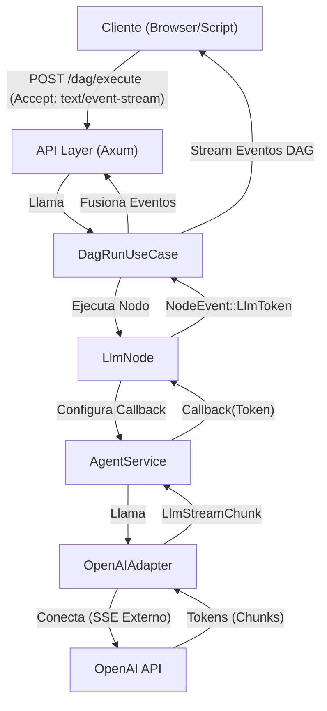
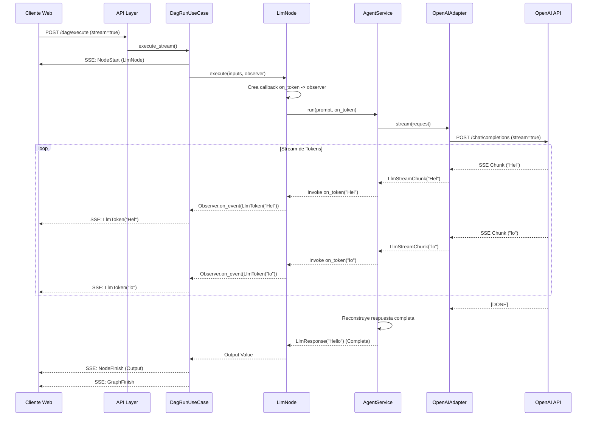

# Explicación Técnica: Server-Sent Events (SSE) y Streaming de LLM

Este documento detalla la implementación del streaming de tokens de LLM utilizando Server-Sent Events (SSE) en la arquitectura de Colmena. El objetivo es permitir que el cliente reciba tokens generados por el modelo de lenguaje en tiempo real, intercalados con eventos del ciclo de vida del grafo de ejecución (DAG).

## 1. ¿Qué es SSE y por qué lo usamos?

**Server-Sent Events (SSE)** es una tecnología web que permite a un servidor enviar actualizaciones automáticas a un cliente a través de una conexión HTTP. A diferencia de los WebSockets (que son bidireccionales), SSE es unidireccional (Servidor -> Cliente), lo cual es ideal para este caso de uso donde el cliente solicita una ejecución y simplemente "escucha" el progreso.

Usamos SSE para cumplir con el **Vercel AI SDK Data Stream Protocol**, lo que facilita la integración con interfaces de usuario modernas de IA.

## 2. Flujo de Datos (Arquitectura)

El flujo de datos atraviesa varias capas de la arquitectura Hexagonal (Clean Architecture) implementada en el proyecto.



## 3. Implementación Paso a Paso

A continuación, explicamos cada componente clave con el código correspondiente.

### 3.1. API Layer: Detectando la Solicitud SSE

En `src/dag_engine/api.rs`, el servidor detecta si el cliente solicita streaming mediante el encabezado `Accept: text/event-stream`. Si está presente, devuelve una respuesta `Sse` en lugar de JSON estándar.

```rust
// src/dag_engine/api.rs

pub async fn handler_webhook(...) -> impl IntoResponse {
    // ...
    // Detectamos si el cliente quiere SSE
    if headers.get("accept").map(|h| h.to_str().unwrap_or("")) == Some("text/event-stream") {
        let stream = use_case.execute_stream(graph);
        
        // Convertimos el stream de eventos internos a formato SSE del protocolo Vercel
        let sse_stream = stream.map(|result| {
            match result {
                Ok(event) => {
                    // Mapeamos eventos como NodeStart, LlmToken, GraphFinish a JSON
                    Event::default().json_data(json!({
                        "type": "data",
                        "value": event // serializado a JSON
                    }))
                },
                // ... manejo de errores
            }
        });
        
        return Sse::new(sse_stream).keep_alive(KeepAlive::default()).into_response();
    }
    // ... fallback a ejecución normal JSON
}
```

### 3.2. Application Layer: Orquestación y Fusión de Streams

El `DagRunUseCase` en `src/dag_engine/application/run_use_case.rs` es el corazón del sistema. En el método `execute_stream`, hace dos cosas cruciales:
1.  Emite eventos del ciclo de vida del DAG (`NodeStart`, `NodeFinish`).
2.  Crea un canal (channel) temporal para recibir eventos asíncronos *dentro* de la ejecución de un nodo (como tokens de LLM) y los fusiona con el stream principal.

```rust
// src/dag_engine/application/run_use_case.rs

pub fn execute_stream(self, graph: Graph) -> impl Stream<...> {
    async_stream::try_stream! {
        // ... Logica de ordenamiento topológico ...

        for node_id in execution_order {
            // 1. Emitimos evento de INICIO de nodo
            yield DagExecutionEvent::NodeStart { ... };

            // 2. Creamos un canal para el Observer
            // Este canal permite que el nodo envíe eventos "fuera de banda" (tokens)
            let (tx, mut rx) = tokio::sync::mpsc::unbounded_channel();
            let observer = Arc::new(ChannelObserver { tx });

            // 3. Ejecutamos el nodo pasando el observer
            let execution_future = node_impl.execute(..., Some(observer));
            tokio::pin!(execution_future);

            // 4. Bucle Select: Esperamos a que el nodo termine O recibimos eventos del observer
            let output_result = loop {
                tokio::select! {
                    res = &mut execution_future => break res, // Nodo terminó
                    Some(event) = rx.recv() => {
                        // Recibimos un evento desde dentro del nodo (ej. un token)
                        match event {
                            NodeEvent::LlmToken { token } => {
                                // Lo re-emitimos al stream principal hacia el cliente
                                yield DagExecutionEvent::LlmToken { node_id: ..., token };
                            }
                        }
                    }
                }
            };

            // 5. Emitimos evento de FIN de nodo
            yield DagExecutionEvent::NodeFinish { ... };
        }
    }
}
```

### 3.3. Infrastructure Layer: LlmNode y Callback

El nodo `LlmNode` en `src/dag_engine/infrastructure/nodes/llm.rs` revisa la configuración para ver si `stream: true`. Si es así, crea un cierre (closure/callback) que conecta el `AgentService` con el `Observer`.

```rust
// src/dag_engine/infrastructure/nodes/llm.rs

// ...
let stream_enabled = inputs.get("stream")...;

let on_token: Option<Box<dyn Fn(String) + Send + Sync>> = if stream_enabled {
    if let Some(obs) = _observer.clone() {
        // Creamos un callback que se ejecutará por cada token recibido
        Some(Box::new(move |token: String| {
            // Enviamos el token al observer (que termina en el canal del UseCase)
            obs.on_event(NodeEvent::LlmToken { token });
        }))
    } else { None }
} else { None };

// Pasamos el callback al servicio
let response = agent_service.run(..., on_token).await?;
```

### 3.4. Domain/Application Layer: AgentService dinámico

El `AgentService` en `src/llm/application/agent_service.rs` decide dinámicamente si usar el método `call` (esperar respuesta completa) o `stream` (recibir por partes) del repositorio de LLM, basándose en si existe el callback `on_token`.

```rust
// src/llm/application/agent_service.rs

// Decidimos si streamear basándonos en si nos pasaron un callback
let should_stream = on_token.is_some();
let request = LlmRequest::new(..., should_stream)?;

let response = if let Some(callback) = &on_token {
    // Modo Streaming
    let mut stream = self.llm_repository.stream(request).await?;
    
    // Consumimos el stream interno
    while let Some(chunk_result) = stream.next().await {
        if let Ok(chunk) = chunk_result {
            // ¡Invocamos el callback por cada pedazo de texto!
            (callback)(chunk.content().to_string());
            full_content.push_str(chunk.content());
        }
    }
    // Reconstruimos la respuesta final para guardarla en memoria y retornarla
    LlmResponse::new(..., full_content, ...)
} else {
    // Modo Request/Response normal
    self.llm_repository.call(request).await?
};
```

### 3.5. Adapter Layer: Parseo de SSE Externo

Finalmente, el `OpenAiAdapter` en `src/llm/infrastructure/openai_adapter.rs` se conecta a la API de OpenAI. Si se pide streaming, usa un Parser de SSE para convertir los bytes crudos en estructuras Rust (`LlmStreamChunk`).

```rust
// src/llm/infrastructure/openai_adapter.rs

async fn stream(&self, request: LlmRequest) -> ... {
    // ... Petición HTTP a OpenAI ...
    let byte_stream = response.bytes_stream();

    // Transformamos bytes -> SSE Events -> LlmStreamChunks
    let sse_stream = SseParser::new(byte_stream).try_filter_map(move |event| {
        match event {
            SseEvent::Message(data) => {
                // Parseamos el JSON de OpenAI (ej. delta: { content: "Hola" })
                let chunk = serde_json::from_str::<OpenAiStreamChunk>(&data)?;
                // Convertimos a nuestro modelo de dominio
                Ok(Some(LlmStreamChunk::new(..., chunk.content, ...)))
            }
        }
    });

    Ok(Box::pin(sse_stream))
}
```

## 4. Diagrama de Secuencia Detallado



## 5. Posibles Mejoras

Aunque la implementación es funcional y robusta, existen áreas de mejora para futuras iteraciones:

1.  **Backpressure y Control de Flujo**:
    *   **El Problema**: Actualmente usamos un `unbounded_channel` (canal infinito). Imagina una tubería: si el LLM (grifo) genera tokens muy rápido (ej. 100/seg) y el cliente (vaso) los consume lento por una mala conexión (ej. 10/seg), el "agua" se acumula en la tubería (memoria RAM del servidor). Si esto continúa, el servidor puede quedarse sin memoria y fallar.
    *   **La Solución**: Cambiar a un `bounded_channel` (ej. capacidad de 100 mensajes). Si el canal se llena, el productor se ve forzado a esperar ("back-pressure") hasta que el consumidor libere espacio. Al bloquear el `send().await`, frenamos la lectura del socket de OpenAI, sincronizando automáticamente la velocidad de generación con la de consumo y protegiendo el servidor.
2.  **Streaming de Tool Calls**: Actualmente solo se streamea el contenido de texto (`content`). Si el modelo decide llamar a una herramienta, el usuario no ve los argumentos generándose en tiempo real. Se podría extender `LlmToken` para soportar `LlmToolToken`.
3.  **Manejo de Errores Granular en Stream**: Si el stream de OpenAI se corta a la mitad, el `AgentService` debería tener una estrategia de reintento o notificar un error parcial específico en lugar de fallar la ejecución completa.
4.  **Soporte Multi-Proveedor**: Asegurar que los adaptadores de `Gemini` y `Anthropic` implementen la lógica de parseo SSE equivalente a la de `OpenAiAdapter`.
5.  **Timeout de Inactividad**: Agregar un timeout específico para el stream. Si OpenAI no envía chunks en X segundos, cerrar la conexión para evitar colgar hilos del servidor.
