<div align="center">

<!-- HERO SECTION -->


<br><br>

<!-- STATS BAR -->
<table>
<tr>
<td align="center"><strong>14</strong><br><sub>Skills</sub></td>
<td align="center"><strong>88</strong><br><sub>Scripts</sub></td>
<td align="center"><strong>940</strong><br><sub>Tests</sub></td>
<td align="center"><strong>CQL</strong><br><sub>Query Support</sub></td>
</tr>
</table>

<br>

<!-- BADGES -->
[](https://github.com/grandcamel/Confluence-Assistant-Skills/releases)
[](https://pypi.org/project/confluence-assistant-skills-lib/)
[](LICENSE)
[](https://www.python.org/downloads/)
[](https://www.atlassian.com/software/confluence)

<br>

### 🚀 Stop clicking through Confluence. Start talking to it.

**Confluence Assistant Skills** brings the power of natural language automation to Confluence Cloud.<br>
Ask Claude to create pages, search content, manage permissions, and more — all without leaving your terminal.

<br>

<!-- QUICK DEMO -->
```
You: "Find all pages labeled 'api-docs' modified this week and export to CSV"

Claude: Found 23 pages matching your criteria.
        ✓ Exported to api-docs-report.csv
```

<br>

[Get Started](#-quick-start) · [View Skills](#-available-skills) · [Documentation](CLAUDE.md) · [Contributing](#-contributing)

</div>

<br>

---

<br>

<!-- PROBLEM / SOLUTION -->
<table>
<tr>
<td width="50%" valign="top">

### 😤 Without Assistant Skills

```
1. Open browser
2. Navigate to Confluence
3. Click through menus
4. Find the right space
5. Create page manually
6. Copy-paste content
7. Format everything
8. Add labels one by one
9. Set permissions
10. Repeat for next page...
```

**Time: 15+ minutes per page**

</td>
<td width="50%" valign="top">

### 🎯 With Assistant Skills

```
You: "Create a page called 'Q4 Planning'
      in the DOCS space with the content
      from my notes.md file, label it
      'planning' and 'q4-2024'"

Claude: ✓ Created page "Q4 Planning"
        ✓ Added 2 labels
        ✓ Page ID: 12345
```

**Time: 10 seconds**

</td>
</tr>
</table>

<br>

---

<br>

## ⚡ Quick Start

<table>
<tr>
<td>

### 1️⃣ Install

**Option A: Claude Code Plugin** (recommended)
```
/plugin grandcamel/Confluence-Assistant-Skills
```

**Option B: Manual**
```bash
git clone https://github.com/grandcamel/Confluence-Assistant-Skills.git
pip install -r requirements.txt
```

</td>
</tr>
<tr>
<td>

### 2️⃣ Configure

```bash
export CONFLUENCE_SITE_URL="https://your-site.atlassian.net"
export CONFLUENCE_EMAIL="you@company.com"
export CONFLUENCE_API_TOKEN="your-api-token"
```

<sub>Get your API token from [Atlassian Account Settings](https://id.atlassian.com/manage-profile/security/api-tokens)</sub>

</td>
</tr>
<tr>
<td>

### 3️⃣ Install CLI

```bash
pip install -e .

# Verify installation
confluence --version
confluence space list --limit 1
```

</td>
</tr>
<tr>
<td>

### 4️⃣ Use

```bash
# CLI commands
confluence page get 12345
confluence search cql "space = DOCS"
confluence label add 12345 approved

# Or ask Claude naturally:
"Create a page titled 'Meeting Notes' in the DOCS space"
"Search for pages about API documentation"
"Add label 'approved' to page 12345"
```

</td>
</tr>
</table>

<br>

---

<br>

## 🔧 Setup (Assistant Skills)

If you're using this as part of the **Assistant Skills** ecosystem, run the setup wizard after installing:

```bash
/assistant-skills-setup
```

This configures:
- Shared Python venv at `~/.assistant-skills-venv/`
- Required dependencies from `requirements.txt`
- Environment variables (prompts you to set: `CONFLUENCE_SITE_URL`, `CONFLUENCE_EMAIL`, `CONFLUENCE_API_TOKEN`)
- `claude-as` shell function for running Claude with dependencies

After setup, use `claude-as` instead of `claude`:
```bash
claude-as  # Runs Claude with Assistant Skills venv activated
```

### Environment Variables

| Variable | Required | Description |
|----------|----------|-------------|
| `CONFLUENCE_SITE_URL` | Yes | Confluence Cloud site URL (e.g., `https://your-site.atlassian.net`) |
| `CONFLUENCE_EMAIL` | Yes | Atlassian account email for API authentication |
| `CONFLUENCE_API_TOKEN` | Yes | API token from [Atlassian Account Settings](https://id.atlassian.com/manage-profile/security/api-tokens) |

<br>

---

<br>

## 🎯 What You Can Do

```mermaid
flowchart LR
    subgraph Input["💬 Natural Language"]
        A["Create a page about..."]
        B["Find all pages with..."]
        C["Update permissions for..."]
    end

    subgraph Skills["🔧 14 Skills"]
        D[Pages]
        E[Search]
        F[Permissions]
        G[Labels]
        H[Comments]
        I[+ 9 more]
    end

    subgraph Output["✅ Results"]
        J["Pages created"]
        K["Content found"]
        L["Settings updated"]
    end

    A --> D --> J
    B --> E --> K
    C --> F --> L

    style Input fill:#0052CC,color:#fff
    style Skills fill:#36B37E,color:#fff
    style Output fill:#00C7E6,color:#000
```



<br>

---

<br>

## 📦 Available Skills

| Skill | Purpose | Example Commands |
|-------|---------|------------------|
| **confluence-page** | Create, read, update, delete pages | `create_page`, `get_page`, `update_page`, `copy_page`, `move_page` |
| **confluence-space** | Manage spaces | `list_spaces`, `create_space`, `get_space`, `delete_space` |
| **confluence-search** | CQL queries & export | `cql_search`, `search_content`, `export_results`, `cql_validate` |
| **confluence-comment** | Page comments | `add_comment`, `get_comments`, `update_comment`, `delete_comment` |
| **confluence-attachment** | File attachments | `upload_attachment`, `download_attachment`, `list_attachments` |
| **confluence-label** | Content labeling | `add_label`, `remove_label`, `get_labels` |
| **confluence-template** | Page templates | `list_templates`, `get_template`, `create_from_template` |
| **confluence-property** | Content properties | `get_properties`, `set_property`, `delete_property` |
| **confluence-permission** | Access control | `get_space_permissions`, `add_space_permission` |
| **confluence-analytics** | View statistics | `get_page_views` |
| **confluence-watch** | Content watching | `watch_page`, `unwatch_page` |
| **confluence-hierarchy** | Page tree navigation | `get_ancestors`, `get_children`, `get_descendants` |
| **confluence-jira** | JIRA integration | `embed_jira_issues`, `get_linked_issues` |
| **confluence-assistant** | Central hub | Routes to specialized skills |

<br>

---

<br>

## 🔍 CQL Query Power

Full Confluence Query Language support with validation, suggestions, and export.

<table>
<tr>
<td width="50%">

### Find Content

```sql
-- Pages in a space
space = "DOCS" AND type = page

-- By label
label = "approved" AND label = "api"

-- Text search
text ~ "API documentation"

-- Recent changes
lastModified >= startOfWeek()
```

</td>
<td width="50%">

### Export Results

```bash
# Export to CSV
confluence search export "label = 'release-notes'" \
  --format csv \
  --output-file releases.csv

# Export to JSON
confluence search export "space = 'DOCS'" \
  --format json
```

</td>
</tr>
</table>

<br>

---

<br>

## 👥 Who Is This For?

<details>
<summary><strong>📝 Technical Writers</strong> — Automate documentation workflows</summary>

<br>

- Bulk create pages from templates
- Search and update outdated content
- Export content for review
- Manage labels across hundreds of pages

```bash
# Find all pages needing review
confluence search cql "label = 'needs-review' AND lastModified < startOfMonth(-3)"
```

</details>

<details>
<summary><strong>🛠️ DevOps Engineers</strong> — Integrate Confluence into CI/CD</summary>

<br>

- Auto-generate release notes
- Update runbooks from code
- Sync documentation with deployments
- Create incident pages automatically

```bash
# Create release notes page
confluence page create RELEASES "v2.5.0" --file CHANGELOG.md
```

</details>

<details>
<summary><strong>👔 Project Managers</strong> — Streamline project documentation</summary>

<br>

- Create project spaces from templates
- Generate status reports
- Track page analytics
- Manage team permissions

```bash
# Get page view statistics
confluence analytics views 12345 --output json
```

</details>

<details>
<summary><strong>🔒 IT Administrators</strong> — Manage Confluence at scale</summary>

<br>

- Audit space permissions
- Bulk update settings
- Export content for compliance
- Automate user provisioning

```bash
# List all space permissions
confluence permission space DOCS --output json
```

</details>

<br>

---

<br>

## 🏗️ Architecture

```
# Root configuration
pytest.ini                    # Test paths, markers, import mode
conftest.py                   # Shared fixtures and pytest hooks

.claude/skills/
├── confluence-assistant/     # Hub skill - routes requests
├── confluence-page/          # Page CRUD operations
├── confluence-space/         # Space management
├── confluence-search/        # CQL queries & export
├── confluence-comment/       # Comments
├── confluence-attachment/    # File attachments
├── confluence-label/         # Labels
├── confluence-template/      # Templates
├── confluence-property/      # Content properties
├── confluence-permission/    # Permissions
├── confluence-analytics/     # Analytics
├── confluence-watch/         # Watching
├── confluence-hierarchy/     # Page tree
├── confluence-jira/          # JIRA integration
└── shared/
    ├── config/               # Configuration schema
    └── tests/                # Shared test fixtures

# Shared library (PyPI package)
confluence-assistant-skills-lib
├── confluence_client.py      # HTTP client with retry
├── config_manager.py         # Configuration management
├── error_handler.py          # Exception handling
├── validators.py             # Input validation
└── formatters.py             # Output formatting
```

<br>

---

<br>

## 🔐 Configuration

### Environment Variables

All configuration is done through environment variables:

```bash
export CONFLUENCE_SITE_URL="https://your-site.atlassian.net"
export CONFLUENCE_EMAIL="you@company.com"
export CONFLUENCE_API_TOKEN="your-api-token"
```

| Variable | Required | Description |
|----------|----------|-------------|
| `CONFLUENCE_SITE_URL` | Yes | Confluence Cloud site URL |
| `CONFLUENCE_EMAIL` | Yes | Atlassian account email |
| `CONFLUENCE_API_TOKEN` | Yes | API token from [Atlassian Account Settings](https://id.atlassian.com/manage-profile/security/api-tokens) |

<br>

---

<br>

## ✅ Quality & Testing

| Metric | Value |
|--------|-------|
| Total Tests | 940 |
| Unit Tests | Comprehensive coverage |
| Live Integration Tests | 64 test files |
| Code Style | PEP 8 compliant |

```bash
# Run all tests
pytest -v

# Run unit tests only (skip live integration)
pytest .claude/skills/ -v --ignore-glob="**/live_integration/*"

# Run with coverage
pytest --cov=confluence_assistant_skills_lib --cov-report=html

# Run live integration tests
pytest .claude/skills/*/tests/live_integration/ --live -v

# Run E2E tests (requires ANTHROPIC_API_KEY)
./scripts/run-e2e-tests.sh           # Docker
./scripts/run-e2e-tests.sh --local   # Local
```

<br>

---

<br>

## 🛠️ Troubleshooting

<details>
<summary><strong>Authentication failed</strong></summary>

1. Verify API token at [Atlassian Account Settings](https://id.atlassian.com/manage-profile/security/api-tokens)
2. Ensure email matches the token owner
3. Check URL includes `https://` and ends with `.atlassian.net`

</details>

<details>
<summary><strong>Permission denied</strong></summary>

1. Verify access in Confluence web UI
2. Some operations require admin permissions
3. Check if content is restricted

</details>

<details>
<summary><strong>CQL syntax error</strong></summary>

```bash
# Validate your query
confluence search validate "your query"
```

Check quotes are balanced and field names are valid.

</details>

<br>

---

<br>

## 📚 Documentation

| Resource | Description |
|----------|-------------|
| [CLAUDE.md](CLAUDE.md) | Developer guide, patterns, API reference |
| [CHANGELOG.md](CHANGELOG.md) | Release history |
| [Confluence API Docs](https://developer.atlassian.com/cloud/confluence/rest/v2/intro/) | Official API reference |

<br>

---

<br>

## 🤝 Contributing

1. Fork the repository
2. Create a feature branch (`git checkout -b feature/amazing-feature`)
3. Make your changes with tests
4. Commit with [Conventional Commits](https://www.conventionalcommits.org/) format
5. Push and submit a pull request

```bash
# Commit format
feat(page): add copy page functionality
fix(search): handle empty CQL results
docs: update README
test(space): add integration tests
```

<br>

---

<br>

## 📄 License

MIT License — see [LICENSE](LICENSE) for details.

<br>

---

<div align="center">

<br>

**[⬆ Back to Top](#)**

<br>

Made with ❤️ for the Confluence community

<br>

[](https://github.com/grandcamel/Confluence-Assistant-Skills)

</div>
