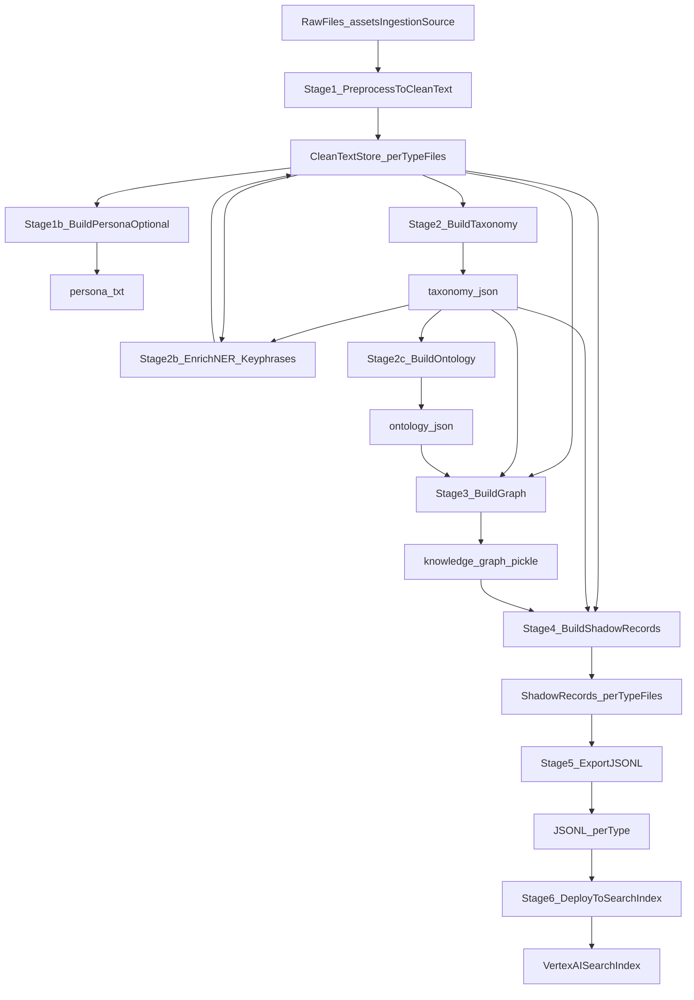

# RAG Ingestion Pipeline

Single canonical flow (persisted stage artifacts under `assets/ingestion/`):



## CLI

All commands are under `contextrouter ingest ...`.

- `preprocess`: Raw → CleanText
- `persona`: CleanText → `persona.txt` (optional; controlled by `[persona].enabled`)
- `taxonomy`: CleanText → `taxonomy.json` (hybrid Pass A/B/C pipeline)
- `ontology`: Taxonomy → `ontology.json` (schema + relation constraints)
- `enrich`: CleanText → NER + keyphrases (optional; does not depend on taxonomy)
  - Output is merged into `keywords` and indexed for keyword search in Postgres
- `graph`: CleanText + `taxonomy.json` + `ontology.json` → `knowledge_graph.pickle`
- `graph-peek`: Quick inspection of graph (nodes/edges + top labels + sample edges)
- `graph-show`: Comprehensive graph statistics and structure
- `graph-audit`: Inspect graph quality (label distribution, directional labels, sample facts)
- `shadow`: CleanText + taxonomy + graph → `shadow/<type>.jsonl`
- `export`: Shadow → Vertex import JSONL (per type)
- `deploy`: JSONL → upload + import into Vertex AI Search
- `report`: Generate ingestion report with stats (taxonomy/graph/ontology coverage)
- `run`: runs preprocess → persona (optional) → taxonomy → ontology → enrich → graph → shadow → export (deploy is separate)
  - `enrich` can be run independently after `preprocess`

**Preflight policy**: every stage checks prerequisites and prints an actionable hint when something is missing.

### Common flags

- `--overwrite/--no-overwrite`:
  - Default is **overwrite** (rebuild stage artifacts)
  - Use `--no-overwrite` to append/keep existing outputs where supported (`preprocess`, `shadow`, `export`)
- `--workers N`:
  - Enables per-type parallelism (where supported)
  - Default is `1` (serial)

## Directory layout

Under `assets/ingestion/`:

- `source/<type>/...`: raw inputs
  - `source/video/`: Video transcript files (`.txt`, `.srt`, or `.vtt`)
  - `source/book/`: Book chapter files (`.txt` or `.md`)
  - `source/qa/`: Q&A session transcripts (`.txt`)
  - `source/web/`: Web content (fetched via `url.toml` or static `.html`/`.txt`)
  - `source/knowledge/`: Knowledge base articles (`.txt` or `.md`)
  - `source/audio/`: Audio transcript files (`.txt`, `.srt`, or `.vtt`) - **Note**: Audio ingestion requires transcript files. Audio files (`.mp3`, `.wav`, etc.) are not directly supported. Use a transcription service to generate `.txt`, `.srt`, or `.vtt` files first, then place them in `source/audio/`.
- `clean_text/<type>.jsonl`: CleanText artifacts (per type)
- `persona.txt`: optional generated persona instruction
- `taxonomy.json`: taxonomy artifact (concepts, categories, canonical_map)
- `ontology.json`: ontology schema (entity types, relation constraints, runtime fact labels)
- `knowledge_graph.pickle`: graph artifact (NetworkX graph with typed relations)
- `shadow/<type>.jsonl`: ShadowRecords (per type)
- `output/jsonl/<type>/*.jsonl`: Vertex import JSONL exports (per type)
- `output/_processing/`: optional debug artifacts (topic_profiles.jsonl, graph_debug_*.json, report/)

## Core Modules

The ingestion pipeline is built on reusable core modules in `modules/ingestion/rag/core/`:

### `batch.py` - LLM Batch Processing

Unified utilities for batch LLM operations:

- `batch_validate()` - Validate items in batches, returning valid indices
- `batch_transform()` - Transform items in batches, returning index→result dict
- `filter_by_indices()` - Filter sequence by valid indices
- `chunked()` - Yield successive chunks from iterable

Used by: video segment validation, QA validation, summary generation.

### `loaders.py` - File Loading Utilities

Utilities for loading and iterating over source files:

- `iter_files()` - Iterate over files matching glob patterns
- `load_text_files()` - Load text files into `LoadedFile` objects
- `read_text_file()` - Read single text file with encoding detection
- `FileLoaderMixin` - Mixin for plugins to load files

### `types.py` - Core Data Types

- `RawData` - Intermediate object returned by loaders (content + metadata)
- `ShadowRecord` - Final output object matching Vertex AI schema
- `IngestionMetadata` - Flexible metadata container (varies by source type)

### `plugins.py` - Source Type Plugins

Plugins implement per-type processing rules:

- `BookPlugin` - Book chapter processing (chunking, topic extraction)
- `VideoPlugin` - Video transcript processing (segment validation, timestamp formatting)
- `QAPlugin` - Q&A session processing (question/answer validation)
- `WebPlugin` - Web content processing (HTML parsing, metadata extraction)
- `TextPlugin` - Generic text processing

Each plugin implements:
- `load()` - Load raw files into `RawData` objects
- `preprocess()` - Transform `RawData` → `CleanText` records
- `validate()` - Validate records (optional)

### `utils.py` - Common Utilities

- `resolve_workers()` - Resolve worker count from config/env
- `normalize_clean_text()` - Normalize text (unicode, whitespace)
- `parallel_map()` - Parallel processing utilities

## Configuration

Configuration is loaded from `settings.toml` (see `settings.toml.example`).

Environment variables:
- `CONTEXTROUTER_CONFIG_PATH`: Direct path to config file
- `CONTEXTROUTER_ASSETS_PATH`: Path to assets folder (config = `{assets}/settings.toml`)

Priority: `CONTEXTROUTER_CONFIG_PATH` > `CONTEXTROUTER_ASSETS_PATH` > package default

## Usage

### Short imports

```python
from contextrouter.modules.ingestion.rag import (
    load_config,
    get_assets_paths,
    preprocess_to_clean_text,
    build_taxonomy_from_clean_text,
    build_graph_from_clean_text,
    build_shadow_records,
    export_jsonl_per_type,
    deploy_jsonl_files,
    RawData,
    ShadowRecord,
)
```

### Programmatic usage

```python
from contextrouter.modules.ingestion.rag import load_config, preprocess_to_clean_text

cfg = load_config()
preprocess_to_clean_text(config=cfg, only_types=["book", "video"], overwrite=True)
```

### Flow-based usage (via FlowManager)

The ingestion stages can also be used as transformers in a Flow:

```toml
[flows.ingestion_rag]
source = "file"
logic = ["ingestion.preprocess", "ingestion.taxonomy", "ingestion.graph", "ingestion.shadow"]
sink = "vertex"
```

## Architecture

This module follows the **modular ingestion pattern**:

- **Connectors** (`modules/connectors/`): Raw data sources (file, API, RSS, web)
- **Transformers** (`modules/ingestion/logic/`): Processing stages (taxonomy, ontology, graph, shadow)
- **Providers** (`modules/providers/`): Storage sinks (Vertex, Postgres, GCS)

The RAG ingestion engine (`modules/ingestion/rag/`) contains:
- Deep business logic for RAG-specific processing
- Type-specific plugins (book, video, qa, web)
- Knowledge graph construction
- Shadow record enrichment

All data flows through `BisquitEnvelope` for provenance tracking and security.
