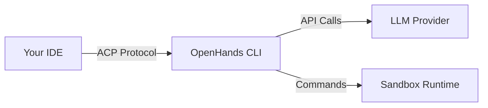

# IDE Integration Overview

> Use OpenHands directly in your favorite code editor through the Agent Client Protocol

<Warning>
  IDE integration via ACP is experimental and may have limitations. Please report any issues on the [OpenHands-CLI repo](https://github.com/OpenHands/OpenHands-CLI/issues).
</Warning>

## What is the Agent Client Protocol (ACP)?

The [Agent Client Protocol (ACP)](https://agentclientprotocol.com/protocol/overview) is a standardized communication protocol that enables code editors and IDEs to interact with AI agents. ACP defines how clients (like code editors) and agents (like OpenHands) communicate through a JSON-RPC 2.0 interface.

## Supported IDEs

| IDE                                             | Support Level       | Setup Guide                       |
| ----------------------------------------------- | ------------------- | --------------------------------- |
| [Zed](/openhands/usage/cli/ide/zed)             | Native              | Built-in ACP support              |
| [Toad](/openhands/usage/cli/ide/toad)           | Native              | Universal terminal interface      |
| [VS Code](/openhands/usage/cli/ide/vscode)      | Community Extension | Via VSCode ACP extension          |
| [JetBrains](/openhands/usage/cli/ide/jetbrains) | Native              | IntelliJ, PyCharm, WebStorm, etc. |

## Prerequisites

Before using OpenHands with any IDE, you must:

1. **Install OpenHands CLI** following the [installation instructions](/openhands/usage/cli/installation)

2. **Configure your LLM settings** using the `/settings` command:
   ```bash  theme={null}
   openhands
   # Then use /settings to configure
   ```

The ACP integration will reuse the credentials and configuration from your CLI settings stored in `~/.openhands/settings.json`.

## How It Works



1. Your IDE launches `openhands acp` as a subprocess
2. Communication happens via JSON-RPC 2.0 over stdio
3. OpenHands uses your configured LLM and runtime settings
4. Results are displayed in your IDE's interface

## The ACP Command

The `openhands acp` command starts OpenHands as an ACP server:

```bash  theme={null}
# Basic ACP server
openhands acp

# With LLM-based approval
openhands acp --llm-approve

# Resume a conversation
openhands acp --resume <conversation-id>

# Resume the latest conversation
openhands acp --resume --last
```

### ACP Options

| Option             | Description                         |
| ------------------ | ----------------------------------- |
| `--resume [ID]`    | Resume a conversation by ID         |
| `--last`           | Resume the most recent conversation |
| `--always-approve` | Auto-approve all actions            |
| `--llm-approve`    | Use LLM-based security analyzer     |
| `--streaming`      | Enable token-by-token streaming     |

## Choosing an IDE

<CardGroup cols={2}>
  <Card title="Zed" icon="bolt" href="/openhands/usage/cli/ide/zed">
    High-performance editor with native ACP support. Best for speed and simplicity.
  </Card>

  <Card title="Toad" icon="terminal" href="/openhands/usage/cli/ide/toad">
    Universal terminal interface. Works with any terminal, consistent experience.
  </Card>

  <Card title="VS Code" icon="code" href="/openhands/usage/cli/ide/vscode">
    Popular editor with community extension. Great for VS Code users.
  </Card>

  <Card title="JetBrains" icon="java" href="/openhands/usage/cli/ide/jetbrains">
    IntelliJ, PyCharm, WebStorm, etc. Best for JetBrains ecosystem users.
  </Card>
</CardGroup>

## Resuming Conversations in IDEs

You can resume previous conversations in ACP mode. Since ACP mode doesn't display an interactive list, first find your conversation ID:

```bash  theme={null}
openhands --resume
```

This shows your recent conversations:

```
Recent Conversations:
--------------------------------------------------------------------------------
 1. abc123def456 (2h ago)
    Fix the login bug in auth.py

 2. xyz789ghi012 (yesterday)
    Add unit tests for the user service
--------------------------------------------------------------------------------
```

Then configure your IDE to use `--resume <id>` or `--resume --last`. See each IDE's documentation for specific configuration.

## See Also

* [ACP Documentation](https://agentclientprotocol.com/protocol/overview) - Full protocol specification
* [Terminal Mode](/openhands/usage/cli/terminal) - Use OpenHands in the terminal
* [Resume Conversations](/openhands/usage/cli/resume) - Detailed resume guide


---

> To find navigation and other pages in this documentation, fetch the llms.txt file at: https://docs.openhands.dev/llms.txt