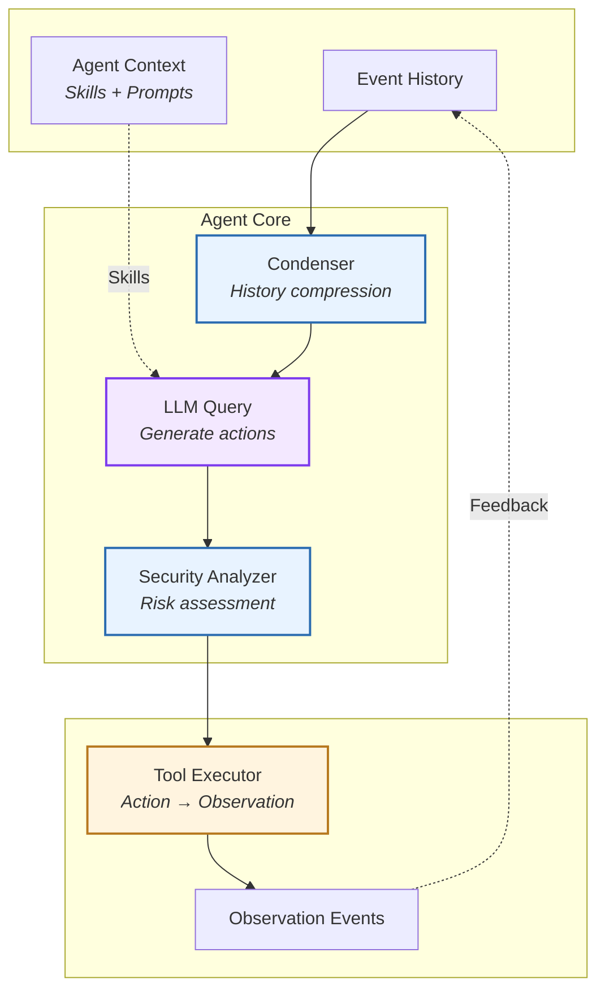
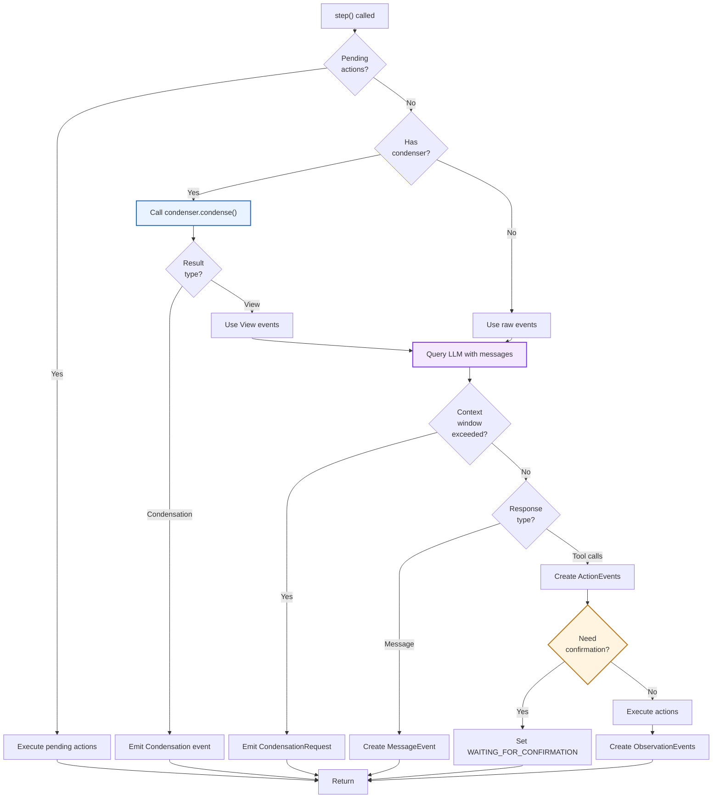
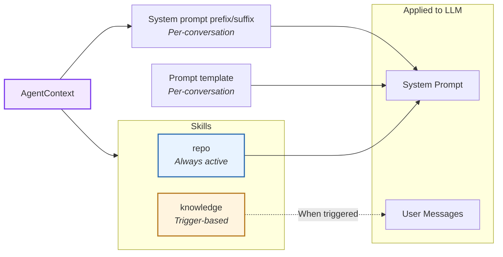
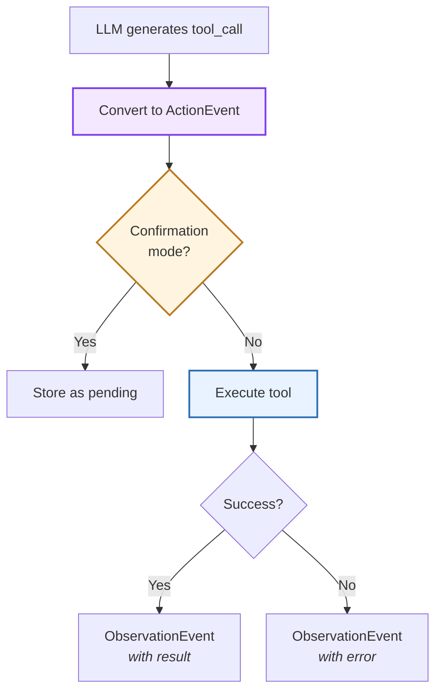
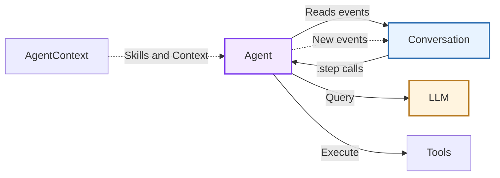

# Agent

> High-level architecture of the reasoning-action loop

The **Agent** component implements the core reasoning-action loop that drives autonomous task execution. It orchestrates LLM queries, tool execution, and context management through a stateless, event-driven architecture.

**Source:** [`openhands-sdk/openhands/sdk/agent/`](https://github.com/OpenHands/software-agent-sdk/tree/main/openhands-sdk/openhands/sdk/agent)

## Core Responsibilities

The Agent system has four primary responsibilities:

1. **Reasoning-Action Loop** - Query LLM to generate next actions based on conversation history
2. **Tool Orchestration** - Select and execute tools, handle results and errors
3. **Context Management** - Apply [skills](/sdk/guides/skill), manage conversation history via [condensers](/sdk/guides/context-condenser)
4. **Security Validation** - Analyze proposed actions for safety before execution via [security analyzer](/sdk/guides/security)

## Architecture

### Key Components

| Component                                                                                                                            | Purpose             | Design                                       |
| ------------------------------------------------------------------------------------------------------------------------------------ | ------------------- | -------------------------------------------- |
| **[`Agent`](https://github.com/OpenHands/software-agent-sdk/blob/main/openhands-sdk/openhands/sdk/agent/agent.py)**                  | Main implementation | Stateless reasoning-action loop executor     |
| **[`AgentBase`](https://github.com/OpenHands/software-agent-sdk/blob/main/openhands-sdk/openhands/sdk/agent/base.py)**               | Abstract base class | Defines agent interface and initialization   |
| **[`AgentContext`](https://github.com/OpenHands/software-agent-sdk/blob/main/openhands-sdk/openhands/sdk/context/agent_context.py)** | Context container   | Manages skills, prompts, and metadata        |
| **[`Condenser`](https://github.com/OpenHands/software-agent-sdk/blob/main/openhands-sdk/openhands/sdk/context/condenser/)**          | History compression | Reduces context when token limits approached |
| **[`SecurityAnalyzer`](https://github.com/OpenHands/software-agent-sdk/blob/main/openhands-sdk/openhands/sdk/security/)**            | Safety validation   | Evaluates action risk before execution       |

## Reasoning-Action Loop

The agent operates through a **single-step execution model** where each `step()` call processes one reasoning cycle:

**Step Execution Flow:**

1. **Pending Actions:** If actions awaiting confirmation exist, execute them and return
2. **Condensation:** If condenser exists:
   * Call `condenser.condense()` with current event view
   * If returns `View`: use condensed events for LLM query (continue in same step)
   * If returns `Condensation`: emit event and return (will be processed next step)
3. **LLM Query:** Query LLM with messages from event history
   * If context window exceeded: emit `CondensationRequest` and return
4. **Response Parsing:** Parse LLM response into events
   * Tool calls → create `ActionEvent`(s)
   * Text message → create `MessageEvent` and return
5. **Confirmation Check:** If actions need user approval:
   * Set conversation status to `WAITING_FOR_CONFIRMATION` and return
6. **Action Execution:** Execute tools and create `ObservationEvent`(s)

**Key Characteristics:**

* **Stateless:** Agent holds no mutable state between steps
* **Event-Driven:** Reads from event history, writes new events
* **Interruptible:** Each step is atomic and can be paused/resumed

## Agent Context

The agent applies `AgentContext` which includes **skills** and **prompts** to shape LLM behavior:

| Skill Type    | Activation             | Use Case                              |
| ------------- | ---------------------- | ------------------------------------- |
| **repo**      | Always included        | Project-specific context, conventions |
| **knowledge** | Trigger words/patterns | Domain knowledge, special behaviors   |

Review [this guide](/sdk/guides/skill) for details on creating and applying agent context and skills.

## Tool Execution

Tools follow a **strict action-observation pattern**:

**Execution Modes:**

| Mode             | Behavior                                 | Use Case                          |
| ---------------- | ---------------------------------------- | --------------------------------- |
| **Direct**       | Execute immediately                      | Development, trusted environments |
| **Confirmation** | Store as pending, wait for user approval | High-risk actions, production     |

**Security Integration:**

Before execution, the security analyzer evaluates each action:

* **Low Risk:** Execute immediately
* **Medium Risk:** Log warning, execute with monitoring
* **High Risk:** Block execution, request user confirmation

## Component Relationships

### How Agent Interacts

**Relationship Characteristics:**

* **Conversation → Agent**: Orchestrates step execution, provides event history
* **Agent → LLM**: Queries for next actions, receives tool calls or messages
* **Agent → Tools**: Executes actions, receives observations
* **AgentContext → Agent**: Injects skills and prompts into LLM queries

## See Also

* **[Conversation Architecture](/sdk/arch/conversation)** - Agent orchestration and lifecycle
* **[Tool System](/sdk/arch/tool-system)** - Tool definition and execution patterns
* **[Events](/sdk/arch/events)** - Event types and structures
* **[Skills](/sdk/arch/skill)** - Prompt engineering and skill patterns
* **[LLM](/sdk/arch/llm)** - Language model abstraction

---

> To find navigation and other pages in this documentation, fetch the llms.txt file at: https://docs.openhands.dev/llms.txt