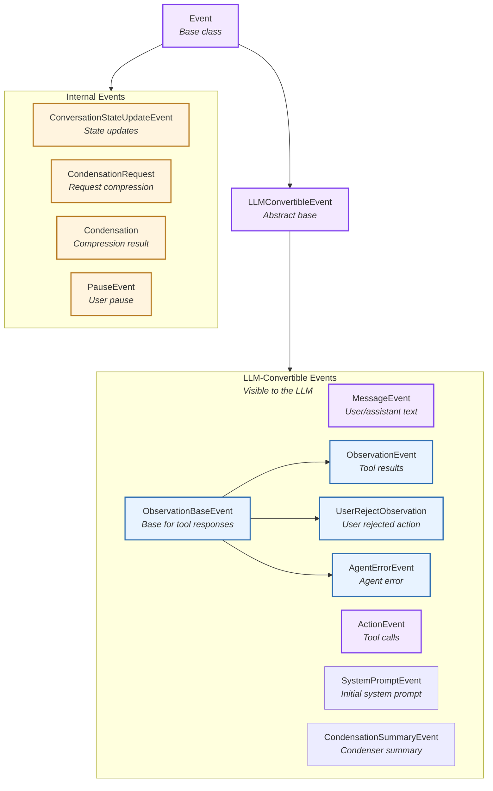
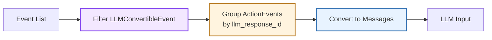
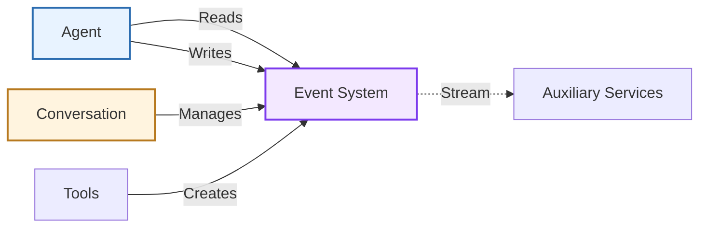

# Events

> High-level architecture of the typed event framework

The **Event System** provides an immutable, type-safe event framework that drives agent execution and state management. Events form an append-only log that serves as both the agent's memory and the integration point for auxiliary services.

**Source:** [`openhands-sdk/openhands/sdk/event/`](https://github.com/OpenHands/software-agent-sdk/tree/main/openhands-sdk/openhands/sdk/event)

## Core Responsibilities

The Event System has four primary responsibilities:

1. **Type Safety** - Enforce event schemas through Pydantic models
2. **LLM Integration** - Convert events to/from LLM message formats
3. **Append-Only Log** - Maintain immutable event history
4. **Service Integration** - Enable observers to react to event streams

## Architecture



### Key Components

| Component                                                                                                                                                 | Purpose               | Design                                                        |
| --------------------------------------------------------------------------------------------------------------------------------------------------------- | --------------------- | ------------------------------------------------------------- |
| **[`Event`](https://github.com/OpenHands/software-agent-sdk/blob/main/openhands-sdk/openhands/sdk/event/base.py)**                                        | Base event class      | Immutable Pydantic model with ID, timestamp, source           |
| **[`LLMConvertibleEvent`](https://github.com/OpenHands/software-agent-sdk/blob/main/openhands-sdk/openhands/sdk/event/base.py)**                          | LLM-compatible events | Abstract class with `to_llm_message()` method                 |
| **[`MessageEvent`](https://github.com/OpenHands/software-agent-sdk/blob/main/openhands-sdk/openhands/sdk/event/llm_convertible/message.py)**              | Text messages         | User or assistant conversational messages with skills         |
| **[`ActionEvent`](https://github.com/OpenHands/software-agent-sdk/blob/main/openhands-sdk/openhands/sdk/event/llm_convertible/action.py)**                | Tool calls            | Agent tool invocations with thought, reasoning, security risk |
| **[`ObservationBaseEvent`](https://github.com/OpenHands/software-agent-sdk/blob/main/openhands-sdk/openhands/sdk/event/llm_convertible/observation.py)**  | Tool response base    | Base for all tool call responses                              |
| **[`ObservationEvent`](https://github.com/OpenHands/software-agent-sdk/blob/main/openhands-sdk/openhands/sdk/event/llm_convertible/observation.py)**      | Tool results          | Successful tool execution outcomes                            |
| **[`UserRejectObservation`](https://github.com/OpenHands/software-agent-sdk/blob/main/openhands-sdk/openhands/sdk/event/llm_convertible/observation.py)** | User rejection        | User rejected action in confirmation mode                     |
| **[`AgentErrorEvent`](https://github.com/OpenHands/software-agent-sdk/blob/main/openhands-sdk/openhands/sdk/event/llm_convertible/observation.py)**       | Agent errors          | Errors from agent/scaffold (not model output)                 |
| **[`SystemPromptEvent`](https://github.com/OpenHands/software-agent-sdk/blob/main/openhands-sdk/openhands/sdk/event/llm_convertible/system.py)**          | System context        | System prompt with tool schemas                               |
| **[`CondensationSummaryEvent`](https://github.com/OpenHands/software-agent-sdk/blob/main/openhands-sdk/openhands/sdk/event/condenser.py)**                | Condenser summary     | LLM-convertible summary of forgotten events                   |
| **[`ConversationStateUpdateEvent`](https://github.com/OpenHands/software-agent-sdk/blob/main/openhands-sdk/openhands/sdk/event/conversation_state.py)**   | State updates         | Key-value conversation state changes                          |
| **[`Condensation`](https://github.com/OpenHands/software-agent-sdk/blob/main/openhands-sdk/openhands/sdk/event/condenser.py)**                            | Condensation result   | Events being forgotten with optional summary                  |
| **[`CondensationRequest`](https://github.com/OpenHands/software-agent-sdk/blob/main/openhands-sdk/openhands/sdk/event/condenser.py)**                     | Request compression   | Trigger for conversation history compression                  |
| **[`PauseEvent`](https://github.com/OpenHands/software-agent-sdk/blob/main/openhands-sdk/openhands/sdk/event/user_action.py)**                            | User pause            | User requested pause of agent execution                       |

## Event Types

### LLM-Convertible Events

Events that participate in agent reasoning and can be converted to LLM messages:

| Event Type                   | Source      | Content                                          | LLM Role                      |
| ---------------------------- | ----------- | ------------------------------------------------ | ----------------------------- |
| **MessageEvent (user)**      | user        | Text, images                                     | `user`                        |
| **MessageEvent (agent)**     | agent       | Text reasoning, skills                           | `assistant`                   |
| **ActionEvent**              | agent       | Tool call with thought, reasoning, security risk | `assistant` with `tool_calls` |
| **ObservationEvent**         | environment | Tool execution result                            | `tool`                        |
| **UserRejectObservation**    | environment | Rejection reason                                 | `tool`                        |
| **AgentErrorEvent**          | agent       | Error details                                    | `tool`                        |
| **SystemPromptEvent**        | agent       | System prompt with tool schemas                  | `system`                      |
| **CondensationSummaryEvent** | environment | Summary of forgotten events                      | `user`                        |

The event system bridges agent events to LLM messages:



**Special Handling - Parallel Function Calling:**

When multiple `ActionEvent`s share the same `llm_response_id` (parallel function calling):

1. Group all ActionEvents by `llm_response_id`
2. Combine into single Message with multiple `tool_calls`
3. Only first event's `thought`, `reasoning_content`, and `thinking_blocks` are included
4. All subsequent events in the batch have empty thought fields

**Example:**

```
ActionEvent(llm_response_id="abc123", thought="Let me check...", tool_call=tool1)
ActionEvent(llm_response_id="abc123", thought=[], tool_call=tool2)
→ Combined into single Message(role="assistant", content="Let me check...", tool_calls=[tool1, tool2])
```

### Internal Events

Events for metadata, control flow, and user actions (not sent to LLM):

| Event Type                       | Source      | Purpose                     | Key Fields                                         |
| -------------------------------- | ----------- | --------------------------- | -------------------------------------------------- |
| **ConversationStateUpdateEvent** | environment | State synchronization       | `key` (field name), `value` (serialized data)      |
| **CondensationRequest**          | environment | Trigger history compression | Signal to condenser when context window exceeded   |
| **Condensation**                 | environment | Compression result          | `forgotten_event_ids`, `summary`, `summary_offset` |
| **PauseEvent**                   | user        | User pause action           | Indicates agent execution was paused by user       |

**Source Types:**

* **user**: Event originated from user input
* **agent**: Event generated by agent logic
* **environment**: Event from system/framework/tools

## Component Relationships

### How Events Integrate



**Relationship Characteristics:**

* **Agent → Events**: Reads history for context, writes actions/messages
* **Conversation → Events**: Owns and persists event log
* **Tools → Events**: Create ObservationEvents after execution
* **Services → Events**: Read-only observers for monitoring, visualization

## Error Events: Agent vs Conversation

Two distinct error events exist in the SDK, with different purpose and visibility:

* AgentErrorEvent
  * Type: ObservationBaseEvent (LLM-convertible)
  * Scope: Error for a specific tool call (has tool\_name and tool\_call\_id)
  * Source: "agent"
  * LLM visibility: Sent as a tool message so the model can react/recover
  * Effect: Conversation continues; not a terminal state
  * Code: [https://github.com/OpenHands/software-agent-sdk/blob/main/openhands-sdk/openhands/sdk/event/llm\_convertible/observation.py](https://github.com/OpenHands/software-agent-sdk/blob/main/openhands-sdk/openhands/sdk/event/llm_convertible/observation.py)

* ConversationErrorEvent
  * Type: Event (not LLM-convertible)
  * Scope: Conversation-level runtime failure (no tool\_name/tool\_call\_id)
  * Source: typically "environment"
  * LLM visibility: Not sent to the model
  * Effect: Run loop transitions to ERROR and run() raises ConversationRunError; surface top-level error to client applications
  * Code: [https://github.com/OpenHands/software-agent-sdk/blob/main/openhands-sdk/openhands/sdk/event/conversation\_error.py](https://github.com/OpenHands/software-agent-sdk/blob/main/openhands-sdk/openhands/sdk/event/conversation_error.py)

## See Also

* **[Agent Architecture](/sdk/arch/agent)** - How agents read and write events
* **[Conversation Architecture](/sdk/arch/conversation)** - Event log management
* **[Tool System](/sdk/arch/tool-system)** - ActionEvent and ObservationEvent generation
* **[Condenser](/sdk/arch/condenser)** - Event history compression


---

> To find navigation and other pages in this documentation, fetch the llms.txt file at: https://docs.openhands.dev/llms.txt