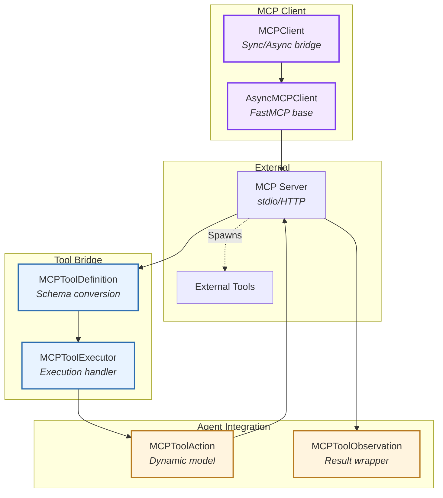
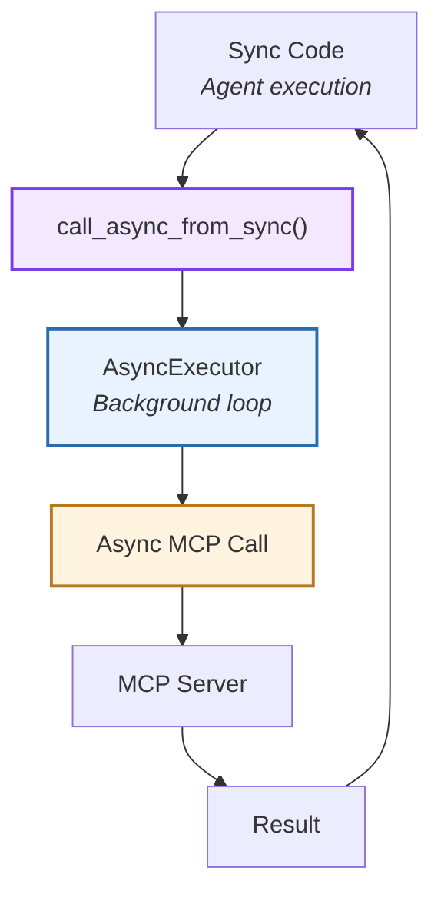
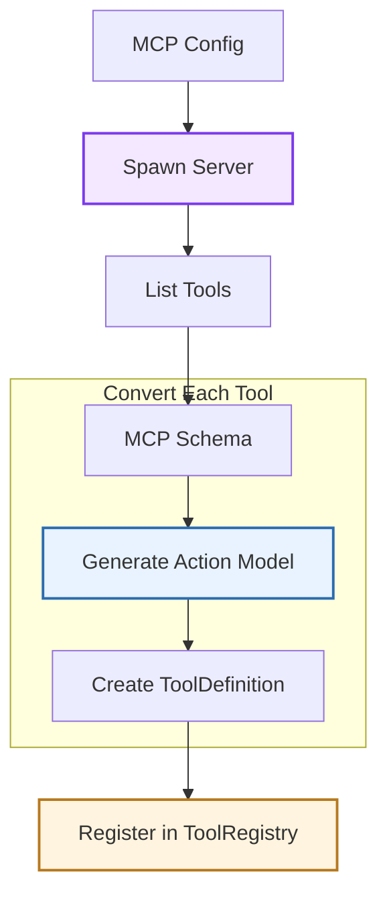
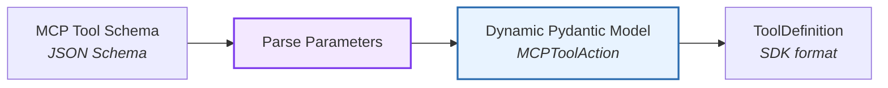
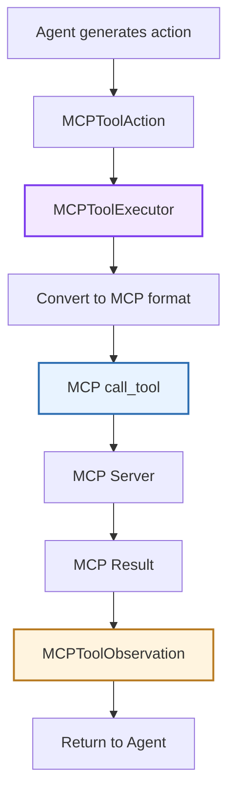
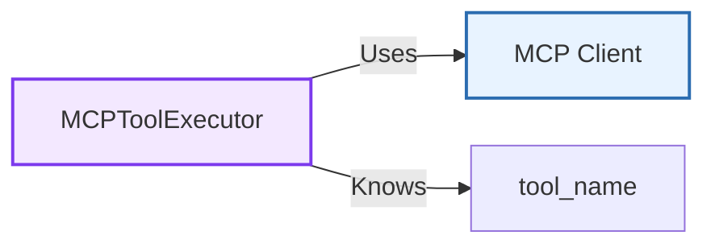
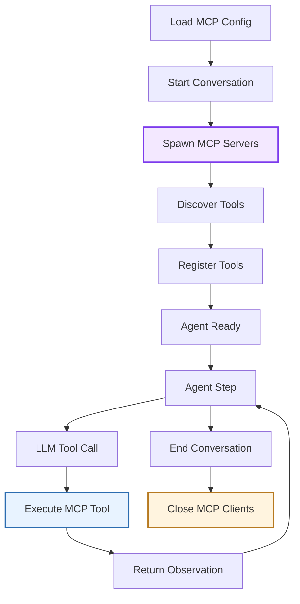
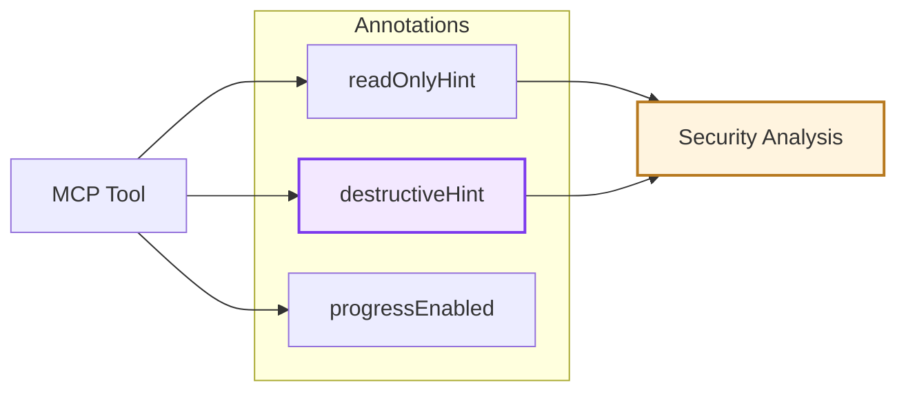
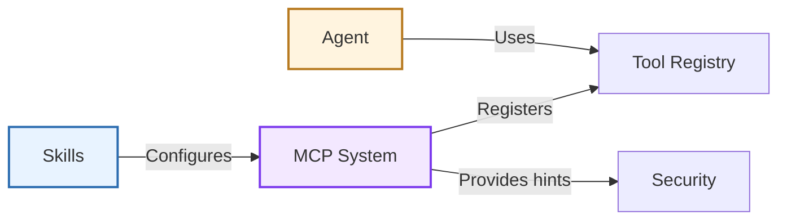

# MCP Integration

> High-level architecture of Model Context Protocol support

The **MCP Integration** system enables agents to use external tools via the Model Context Protocol (MCP). It provides a bridge between MCP servers and the Software Agent SDK's tool system, supporting both synchronous and asynchronous execution.

**Source:** [`openhands/sdk/mcp/`](https://github.com/OpenHands/software-agent-sdk/tree/main/openhands-sdk/openhands/sdk/mcp)

## Core Responsibilities

The MCP Integration system has four primary responsibilities:

1. **MCP Client Management** - Connect to and communicate with MCP servers
2. **Tool Discovery** - Enumerate available tools from MCP servers
3. **Schema Adaptation** - Convert MCP tool schemas to SDK tool definitions
4. **Execution Bridge** - Execute MCP tool calls from agent actions

## Architecture



### Key Components

| Component                                                                                                                           | Purpose              | Design                                 |
| ----------------------------------------------------------------------------------------------------------------------------------- | -------------------- | -------------------------------------- |
| **[`MCPClient`](https://github.com/OpenHands/software-agent-sdk/blob/main/openhands-sdk/openhands/sdk/mcp/client.py)**              | Client wrapper       | Extends FastMCP with sync/async bridge |
| **[`MCPToolDefinition`](https://github.com/OpenHands/software-agent-sdk/blob/main/openhands-sdk/openhands/sdk/mcp/definition.py)**  | Tool metadata        | Converts MCP schemas to SDK format     |
| **[`MCPToolExecutor`](https://github.com/OpenHands/software-agent-sdk/blob/main/openhands-sdk/openhands/sdk/mcp/tool.py)**          | Execution handler    | Bridges agent actions to MCP calls     |
| **[`MCPToolAction`](https://github.com/OpenHands/software-agent-sdk/blob/main/openhands-sdk/openhands/sdk/mcp/definition.py)**      | Dynamic action model | Runtime-generated Pydantic model       |
| **[`MCPToolObservation`](https://github.com/OpenHands/software-agent-sdk/blob/main/openhands-sdk/openhands/sdk/mcp/definition.py)** | Result wrapper       | Wraps MCP tool results                 |

## MCP Client

### Sync/Async Bridge

The SDK's `MCPClient` extends FastMCP's async client with synchronous wrappers:



**Bridge Pattern:**

* **Problem:** MCP protocol is async, but agent tools run synchronously
* **Solution:** Background event loop that executes async code from sync contexts
* **Benefit:** Agents use MCP tools without async/await in tool definitions

**Client Features:**

* **Lifecycle Management:** `__enter__`/`__exit__` for context manager
* **Timeout Support:** Configurable timeouts for MCP operations
* **Error Handling:** Wraps MCP errors in observations
* **Connection Pooling:** Reuses connections across tool calls

### MCP Server Configuration

MCP servers are configured using the FastMCP format:

```python  theme={null}
mcp_config = {
    "mcpServers": {
        "fetch": {
            "command": "uvx",
            "args": ["mcp-server-fetch"]
        },
        "filesystem": {
            "command": "npx",
            "args": ["-y", "@modelcontextprotocol/server-filesystem", "/path"]
        }
    }
}
```

**Configuration Fields:**

* **command:** Executable to spawn (e.g., `uvx`, `npx`, `node`)
* **args:** Arguments to pass to command
* **env:** Environment variables (optional)

## Tool Discovery and Conversion

### Discovery Flow



**Discovery Steps:**

1. **Spawn Server:** Launch MCP server via stdio
2. **List Tools:** Call `tools/list` MCP endpoint
3. **Parse Schemas:** Extract tool names, descriptions, parameters
4. **Generate Models:** Dynamically create Pydantic models for actions
5. **Create Definitions:** Wrap in `ToolDefinition` objects
6. **Register:** Add to agent's tool registry

### Schema Conversion

MCP tool schemas are converted to SDK tool definitions:



**Conversion Rules:**

| MCP Schema      | SDK Action Model       |
| --------------- | ---------------------- |
| **name**        | Class name (camelCase) |
| **description** | Docstring              |
| **inputSchema** | Pydantic fields        |
| **required**    | Field(required=True)   |
| **type**        | Python type hints      |

**Example:**

```python  theme={null}
# MCP Schema
{
    "name": "fetch_url",
    "description": "Fetch content from URL",
    "inputSchema": {
        "type": "object",
        "properties": {
            "url": {"type": "string"},
            "timeout": {"type": "number"}
        },
        "required": ["url"]
    }
}

# Generated Action Model
class FetchUrl(MCPToolAction):
    """Fetch content from URL"""
    url: str
    timeout: float | None = None
```

## Tool Execution

### Execution Flow



**Execution Steps:**

1. **Action Creation:** LLM generates tool call, parsed into `MCPToolAction`
2. **Executor Lookup:** Find `MCPToolExecutor` for tool name
3. **Format Conversion:** Convert action fields to MCP arguments
4. **MCP Call:** Execute `call_tool` via MCP client
5. **Result Parsing:** Parse MCP result (text, images, resources)
6. **Observation Creation:** Wrap in `MCPToolObservation`
7. **Error Handling:** Catch exceptions, return error observations

### MCPToolExecutor

Executors bridge SDK actions to MCP calls:



**Executor Responsibilities:**

* **Client Management:** Hold reference to MCP client
* **Tool Identification:** Know which MCP tool to call
* **Argument Conversion:** Transform action fields to MCP format
* **Result Handling:** Parse MCP responses
* **Error Recovery:** Handle connection errors, timeouts, server failures

## MCP Tool Lifecycle

### From Configuration to Execution



**Lifecycle Phases:**

| Phase              | Operations                          | Components                         |
| ------------------ | ----------------------------------- | ---------------------------------- |
| **Initialization** | Spawn servers, discover tools       | MCPClient, ToolRegistry            |
| **Registration**   | Create definitions, executors       | MCPToolDefinition, MCPToolExecutor |
| **Execution**      | Handle tool calls                   | Agent, MCPToolAction               |
| **Cleanup**        | Close connections, shutdown servers | MCPClient.sync\_close()            |

## MCP Annotations

MCP tools can include metadata hints for agents:



**Annotation Types:**

| Annotation          | Meaning                    | Use Case             |
| ------------------- | -------------------------- | -------------------- |
| **readOnlyHint**    | Tool doesn't modify state  | Lower security risk  |
| **destructiveHint** | Tool modifies/deletes data | Require confirmation |
| **progressEnabled** | Tool reports progress      | Show progress UI     |

These annotations feed into the security analyzer for risk assessment.

## Component Relationships

### How MCP Integrates



**Relationship Characteristics:**

* **Skills → MCP**: Repository skills can embed MCP configurations
* **MCP → Tools**: MCP tools registered alongside native tools
* **Agent → Tools**: Agents use MCP tools like any other tool
* **MCP → Security**: Annotations inform security risk assessment
* **Transparent Integration**: Agent doesn't distinguish MCP from native tools

## Design Rationale

**Async Bridge Pattern:** MCP protocol requires async, but synchronous tool execution simplifies agent implementation. Background event loop bridges the gap without exposing async complexity to tool users.

**Dynamic Model Generation:** Creating Pydantic models at runtime from MCP schemas enables type-safe tool calls without manual model definitions. This supports arbitrary MCP servers without SDK code changes.

**Unified Tool Interface:** Wrapping MCP tools in `ToolDefinition` makes them indistinguishable from native tools. Agents use the same interface regardless of tool source.

**FastMCP Foundation:** Building on FastMCP (MCP SDK for Python) provides battle-tested client implementation, protocol compliance, and ongoing updates as MCP evolves.

**Annotation Support:** Exposing MCP hints (readOnly, destructive) enables intelligent security analysis and user confirmation flows based on tool characteristics.

**Lifecycle Management:** Automatic spawn/cleanup of MCP servers in conversation lifecycle ensures resources are properly managed without manual bookkeeping.

## See Also

* **[Tool System](/sdk/arch/tool-system)** - How MCP tools integrate with tool framework
* **[Skill Architecture](/sdk/arch/skill)** - Embedding MCP configs in repository skills
* **[Security](/sdk/arch/security)** - How MCP annotations inform risk assessment
* **[MCP Guide](/sdk/guides/mcp)** - Using MCP tools in applications
* **[FastMCP Documentation](https://gofastmcp.com/)** - Underlying MCP client library


---

> To find navigation and other pages in this documentation, fetch the llms.txt file at: https://docs.openhands.dev/llms.txt
