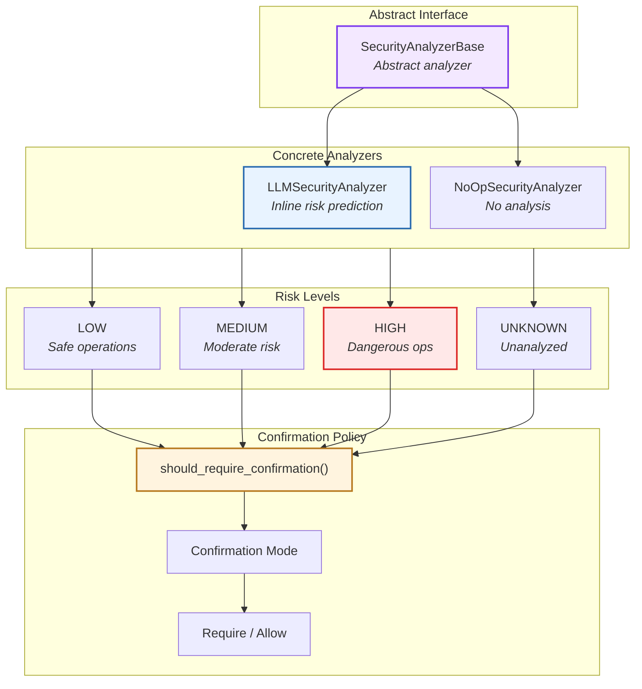
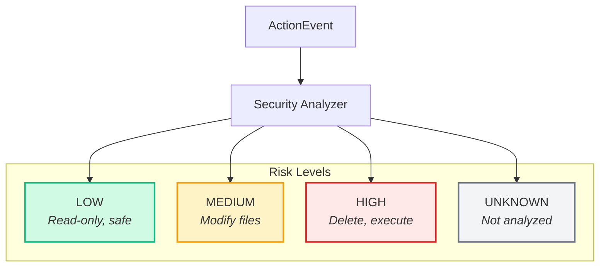
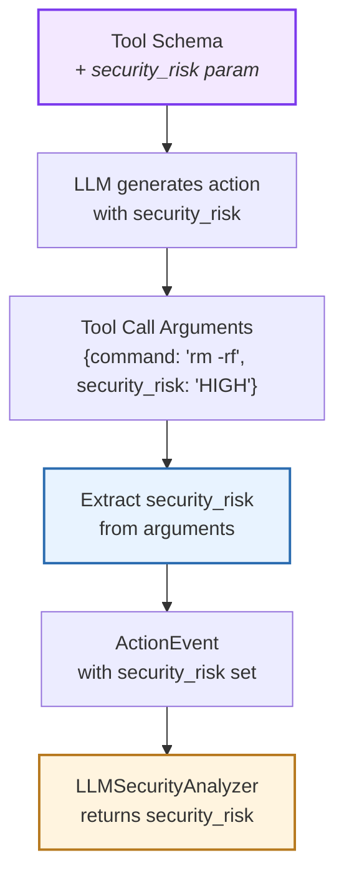
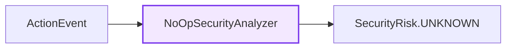
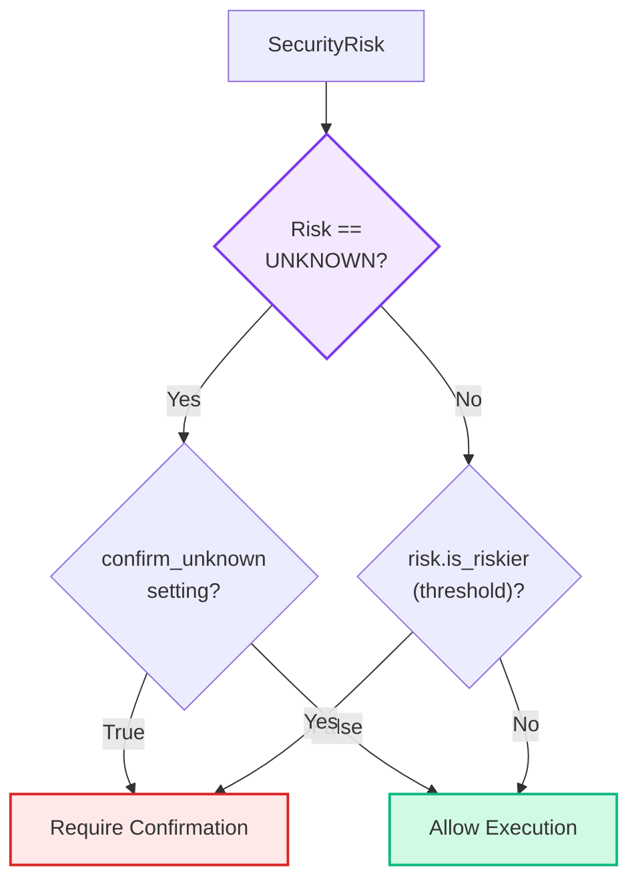
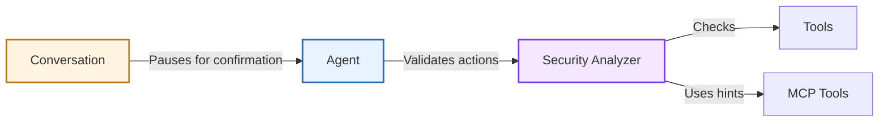

# Security

> High-level architecture of action security analysis and validation

The **Security** system evaluates agent actions for potential risks before execution. It provides pluggable security analyzers that assess action risk levels and enforce confirmation policies based on security characteristics.

**Source:** [`openhands-sdk/penhands/sdk/security/`](https://github.com/OpenHands/software-agent-sdk/tree/main/openhands-sdk/openhands/sdk/security)

## Core Responsibilities

The Security system has four primary responsibilities:

1. **Risk Assessment** - Capture and validate LLM-provided risk levels for actions
2. **Confirmation Policy** - Determine when user approval is required based on risk
3. **Action Validation** - Enforce security policies before execution
4. **Audit Trail** - Record security decisions in event history

## Architecture



### Key Components

| Component                                                                                                                                         | Purpose                | Design                                          |
| ------------------------------------------------------------------------------------------------------------------------------------------------- | ---------------------- | ----------------------------------------------- |
| **[`SecurityAnalyzerBase`](https://github.com/OpenHands/software-agent-sdk/blob/main/openhands-sdk/openhands/sdk/security/analyzer.py)**          | Abstract interface     | Defines `security_risk()` contract              |
| **[`LLMSecurityAnalyzer`](https://github.com/OpenHands/software-agent-sdk/blob/main/openhands-sdk/openhands/sdk/security/llm_analyzer.py)**       | Inline risk assessment | Returns LLM-provided risk from action arguments |
| **[`NoOpSecurityAnalyzer`](https://github.com/OpenHands/software-agent-sdk/blob/main/openhands-sdk/openhands/sdk/security/analyzer.py)**          | Passthrough analyzer   | Always returns UNKNOWN                          |
| **[`SecurityRisk`](https://github.com/OpenHands/software-agent-sdk/blob/main/openhands-sdk/openhands/sdk/security/risk.py)**                      | Risk enum              | LOW, MEDIUM, HIGH, UNKNOWN                      |
| **[`ConfirmationPolicy`](https://github.com/OpenHands/software-agent-sdk/blob/main/openhands-sdk/openhands/sdk/security/confirmation_policy.py)** | Decision logic         | Maps risk levels to confirmation requirements   |

## Risk Levels

Security analyzers return one of four risk levels:



### Risk Level Definitions

| Level       | Characteristics               | Examples                                             |
| ----------- | ----------------------------- | ---------------------------------------------------- |
| **LOW**     | Read-only, no state changes   | File reading, directory listing, search              |
| **MEDIUM**  | Modifies user data            | File editing, creating files, API calls              |
| **HIGH**    | Dangerous operations          | File deletion, system commands, privilege escalation |
| **UNKNOWN** | Not analyzed or indeterminate | Complex commands, ambiguous operations               |

## Security Analyzers

### LLMSecurityAnalyzer

Leverages the LLM's inline risk assessment during action generation:



**Analysis Process:**

1. **Schema Enhancement:** A required `security_risk` parameter is added to each tool's schema
2. **LLM Generation:** The LLM generates tool calls with `security_risk` as part of the arguments
3. **Risk Extraction:** The agent extracts the `security_risk` value from the tool call arguments
4. **ActionEvent Creation:** The security risk is stored on the `ActionEvent`
5. **Analyzer Query:** `LLMSecurityAnalyzer.security_risk()` returns the pre-assigned risk level
6. **No Additional LLM Calls:** Risk assessment happens inline—no separate analysis step

**Example Tool Call:**

```json  theme={null}
{
  "name": "execute_bash",
  "arguments": {
    "command": "rm -rf /tmp/cache",
    "security_risk": "HIGH"
  }
}
```

The LLM reasons about risk in context when generating the action, eliminating the need for a separate security analysis call.

**Configuration:**

* **Enabled When:** A `LLMSecurityAnalyzer` is configured for the agent
* **Schema Modification:** Automatically adds `security_risk` field to non-read-only tools
* **Zero Overhead:** No additional LLM calls or latency beyond normal action generation

### NoOpSecurityAnalyzer

Passthrough analyzer that skips analysis:



**Use Case:** Development, trusted environments, or when confirmation mode handles all actions

## Confirmation Policy

The confirmation policy determines when user approval is required. There are three policy implementations:

**Source:** [`confirmation_policy.py`](https://github.com/OpenHands/software-agent-sdk/blob/main/openhands-sdk/openhands/sdk/security/confirmation_policy.py)

### Policy Types

| Policy                                                                                                                                               | Behavior                                  | Use Case                                      |
| ---------------------------------------------------------------------------------------------------------------------------------------------------- | ----------------------------------------- | --------------------------------------------- |
| **[`AlwaysConfirm`](https://github.com/OpenHands/software-agent-sdk/blob/main/openhands-sdk/openhands/sdk/security/confirmation_policy.py#L27-L32)** | Requires confirmation for **all** actions | Maximum safety, interactive workflows         |
| **[`NeverConfirm`](https://github.com/OpenHands/software-agent-sdk/blob/main/openhands-sdk/openhands/sdk/security/confirmation_policy.py#L35-L40)**  | Never requires confirmation               | Fully autonomous agents, trusted environments |
| **[`ConfirmRisky`](https://github.com/OpenHands/software-agent-sdk/blob/main/openhands-sdk/openhands/sdk/security/confirmation_policy.py#L43-L62)**  | Configurable risk-based policy            | Balanced approach, production use             |

### ConfirmRisky (Default Policy)

The most flexible policy with configurable thresholds:



**Configuration:**

* **`threshold`** (default: `HIGH`) - Risk level at or above which confirmation is required
  * Cannot be set to `UNKNOWN`
  * Uses reflexive comparison: `risk.is_riskier(threshold)` returns `True` if `risk >= threshold`
* **`confirm_unknown`** (default: `True`) - Whether `UNKNOWN` risk requires confirmation

### Confirmation Rules by Policy

#### ConfirmRisky with threshold=HIGH (Default)

| Risk Level  | `confirm_unknown=True` (default) | `confirm_unknown=False` |
| ----------- | -------------------------------- | ----------------------- |
| **LOW**     | ✅ Allow                          | ✅ Allow                 |
| **MEDIUM**  | ✅ Allow                          | ✅ Allow                 |
| **HIGH**    | 🔒 Require confirmation          | 🔒 Require confirmation |
| **UNKNOWN** | 🔒 Require confirmation          | ✅ Allow                 |

#### ConfirmRisky with threshold=MEDIUM

| Risk Level  | `confirm_unknown=True`  | `confirm_unknown=False` |
| ----------- | ----------------------- | ----------------------- |
| **LOW**     | ✅ Allow                 | ✅ Allow                 |
| **MEDIUM**  | 🔒 Require confirmation | 🔒 Require confirmation |
| **HIGH**    | 🔒 Require confirmation | 🔒 Require confirmation |
| **UNKNOWN** | 🔒 Require confirmation | ✅ Allow                 |

#### ConfirmRisky with threshold=LOW

| Risk Level  | `confirm_unknown=True`  | `confirm_unknown=False` |
| ----------- | ----------------------- | ----------------------- |
| **LOW**     | 🔒 Require confirmation | 🔒 Require confirmation |
| **MEDIUM**  | 🔒 Require confirmation | 🔒 Require confirmation |
| **HIGH**    | 🔒 Require confirmation | 🔒 Require confirmation |
| **UNKNOWN** | 🔒 Require confirmation | ✅ Allow                 |

**Key Rules:**

* **Risk comparison** is **reflexive**: `HIGH.is_riskier(HIGH)` returns `True`
* **UNKNOWN handling** is configurable via `confirm_unknown` flag
* **Threshold cannot be UNKNOWN** - validated at policy creation time

## Component Relationships



**Relationship Characteristics:**

* **Agent → Security**: Validates actions before execution
* **Security → Tools**: Examines tool characteristics (annotations)
* **Security → MCP**: Uses MCP hints for risk assessment
* **Conversation → Agent**: Pauses for user confirmation when required
* **Optional Component**: Security analyzer can be disabled for trusted environments

## See Also

* **[Agent Architecture](/sdk/arch/agent)** - How agents use security analyzers
* **[Tool System](/sdk/arch/tool-system)** - Tool annotations and metadata; includes MCP tool hints
* **[Security Guide](/sdk/guides/security)** - Configuring security policies


---

> To find navigation and other pages in this documentation, fetch the llms.txt file at: https://docs.openhands.dev/llms.txt