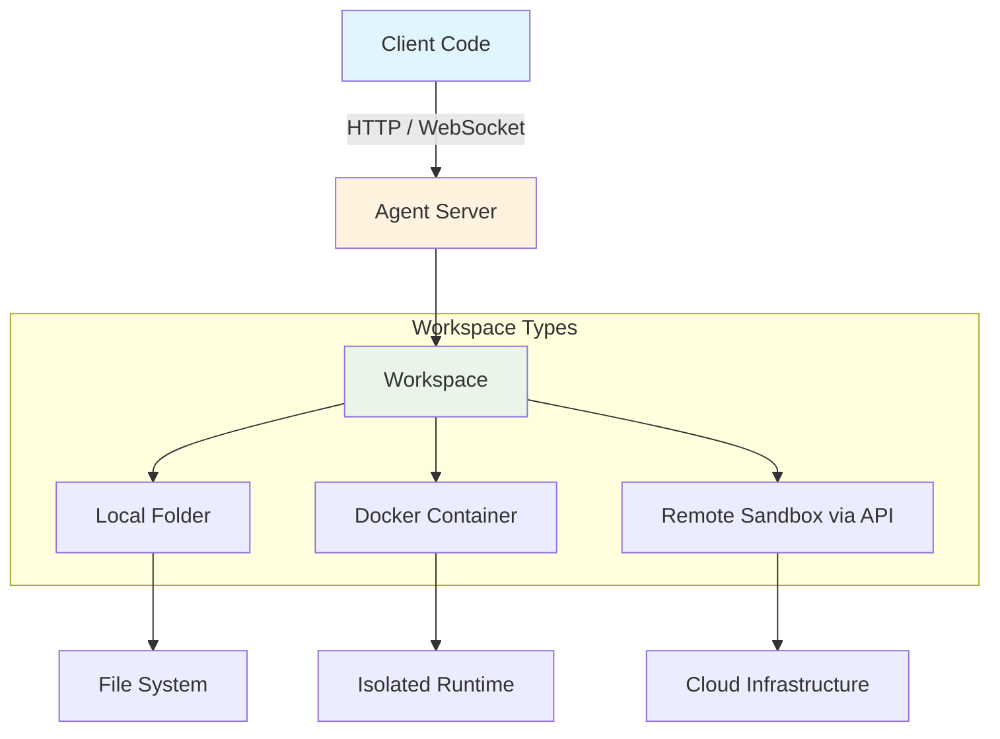

# Overview

> Run agents on remote servers with isolated workspaces for production deployments.

Remote Agent Servers package the Software Agent SDK into containers you can deploy anywhere (Kubernetes, VMs, on‑prem, any cloud) with strong isolation. The remote path uses the exact same SDK API as local—switching is just changing the workspace argument; your Conversation code stays the same.

For example, switching from a local workspace to a Docker‑based remote agent server:

```python lines theme={null}
# Local → Docker
conversation = Conversation(agent=agent, workspace=os.getcwd())  # [!code --]
from openhands.workspace import DockerWorkspace  # [!code ++]
with DockerWorkspace( # [!code ++]
    server_image="ghcr.io/openhands/agent-server:latest-python", # [!code ++]
) as workspace: # [!code ++]
    conversation = Conversation(agent=agent, workspace=workspace)  # [!code ++]
```

Use `DockerWorkspace` with the pre-built agent server image for the fastest startup. When you need to build from a custom base image, switch to [`DockerDevWorkspace`](/sdk/guides/agent-server/docker-sandbox).

Or switching to an API‑based remote workspace (via [OpenHands Runtime API](https://runtime.all-hands.dev/)):

```python lines theme={null}
# Local → Remote API
conversation = Conversation(agent=agent, workspace=os.getcwd())  # [!code --]
from openhands.workspace import APIRemoteWorkspace  # [!code ++]
with APIRemoteWorkspace( # [!code ++]
    runtime_api_url="https://runtime.eval.all-hands.dev",  # [!code ++]
    runtime_api_key="YOUR_API_KEY", # [!code ++]
    server_image="ghcr.io/openhands/agent-server:latest-python", # [!code ++]
) as workspace: # [!code ++]
    conversation = Conversation(agent=agent, workspace=workspace)  # [!code ++]
```

## What is a Remote Agent Server?

A Remote Agent Server is an HTTP/WebSocket server that:

* **Package the Software Agent SDK into containers** and deploy on your own infrastructure (Kubernetes, VMs, on-prem, or cloud)
* **Runs agents** on dedicated infrastructure
* **Manages workspaces** (Docker containers or remote sandboxes)
* **Streams events** to clients via WebSocket
* **Handles command and file operations** (execute command, upload, download), check [base class](https://github.com/OpenHands/software-agent-sdk/blob/main/openhands-sdk/openhands/sdk/workspace/base.py) for more details
* **Provides isolation** between different agent executions

Think of it as the "backend" for your agent, while your Python code acts as the "frontend" client.

## Architecture Overview

Remote Agent Servers follow a simple three-part architecture:



1. **Client (Python SDK)** — Your application creates and controls conversations using the SDK.
2. **Agent Server** — A lightweight HTTP/WebSocket service that runs the agent and manages workspace execution.
3. **Workspace** — An isolated environment (local, Docker, or remote VM) where the agent code runs.

The same SDK API works across all three workspace types—you just switch which workspace the conversation connects to.

## How Remote Conversations Work

Each step in the diagram maps directly to how the SDK and server interact:

### 1. Workspace Connection → *(Client → Server)*

When you create a conversation with a remote workspace (e.g., `DockerWorkspace` or `APIRemoteWorkspace`), the SDK automatically starts or connects to an agent server inside that workspace:

```python  theme={null}
with DockerWorkspace(server_image="ghcr.io/openhands/agent-server:latest") as workspace:
    conversation = Conversation(agent=agent, workspace=workspace)
```

This turns the local `Conversation` into a **[RemoteConversation](https://github.com/OpenHands/software-agent-sdk/blob/main/openhands-sdk/openhands/sdk/conversation/impl/remote_conversation.py)** that speaks to the agent server over HTTP/WebSocket.

### 2. Server Initialization → *(Server → Workspace)*

Once the workspace starts:

* It launches the agent server process.
* Waits for it to be ready.
* Shares the server URL with the SDK client.

You don’t need to manage this manually—the workspace context handles startup and teardown automatically.

### 3. Event Streaming → *(Bidirectional WebSocket)*

The client and agent server maintain a live WebSocket connection for streaming events:

```python  theme={null}
def on_event(event):
    print(f"Received: {type(event).__name__}")

conversation = Conversation(agent=agent, workspace=workspace, callbacks=[on_event])
```

This allows you to see real-time updates from the running agent as it executes tasks inside the workspace.

### 4. Workspace Supports File and Command Operations → *(Server ↔ Workspace)*

Workspace supports file and command operations via the agent server API ([base class](https://github.com/OpenHands/software-agent-sdk/blob/main/openhands-sdk/openhands/sdk/workspace/base.py)), ensuring isolation and consistent behavior:

```python  theme={null}
workspace.file_upload(local_path, remote_path)
workspace.file_download(remote_path, local_path)
result = workspace.execute_command("ls -la")
print(result.stdout)
```

These commands are proxied through the agent server, whether it’s a Docker container or a remote VM, keeping your client code environment-agnostic.

### Summary

The architecture makes remote execution seamless:

* Your **client code** stays the same.
* The **agent server** manages execution and streaming.
* The **workspace** provides secure, isolated runtime environments.

Switching from local to remote is just a matter of swapping the workspace class—no code rewrites needed.

## Next Steps

Explore different deployment options:

* **[Local Agent Server](/sdk/guides/agent-server/local-server)** - Run agent server in the same process
* **[Docker Sandboxed Server](/sdk/guides/agent-server/docker-sandbox)** - Run agent server in isolated Docker containers
* **[API Sandboxed Server](/sdk/guides/agent-server/api-sandbox)** - Connect to hosted agent server via API

For architectural details:

* **[Agent Server Package Architecture](/sdk/arch/agent-server)** - Remote execution architecture and deployment


---

> To find navigation and other pages in this documentation, fetch the llms.txt file at: https://docs.openhands.dev/llms.txt