# Condenser

> High-level architecture of the conversation history compression system

The **Condenser** system manages conversation history compression to keep agent context within LLM token limits. It reduces long event histories into condensed summaries while preserving critical information for reasoning. For more details, read the [blog here](https://openhands.dev/blog/openhands-context-condensensation-for-more-efficient-ai-agents).

**Source:** [`openhands-sdk/openhands/sdk/context/condenser/`](https://github.com/OpenHands/software-agent-sdk/tree/main/openhands-sdk/openhands/sdk/context/condenser)

## Core Responsibilities

The Condenser system has four primary responsibilities:

1. **History Compression** - Reduce event lists to fit within context windows
2. **Threshold Detection** - Determine when condensation should trigger
3. **Summary Generation** - Create meaningful summaries via LLM or heuristics
4. **View Management** - Transform event history into LLM-ready views

## Architecture

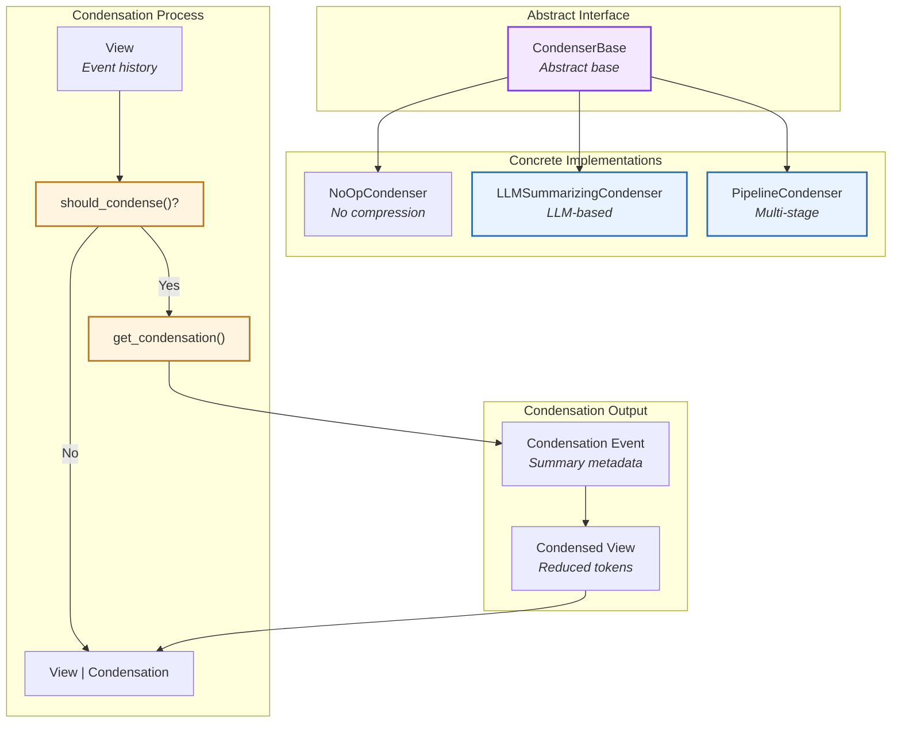

### Key Components

| Component                                                                                                                                                             | Purpose              | Design                                |
| --------------------------------------------------------------------------------------------------------------------------------------------------------------------- | -------------------- | ------------------------------------- |
| **[`CondenserBase`](https://github.com/OpenHands/software-agent-sdk/blob/main/openhands-sdk/openhands/sdk/context/condenser/base.py)**                                | Abstract interface   | Defines `condense()` contract         |
| **[`RollingCondenser`](https://github.com/OpenHands/software-agent-sdk/blob/main/openhands-sdk/openhands/sdk/context/condenser/base.py)**                             | Rolling window base  | Implements threshold-based triggering |
| **[`LLMSummarizingCondenser`](https://github.com/OpenHands/software-agent-sdk/blob/main/openhands-sdk/openhands/sdk/context/condenser/llm_summarizing_condenser.py)** | LLM summarization    | Uses LLM to generate summaries        |
| **[`NoOpCondenser`](https://github.com/OpenHands/software-agent-sdk/blob/main/openhands-sdk/openhands/sdk/context/condenser/no_op_condenser.py)**                     | No-op implementation | Returns view unchanged                |
| **[`PipelineCondenser`](https://github.com/OpenHands/software-agent-sdk/blob/main/openhands-sdk/openhands/sdk/context/condenser/pipeline_condenser.py)**              | Multi-stage pipeline | Chains multiple condensers            |
| **[`View`](https://github.com/OpenHands/software-agent-sdk/blob/main/openhands-sdk/openhands/sdk/context/view.py)**                                                   | Event view           | Represents history for LLM            |
| **[`Condensation`](https://github.com/OpenHands/software-agent-sdk/blob/main/openhands-sdk/openhands/sdk/event/condenser.py)**                                        | Condensation event   | Metadata about compression            |

## Condenser Types

### NoOpCondenser

Pass-through condenser that performs no compression:

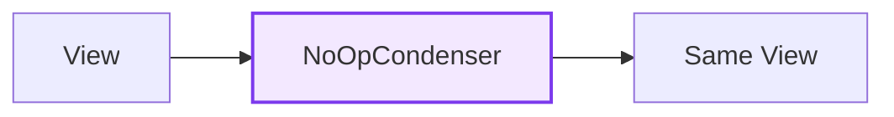

### LLMSummarizingCondenser

Uses an LLM to generate summaries of conversation history:

```mermaid  theme={null}
%%{init: {"theme": "default", "flowchart": {"nodeSpacing": 30, "rankSpacing": 40}} }%%
flowchart LR
    View["Long View<br><i>120+ events</i>"]
    Check["Threshold<br>exceeded?"]
    Summarize["LLM Summarization"]
    Summary["Summary Text"]
    Metadata["Condensation Event"]
    AddToHistory["Add to History"]
    NextStep["Next Step: View.from_events()"]
    NewView["Condensed View"]
    
    View --> Check
    Check -->|Yes| Summarize
    Summarize --> Summary
    Summary --> Metadata
    Metadata --> AddToHistory
    AddToHistory --> NextStep
    NextStep --> NewView
    
    style Check fill:#f3e8ff,stroke:#7c3aed,stroke-width:2px
    style Summarize fill:#e8f3ff,stroke:#2b6cb0,stroke-width:2px
    style NewView fill:#fff4df,stroke:#b7791f,stroke-width:2px
```

**Process:**

1. **Check Threshold:** Compare view size to configured limit (e.g., event count > `max_size`)
2. **Select Events:** Identify events to keep (first N + last M) and events to summarize (middle)
3. **LLM Call:** Generate summary of middle events using dedicated LLM
4. **Create Event:** Wrap summary in `Condensation` event with `forgotten_event_ids`
5. **Add to History:** Agent adds `Condensation` to event log and returns early
6. **Next Step:** `View.from_events()` filters forgotten events and inserts summary

**Configuration:**

* **`max_size`:** Event count threshold before condensation triggers (default: 120)
* **`keep_first`:** Number of initial events to preserve verbatim (default: 4)
* **`llm`:** LLM instance for summarization (often cheaper model than reasoning LLM)

### PipelineCondenser

Chains multiple condensers in sequence:

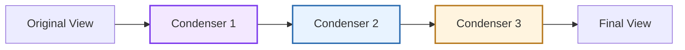

**Use Case:** Multi-stage compression (e.g., remove old events, then summarize, then truncate)

## Condensation Flow

### Trigger Mechanisms

Condensers can be triggered in two ways:

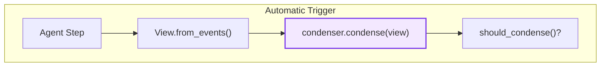

**Automatic Trigger:**

* **When:** Threshold exceeded (e.g., event count > `max_size`)
* **Who:** Agent calls `condenser.condense()` each step
* **Purpose:** Proactively keep context within limits

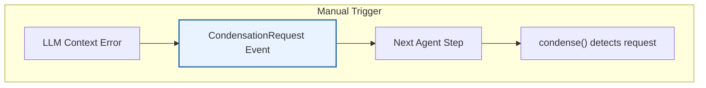

**Manual Trigger:**

* **When:** `CondensationRequest` event added to history (via `view.unhandled_condensation_request`)
* **Who:** Agent (on LLM context window error) or application code
* **Purpose:** Force compression when context limit exceeded

### Condensation Workflow

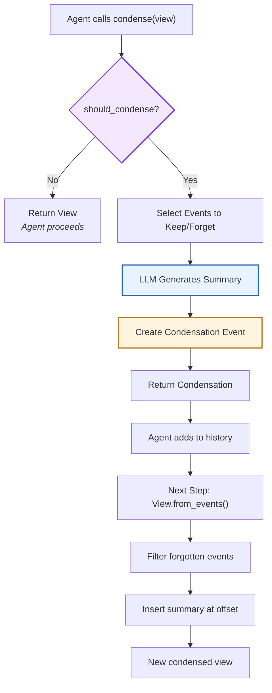

**Key Steps:**

1. **Threshold Check:** `should_condense()` determines if condensation needed
2. **Event Selection:** Identify events to keep (head + tail) vs forget (middle)
3. **Summary Generation:** LLM creates compressed representation of forgotten events
4. **Condensation Creation:** Create `Condensation` event with `forgotten_event_ids` and summary
5. **Return to Agent:** Condenser returns `Condensation` (not `View`)
6. **History Update:** Agent adds `Condensation` to event log and exits step
7. **Next Step:** `View.from_events()` ([source](https://github.com/OpenHands/software-agent-sdk/blob/main/openhands-sdk/openhands/sdk/context/view.py)) processes Condensation to filter events and insert summary

## View and Condensation

### View Structure

A `View` represents the conversation history as it will be sent to the LLM:

```mermaid  theme={null}
%%{init: {"theme": "default", "flowchart": {"nodeSpacing": 30}} }%%
flowchart LR
    Events["Full Event List<br><i>+ Condensation events</i>"]
    FromEvents["View.from_events()"]
    Filter["Filter forgotten events"]
    Insert["Insert summary"]
    View["View<br><i>LLMConvertibleEvents</i>"]
    Convert["events_to_messages()"]
    LLM["LLM Input"]
    
    Events --> FromEvents
    FromEvents --> Filter
    Filter --> Insert
    Insert --> View
    View --> Convert
    Convert --> LLM
    
    style View fill:#f3e8ff,stroke:#7c3aed,stroke-width:2px
    style FromEvents fill:#e8f3ff,stroke:#2b6cb0,stroke-width:2px
```

**View Components:**

* **`events`:** List of `LLMConvertibleEvent` objects (filtered by Condensation)
* **`unhandled_condensation_request`:** Flag for pending manual condensation
* **`condensations`:** List of all Condensation events processed
* **Methods:** `from_events()` creates view from raw events, handling Condensation semantics

### Condensation Event

When condensation occurs, a `Condensation` event is created:

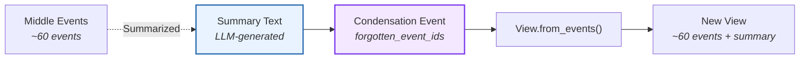

**Condensation Fields:**

* **`forgotten_event_ids`:** List of event IDs to filter out
* **`summary`:** Compressed text representation of forgotten events
* **`summary_offset`:** Index where summary event should be inserted
* Inherits from `Event`: `id`, `timestamp`, `source`

## Rolling Window Pattern

`RollingCondenser` implements a common pattern for threshold-based condensation:

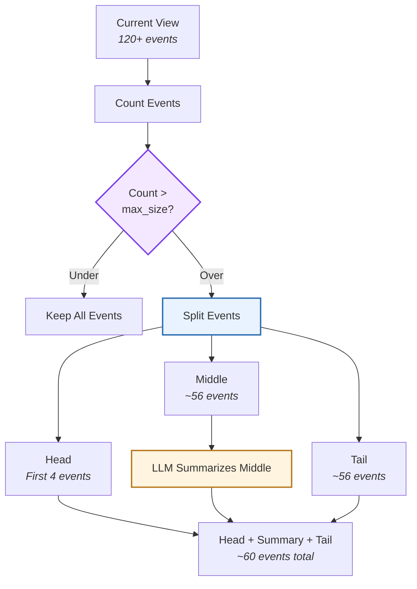

**Rolling Window Strategy:**

1. **Keep Head:** Preserve first `keep_first` events (default: 4) - usually system prompts
2. **Keep Tail:** Preserve last `target_size - keep_first - 1` events - recent context
3. **Summarize Middle:** Compress events between head and tail into summary
4. **Target Size:** After condensation, view has `max_size // 2` events (default: 60)

## Component Relationships

### How Condenser Integrates

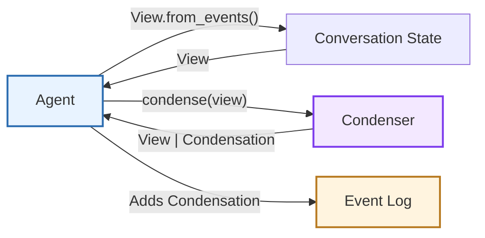

**Relationship Characteristics:**

* **Agent → State**: Calls `View.from_events()` to get current view
* **Agent → Condenser**: Calls `condense(view)` each step if condenser registered
* **Condenser → Agent**: Returns `View` (proceed) or `Condensation` (defer)
* **Agent → Events**: Adds `Condensation` event to log when returned

## See Also

* **[Agent Architecture](/sdk/arch/agent)** - How agents use condensers during reasoning
* **[Conversation Architecture](/sdk/arch/conversation)** - View generation and event management
* **[Events](/sdk/arch/events)** - Condensation event type and append-only log
* **[Context Condenser Guide](/sdk/guides/context-condenser)** - Configuring and using condensers

---

> To find navigation and other pages in this documentation, fetch the llms.txt file at: https://docs.openhands.dev/llms.txt