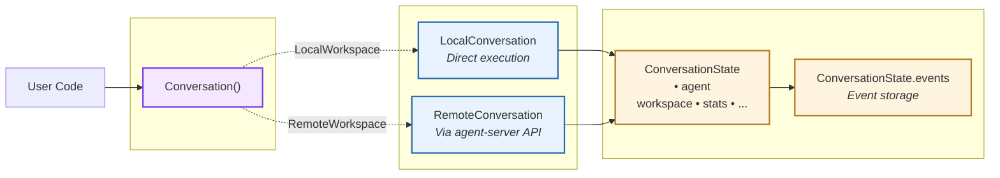
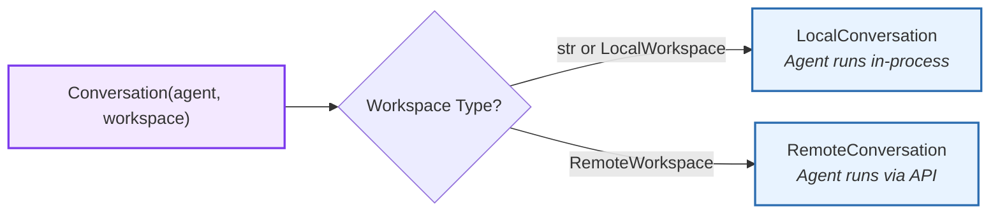
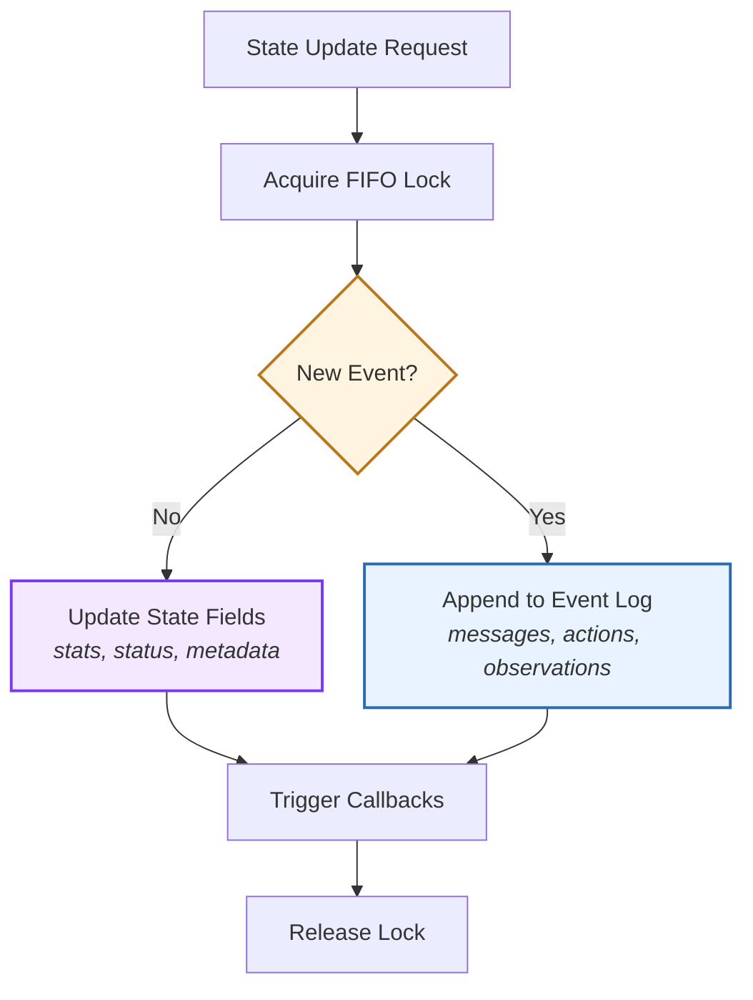
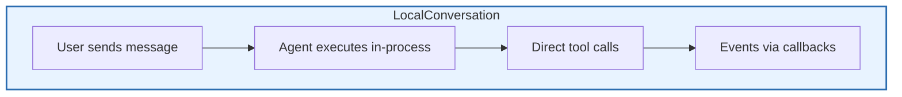
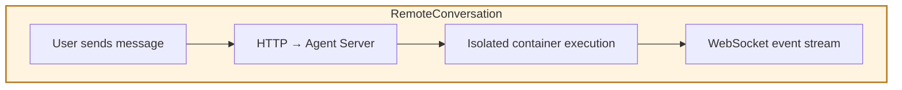
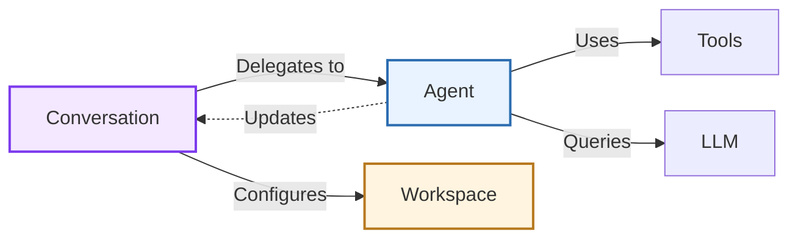

# Conversation

> High-level architecture of the conversation orchestration system

The **Conversation** component orchestrates agent execution through structured message flows and state management. It serves as the primary interface for interacting with agents, managing their lifecycle from initialization to completion.

**Source:** [`openhands-sdk/openhands/sdk/conversation/`](https://github.com/OpenHands/software-agent-sdk/tree/main/openhands-sdk/openhands/sdk/conversation)

## Core Responsibilities

The Conversation system has four primary responsibilities:

1. **Agent Lifecycle Management** - Initialize, run, pause, and terminate agents
2. **State Orchestration** - Maintain conversation history, events, and execution status
3. **Workspace Coordination** - Bridge agent operations with execution environments
4. **Runtime Services** - Provide persistence, monitoring, security, and visualization

## Architecture

### Key Components

| Component                                                                                                                                                  | Purpose            | Design                                                 |
| ---------------------------------------------------------------------------------------------------------------------------------------------------------- | ------------------ | ------------------------------------------------------ |
| **[`Conversation`](https://github.com/OpenHands/software-agent-sdk/blob/main/openhands-sdk/openhands/sdk/conversation/conversation.py)**                   | Unified entrypoint | Returns correct implementation based on workspace type |
| **[`LocalConversation`](https://github.com/OpenHands/software-agent-sdk/blob/main/openhands-sdk/openhands/sdk/conversation/impl/local_conversation.py)**   | Local execution    | Runs agent directly in process                         |
| **[`RemoteConversation`](https://github.com/OpenHands/software-agent-sdk/blob/main/openhands-sdk/openhands/sdk/conversation/impl/remote_conversation.py)** | Remote execution   | Delegates to agent-server via HTTP/WebSocket           |
| **[`ConversationState`](https://github.com/OpenHands/software-agent-sdk/blob/main/openhands-sdk/openhands/sdk/conversation/state.py)**                     | State container    | Pydantic model with validation and serialization       |
| **[`EventLog`](https://github.com/OpenHands/software-agent-sdk/blob/main/openhands-sdk/openhands/sdk/conversation/event_store.py)**                        | Event storage      | Immutable append-only store with efficient queries     |

## Factory Pattern

The [`Conversation`](https://github.com/OpenHands/software-agent-sdk/blob/main/openhands-sdk/openhands/sdk/conversation/conversation.py) class automatically selects the correct implementation based on workspace type:

**Dispatch Logic:**

* **Local:** String paths or `LocalWorkspace` → in-process execution
* **Remote:** `RemoteWorkspace` → agent-server via HTTP/WebSocket

This abstraction enables switching deployment modes without code changes—just swap the workspace type.

## State Management

State updates follow a **two-path pattern** depending on the type of change:

**Two Update Patterns:**

1. **State-Only Updates** - Modify fields without appending events (e.g., status changes, stat increments)
2. **Event-Based Updates** - Append to event log when new messages, actions, or observations occur

**Thread Safety:**

* FIFO Lock ensures ordered, atomic updates
* Callbacks fire after successful commit
* Read operations never block writes

## Execution Models

The conversation system supports two execution models with identical APIs:

### Local vs Remote Execution

| Aspect            | LocalConversation      | RemoteConversation      |
| ----------------- | ---------------------- | ----------------------- |
| **Execution**     | In-process             | Remote container/server |
| **Communication** | Direct function calls  | HTTP + WebSocket        |
| **State Sync**    | Immediate              | Network serialized      |
| **Use Case**      | Development, CLI tools | Production, web apps    |
| **Isolation**     | Process-level          | Container-level         |

**Key Insight:** Same API surface means switching between local and remote requires only changing workspace type—no code changes.

## Auxiliary Services

The conversation system provides pluggable services that operate independently on the event stream:

| Service                                                                                                                                      | Purpose                       | Architecture Pattern                 |
| -------------------------------------------------------------------------------------------------------------------------------------------- | ----------------------------- | ------------------------------------ |
| **[Event Log](https://github.com/OpenHands/software-agent-sdk/blob/main/openhands-sdk/openhands/sdk/conversation/event_store.py)**           | Append-only immutable storage | Event sourcing with indexing         |
| **[Persistence](https://github.com/OpenHands/software-agent-sdk/blob/main/openhands-sdk/openhands/sdk/conversation/state.py)**               | Auto-save & resume            | Debounced writes, incremental events |
| **[Stuck Detection](https://github.com/OpenHands/software-agent-sdk/blob/main/openhands-sdk/openhands/sdk/conversation/stuck_detector.py)**  | Loop prevention               | Sliding window pattern matching      |
| **[Visualization](https://github.com/OpenHands/software-agent-sdk/blob/main/openhands-sdk/openhands/sdk/conversation/visualizer.py)**        | Execution diagrams            | Event stream → visual representation |
| **[Secret Registry](https://github.com/OpenHands/software-agent-sdk/blob/main/openhands-sdk/openhands/sdk/conversation/secret_registry.py)** | Secure value storage          | Memory-only with masked logging      |

**Design Principle:** Services read from the event log but never mutate state directly. This enables:

* Services can be enabled/disabled independently
* Easy to add new services without changing core orchestration
* Event stream acts as the integration point

## Component Relationships

### How Conversation Interacts

**Relationship Characteristics:**

* **Conversation → Agent**: One-way orchestration, agent reports back via state updates
* **Conversation → Workspace**: Configuration only, workspace doesn't know about conversation
* **Agent → Conversation**: Indirect via state events

## See Also

* **[Agent Architecture](/sdk/arch/agent)** - Agent reasoning loop design
* **[Workspace Architecture](/sdk/arch/workspace)** - Execution environment design
* **[Event System](/sdk/arch/events)** - Event types and flow
* **[Conversation Usage Guide](/sdk/guides/convo-persistence)** - Practical examples

---

> To find navigation and other pages in this documentation, fetch the llms.txt file at: https://docs.openhands.dev/llms.txt