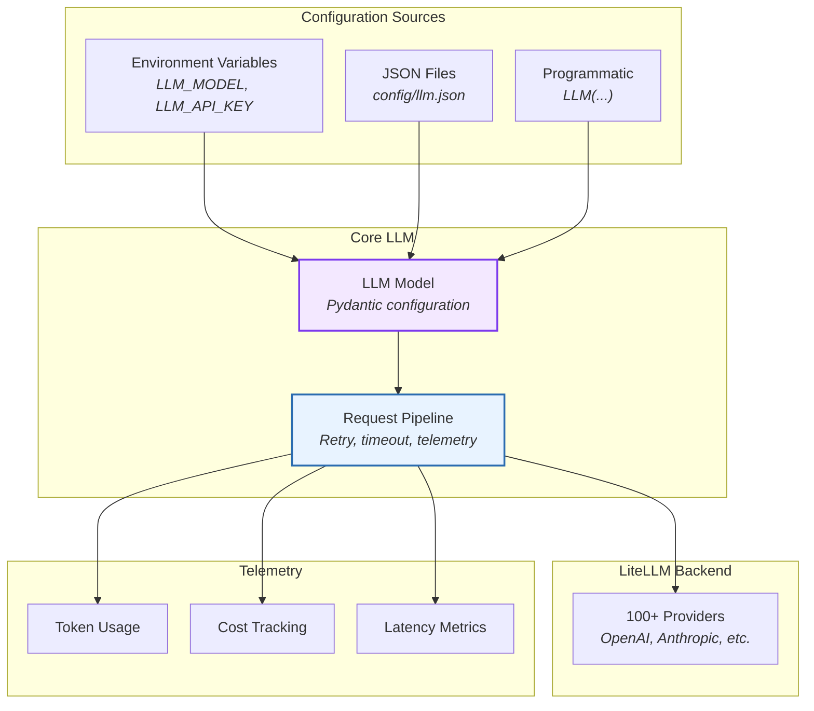
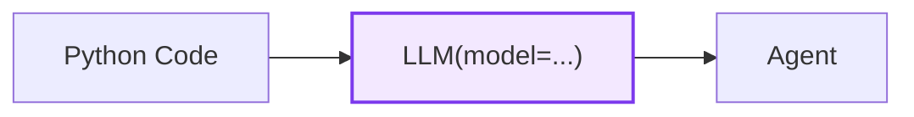
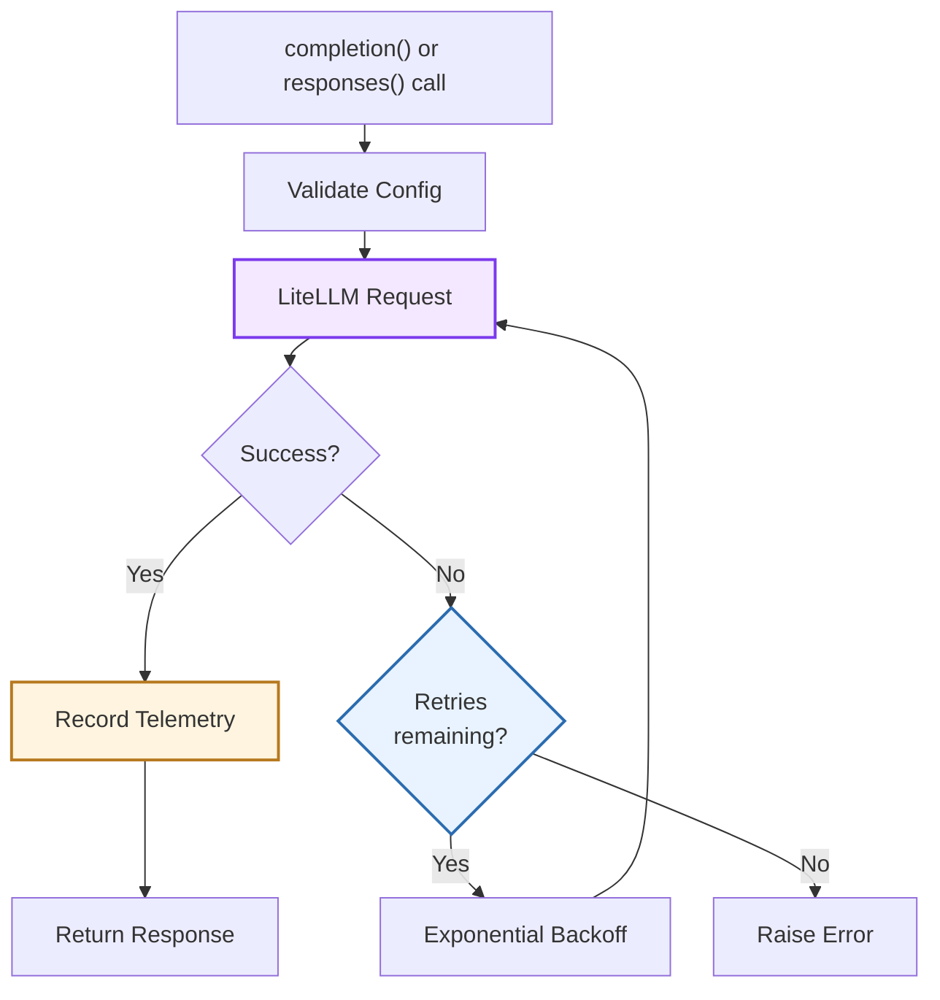
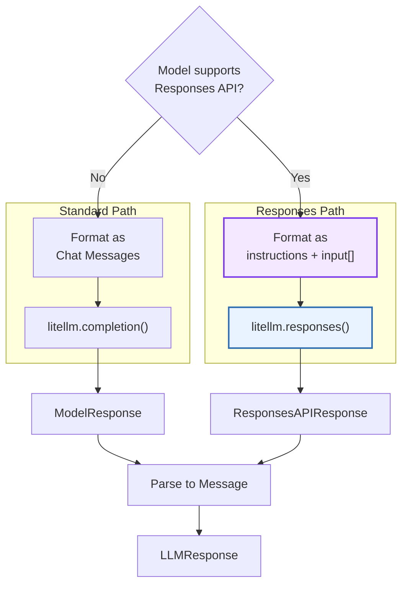
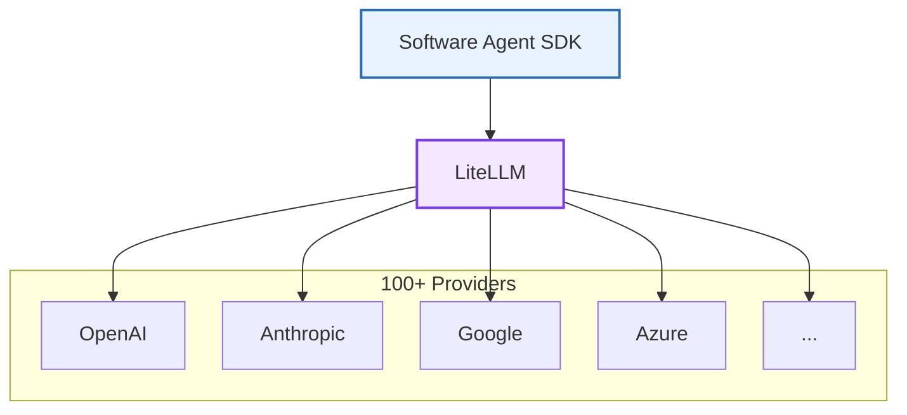
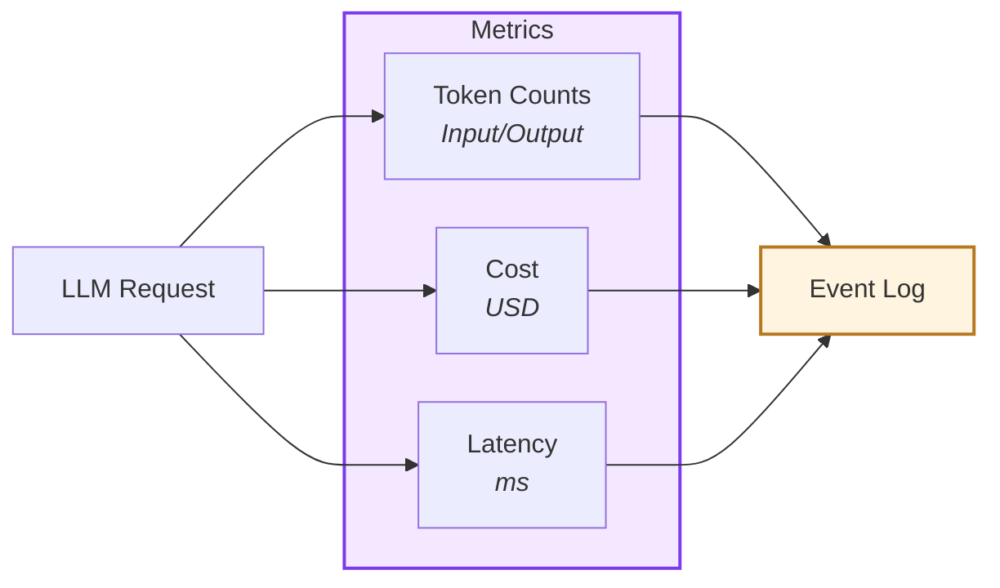
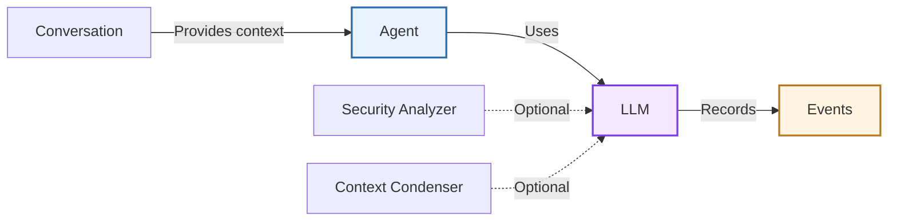

# LLM

> High-level architecture of the provider-agnostic language model interface

The **LLM** system provides a unified interface to language model providers through LiteLLM. It handles model configuration, request orchestration, retry logic, telemetry, and cost tracking across all providers.

**Source:** [`openhands-sdk/openhands/sdk/llm/`](https://github.com/OpenHands/software-agent-sdk/tree/main/openhands-sdk/openhands/sdk/llm)

## Core Responsibilities

The LLM system has five primary responsibilities:

1. **Provider Abstraction** - Uniform interface to OpenAI, Anthropic, Google, and 100+ providers
2. **Request Pipeline** - Dual API support: Chat Completions (`completion()`) and Responses API (`responses()`)
3. **Configuration Management** - Load from environment, JSON, or programmatic configuration
4. **Telemetry & Cost** - Track usage, latency, and costs across providers
5. **Enhanced Reasoning** - Support for OpenAI Responses API with encrypted thinking and reasoning summaries

## Architecture



### Key Components

| Component                                                                                                              | Purpose              | Design                                     |
| ---------------------------------------------------------------------------------------------------------------------- | -------------------- | ------------------------------------------ |
| **[`LLM`](https://github.com/OpenHands/software-agent-sdk/blob/main/openhands-sdk/openhands/sdk/llm/llm.py)**          | Configuration model  | Pydantic model with provider settings      |
| **[`completion()`](https://github.com/OpenHands/software-agent-sdk/blob/main/openhands-sdk/openhands/sdk/llm/llm.py)** | Chat Completions API | Handles retries, timeouts, streaming       |
| **[`responses()`](https://github.com/OpenHands/software-agent-sdk/blob/main/openhands-sdk/openhands/sdk/llm/llm.py)**  | Responses API        | Enhanced reasoning with encrypted thinking |
| **[`LiteLLM`](https://github.com/BerriAI/litellm)**                                                                    | Provider adapter     | Unified API for 100+ providers             |
| **Configuration Loaders**                                                                                              | Config hydration     | `load_from_env()`, `load_from_json()`      |
| **Telemetry**                                                                                                          | Usage tracking       | Token counts, costs, latency               |

## Configuration

See [`LLM` source](https://github.com/OpenHands/software-agent-sdk/blob/main/openhands-sdk/openhands/sdk/llm/llm.py) for complete list of supported fields.

### Programmatic Configuration

Create LLM instances directly in code:



**Example:**

```python  theme={null}
from pydantic import SecretStr
from openhands.sdk import LLM

llm = LLM(
    model="anthropic/claude-sonnet-4.1",
    api_key=SecretStr("sk-ant-123"),
    temperature=0.1,
    timeout=120,
)
```

### Environment Variable Configuration

Load from environment using naming convention:

**Environment Variable Pattern:**

* **Prefix:** All variables start with `LLM_`
* **Mapping:** `LLM_FIELD` → `field` (lowercased)
* **Types:** Auto-cast to int, float, bool, JSON, or SecretStr

**Common Variables:**

```bash  theme={null}
export LLM_MODEL="anthropic/claude-sonnet-4.1"
export LLM_API_KEY="sk-ant-123"
export LLM_USAGE_ID="primary"
export LLM_TIMEOUT="120"
export LLM_NUM_RETRIES="5"
```

### JSON Configuration

Serialize and load from JSON files:

**Example:**

```python  theme={null}
# Save
llm.model_dump_json(exclude_none=True, indent=2)

# Load
llm = LLM.load_from_json("config/llm.json")
```

**Security:** Secrets are redacted in serialized JSON (combine with environment variables for sensitive data).
If you need to include secrets in JSON, use `llm.model_dump_json(exclude_none=True, context={"expose_secrets": True})`.

## Request Pipeline

### Completion Flow



**Pipeline Stages:**

1. **Validation:** Check required fields (model, messages)
2. **Request:** Call LiteLLM with provider-specific formatting
3. **Retry Logic:** Exponential backoff on failures (configurable)
4. **Telemetry:** Record tokens, cost, latency
5. **Response:** Return completion or raise error

### Responses API Support

In addition to the standard chat completion API, the LLM system supports [OpenAI's Responses API](https://platform.openai.com/docs/api-reference/responses) as an alternative invocation path for models that benefit from this newer interface (e.g., GPT-5-Codex only supports Responses API). The Responses API provides enhanced reasoning capabilities with encrypted thinking and detailed reasoning summaries.

#### Architecture



#### Supported Models

Models that automatically use the Responses API path:

| Pattern     | Examples                             | Documentation       |
| ----------- | ------------------------------------ | ------------------- |
| **gpt-5**\* | `gpt-5`, `gpt-5-mini`, `gpt-5-codex` | OpenAI GPT-5 family |

**Detection:** The SDK automatically detects if a model supports the Responses API using pattern matching in [`model_features.py`](https://github.com/OpenHands/software-agent-sdk/blob/main/openhands-sdk/openhands/sdk/llm/utils/model_features.py).

## Provider Integration

### LiteLLM Abstraction

Software Agent SDK uses LiteLLM for provider abstraction:



**Benefits:**

* **100+ Providers:** OpenAI, Anthropic, Google, Azure, AWS Bedrock, local models, etc.
* **Unified API:** Same interface regardless of provider
* **Format Translation:** Provider-specific request/response formatting
* **Error Handling:** Normalized error codes and messages

### LLM Providers

Provider integrations remain shared between the Software Agent SDK and the OpenHands Application.
The pages linked below live under the OpenHands app section but apply
verbatim to SDK applications because both layers wrap the same
`openhands.sdk.llm.LLM` interface.

| Provider / scenario                          | Documentation                                                                        |
| -------------------------------------------- | ------------------------------------------------------------------------------------ |
| OpenHands hosted models                      | [/openhands/usage/llms/openhands-llms](/openhands/usage/llms/openhands-llms)         |
| OpenAI                                       | [/openhands/usage/llms/openai-llms](/openhands/usage/llms/openai-llms)               |
| Azure OpenAI                                 | [/openhands/usage/llms/azure-llms](/openhands/usage/llms/azure-llms)                 |
| Google Gemini / Vertex                       | [/openhands/usage/llms/google-llms](/openhands/usage/llms/google-llms)               |
| Groq                                         | [/openhands/usage/llms/groq](/openhands/usage/llms/groq)                             |
| OpenRouter                                   | [/openhands/usage/llms/openrouter](/openhands/usage/llms/openrouter)                 |
| Moonshot                                     | [/openhands/usage/llms/moonshot](/openhands/usage/llms/moonshot)                     |
| LiteLLM proxy                                | [/openhands/usage/llms/litellm-proxy](/openhands/usage/llms/litellm-proxy)           |
| Local LLMs (Ollama, SGLang, vLLM, LM Studio) | [/openhands/usage/llms/local-llms](/openhands/usage/llms/local-llms)                 |
| Custom LLM configurations                    | [/openhands/usage/llms/custom-llm-configs](/openhands/usage/llms/custom-llm-configs) |

When you follow any of those guides while building with the SDK, create an
`LLM` object using the documented parameters (for example, API keys, base URLs,
or custom headers) and pass it into your agent or registry. The OpenHands UI
surfacing is simply a convenience layer on top of the same configuration model.

## Telemetry and Cost Tracking

### Telemetry Collection

LLM requests automatically collect metrics:



**Tracked Metrics:**

* **Token Usage:** Input tokens, output tokens, total
* **Cost:** Per-request cost using configured rates
* **Latency:** Request duration in milliseconds
* **Errors:** Failure types and retry counts

### Cost Configuration

Configure per-token costs for custom models:

```python  theme={null}
llm = LLM(
    model="custom/my-model",
    input_cost_per_token=0.00001,   # $0.01 per 1K tokens
    output_cost_per_token=0.00003,  # $0.03 per 1K tokens
)
```

**Built-in Costs:** LiteLLM includes costs for major providers (updated regularly, [link](https://github.com/BerriAI/litellm/blob/main/model_prices_and_context_window.json))

**Custom Costs:** Override for:

* Internal models
* Custom pricing agreements
* Cost estimation for budgeting

## Component Relationships

### How LLM Integrates



**Relationship Characteristics:**

* **Agent → LLM**: Agent uses LLM for reasoning and tool calls
* **LLM → Events**: LLM requests/responses recorded as events
* **Security → LLM**: Optional security analyzer can use separate LLM
* **Condenser → LLM**: Optional context condenser can use separate LLM
* **Configuration**: LLM configured independently, passed to agent
* **Telemetry**: LLM metrics flow through event system to UI/logging

## See Also

* **[Agent Architecture](/sdk/arch/agent)** - How agents use LLMs for reasoning and perform actions
* **[Events](/sdk/arch/events)** - LLM request/response event types
* **[Security](/sdk/arch/security)** - Optional LLM-based security analysis
* **[Provider Setup Guides](/openhands/usage/llms/openai-llms)** - Provider-specific configuration


---

> To find navigation and other pages in this documentation, fetch the llms.txt file at: https://docs.openhands.dev/llms.txt