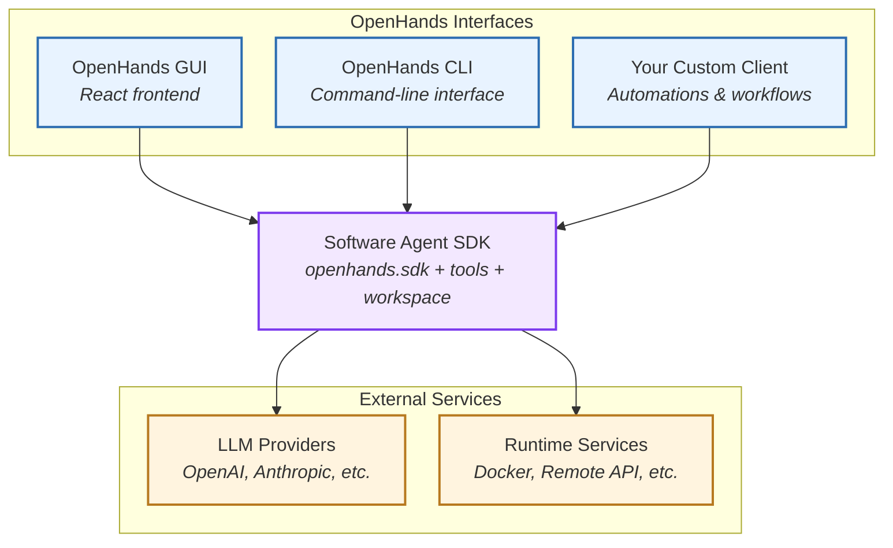
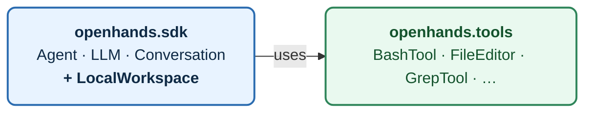
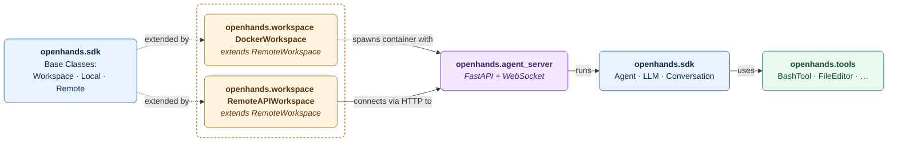
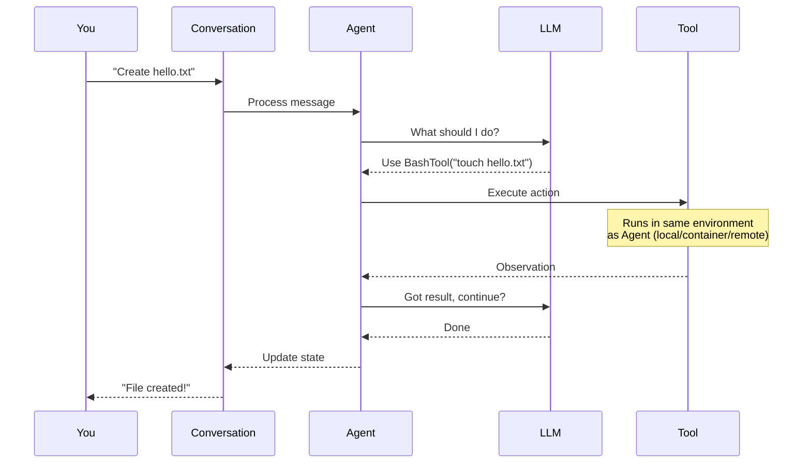
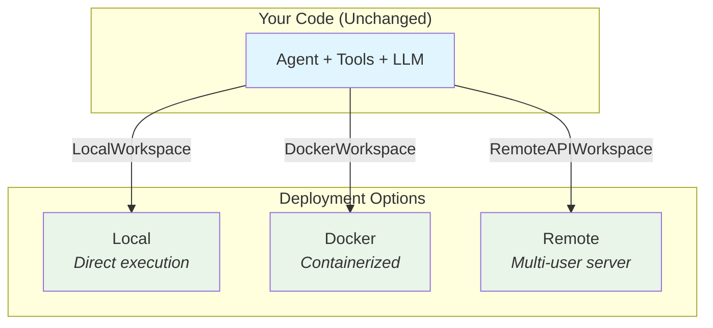

# Overview

> Understanding the OpenHands Software Agent SDK's package structure, component interactions, and execution models.

The **OpenHands Software Agent SDK** provides a unified, type-safe framework for building and deploying AI agents—from local experiments to full production systems, focused on **statelessness**, **composability**, and **clear boundaries** between research and deployment.

Check [this document](/sdk/arch/design) for the core design principles that guided its architecture.

## Relationship with OpenHands Applications

The Software Agent SDK serves as the **source of truth for agents** in OpenHands. The [OpenHands repository](https://github.com/OpenHands/OpenHands) provides interfaces—web app, CLI, and cloud—that consume the SDK APIs. This architecture ensures consistency and enables flexible integration patterns.

* **Software Agent SDK = foundation.** The SDK defines all core components: agents, LLMs, conversations, tools, workspaces, events, and security policies.
* **Interfaces reuse SDK objects.** The OpenHands GUI or CLI hydrate SDK components from persisted settings and orchestrate execution through SDK APIs.
* **Consistent configuration.** Whether you launch an agent programmatically or via the OpenHands GUI, the supported parameters and defaults come from the SDK.



## Four-Package Architecture

The agent-sdk is organized into four distinct Python packages:

| Package                     | What It Does                                        | When You Need It                             |
| --------------------------- | --------------------------------------------------- | -------------------------------------------- |
| **openhands.sdk**           | Core agent framework + base workspace classes       | Always (required)                            |
| **openhands.tools**         | Pre-built tools (bash, file editing, etc.)          | Optional - provides common tools             |
| **openhands.workspace**     | Extended workspace implementations (Docker, remote) | Optional - extends SDK's base classes        |
| **openhands.agent\_server** | Multi-user API server                               | Optional - used by workspace implementations |

### Two Deployment Modes

The SDK supports two deployment architectures depending on your needs:

#### Mode 1: Local Development

**Installation:** Just install `openhands-sdk` + `openhands-tools`

```bash  theme={null}
pip install openhands-sdk openhands-tools
```

**Architecture:**



* `LocalWorkspace` included in SDK (no extra install)
* Everything runs in one process
* Perfect for prototyping and simple use cases
* Quick setup, no Docker required

#### Mode 2: Production / Sandboxed

**Installation:** Install all 4 packages

```bash  theme={null}
pip install openhands-sdk openhands-tools openhands-workspace openhands-agent-server
```

**Architecture:**



* `RemoteWorkspace` auto-spawns agent-server in containers
* Sandboxed execution for security
* Multi-user deployments
* Distributed systems (e.g., Kubernetes) support

<Tip>
  **Key Point:** Same agent code works in both modes—just swap the workspace type (`LocalWorkspace` → `DockerWorkspace` → `RemoteAPIWorkspace`).
</Tip>

### SDK Package (`openhands.sdk`)

**Purpose:** Core components and base classes for OpenHands agent.

**Key Components:**

* **[Agent](/sdk/arch/agent):** Implements the reasoning-action loop
* **[Conversation](/sdk/arch/conversation):** Manages conversation state and lifecycle
* **[LLM](/sdk/arch/llm):** Provider-agnostic language model interface with retry and telemetry
* **[Tool System](/sdk/arch/tool-system):** Typed base class definitions for action, observation, tool, and executor; includes MCP integration
* **[Events](/sdk/arch/events):** Typed event framework (e.g., action, observation, user messages, state update, etc.)
* **[Workspace](/sdk/arch/workspace):** Base classes (`Workspace`, `LocalWorkspace`, `RemoteWorkspace`)
* **[Skill](/sdk/arch/skill):** Reusable user-defined prompts with trigger-based activation
* **[Condenser](/sdk/arch/condenser):** Conversation history compression for token management
* **[Security](/sdk/arch/security):** Action risk assessment and validation before execution

**Design:** Stateless, immutable components with type-safe Pydantic models.

**Self-Contained:** Build and run agents with just `openhands-sdk` using `LocalWorkspace`.

**Source:** [`openhands-sdk/`](https://github.com/OpenHands/software-agent-sdk/tree/main/openhands-sdk)

### Tools Package (`openhands.tools`)

<Note>
  **Tool Independence:** Tools run alongside the agent in whatever environment workspace configures (local/container/remote). They don't run "through" workspace APIs.
</Note>

**Purpose:** Pre-built tools following consistent patterns.

**Design:** All tools follow Action/Observation/Executor pattern with built-in validation, error handling, and security.

<Note>
  For full list of tools, see the [source code](https://github.com/OpenHands/software-agent-sdk/tree/main/openhands-tools) as the source of truth.
</Note>

### Workspace Package (`openhands.workspace`)

**Purpose:** Workspace implementations extending SDK base classes.

**Key Components:** Docker Workspace, Remote API Workspace, and more.

**Design:** All workspace implementations extend `RemoteWorkspace` from SDK, adding container lifecycle or API client functionality.

**Use Cases:** Sandboxed execution, multi-user deployments, production environments.

<Note>
  For full list of implemented workspaces, see the [source code](https://github.com/OpenHands/software-agent-sdk/tree/main/openhands-workspace).
</Note>

### Agent Server Package (`openhands.agent_server`)

**Purpose:** FastAPI-based HTTP/WebSocket server for remote agent execution.

**Features:**

* REST API & WebSocket endpoints for conversations, bash, files, events, desktop, and VSCode
* Service management with isolated per-user sessions
* API key authentication and health checking

**Deployment:** Runs inside containers (via `DockerWorkspace`) or as standalone process (connected via `RemoteWorkspace`).

**Use Cases:** Multi-user web apps, SaaS products, distributed systems.

<Note>
  For implementation details, see the [source code](https://github.com/OpenHands/software-agent-sdk/tree/main/openhands-agent-server).
</Note>

## How Components Work Together

### Basic Execution Flow (Local)

When you send a message to an agent, here's what happens:



**Key takeaway:** The agent orchestrates the reasoning-action loop—calling the LLM for decisions and executing tools to perform actions.

### Deployment Flexibility

The same agent code runs in different environments by swapping workspace configuration:



## Next Steps

### Get Started

* [Getting Started](/sdk/getting-started) – Build your first agent
* [Hello World](/sdk/guides/hello-world) – Minimal example

### Explore Components

**SDK Package:**

* [Agent](/sdk/arch/agent) – Core reasoning-action loop
* [Conversation](/sdk/arch/conversation) – State management and lifecycle
* [LLM](/sdk/arch/llm) – Language model integration
* [Tool System](/sdk/arch/tool-system) – Action/Observation/Executor pattern
* [Events](/sdk/arch/events) – Typed event framework
* [Workspace](/sdk/arch/workspace) – Base workspace architecture

**Tools Package:**

* See [`openhands-tools/`](https://github.com/OpenHands/software-agent-sdk/tree/main/openhands-tools) source code for implementation details

**Workspace Package:**

* See [`openhands-workspace/`](https://github.com/OpenHands/software-agent-sdk/tree/main/openhands-workspace) source code for implementation details

**Agent Server:**

* See [`openhands-agent-server/`](https://github.com/OpenHands/software-agent-sdk/tree/main/openhands-agent-server) source code for implementation details

### Deploy

* [Remote Server](/sdk/guides/agent-server/overview) – Deploy remotely
* [Docker Sandboxed Server](/sdk/guides/agent-server/docker-sandbox) – Container setup
* [API Sandboxed Server](/sdk/guides/agent-server/api-sandbox) – Hosted runtime service
* [Local Agent Server](/sdk/guides/agent-server/local-server) – In-process server

### Source Code

* [`openhands/sdk/`](https://github.com/OpenHands/software-agent-sdk/tree/main/openhands/sdk) – Core framework
* [`openhands/tools/`](https://github.com/OpenHands/software-agent-sdk/tree/main/openhands/tools) – Pre-built tools
* [`openhands/workspace/`](https://github.com/OpenHands/software-agent-sdk/tree/main/openhands/workspace) – Workspaces
* [`openhands/agent_server/`](https://github.com/OpenHands/software-agent-sdk/tree/main/openhands/agent_server) – HTTP server
* [`examples/`](https://github.com/OpenHands/software-agent-sdk/tree/main/examples) – Working examples


---

> To find navigation and other pages in this documentation, fetch the llms.txt file at: https://docs.openhands.dev/llms.txt