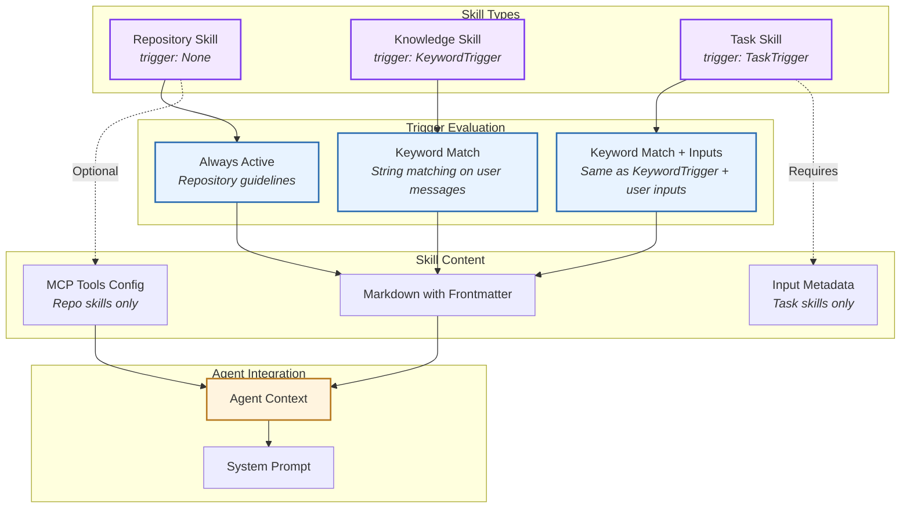
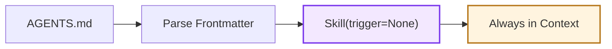
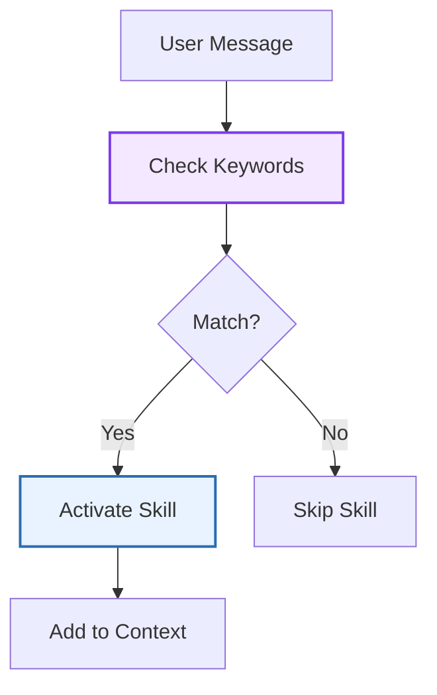
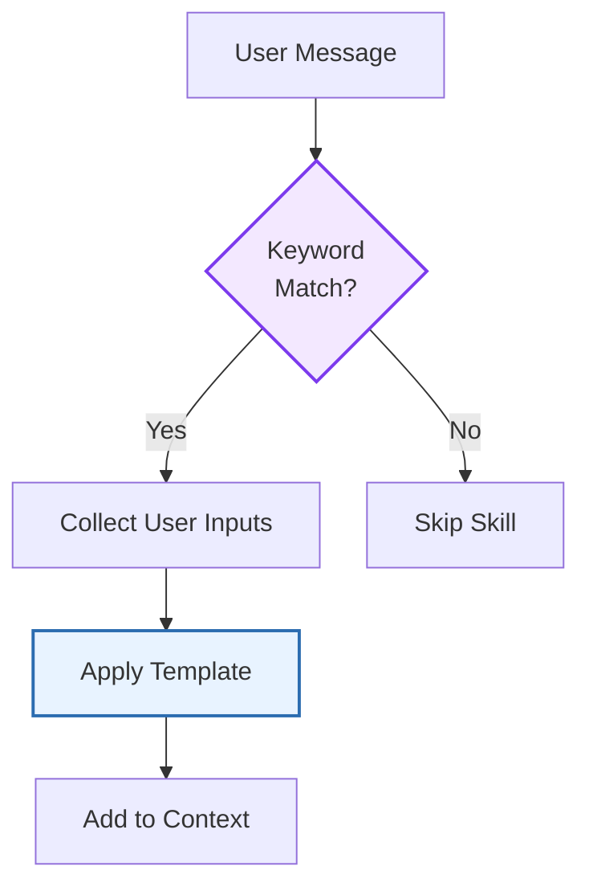
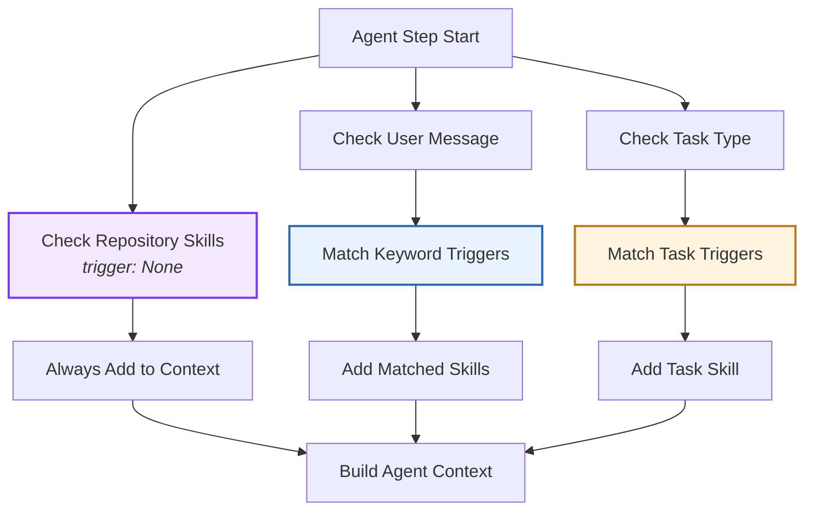
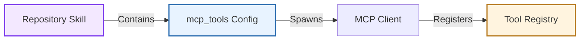
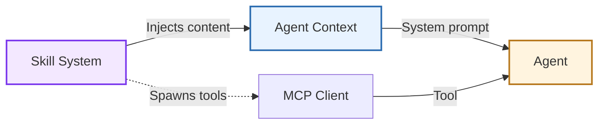

# Skill

> High-level architecture of the reusable prompt system

The **Skill** system provides a mechanism for injecting reusable, specialized knowledge into agent context. Skills use trigger-based activation to determine when they should be included in the agent's prompt.

**Source:** [`openhands/sdk/context/skills/`](https://github.com/OpenHands/software-agent-sdk/tree/main/openhands-sdk/openhands/sdk/context/skills)

## Core Responsibilities

The Skill system has four primary responsibilities:

1. **Context Injection** - Add specialized prompts to agent context based on triggers
2. **Trigger Evaluation** - Determine when skills should activate (always, keyword, task)
3. **MCP Integration** - Load MCP tools associated with repository skills
4. **Third-Party Support** - Parse `.cursorrules`, `agents.md`, and other skill formats

## Architecture



### Key Components

| Component                                                                                                                               | Purpose                  | Design                                                     |
| --------------------------------------------------------------------------------------------------------------------------------------- | ------------------------ | ---------------------------------------------------------- |
| **[`Skill`](https://github.com/OpenHands/software-agent-sdk/blob/main/openhands-sdk/openhands/sdk/context/skills/skill.py)**            | Core skill model         | Pydantic model with name, content, trigger                 |
| **[`KeywordTrigger`](https://github.com/OpenHands/software-agent-sdk/blob/main/openhands-sdk/openhands/sdk/context/skills/trigger.py)** | Keyword-based activation | String matching on user messages                           |
| **[`TaskTrigger`](https://github.com/OpenHands/software-agent-sdk/blob/main/openhands-sdk/openhands/sdk/context/skills/trigger.py)**    | Task-based activation    | Special type of KeywordTrigger for skills with user inputs |
| **[`InputMetadata`](https://github.com/OpenHands/software-agent-sdk/blob/main/openhands-sdk/openhands/sdk/context/skills/types.py)**    | Task input parameters    | Defines user inputs for task skills                        |
| **Skill Loader**                                                                                                                        | File parsing             | Reads markdown with frontmatter, validates schema          |

## Skill Types

### Repository Skills

Always-active, repository-specific guidelines.

**Recommended:** put these permanent instructions in `AGENTS.md` (and optionally `GEMINI.md` / `CLAUDE.md`) at the repo root.



**Characteristics:**

* **Trigger:** `None` (always active)
* **Purpose:** Project conventions, coding standards, architecture rules
* **MCP Tools:** Can include MCP tool configuration
* **Location:** `AGENTS.md` (recommended) and/or `.openhands/skills/*.md` (supported)

**Example Files (permanent context):**

* `AGENTS.md` - General agent instructions
* `GEMINI.md` - Gemini-specific instructions
* `CLAUDE.md` - Claude-specific instructions

**Other supported formats:**

* `.cursorrules` - Cursor IDE guidelines
* `agents.md` / `agent.md` - General agent instructions

### Knowledge Skills

Keyword-triggered skills for specialized domains:



**Characteristics:**

* **Trigger:** `KeywordTrigger` with regex patterns
* **Purpose:** Domain-specific knowledge (e.g., "kubernetes", "machine learning")
* **Activation:** Keywords detected in user messages
* **Location:** System or user-defined knowledge base

**Trigger Example:**

```yaml  theme={null}
---
name: kubernetes
trigger:
  type: keyword
  keywords: ["kubernetes", "k8s", "kubectl"]
---
```

### Task Skills

Keyword-triggered skills with structured inputs for guided workflows:



**Characteristics:**

* **Trigger:** `TaskTrigger` (a special type of KeywordTrigger for skills with user inputs)
* **Activation:** Keywords/triggers detected in user messages (same matching logic as KeywordTrigger)
* **Purpose:** Guided workflows (e.g., bug fixing, feature implementation)
* **Inputs:** User-provided parameters (e.g., bug description, acceptance criteria)
* **Location:** System-defined or custom task templates

**Trigger Example:**

```yaml  theme={null}
---
name: bug_fix
triggers: ["/bug_fix", "fix bug", "bug report"]
inputs:
  - name: bug_description
    description: "Describe the bug"
    required: true
---
```

**Note:** TaskTrigger uses the same keyword matching mechanism as KeywordTrigger. The distinction is semantic - TaskTrigger is used for skills that require structured user inputs, while KeywordTrigger is for knowledge-based skills.

## Trigger Evaluation

Skills are evaluated at different points in the agent lifecycle:



**Evaluation Rules:**

| Trigger Type       | Evaluation Point | Activation Condition                                     |
| ------------------ | ---------------- | -------------------------------------------------------- |
| **None**           | Every step       | Always active                                            |
| **KeywordTrigger** | On user message  | Keyword/string match in message                          |
| **TaskTrigger**    | On user message  | Keyword/string match in message (same as KeywordTrigger) |

**Note:** Both KeywordTrigger and TaskTrigger use identical string matching logic. TaskTrigger is simply a semantic variant used for skills that include user input parameters.

## MCP Tool Integration

Repository skills can include MCP tool configurations:



**MCP Configuration Format:**

Skills can embed MCP server configuration following the [FastMCP format](https://gofastmcp.com/clients/client#configuration-format):

```yaml  theme={null}
---
name: repo_skill
mcp_tools:
  mcpServers:
    filesystem:
      command: "npx"
      args: ["-y", "@modelcontextprotocol/server-filesystem", "/path/to/project"]
---
```

**Workflow:**

1. **Load Skill:** Parse markdown file with frontmatter
2. **Extract MCP Config:** Read `mcp_tools` field
3. **Spawn MCP Servers:** Create MCP clients for each server
4. **Register Tools:** Add MCP tools to agent's tool registry
5. **Inject Context:** Add skill content to agent prompt

## Skill File Format

Skills are defined in markdown files with YAML frontmatter:

```markdown  theme={null}
---
name: skill_name
trigger:
  type: keyword
  keywords: ["pattern1", "pattern2"]
---

# Skill Content

This is the instruction text that will be added to the agent's context.
```

**Frontmatter Fields:**

| Field          | Required | Description                                   |
| -------------- | -------- | --------------------------------------------- |
| **name**       | Yes      | Unique skill identifier                       |
| **trigger**    | Yes\*    | Activation trigger (`null` for always active) |
| **mcp\_tools** | No       | MCP server configuration (repo skills only)   |
| **inputs**     | No       | User input metadata (task skills only)        |

\*Repository skills use `trigger: null` (or omit trigger field)

## Component Relationships

### How Skills Integrate



**Relationship Characteristics:**

* **Skills → Agent Context**: Active skills contribute their content to system prompt
* **Skills → MCP**: Repository skills can spawn MCP servers and register tools
* **Context → Agent**: Combined skill content becomes part of agent's instructions
* **Skills Lifecycle**: Loaded at conversation start, evaluated each step

## See Also

* **[Agent Architecture](/sdk/arch/agent)** - How agents use skills for context
* **[Tool System](/sdk/arch/tool-system#mcp-integration)** - MCP tool spawning and client management
* **[Context Management Guide](/sdk/guides/skill)** - Using skills in applications


---

> To find navigation and other pages in this documentation, fetch the llms.txt file at: https://docs.openhands.dev/llms.txt