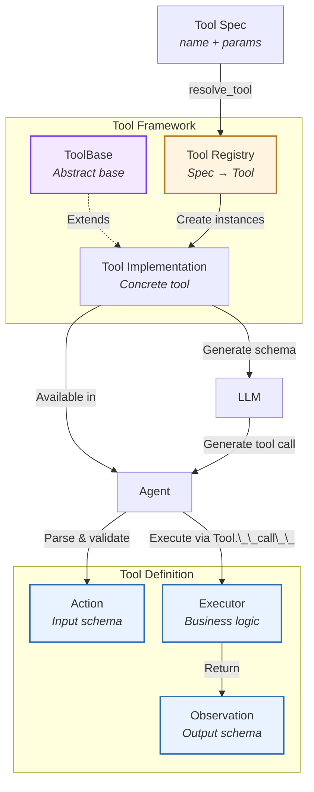
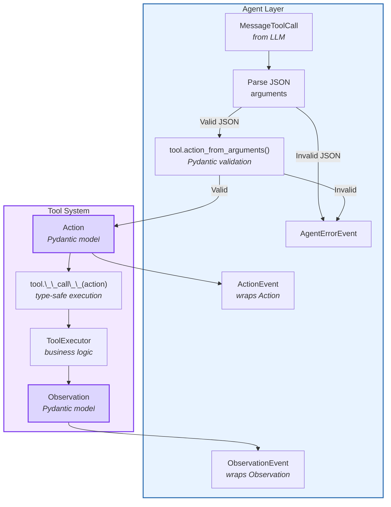
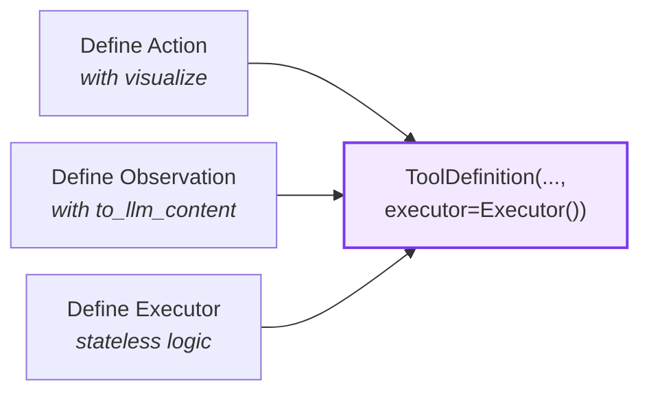
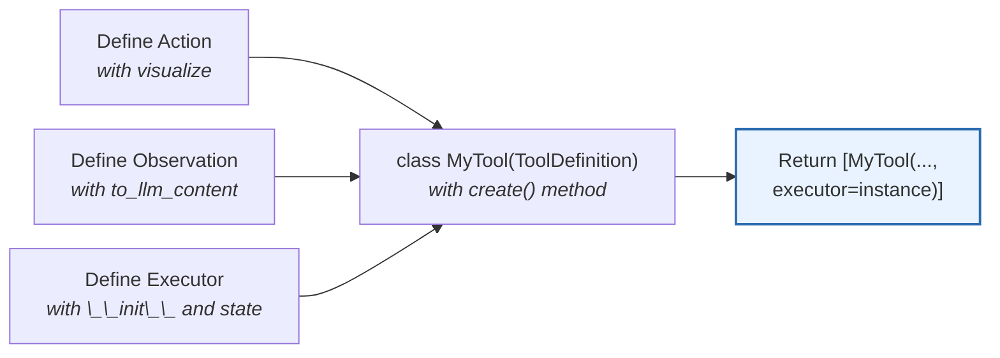
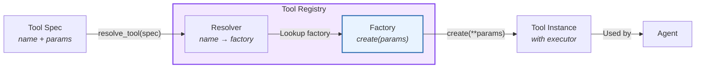
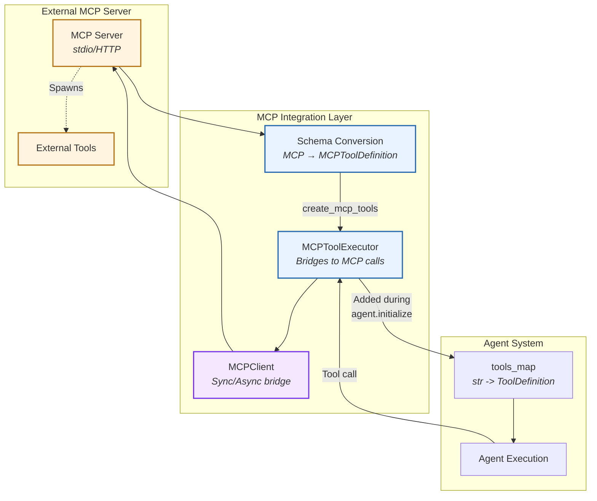
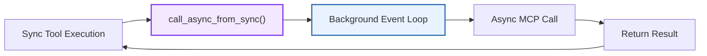
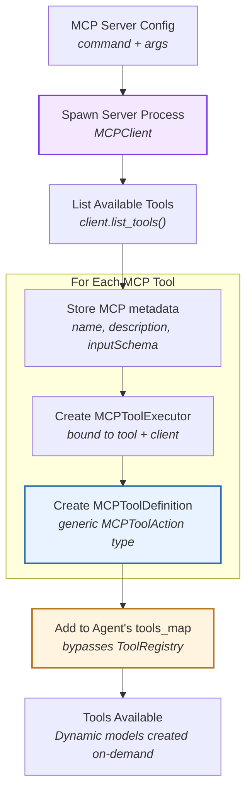
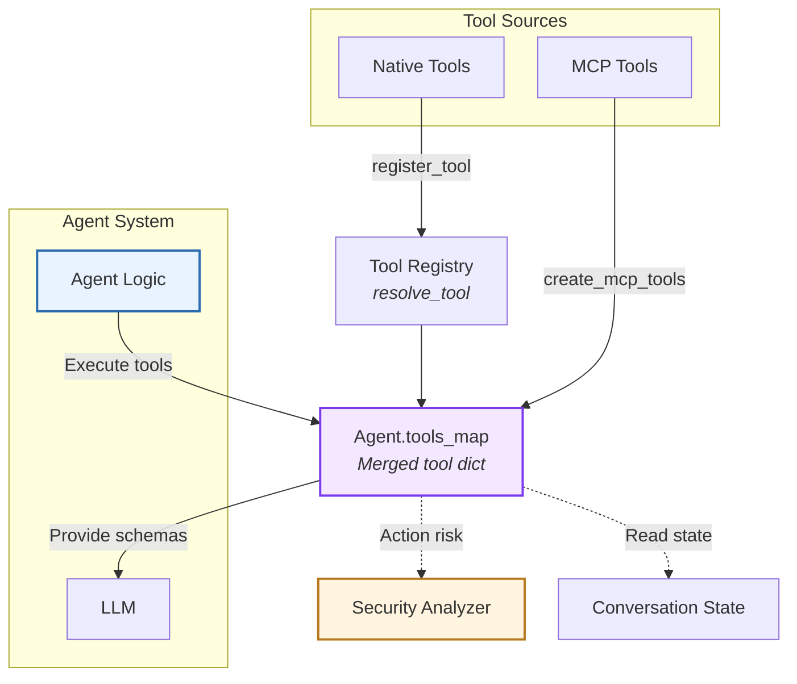

# Tool System & MCP

> High-level architecture of the action-observation tool framework

The **Tool System** provides a type-safe, extensible framework for defining agent capabilities. It standardizes how agents interact with external systems through a structured Action-Observation pattern with automatic validation and schema generation.

**Source:** [`openhands-sdk/openhands/sdk/tool/`](https://github.com/OpenHands/software-agent-sdk/tree/main/openhands-sdk/openhands/sdk/tool)

## Core Responsibilities

The Tool System has four primary responsibilities:

1. **Type Safety** - Enforce action/observation schemas via Pydantic models
2. **Schema Generation** - Auto-generate LLM-compatible tool descriptions from Pydantic schemas
3. **Execution Lifecycle** - Validate inputs, execute logic, wrap outputs
4. **Tool Registry** - Discover and resolve tools by name or pattern

## Tool System

### Architecture Overview



### Key Components

| Component                                                                                                                    | Purpose             | Design                                                                 |
| ---------------------------------------------------------------------------------------------------------------------------- | ------------------- | ---------------------------------------------------------------------- |
| **[`ToolBase`](https://github.com/OpenHands/software-agent-sdk/blob/main/openhands-sdk/openhands/sdk/tool/tool.py)**         | Abstract base class | Generic over Action and Observation types, defines abstract `create()` |
| **[`ToolDefinition`](https://github.com/OpenHands/software-agent-sdk/blob/main/openhands-sdk/openhands/sdk/tool/tool.py)**   | Concrete tool class | Can be instantiated directly or subclassed for factory pattern         |
| **[`Action`](https://github.com/OpenHands/software-agent-sdk/blob/main/openhands-sdk/openhands/sdk/tool/schema.py)**         | Input model         | Pydantic model with `visualize` property                               |
| **[`Observation`](https://github.com/OpenHands/software-agent-sdk/blob/main/openhands-sdk/openhands/sdk/tool/schema.py)**    | Output model        | Pydantic model with `to_llm_content` property                          |
| **[`ToolExecutor`](https://github.com/OpenHands/software-agent-sdk/blob/main/openhands-sdk/openhands/sdk/tool/tool.py)**     | Execution interface | ABC with `__call__()` method, optional `close()`                       |
| **[`ToolAnnotations`](https://github.com/OpenHands/software-agent-sdk/blob/main/openhands-sdk/openhands/sdk/tool/tool.py)**  | Behavioral hints    | MCP-spec hints (readOnly, destructive, idempotent, openWorld)          |
| **[`Tool` (spec)](https://github.com/OpenHands/software-agent-sdk/blob/main/openhands-sdk/openhands/sdk/tool/spec.py)**      | Tool specification  | Configuration object with name and params                              |
| **[`ToolRegistry`](https://github.com/OpenHands/software-agent-sdk/blob/main/openhands-sdk/openhands/sdk/tool/registry.py)** | Tool discovery      | Resolves Tool specs to ToolDefinition instances                        |

### Action-Observation Pattern

The tool system follows a **strict input-output contract**: `Action → Observation`. The Agent layer wraps these in events for conversation management.



**Tool System Boundary:**

* **Input**: `dict[str, Any]` (JSON arguments) → validated `Action` instance
* **Output**: `Observation` instance with structured result
* **No knowledge of**: Events, LLM messages, conversation state

### Tool Definition

Tools are defined using two patterns depending on complexity:

#### Pattern 1: Direct Instantiation (Simple Tools)

For stateless tools that don't need runtime configuration (e.g., `finish`, `think`):



**Components:**

1. **Action** - Pydantic model with `visualize` property for display
2. **Observation** - Pydantic model with `to_llm_content` property for LLM
3. **ToolExecutor** - Stateless executor with `__call__(action) → observation`
4. **ToolDefinition** - Direct instantiation with executor instance

#### Pattern 2: Subclass with Factory (Stateful Tools)

For tools requiring runtime configuration or persistent state (e.g., `execute_bash`, `file_editor`, `glob`):



**Components:**

1. **Action/Observation** - Same as Pattern 1
2. **ToolExecutor** - Stateful executor with `__init__()` for configuration and optional `close()` for cleanup
3. **MyTool(ToolDefinition)** - Subclass with `@classmethod create(conv_state, ...)` factory method
4. **Factory Method** - Returns sequence of configured tool instances

```mermaid  theme={null}
%%{init: {"theme": "default", "flowchart": {"nodeSpacing": 30}} }%%
flowchart TB
    subgraph Pattern1["Pattern 1: Direct Instantiation"]
        P1A["Define Action/Observation<br>with visualize/to_llm_content"]
        P1E["Define ToolExecutor<br>with \_\_call\_\_()"]
        P1T["ToolDefinition(...,<br>executor=Executor())"]
    end
    
    subgraph Pattern2["Pattern 2: Subclass with Factory"]
        P2A["Define Action/Observation<br>with visualize/to_llm_content"]
        P2E["Define Stateful ToolExecutor<br>with \_\_init\_\_() and \_\_call\_\_()"]
        P2C["class MyTool(ToolDefinition)<br>@classmethod create()"]
        P2I["Return [MyTool(...,<br>executor=instance)]"]
    end
    
    P1A --> P1E
    P1E --> P1T
    
    P2A --> P2E
    P2E --> P2C
    P2C --> P2I
    
    style P1T fill:#f3e8ff,stroke:#7c3aed,stroke-width:2px
    style P2I fill:#e8f3ff,stroke:#2b6cb0,stroke-width:2px
```



**Key Design Elements:**

| Component          | Purpose                         | Requirements                                                                           |
| ------------------ | ------------------------------- | -------------------------------------------------------------------------------------- |
| **Action**         | Defines LLM-provided parameters | Extends `Action`, includes `visualize` property returning Rich Text                    |
| **Observation**    | Defines structured output       | Extends `Observation`, includes `to_llm_content` property returning content list       |
| **ToolExecutor**   | Implements business logic       | Extends `ToolExecutor[ActionT, ObservationT]`, implements `__call__()` method          |
| **ToolDefinition** | Ties everything together        | Either instantiate directly (Pattern 1) or subclass with `create()` method (Pattern 2) |

**When to Use Each Pattern:**

| Pattern                   | Use Case                                       | Examples                                      |
| ------------------------- | ---------------------------------------------- | --------------------------------------------- |
| **Direct Instantiation**  | Stateless tools with no configuration needs    | `finish`, `think`, simple utilities           |
| **Subclass with Factory** | Tools requiring runtime state or configuration | `execute_bash`, `file_editor`, `glob`, `grep` |

### Tool Annotations

Tools include optional `ToolAnnotations` based on the [Model Context Protocol (MCP) spec](https://github.com/modelcontextprotocol/modelcontextprotocol) that provide behavioral hints to LLMs:

| Field             | Meaning                        | Examples                                      |
| ----------------- | ------------------------------ | --------------------------------------------- |
| `readOnlyHint`    | Tool doesn't modify state      | `glob` (True), `execute_bash` (False)         |
| `destructiveHint` | May delete/overwrite data      | `file_editor` (True), `task_tracker` (False)  |
| `idempotentHint`  | Repeated calls are safe        | `glob` (True), `execute_bash` (False)         |
| `openWorldHint`   | Interacts beyond closed domain | `execute_bash` (True), `task_tracker` (False) |

**Key Behaviors:**

* [LLM-based Security risk prediction](/sdk/guides/security) automatically added for tools with `readOnlyHint=False`
* Annotations help LLMs reason about tool safety and side effects

### Tool Registry

The registry enables **dynamic tool discovery** and instantiation from tool specifications:



**Resolution Workflow:**

1. **[Tool (Spec)](https://github.com/OpenHands/software-agent-sdk/blob/main/openhands-sdk/openhands/sdk/tool/spec.py)** - Configuration object with `name` (e.g., "BashTool") and `params` (e.g., `{"working_dir": "/workspace"}`)
2. **Resolver Lookup** - Registry finds the registered resolver for the tool name
3. **Factory Invocation** - Resolver calls the tool's `.create()` method with params and conversation state
4. **Instance Creation** - Tool instance(s) are created with configured executors
5. **Agent Usage** - Instances are added to the agent's tools\_map for execution

**Registration Types:**

| Type                 | Registration                     | Resolver Behavior                                    |
| -------------------- | -------------------------------- | ---------------------------------------------------- |
| **Tool Instance**    | `register_tool(name, instance)`  | Returns the fixed instance (params not allowed)      |
| **Tool Subclass**    | `register_tool(name, ToolClass)` | Calls `ToolClass.create(**params, conv_state=state)` |
| **Factory Function** | `register_tool(name, factory)`   | Calls `factory(**params, conv_state=state)`          |

### File Organization

Tools follow a consistent file structure for maintainability:

```
openhands-tools/openhands/tools/my_tool/
├── __init__.py           # Export MyTool
├── definition.py         # Action, Observation, MyTool(ToolDefinition)
├── impl.py              # MyExecutor(ToolExecutor)
└── [other modules]      # Tool-specific utilities
```

**File Responsibilities:**

| File            | Contains                                     | Purpose                                        |
| --------------- | -------------------------------------------- | ---------------------------------------------- |
| `definition.py` | Action, Observation, ToolDefinition subclass | Public API, schema definitions, factory method |
| `impl.py`       | ToolExecutor implementation                  | Business logic, state management, execution    |
| `__init__.py`   | Tool exports                                 | Package interface                              |

**Benefits:**

* **Separation of Concerns** - Public API separate from implementation
* **Avoid Circular Imports** - Import `impl` only inside `create()` method
* **Consistency** - All tools follow same structure for discoverability

**Example Reference:** See [`execute_bash/`](https://github.com/OpenHands/software-agent-sdk/tree/main/openhands-tools/openhands/tools/execute_bash) for complete implementation

## MCP Integration

The tool system supports external tools via the [Model Context Protocol (MCP)](https://modelcontextprotocol.io/). MCP tools are **configured separately from the tool registry** via the `mcp_config` field in `Agent` class and are automatically discovered from MCP servers during agent initialization.

**Source:** [`openhands-sdk/openhands/sdk/mcp/`](https://github.com/OpenHands/software-agent-sdk/tree/main/openhands-sdk/openhands/sdk/mcp)

### Architecture Overview



### Key Components

| Component                                                                                                                            | Purpose                | Design                                                                 |
| ------------------------------------------------------------------------------------------------------------------------------------ | ---------------------- | ---------------------------------------------------------------------- |
| **[`MCPClient`](https://github.com/OpenHands/software-agent-sdk/blob/main/openhands-sdk/openhands/sdk/mcp/client.py)**               | MCP server connection  | Extends FastMCP with sync/async bridge                                 |
| **[`MCPToolDefinition`](https://github.com/OpenHands/software-agent-sdk/blob/main/openhands-sdk/openhands/sdk/mcp/tool.py)**         | Tool wrapper           | Wraps MCP tools as SDK `ToolDefinition` with dynamic validation        |
| **[`MCPToolExecutor`](https://github.com/OpenHands/software-agent-sdk/blob/main/openhands-sdk/openhands/sdk/mcp/tool.py)**           | Execution handler      | Bridges agent actions to MCP tool calls via MCPClient                  |
| **[`MCPToolAction`](https://github.com/OpenHands/software-agent-sdk/blob/main/openhands-sdk/openhands/sdk/mcp/definition.py)**       | Generic action wrapper | Simple `dict[str, Any]` wrapper for MCP tool arguments                 |
| **[`MCPToolObservation`](https://github.com/OpenHands/software-agent-sdk/blob/main/openhands-sdk/openhands/sdk/mcp/definition.py)**  | Result wrapper         | Wraps MCP tool results as observations with content blocks             |
| **[`_create_mcp_action_type()`](https://github.com/OpenHands/software-agent-sdk/blob/main/openhands-sdk/openhands/sdk/mcp/tool.py)** | Dynamic schema         | Runtime Pydantic model generated from MCP `inputSchema` for validation |

### Sync/Async Bridge

MCP protocol is asynchronous, but SDK tools execute synchronously. The bridge pattern in [client.py](https://github.com/OpenHands/software-agent-sdk/blob/main/openhands-sdk/openhands/sdk/mcp/client.py) solves this:



**Bridge Features:**

* **Background Event Loop** - Executes async code from sync contexts
* **Timeout Support** - Configurable timeouts for MCP operations
* **Error Handling** - Wraps MCP errors in observations
* **Connection Pooling** - Reuses connections across tool calls

### Tool Discovery Flow

**Source:** [`create_mcp_tools()`](https://github.com/OpenHands/software-agent-sdk/blob/main/openhands-sdk/openhands/sdk/mcp/utils.py) | [`agent._initialize()`](https://github.com/OpenHands/software-agent-sdk/blob/main/openhands-sdk/openhands/sdk/agent/base.py)



**Discovery Steps:**

1. **Spawn Server** - Launch MCP server via stdio protocol (using `MCPClient`)
2. **List Tools** - Call MCP `tools/list` endpoint to retrieve available tools
3. **Parse Schemas** - Extract tool names, descriptions, and `inputSchema` from MCP response
4. **Create Definitions** - For each tool, call `MCPToolDefinition.create()` which:
   * Creates an `MCPToolExecutor` instance bound to the tool name and client
   * Wraps the MCP tool metadata in `MCPToolDefinition`
   * Uses generic `MCPToolAction` as the action type (NOT dynamic models yet)
5. **Add to Agent** - All `MCPToolDefinition` instances are added to agent's `tools_map` during `initialize()` (bypasses ToolRegistry)
6. **Lazy Validation** - Dynamic Pydantic models are generated lazily when:
   * `action_from_arguments()` is called (argument validation)
   * `to_openai_tool()` is called (schema export to LLM)

**Schema Handling:**

| MCP Schema           | SDK Integration                                             | When Used                    |
| -------------------- | ----------------------------------------------------------- | ---------------------------- |
| `name`               | Tool name (stored in `MCPToolDefinition`)                   | Discovery, execution         |
| `description`        | Tool description for LLM                                    | Discovery, LLM prompt        |
| `inputSchema`        | Stored in `mcp_tool.inputSchema`                            | Lazy model generation        |
| `inputSchema` fields | Converted to Pydantic fields via `Schema.from_mcp_schema()` | Validation, schema export    |
| `annotations`        | Mapped to `ToolAnnotations`                                 | Security analysis, LLM hints |

### MCP Server Configuration

MCP servers are configured via the `mcp_config` field on the `Agent` class. Configuration follows [FastMCP config format](https://gofastmcp.com/clients/client#configuration-format):

```python  theme={null}
from openhands.sdk import Agent

agent = Agent(
    mcp_config={
        "mcpServers": {
            "fetch": {
                "command": "uvx",
                "args": ["mcp-server-fetch"]
            },
            "filesystem": {
                "command": "npx",
                "args": ["-y", "@modelcontextprotocol/server-filesystem", "/path"]
            }
        }
    }
)
```

## Component Relationships



**Relationship Characteristics:**

* **Native → Registry → tools\_map**: Native tools resolved via `ToolRegistry`
* **MCP → tools\_map**: MCP tools bypass registry, added directly during `initialize()`
* **tools\_map → LLM**: Generate schemas describing all available capabilities
* **Agent → tools\_map**: Execute actions, receive observations
* **tools\_map → Conversation**: Read state for context-aware execution
* **tools\_map → Security**: Tool annotations inform risk assessment

## See Also

* **[Agent Architecture](/sdk/arch/agent)** - How agents select and execute tools
* **[Events](/sdk/arch/events)** - ActionEvent and ObservationEvent structures
* **[Security Analyzer](/sdk/arch/security)** - Action risk assessment
* **[Skill Architecture](/sdk/arch/skill)** - Embedding MCP configs in repository skills
* **[Custom Tools Guide](/sdk/guides/custom-tools)** - Building your own tools
* **[FastMCP Documentation](https://gofastmcp.com/)** - Underlying MCP client library


---

> To find navigation and other pages in this documentation, fetch the llms.txt file at: https://docs.openhands.dev/llms.txt