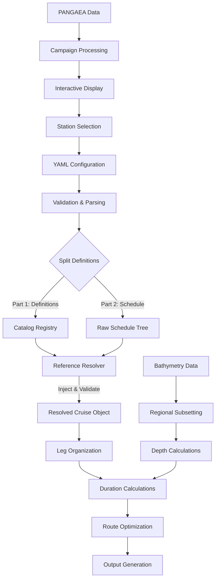

# Oceanographic Cruise Planning System: Complete Project Specification v2

## 📋 Executive Summary

### Purpose & Vision
The Oceanographic Cruise Planning System is a comprehensive software tool for planning research cruises. It serves oceanographic researchers who need to:

- **Plan station distributions** along lines with optimal spacing
- **Calculate operational timings** for CTD profiles, mooring operations, and transfers
- **Integrate past cruise locations** from PANGAEA database for context
- **Generate professional outputs** for cruise proposals and operational planning
- **Manage complex multi-area expeditions** with discrete working phases

### Target Users
- **Oceanographic researchers** planning research expeditions
- **Chief scientists** designing station layouts and schedules

### Core Value Proposition
Transform cruise planning from manual processes to an integrated, interactive, and automated workflow that produces publication-ready outputs while ensuring operational efficiency and scientific rigor.

---

## 🎯 User Experience Requirements

### Primary User Workflows

#### 1. Interactive Station Selection Workflow
```
User Intent: "I need to place oceanographic stations along specific transects with bathymetry context"

Required Experience:
├── Load bathymetry data for region of interest
├── Display interactive map with oceanographic depth contours
├── Enable click-to-place station functionality
├── Show past PANGAEA campaign metadata (locations) as context
├── Provide real-time coordinate and depth feedback
├── Export station list to validated YAML format
└── Integrate with cruise scheduling system
```

**User Interface Requirements:**
- **Three-panel layout**: Campaign selection (left), map with station picking (center), controls (right)
- **Interactive bathymetry**: Mercator-corrected aspect ratio, oceanographic contour intervals
- **Keyboard shortcuts**: Professional navigation modes (keys to change mode, right and left click options)
- **Real-time feedback**: Coordinate display, depth lookup, station naming
- **Visual indicators**: Current mode, selected campaigns, placed stations

#### 2. Cruise Schedule Generation Workflow
```
User Intent: "I have station positions and need a complete cruise schedule with timings"

Required Experience:
├── Parse YAML cruise configuration with validation
├── Calculate CTD profile durations based on depth
├── Compute transfer times between operations
├── Optimize operational sequences within legs
├── Generate multiple output formats simultaneously
└── Provide comprehensive timing and logistics summary
```

**Output Requirements:**
- **HTML**: Table view for the whole cruise, each leg, and each operation type
- **LaTeX tables**: Professional formatting for cruise proposals with tables of "Working area, stations and profiles", "work days at sea" and "station list"
- **CSV spreadsheets**: Editable formats for operational planning
- **KML files**: Google Earth visualization with cruise tracks
- **NetCDF datasets**: Scientific data formats for onward use and analysis

#### 3. Data Integration Workflow
```
User Intent: "I want to enhance my cruise plan with bathymetry and historical context"

Required Experience:
├── Import PANGAEA DOI lists for historical metadata (station locations)
├── Process and cache oceanographic campaign datasets
├── Validate station depths against ETOPO bathymetry
├── Add navigational coordinates in multiple formats
└── Enrich YAML configurations with computed data
```

#### 4. Robust coordinate and unit conversion
```
User Intent: "I need to plan research with decimal degrees and kilometers, but ship operations are in degrees decimal minutes and nautical miles"

Required Experience:
├── Robust conversions between kilometers and nautical miles
├── Use of ship speed to determine duration given distance
├── Round trip conversion between decimal degrees and degrees-decimal minutes in multiple formats (unicode, Latex, HTML, etc)
└── Meticulous accounting for units throughout
```

#### 5. Enhanced CLI Warning Display
```
User Intent: "I need clear, actionable warnings without technical noise when validating cruise configurations"

Required Experience:
├── Clean, formatted warning messages across all CLI commands
├── Contextual error information without raw Pydantic tracebacks
├── Consistent warning formatting standards for better readability
├── Actionable guidance for resolving common validation issues
└── Professional error display suitable for operational use
```

**CLI Warning Display Requirements:**

- **Clean Format**: Human-readable warning messages without technical stack traces
- **Consistent Standards**: Uniform formatting across `validate`, `enrich`, `schedule`, and `stations` commands
- **Contextual Information**: Include relevant details (line numbers, field names, suggested fixes)
- **Actionable Guidance**: Clear instructions for resolving validation issues
- **Professional Presentation**: Suitable for operational cruise planning environments

**Implementation Standards:**

```text
# Enhanced Warning Format (Target)
WARNING: Station 'CTD_001' validation issues:
  - Missing operation_type field (line 45)
    → Add: operation_type: "CTD"
  - Invalid depth value: -9999.0 (line 47)  
    → Use: depth: <positive value> or remove for auto-calculation

# Instead of Raw Pydantic Format (Current)
ValidationError: 1 validation error for StationDefinition
stations -> 0 -> operation_type
  field required (type=value_error.missing)
```

**Benefits:**
- **Reduced Learning Curve**: Non-technical users can understand and fix validation issues
- **Faster Troubleshooting**: Clear guidance eliminates guesswork
- **Professional Output**: Suitable for operational cruise planning environments
- **Consistent Experience**: Uniform warning format across all commands

---

## 🏗️ Core Architecture Specifications

### Decision Hierarchy (System Logic Flow)

When calculating the Cruise Timeline and Path, the system follows this strict hierarchy of constraints:

1. **Global Anchors (The "Bookends"):**
   - The cruise **MUST** start at `departure_port` and end at `arrival_port`
   - The first science action **MUST** be `first_waypoint` (formerly `first_station`) - uses entry point from operation abstraction
   - The last science action **MUST** be `last_waypoint` (formerly `last_station`) - uses exit point from operation abstraction
   - For time-based strategies, assume departure time of 08:00 local time, "daytime" is 08:00 - 20:00

2. **Leg Sequence (The "Chapters"):**
   - Legs are executed strictly in the order listed in the YAML
   - The system moves from the exit point of Leg N to the entry point of Leg N+1 using the operation abstraction interface

3. **Cluster Constraints (The "Paragraphs"):**
   - **Contiguity:** The ship enters a Cluster and completes ALL tasks inside before leaving (unless `--flatten-groups` is used)
   - **Internal Order:**
     - If `activities` is defined → Follow it exactly
     - If `strategy: sequential` → Finish List A, then List B
     - If `strategy: day_night_split` → Interleave based on time constraints
     - If `strategy: spatial_interleaved` → Solve TSP for shortest path

4. **Atomic Operations (The "Words"):**
   - **PointOps:** Zero spatial displacement, only temporal (duration)
   - **LineOps:** Has internal geometry. The optimizer creates a "Tunnel" constraint - you must travel Start to End without performing other tasks inside

### Spatial Operations Hierarchy

The system organizes all cruise activities using a Composite Pattern that distinguishes between atomic physical actions and logical grouping containers.

```
Cruise (Top-level container)
└── Legs (Discrete working areas/time periods)
    └── Operations (Spatial activities)
        ├── Point Operations (Atomic: Zero-displacement activities)
        │   ├── CTD Profiles (Ship status: Dynamic Positioning)
        │   ├── Mooring Ops (Ship status: Station Keeping)
        │   └── Waypoints (Ship status: Navigation only)
        │
        ├── Line Operations (Atomic: Continuous displacement activities)
        │   ├── Transfers (Transit from A to B at cruise speed)
        │   ├── Towyo/Trawls (Transit from A to B at working speed)
        │   └── Underway Geophysics (Continuous sampling along path)
        │
        ├── Composite Operations (Logical Containers)
        │   ├── Sections (Ordered list of Points along a geometric line)
        │   └── Observatories/Clusters (Spatially related mix of CTDs & Moorings)
        │
        └── Area Operations (Regional activities - defined by a polygon)
            ├── Grid Surveys (systematic area coverage)
            └── Area Activities (diffuse regional work)
```

### Spatial Base Classes

**PointOperation**
```python
# Activities occurring at fixed geographic coordinates
# Examples: CTD profiles, mooring deployments, calibrations
# Attributes: latitude, longitude, depth, duration, time_of_day (e.g. daytime for moorings)
# Duration calculation: depth-based (profiles) or user-defined (moorings)
```

**LineOperation**
```python
# Activities involving continuous vessel movement from Start to End
# Crucial distinction: The operation IS the movement
# Examples: Ship transfers, towyo operations, trawling
# Attributes: start_pos, end_pos, route, distance, speed_mode (transit vs working)
# Duration calculation: distance / speed
```

**Cluster**
```python
# Logical containers for grouping related PointOperations
# Examples: "53N Section" (20 CTDs), "OSNAP Array" (Mixed CTDs + Moorings)
# Attributes:
#   - activities: List[str] (references to activity names)
#   - strategy: Enum (SEQUENTIAL, INTERLEAVED, DAY_NIGHT_SPLIT)
#
# Function:
#   Calculates total duration not just by summing children, but by
#   solving the internal routing logic (e.g., optimizing Day-Ops vs Night-Ops)
```

**AreaOperation**
```python
# Activities within defined polygonal regions
# Examples: grid surveys, area monitoring, search patterns
# Attributes: boundary_polygon, area, sampling_density
# Duration calculation: area coverage models or user-defined
```

### Entry/Exit Point Abstraction Architecture

**Purpose**: Provide a unified, type-agnostic interface for routing calculations across all operation types.

**Problem Solved**: Previously, routing logic needed operation-specific code to determine entry and exit points for different operation types. This created maintenance burden and coupling between routing algorithms and operation implementations.

**Abstraction Methods**:

```python
# Unified interface implemented by all operation types
class Operation:
    def get_entry_point(self) -> Coordinate:
        """Return the geographic coordinate where this operation begins"""
        pass
    
    def get_exit_point(self) -> Coordinate:
        """Return the geographic coordinate where this operation ends"""
        pass
```

**Operation Type Abstractions**:

**Point Operations**:
```python
def get_entry_point(self) -> Coordinate:
    return self.position  # Station coordinates
    
def get_exit_point(self) -> Coordinate:
    return self.position  # Same point for entry and exit
```

**Line Operations**:
```python
def get_entry_point(self) -> Coordinate:
    return self.route[0]  # First waypoint in route
    
def get_exit_point(self) -> Coordinate:
    return self.route[-1]  # Last waypoint in route
```

**Area Operations**:
```python
def get_entry_point(self) -> Coordinate:
    return self.calculate_center_point()  # Calculated center of polygon
    
def get_exit_point(self) -> Coordinate:
    return self.calculate_center_point()  # Same center point for entry/exit
```

**Cluster Operations**:
```python
def get_entry_point(self) -> Coordinate:
    return self.stations[0].get_entry_point()  # First operation entry
    
def get_exit_point(self) -> Coordinate:
    return self.stations[-1].get_exit_point()  # Last operation exit
```

**Routing Calculation Improvements**:

- **Type-Agnostic Distance Calculations**: Routing algorithms use `get_entry_point()` and `get_exit_point()` without knowing operation type
- **Future-Proof Architecture**: New operation types only need to implement the abstraction interface
- **Cleaner Code**: Eliminates operation-specific conditional logic in routing calculations
- **Consistent Behavior**: All operations provide predictable entry/exit coordinates for scheduling

**Benefits**:

- **Future-Proof**: Adding new operation types requires only implementing the abstraction interface
- **Type-Agnostic**: Routing algorithms work with any operation type without modification
- **Cleaner Code**: Eliminates complex conditional logic based on operation type
- **Maintainable**: Centralized interface reduces coupling between routing and operation implementations
- **Testable**: Abstraction interface can be easily mocked for unit testing

**Developer Note: The "Hybrid" Pattern**

The parsing engine must support a "Hybrid" list structure. A list of moorings in a cluster may contain **Strings** (references) AND **Dictionaries** (inline definitions).

- **If type is String:** Look up in Catalog
- **If type is Dict:** Validate schema and use as-is

This allows the user to catalog their major assets while quickly adding "one-off" tasks inline without cluttering the global catalog.

### Leg-Based Organization

**Purpose**: Enable complex multi-area expeditions while maintaining simple single-leg default

**Structure:** The legs list contains discrete working phases. Within a leg, users can define composite groups to manage complex localized activities alongside standard sections.

```yaml
# Single-leg cruise (default - transparent to user)
cruise_name: Simple_Cruise_2028

# Point Operations (featureType: point)
points: [...]          # CTD profiles, water sampling, calibrations, mooring deployments and recoveries (as points with operation_type: "mooring" and action: "deployment"/"recovery")

# Line Operations (featureType: trajectory) 
lines: [...]         # Scientific operations along paths (ADCP, towing, bathymetry)

# Area Operations (featureType: trajectory or specialized)
areas: [...]    # Systematic coverage patterns, grid surveys

# Pure navigation (automatically generated by scheduler)
# NavigationalTransit objects created automatically for vessel movement between operations

# Multi-leg cruise with enhanced operation types
cruise_name: Complex_Expedition_2028
legs:
  - name: "Irminger_Sea_Operations"
    description: "Deep water mooring recoveries"

    # Point Operations: Fixed location scientific activities
    activities:
      - "STN_001"
      - "STN_002"

  - name: "53N_Observatory_Work"
    description: "Mixed operations with Day/Night constraints"

    # Composite: A cluster of mixed activities
    clusters:
      - name: "53N_Array"
        strategy: day_night_split    # Tells the scheduler: Day? Pop from moorings, Night? Pop from stations

        # OPTION A: Explicit Mixed Sequence (Manual Control)
        activities:
          - "MOOR_K7"          # Reference to a Mooring
          - "STN_001"          # Reference to a Station  
          - "ADCP_Transect_A"  # Reference to a Survey
          - "Grid_Survey_Alpha" # Reference to an Area Survey

        # OPTION B: Unordered Activities (Optimization Target)
        ordered: false
        activities: [CTD_01, CTD_02, CTD_20, M_53_A, M_53_B, M_53_C, ADCP_Line_1, Bathymetry_Survey_2, Grid_Alpha, Systematic_Mapping_Beta]
```

### Controlled Vocabulary

**Mooring Actions:**
- `"deployment"` - Deploy mooring at location
- `"recovery"` - Recover existing mooring

**Survey Operation Types:**
- `"underway"` - Instruments operating while ship underway (nothing over the side)
- `"towing"` - Towed instruments or devices deployed behind vessel

**Survey Actions:**
- `"ADCP"` - Acoustic Doppler Current Profiler survey
- `"bathymetry"` - Multibeam or singlebeam seafloor mapping
- `"thermosalinograph"` - Underway temperature and salinity measurement
- `"tow_yo"` - Tow-yo CTD profiling operations
- `"seismic"` - Seismic reflection/refraction surveys
- `"microstructure"` - Microstructure turbulence profiling

**Area Survey Pattern Types:**
- `"grid_survey"` - Systematic grid-based coverage
- `"systematic_mapping"` - Structured mapping pattern
- `"search_pattern"` - Search and rescue or target location patterns
- `"random_sampling"` - Statistical sampling within defined area

**Benefits:**
- **Operational Logic**: Allows grouping of spatially related activities that are operationally distinct
- **Temporal Organization**: Sequential phases with different objectives
- **Resource Management**: Equipment and personnel allocation by leg or by Cluster
- **Risk Assessment**: Isolated evaluation of different cruise components

The activities field provides a unified list of all operations to be executed within the cluster. If ordered=True, activities will be executed in the exact order specified. If ordered=False, the optimizer will perform route optimization (TSP) on all activities.

---

## 🔧 Technical Architecture

### Module Structure

```
cruiseplan/
├── core/
│   ├── operations.py          # Spatial operations hierarchy
│   ├── cruise.py             # Top-level cruise container
│   ├── leg.py               # Working area organization
│   └── validation.py        # YAML schema validation
├── data/
│   ├── bathymetry.py        # ETOPO/GEBCO data handling
│   ├── pangaea.py           # Handle positions from past cruises
│   └── cache.py             # Efficient data caching
├── interactive/
│   ├── station_picker.py    # Interactive station placement
│   ├── campaign_selector.py # PANGAEA campaign management
│   └── widgets.py           # Custom matplotlib widgets
├── calculators/
│   ├── duration.py          # CTD timing calculations
│   ├── distance.py          # Haversine distance calculations
│   └── routing.py           # Optimal transfer routing
├── output/
│   ├── html_generator.py    # Summary table views
│   ├── latex_generator.py   # Generate tables for DFG proposals
│   ├── map_generator.py     # Cruise track visualization
│   └── scientific_formats.py # NetCDF/CSV export
├── cli/
│   ├── main.py              # Unified command interface
│   ├── stations.py          # Interactive station picking
│   ├── schedule.py          # Cruise schedule generation
│   └── enhance.py           # Data enrichment commands
└── utils/
    ├── coordinates.py       # Geographic coordinate handling
    ├── units.py            # Unit conversion utilities
    └── config.py           # Configuration management
```

### Data Flow Architecture



### Optimization Logic & Strategy Matrix

The Route Optimizer uses a hierarchical approach. It respects the "Container" structure of Legs and Clusters unless explicitly overridden. Within a container, behavior is determined by the strategy and ordered attributes.

**Strategy Definitions:**

1. **sequential** (Default)
   - Behavior: Respects the exact order defined in the YAML
   - Split Lists: If moorings and stations are defined separately, executes all Moorings (in list order) followed by all Stations (in list order)
   - Use Case: Standard transects where geometry dictates the sequence

2. **day_night_split** (The "Zipper")
   - Behavior: Preserves the internal order of each individual list but interleaves them based on temporal constraints
   - Logic: The system maintains two parallel queues. It checks the clock and pops the next item from the queue that matches the current light conditions (Day=Moorings, Night=Stations)
   - Constraint: It never looks ahead. It must finish Mooring[0] before considering Mooring[1]

3. **spatial_interleaved** (The "Constrained TSP")
   - Behavior: Ignores list order. Merges all defined operations into a "Cloud of Tasks" and solves the Traveling Salesman Problem (TSP) to minimize total distance
   - Constraint - Point Operations: Treated as standard nodes (Lat/Lon)
   - Constraint - Line Operations: Treated as "Macro-Nodes" with strict entry/exit ports
     - Atomic: The optimizer cannot insert a station inside a line
     - Directionality: If reversible: true, the solver tests both directions (Start→End vs End→Start). If false, strictly Start→End

**The "Unified Sequence" Precedence:**

When parsing a Cluster, the system looks for operations in this priority order:

1. **activities** List: This is the **Absolute Truth**. It defines a specific mixed order (e.g., M1 → S1 → S2 → M2). The ordered flag controls whether this sequence is strict (ordered: true) or can be optimized (ordered: false)

2. **Legacy Support**: Older configurations may still use separate moorings/stations lists, but these are deprecated in favor of the unified activities field

**Distance Calculation:**

1. **Transit Segments:**
   - **Mobilization:** `Distance(departure_port, first_waypoint.get_entry_point())`
   - **Demobilization:** `Distance(last_waypoint.get_exit_point(), arrival_port)`
   - **Inter-Operation:** Haversine distance between sequential operation exit/entry points using abstraction interface

2. **Composite Cluster Distance:**
   - If a Cluster contains multiple lists (e.g., `moorings` and `stations`), the calculator treats them as **Sequential Blocks** by default
   - Formula: `Path(List_A) + Transfer(List_A_End -> List_B_Start) + Path(List_B)`
   - Note: This provides the "Base Geometric Distance". Any extra distance incurred by day/night zig-zagging is captured in the `maneuver_factor` (optional global setting) rather than the raw track distance

---

## 📊 Data Model Specifications

### YAML Configuration Schema

The configuration is divided into two logical parts: the Catalog (definitions of assets/operations) and the Schedule (the organization of work into legs and clusters).

### Part 1: The Catalog (Global Definitions)

These lists define "What" exists. Order here does not imply execution order.

**Core Cruise Definition**
```yaml
# Global Cruise Parameters
cruise_name: string                      # Required: Unique cruise identifier
description: string                      # Optional: Cruise description
default_vessel_speed: float              # Required: Speed in knots
default_distance_between_stations: float # Required: Spacing in km
calculate_transfer_between_sections: boolean # Required: Auto-transfer calculation
calculate_depth_via_bathymetry: boolean  # Required: Bathymetry depth lookup

# Global timing parameters
turnaround_time: float                # Optional: Default profile turnaround (minutes)
ctd_descent_rate: float               # Optional: CTD descent speed (m/s)
ctd_ascent_rate: float                # Optional: CTD ascent speed (m/s)

# Output Labeling Rules
# Defines how stations are numbered in final outputs (HTML/LaTeX)
# Logic: Assigned sequentially based on the final optimized schedule order
station_label_format: string          # Default: "C{:03d}" (Result: C001, C002...)
mooring_label_format: string          # Default: "M{:02d}" (Result: M01, M02 ...)

# Start information
start_time: 08:00                     # Nominal start time, default 09:00 LOCAL
start_date: string                    # ISO8601 string

# ---------------------------------------------------------
# GEOGRAPHIC ANCHORS (The "Bookends" of the Cruise)
# ---------------------------------------------------------

# 1. The Ports (Physical Start/End of the ship's journey)
departure_port:
  latitude: float         # Required. Decimal degrees (-90 to 90)
  longitude: float        # Required. Decimal degrees (-180 to 360)
  name: string            # e.g. "St. Johns"
  timezone: string        # e.g. "GMT-3.5"

arrival_port:
  latitude: float       # Required. Decimal degrees
  longitude: float      # Required. Decimal degrees
  name: string            # e.g. "Reykjavik"
  timezone: string        # e.g. "GMT+0"

# 2. The Scientific Boundaries (The first/last science acts)
# These define the "Transit to/from Working Area" segments
# The Optimizer will effectively "Lock" these stations in place
first_waypoint: "STN_01_Deep"  # Must match a name in the Catalog - routing uses entry point
last_waypoint: "Mooring_K7"    # Must match a name in the Catalog - routing uses exit point

# ---------------------------------------------------------
# RESOURCE CATALOG
# Definitions of all potential operations
# These do not appear in the schedule unless referenced
# ---------------------------------------------------------

# Station Definitions
points:
  - name: string                      # Required: ID: e.g., STN01
    latitude: float                 # Required. Decimal degrees
    longitude: float                # Required. Decimal degrees
    depth: float                      # Optional: Water depth (validated against bathymetry)
    duration: float                   # Optional: Override calculated duration
    comment: string                   # Optional: Station description
    position_string: string           # Auto-generated: Degrees + decimal minutes format coordinates "lat string, lon string"

# Mooring definitions (DEPRECATED - now included in stations list)
# Moorings are now defined in the stations list with operation_type: "mooring"
# See stations section above for current schema
    action: "deploy|recover"          # Required: Operation type (service = deploy+recover)
    duration: float                   # Required: Operation duration (minutes)
    depth: float                      # Optional: Water depth
    comment: string                   # Optional: Mooring description
    equipment: string                 # Optional: Equipment description
    lat_str: string                   # Auto-generated: Degrees + decimal minutes format
    lon_str: string

# Transect definitions (Line Operations)
lines:
  - name: string                      # Required: Transect identifier
    comment: string                   # Optional: Transect description
    route:
        - latitude: 50.0
          longitude: -5.0
        - latitude: 60.0
          longitude: -6.0              # Required: List of waypoint coordinates ("lat, lon" in decimal degrees)
    vessel_speed: float               # Optional: Override default speed
```

**Developer Note:** Flexible Coordinate Parsing While the explicit latitude and longitude keys are preferred for readability and safety, the system must support a Flexible Location Model for all spatial objects (Ports, Stations, Moorings).

The parser must accept either:
    1. Explicit Keys: latitude: 47.5, longitude: -52.7
    2. Legacy String: position: "47.5, -52.7"
If both are present, the explicit keys take precedence. Values must be parsed as Signed Decimal Degrees (Positive North / Positive East).

### Part 2: The Schedule (Legs & Clusters)

These structures define "When/Where" operations happen by referencing the Catalog.

**Multi-Leg Structure**
```yaml
# ---------------------------------------------------------
# EXECUTION SCHEDULE
# ---------------------------------------------------------

legs:
  - name: string                      # e.g., "Irminger Sea"
    # Logic controls
    strategy: "sequential|spatial_interleaved|day_night_split"
    ordered: boolean                 # Default: True. If False, allows optimizer to shuffle

    # 1. EXPLICIT MIXED SEQUENCE (Highest priority)
    # Use this for precise manual control of mixed operation types
    sequence:
    - "Mooring_K7"                  # String reference from global catalog
    - "STN_001"                     # String reference from global catalog
    - "Transit_Line_A"

    # Hybrid Support: You can mix references and inline definitions
    # (Useful for one-off operations not worth cataloging)
    activities:
      - "STN_Deep_01"             # Reference by ID (includes stations, moorings, lines, areas)
      - name: "Unexpected_Calibration"  # Inline definition
        duration: 60

      # Naming logic for Internal IDs
      # Used to generate unique IDs for the system to reference
      # The pattern must contain a placeholder for the index
      # Example: "S1_Stn{:02d}" -> S1_Stn01, S1_Stn02...
      id_pattern: string      # Required
      start_index: int        # Optional (default 1)

    # Standard Sections (Simple Lines)
    sections:
      - name: "Standard_Line_A"
        start:
            latitude: float             # Required. Decimal degrees
            longitude: float            # Required. Decimal degrees
        end:
            latitude: float             # Required. Decimal degrees
            longitude: float            # Required. Decimal degrees
        distance_between_stations: 20
        reversible: boolean     # true
```

**Inheritance Logic:**

1. Check Leg: Does the specific leg object have the attribute (e.g., vessel_speed) defined?
2. Use Leg Value: If yes, use the leg-specific value for all calculations within that leg
3. Fallback: If no, traverse up to the Cruise parent object and use the global default
4. Error: If neither exists, raise ConfigurationError

### Validation Rules

**Required Validations:**
- YAML syntax and structure validation
- Coordinate range validation (-90 ≤ lat ≤ 90, -180 ≤ lon ≤ 180 OR 0 ≤ lon ≤ 360)
- Positive value validation (speeds, durations, distances)
- Unique name enforcement within categories
- Bathymetry depth comparison (optional warning system)
- Route continuity validation for multi-waypoint transfers

**Schema Evolution:**
- Backward compatibility for existing YAML files
- Graceful handling of missing optional fields
- Clear error messages with line number references
- Warning system for potential issues (depth mismatches, unusual values)

**Reference Integrity Validation:**

- **Resolution Pass:** When parsing legs, every string found in a moorings or stations list is treated as a Reference ID
- **Lookup Logic:** The system attempts to find a matching name in the global moorings or stations catalog
- **Error Handling:**
  - If ID is found: The full object is copied from the catalog into the Leg structure
  - If ID is NOT found: Raise ReferenceError: Mooring 'K7_Rec' is scheduled in Leg 1 but not defined in the Catalog
- **Type Checking:** Ensure a Mooring ID is not accidentally placed in a Station list, but mixed types are allowed in a Sequence list.

**Calculation Priority Rules:**

1. **Depth Resolution Hierarchy:**
   - Priority 1 (Manual): If a depth attribute is explicitly defined in the Catalog or Inline (even if calculate_depth_via_bathymetry is True), the system MUST use the manual value
   - Priority 2 (Bathymetry): If depth is missing/null AND calculate_depth_via_bathymetry is True, use the interpolated grid value from data/bathymetry.py
   - Priority 3 (Fallback): If neither exists, emit a Warning and default to 99999.


2. **Duration Logic:**
   - Point Operations (profile): turnaround_time + (depth * 2 / winch_speed)
   - Transfers: distance / vessel_speed (Use Haversine distance)
   - Day/Night Scheduling: Calculated relative to the global start_date

**Composite Operations Logic:**

Interaction of `ordered` and `strategy`

When a Cluster contains multiple operation lists (e.g., `moorings` and `stations`) and logic flags:

| Config | Behavior |
| :--- | :--- |
| ordered: false (Default) | Full Optimization. The Optimizer merges all points into a single cloud and solves the TSP (Traveling Salesman) to minimize distance, respecting Day/Night windows if strategy is set. |
| ordered: true + strategy: sequential | Strict Append. Executes the moorings list in order, then the stations list in order. (Order is determined by the YAML field definition order). |
| ordered: true + strategy: day_night_split | The Zipper Pattern. The internal order of each individual list is preserved (Sequence A must be 1->2->3), but the scheduler switches between List A and List B based on the time of day. |

**Developer Note:**

In "Zipper" mode, the scheduler looks at head(moorings) and head(stations). If current_time is Day, it executes head(moorings). If Night, it executes head(stations). It does NOT look ahead to moorings[1] until moorings[0] is complete.

If arrival at the target happens during a prohibited window (e.g., Night for Moorings), add wait_time to the duration until the next valid window opens.

---

## 🎨 Interactive Components Specification

### Station Picker Interface

**Layout Requirements:**
```
┌─────────────────┬─────────────────────────────────┬─────────────────┐
│   Campaign      │         Bathymetry Map          │    Controls     │
│   Selection     │       (Station Picking)         │   & Status      │
│                 │                                 │                 │
│ ☑ Campaign_A    │  ○ Interactive (matplotlib)     │ Mode: Add       │
│ ☐ Campaign_B    │  ○ Mercator projection          │ Stations: 12    │
│ ☑ Campaign_C    │  ○ Oceanographic contours       │                 │
│                 │  ○ Real-time coordinate display │ [Save YAML]     │
│ [Toggle All]    │  ○ Click-to-place stations      │ [Clear All]     │
│ [Save Campaigns]│  ○ Keyboard navigation          │ [Load PANGAEA]  │
└─────────────────┴─────────────────────────────────┴─────────────────┘
```

**Interaction Model:**
- **Mouse Controls**: Click to place stations, scroll to zoom, drag to pan
- **Keyboard Controls**:
  - `'p'` or `'w'`: Switch to add WayPoint (single lat/lon) mode
  - `'l'` or `'s'`: Switch to add LineSection (defined by a start and end point) mode
  - `'a'`: Switch to add area (defined by a set of points and finished by clicking `'a'` again)
  - `'n'`: Toggle navigation mode
  - `'y'`: Save current stations to YAML
  - `'s'`: Save selected campaigns to pkl
  - `'c'`: Clear all placed operations (points, lines and areas)
  - `'r'`: Remove last placed operation (last point, or last line, or last area)
  - `'esc'`: Close window without saving
- **Visual Feedback**: Mode indicators, coordinate display, depth lookup
- **Real-time Updates**: Station counter (points), Transect counter (lines), Area counter (areas), coordinate formatting, validation status

**Bathymetry Integration:**
```python
# Depth contour specifications (oceanographic standard)
DEPTH_CONTOURS = [0, -50, -100, -200, -500, -1000, -2000, -3000, -4000]

# Interpolation Logic
def get_depth_at_point(lat, lon, grid):
    """
    Calculates depth using Bilinear Interpolation.
    1. Identify the 4 grid points surrounding the coordinate.
    2. Perform weighted average based on distance to grid points.
    3. Return interpolated float value.
    """

# Land Avoidance Logic
allow_land_stations: boolean = False  # Configurable setting

def validate_placement(lat, lon):
    depth = get_depth_at_point(lat, lon)
    if depth > 0: # Positive value indicates land (dataset dependent)
        if not allow_land_stations:
            raise InteractionError("Cannot place station on land")
        else:
            emit_warning(f"Station placed on land (Elevation: {depth}m)")
```

If the local ETOPO file is not found, get_depth_at_point should return a depth of -9999 to allow development to proceed without the 1GB dataset.

**Performance Requirements:**
- Sub-second response for station placement
- Smooth zooming and panning for regions up to 1000km×1000km
- On zoom, reset the aspect ratio to PROJECTION including all points within the zoom
- Efficient rendering for up to 10,000 PANGAEA data points
- Memory management for long interactive sessions

### PANGAEA Integration System

**Data Processing Pipeline:**
```python
# DOI List Processing
input: list_of_pangaea_dois.txt
│
├── DOI Validation (format: 10.xxxx/xxxxx)
├── PANGAEA API Queries (with rate limiting)
├── Event Extraction (lat/lon coordinates)
├── Campaign Grouping (by cruise/expedition)
├── Pickle Serialization (efficient storage)
└── Interactive Loading (checkbox interface)

output: selected_campaigns.pkl
```

**Performance & Visualization:**
- **Checkbox Interface**: Toggle visibility of individual campaigns
- **Bulk Operations**: Select all, clear all, save selection
- **Visual Distinction**: Different colors/markers per campaign
- **Performance Caching**: Pre-processed pickle files for large datasets
- **Metadata Display**: Campaign names, data counts, coordinate ranges
- **Smart Downsampling:**
  - Implementation of "Level of Detail" (LOD) rendering
  - When Map Zoom < X: Render every Nth point (stride slicing) to maintain >30fps
  - When Map Zoom > X: Render full resolution dataset
  - Thresholds configurable in config.py

**Visual distinction:** To generate this, pick 4 colors for fill colors which are colorblind distinguishable, then pick 5 edge colors also distinguishable, and 6 shapes. Then for the markers, cycle through each of these separately. So the first marker is (fill color 1, edge color 1, symbol 1), the second marker is (fill color 2, edge color 2, symbol 2). In this way, we are changing everything for each incremented marker.

**Data Format:**
```python
# Standardized campaign data structure
campaign_data = [
    (lat_array, lon_array, "Campaign_Name_1"),
    (lat_array, lon_array, "Campaign_Name_2"),
    # ... additional campaigns
]
```

---

## 📈 Output Generation Specifications

### LaTeX Tables for Cruise Proposals

**Table Requirements:**
```latex
% Working area, stations and profiles table
\begin{table}[htbp]
\caption{Working area, stations and profiles: [Cruise Name]}
\begin{tabular}{llrrrc}
\toprule
Station & Location & Geographic coordinates & Water depth (m) \\
\midrule
% Auto-generated content with proper formatting
CTD profile & Stn01 & 52$^\circ$30.15'N, 051$^\circ$20.23'W & 2847   \\
Mooring deployment & M02 & 53$^\circ$07.20'N, 050$^\circ$90.10'W & 2156   \\
\bottomrule
\end{tabular}
\end{table}

% Work days at sea table
\begin{table}[htbp]
\caption{Work days at sea: [Cruise Name]}
\begin{tabular}{llrrrc}
\toprule
Area & Station & Duration (h) & Transit (h) \\
\midrule
% Auto-generated content with proper formatting
Transit to Area 1 &         &     & 35 \\
\midrule
Area 1 & CTD stations       & 100 &  \\
\midrule
Area 1 & Mooring operations & 25  &  \\
\midrule
Transit within area 1       & 25  &  \\
\midrule
Area 2 & CTD stations       & 25  &  \\
\midrule
Transit within area 2       & 25  & \\
\midrule
Transit from Area &         &     & 25 \\
\midrule
Total duration & 200 & 60 \\
\bottomrule
\end{tabular}
\end{table}
```

**Formatting Features:**
- Coordinate formatting in degrees and decimal minutes (for outputs) or decimal degrees (native for calculations)
- Duration summaries by operation type and leg
- Incorporate enhanced typography with booktabs package
- Automatic page breaking for long schedules (i.e. more than NN lines, default to NN=45)
- When applying page breaking, repeat the header row and add to the caption "Continued"
- Section breaks and subtotals for multi-leg cruises

### HTML Summary

The HTML output provides comprehensive cruise overview with detailed breakdowns:

```html
<html>
<head>
    <title>Schedule for {{cruise}}</title>
</head>
<body>
    <h1>{{cruise}}</h1>

    <!-- Navigation Links -->
    <b>Files</b>
    <ul>
        <li><a href="#">Cruise Plot</a></li>
        <li><a href="cruise.kml">KML file (Google Earth)</a></li>
        <li><a href="cruise.csv">CSV file</a></li>
        <li><a href="#">JSON file</a></li>
    </ul>

    <!-- 1. Cruise Schedule Summary -->
    <h2>1. Cruise Schedule</h2>
    <table cellpadding="5" cellspacing="0" border="1">
        <tr>
            <th>Task</th>
            <th>Description</th>
            <th>Hours</th>
            <th>Days</th>
        </tr>
        <!-- Detailed rows with calculations for moorings, stations, transfers, etc. -->
    </table>

    <!-- 2. Sections Detail -->
    <h2>2. Sections</h2>
    <!-- Detailed section information with coordinates, distances, stations -->

    <!-- 3. Moorings Detail -->
    <h2>3. Moorings</h2>
    <!-- Complete mooring operations with coordinates in multiple formats -->

    <!-- 4. Transfers Detail -->
    <h2>4. Transfers</h2>
    <!-- Transfer routes with distances and timing -->

    <!-- 5. Miscellaneous Activities -->
    <h2>5. Misc. Actions</h2>
    <!-- Other cruise activities -->
</body>
</html>
```

**HTML Summary Report**

**File Structure:** The system generates a self-contained index.html report containing:

1. File Links: Direct download links for generated KML, CSV, JSON, and Plot files.
2. Cruise Schedule Summary: A high-level accounting of time budgets.
3. Detailed Breakdowns: Per-section, per-mooring, and per-transfer tables.

**Table 1: Cruise Schedule Logic**

The primary summary table must aggregate data from both global lists and nested Cluster/Leg lists.
- Format: HTML Table with borders.
- Columns: Task Category | Detailed Breakdown & Logic | Total Hours | Total Days

Content Specification:

Task Category	Description / Breakdown Column Logic	Hours / Days

1. Total Moorings

  Must Display:
    • Count of Global Moorings
    • Count of Cluster-nested Moorings
    • Total Count
    • Average duration per mooring

  Logic: `Sum(Global) + Sum(Legs.Clusters.Moorings)`

  Hours/Days are Calculated

2. Total Stations

  Must Display:
    • Total Count
    • Average Depth (m)
    • Average Duration (hrs)

  Logic: `Sum(Legs.Clusters.Stations) + Sum(Legs.Sections.Stations)`

  Hours/Days are Calculated


3. Miscellaneous

  Must Display (Bullet List):
    • Item Name: Duration
    • Item Name: Duration

  Example:

  <ul> <li>Glider Deploy: 2h</li> <li>Calibration: 4h</li> </ul>"

  Hours/Days are Calculated


4. Station Transits

  Must Display:
  • Total Distance (nm)
  • Pair Count (N-1)
  • Average Speed used (kts)

  Note: This represents small movements between stations, distinct from major transfers.

  Hours/Days are Calculated


5. Named Transfers

  Must Display (List):
    • Name of Transfer 1 (Distance nm)
    • Name of Transfer 2 (Distance nm)


  Logic: List all explicit Transfer objects defined in Catalog or Legs."

  Hours/Days are Calculated

6. TOTAL CRUISE

  Must Display:
    • Grand Total Operations Count
    • Checksum of all activities"

  Hours/Days are Sum(All)

**Table 2: Section/Cluster Details**

A detailed breakdown of every Transect, Section, or Cluster defined in the YAML.

- Columns:
    - Name: Section identifier.
    - Route: Start/End Coordinates (DD MM.mmm format).
    - Distance: Nautical Miles and Kilometers.
    - Stations: Count of stations within this section.
    - Spacing: Planned (YAML) vs Actual (Geodesic average).
    - Moorings: List of mooring names contained within this section (if any).

**Table 3: Asset Manifests**

Three separate tables providing the raw data for:

1. Moorings: Name, Position, Depth, Duration, Action (Deploy/Recover).
2. Transfers: Name, Start/End, Distance, Speed, Duration.
3. Misc Actions: Name, Duration.

**Data Aggregation Rules (Developer Note):** The HTML generator must perform a Deep Flattening operation before rendering.

1. Moorings: Global_Moorings + Flatten(Legs -> Clusters -> Moorings) + Flatten(Legs -> Sections -> Moorings)
2. Stations: Global_Stations + Flatten(Legs -> Clusters -> Stations) + Flatten(Legs -> Sections -> Stations)
3. Transits: Identify "Gaps" between spatial operations that are not covered by explicit "Named Transfers" and calculate them as "Station Transits."

### Scientific Data Formats

**NetCDF Structure:**
```python
# Primary cruise dataset
cruise.nc:
  dimensions: station
  variables:
    - longitude(station): station longitudes
    - latitude(station): station latitudes
    - depth(station): water depths
    - duration(station): operation durations (minutes)
    - distance_from_start(station): cumulative distance (nautical miles)
    - operation_type(station): categorical operation types
    - leg_id(station): leg assignment
  global_attributes:
    - cruise_name, vessel_speed, total_duration_days
    - creation_date, software_version
    - coordinate_system, depth_datum

# Specialized datasets for different operation types
cruise_stations.nc    # CTD profile data
cruise_moorings.nc    # Mooring operation data
cruise_transfers.nc   # Ship movement data
cruise_sections.nc    # Section-level aggregations
```

**CSV Export Format:**
```csv
# Comprehensive spreadsheet with all operations
Activity,Label (name), Location, Delay start [h], Activity duration [h], Depth [m], Lat [deg], Lon [deg], Lat [integer degrees], Lat [decimal minutes], Lon [integer degrees], Lon [decimal minutes], Transit distance [nm], Transit time [h], Vessel speed [kt], Start (date), Start (time HH:MM:SS), End (date), End (time HH:MM:SS), Leg, Notes
CTD cast,STN01,,,3.0,2847,52.8332,-51.5468,52,49.992,-51,-32.808,0,0,10,,,,, Leg1,"Deep water profile"
mooring,MOOR_A,,,4.0,2156,53.1234,-50.5678,53,7.404, -50, -34.068, 0,0,10,,,,,Leg1,"Deployment operation"
transfer,PORT_TO_STN01,,,0,,47.5705,-52.6979,47,,-52,-,240,24,10,,,,,Leg1,"Departure transfer"
```

### Map Visualization

**KML for Google Earth:**
```xml
<!-- Comprehensive cruise visualization -->
<kml>
  <Document>
    <name>[Cruise Name] - Track and Stations</name>

    <!-- Station placemarks with depth-based styling -->
    <Placemark>
      <name>STN01</name>
      <description>Deep Station - 2847m depth</description>
      <styleUrl>#station-deep</styleUrl>
      <Point><coordinates>-51.5468,52.8332,0</coordinates></Point>
    </Placemark>

    <!-- Cruise track with transfer routes -->
    <Placemark>
      <name>Cruise Track</name>
      <LineString>
        <coordinates>
          -52.6979,47.5705,0 -51.5468,52.8332,0
        </coordinates>
      </LineString>
    </Placemark>
  </Document>
</kml>
```

**Interactive Web Maps:**
- Leaflet-based interactive maps with OpenStreetMap base layers
- Bathymetry overlay integration
- Station clustering for dense operations
- Route animation capabilities
- Export functionality for static images

---

## 🔧 CLI Interface Specifications

### Modern Subcommand Architecture

**Primary Command Interface:**
```bash
cruiseplan --help
# Unified command with subcommands following git-style patterns

cruiseplan pangaea    # Process PANGAEA DOI lists
cruiseplan stations   # Interactive station placement
cruiseplan depths     # Add bathymetry depth validation
cruiseplan coords     # Add navigational coordinate formatting
cruiseplan optimize   # Optimize cruise routing
cruiseplan schedule   # Generate complete cruise schedules
cruiseplan validate   # Validate YAML configuration files
```

### Subcommand Specifications

**cruiseplan schedule**
```bash
# Generate comprehensive cruise schedule from YAML configuration
cruiseplan schedule -c INPUT_CONFIG [-o OUTPUT_DIR]

Arguments:
  INPUT_CONFIG         YAML cruise configuration file
  OUTPUT_DIR           Path to save the schedules

Options:
  -c, --config-file    Path to cruise configuration (required)
  -o, --output-dir     Output directory (default: current)
  --format             Output formats: html,latex,csv,kml,netcdf,all
  --validate-depths    Compare stated depths with bathymetry
  --leg LEGNAME        Process specific leg only

Examples:
  cruiseplan schedule -c cruise2028.yaml -o results/
  cruiseplan schedule -c cruise.yaml --format latex,html
  cruiseplan schedule -c cruise.yaml --validate-depths --leg "Leg1"
```

**cruiseplan optimize**

**Optimization Behavior:** The command parses the YAML logic settings (strategy, ordered) and applies them. CLI flags act as **Global Overrides**.

```bash
# Optimize cruise routing from existing YAML configuration
cruiseplan optimize -c INPUT_CONFIG -o OUTPUT_DIR [OPTIONS]

Arguments:
  INPUT_CONFIG          Existing YAML cruise configuration
  OUTPUT_DIR            Path to save the optimized YAML file

Options:
  -c, --config-file     Filename including path to cruise configuration (required)
  -o, --output-dir      Output directory (default: current)
  --algorithm           'nearest_neighbor' (fast) or 'genetic' (thorough). Default: nearest_neighbor
  --flatten-legs        Dissolve boundaries ignoring both Leg AND Cluster grouping.
                        Solves a global TSP for all operations.
                        (Default: False - Legs/Clusters remain contiguous)
  --flatten-clusters    Dissolve boundaries. Ignores Cluster grouping.
                        Solves a global TSP for every leg.
                        Allows stations to be mixed globally.
                        (Default: False - Clusters remain contiguous)
  --reorder-internal    Force shuffle. Ignores ordered: True in the YAML. Forces a
                        spatial_interleaved strategy on all clusters. Useful for "What if" analysis.
                        (Default: False - Internal YAML list order is preserved)
  --allow_reversal      Flip Lines. Allows the optimizer to reverse the direction
                        of line operations even if reversible: true is not set in the catalog
                        (Default: True - allows reversal of direction of line operations, but
                        if reversible: false on an operation then that holds)

Behavior Matrix:

| Flag Config | Resulting Behavior |
| :--- | :--- |
| **Default** | **Container Sort Only:** Reorders the sequence of whole Sections/Clusters to minimize transit, but the internal station order of each remains exactly as listed in YAML. |
| `--reorder-internal` | **Hierarchical Sort:** Reorders the Sections/Clusters, AND reorders the stations inside them (e.g., turns a zig-zag mooring list into a circle), but never mixes stations from Section A with Section B. |
| `--flatten-legs` | **Global TSP:** Ignores all structure. Solves the Traveling Salesman Problem for every single station on the list simultaneously. |
| `--flatten-clusters` | **Global TSP within legs** Ignores all structure. Solves the Traveling Salesman Problem for every single station in each leg  simultaneously. |

Behavior:
  1. Graph Building: Parses the input YAML to build a graph of nodes (stations) and edges (transfers).
  2. Algorithm: Applies the selected algorithm (TSP or Nearest Neighbor) to minimize total transit distance.
  3. Reference Preservation: The optimizer generates a new YAML file that only reorders the reference lists within the legs (Schedule). It does not inline or modify the Global Catalog definitions.
    - Input: stations: ["Stn_B", "Stn_A"]
    - Output: stations: ["Stn_A", "Stn_B"]
```

**cruiseplan stations**
```bash
# Interactive station placement with PANGAEA background data
cruiseplan stations [-p PANGAEA_FILE] [--lat MIN MAX] [--lon MIN MAX]
                   [-o OUTPUT_DIR]

Arguments:
  PANGAEA_FILE          PANGAEA campaigns pickle file with locations and labels
  OUTPUT_DIR            Path to save the YAML file
  OUTPUT_FILE           Path including filename (overrides OUTPUT_DIR) for the yaml file

Options:
  -p, --pangaea-file   PANGAEA campaigns pickle file
  --lat MIN MAX        Latitude bounds (default: Use bounds from PANGAEA pickle provided, else 45 70)
  --lon MIN MAX        Longitude bounds (default: Use bounds from PANGAEA pickle if provided, else -65 -5)
  -o, --output-dir     Output directory (default: current)
  --bathy-source       etopo2022|gebco2025 (default: etopo2022)
  --contour-levels     Custom depth contours (comma-separated, Default: 0, -50, -100, -200, -500, -1000, -2000, -3000, -4000, -5000)

Examples:
  cruiseplan stations --lat 50 65 --lon -60 -30
  cruiseplan stations -p campaigns.pkl -o station_data/
  cruiseplan stations --bathy-source gebco2025
```

**cruiseplan depths**
```bash
# Validate and add bathymetry depths to station configurations
cruiseplan depths -c INPUT_CONFIG [-o OUTPUT_DIR]                  [--tolerance PERCENT] [--source DATASET]

Arguments:
  INPUT_CONFIG          Input YAML file with station positions
  OUTPUT_DIR            Path to save the enriched YAML file
  OUTPUT_FILE           Path including filename (overrides OUTPUT_DIR) for the yaml file

Options:
  -c, --config-file     Path to cruise configuration (required)
  -o, --output-dir      Output directory (default: data/)
  --tolerance           Depth difference warning threshold (default: 10%)
  --source              Bathymetry dataset: etopo2022|gebco2025
  --add-missing         Add depth for stations without depth values
  --warnings-only       Only show warnings, don't modify file

Examples:
  cruiseplan depths stations.yaml --tolerance 15
  cruiseplan depths cruise.yaml --source gebco2025 -o validated/
  cruiseplan depths stations.yaml --warnings-only

Creates:
  Generates a filename by appending "_with_depths"
  Example: for YAML_FILE of stations.yaml results in stations_with_depths.yaml
```

**cruiseplan coords**
```bash
# Add navigational coordinate formatting to YAML configurations
cruiseplan coords -c INPUT_CONFIG [-o OUTPUT_DIR]                  [--format FORMAT]

Arguments:
  INPUT_CONFIG          Input YAML with coordinate data
  OUTPUT_DIR            Path to save the enriched YAML file
  OUTPUT_FILE           Path including filename (overrides OUTPUT_DIR) for the yaml file

Options:
  -c, --config-file     Path to cruise configuration (required)
  -o, --output-dir      Output directory (default: data/)
  --format              Coordinate format: dm|dd (degrees/decimal-minutes,
                        decimal-degrees) (default: degrees/decimal-minutes)
  --field-name          Output field name (default: "position_string")
  --overwrite           Overwrite existing coordinate strings

Examples:
  cruiseplan coords stations.yaml --format dms
  cruiseplan coords cruise.yaml --format dm --field-name nav_coords

Creates:
  Generates a filename by appending "_with_coords" to the YAML_FILE
  Example: for YAML_FILE of stations.yaml, creates stations_with_coords.yaml
```

**cruiseplan pangaea**
```bash
# Process PANGAEA DOI lists into campaign datasets
cruiseplan pangaea DOI_LIST_FILE [-o OUTPUT_DIR]                   [--rate-limit REQUESTS_PER_SECOND]

Arguments:
  OUTPUT_DIR           Path to save the PANGAEA pickle
  DOI_LIST_FILE        Text file with PANGAEA DOIs (one per line)
  OUTPUT_FILE          Path including filename (overrides OUTPUT_DIR) for the pickle file

Options:
  -o, --output-dir     Output directory (default: data/)
  --rate-limit         API request rate limit (default: 1.0)
  --validate-dois      Validate DOI format before processing (Default: true)
  --merge-campaigns    Merge campaigns with same name (Default: true)
  --region LAT1 LAT2 LON1 LON2  Filter by geographic region

Examples:
  cruiseplan pangaea doi_list.txt -o pangaea_data/
  cruiseplan pangaea dois.txt --merge-campaigns --rate-limit 0.5
  cruiseplan pangaea dois.txt --region 50 70 -60 -30
```

### Consistent UX Patterns

**Parameter Conventions:**
- `-o, --output-dir`: Consistent output directory specification
- `--help`: Comprehensive help documentation for all commands
- `--verbose`: Detailed progress and diagnostic output
- `--quiet`: Suppress non-essential output

**Error Handling:**
- Clear, actionable error messages with suggested fixes
- Validation errors with line numbers and context
- Warning systems for potential issues (non-fatal)
- Graceful degradation for missing optional dependencies

**Progress Feedback:**
- Progress bars for long-running operations (bathymetry loading, PANGAEA queries)
- Informative status messages during processing
- Summary statistics upon completion
- Timing information for performance optimization

---

## 🧪 Testing & Quality Assurance

### Testing Philosophy

**Comprehensive Coverage Strategy:**
```
├── Unit Tests (70% of test suite)
│   ├── Individual function testing with mocked dependencies
│   ├── Edge case validation (boundary conditions, error cases)
│   └── Type safety and API contract verification
├── Integration Tests (20% of test suite)
│   ├── Component interaction testing
│   ├── File I/O and data processing workflows
│   └── CLI interface end-to-end validation
└── Regression Tests (10% of test suite)
    ├── Known bug prevention with specific test cases
    ├── Output format stability verification
    └── Performance benchmark maintenance
```

### Test Categories

**Core Functionality Tests:**
```python
# Duration calculation accuracy
test_ctd_duration_calculation()          # Verify depth-based timing
test_mooring_duration_override()         # User-defined duration handling
test_transfer_time_calculation()         # Distance/speed computations

# Coordinate system handling
test_coordinate_validation()             # Lat/lon range validation
test_coordinate_format_conversion()      # decimal degrees/degrees-decimal minutes conversion
test_bathymetry_depth_lookup()           # Accurate depth interpolation

# YAML processing
test_yaml_schema_validation()           # Configuration file validation
test_yaml_error_reporting()             # Clear error messages
```

**Interactive Component Tests:**
```python
# Station picker functionality
test_station_placement_accuracy()       # Coordinate precision
test_keyboard_navigation()              # Mode switching and shortcuts
test_pangaea_campaign_loading()         # Past cruise positions - data integration
test_real_time_depth_display()          # Bathymetry lookup performance

# Widget behavior testing
test_checkbox_campaign_selection()      # Campaign toggle functionality
test_matplotlib_event_handling()        # Mouse/keyboard event processing
test_zoom_pan_performance()             # Interactive map responsiveness
```

**Output Generation Tests:**
```python
# Format-specific validation
test_latex_table_formatting()           # Professional table generation
test_html_summary_generation()          # Interactive summary accuracy
test_netcdf_data_structure()            # Scientific data format compliance
test_kml_google_earth_compatibility()   # Geographic visualization

# Cross-format consistency
test_data_consistency_across_formats()  # Identical data in all outputs
test_coordinate_precision_preservation() # No precision loss in conversions
test_unicode_handling_in_outputs()      # International character support
```

**CLI Interface Tests:**
```python
# Subcommand functionality
test_schedule_generation_cli()          # End-to-end schedule creation
test_station_picker_cli_arguments()     # Parameter passing and validation
test_depth_validation_cli()             # Bathymetry integration via CLI
test_error_handling_and_messages()      # User-friendly error reporting

# Parameter validation
test_consistent_output_directory_handling() # -o flag behavior
test_help_documentation_completeness()     # --help output quality
test_invalid_argument_handling()           # Graceful error handling
```

### Quality Metrics

**Code Coverage Targets:**
- Overall: 80% statement coverage minimum
- Core modules: 90% coverage (operations, calculators, validators)
- Interactive modules: 70% coverage (picker, widgets - GUI testing complexity)
- CLI modules: 85% coverage (main, subcommands)

**Performance Benchmarks:**
- Bathymetry loading: <5 seconds for 1000km×1000km regions
- Station placement response: <100ms per click
- YAML parsing: <1 second for 1000-station configurations
- Schedule generation: <30 seconds for complex multi-leg cruises

**Documentation Coverage:**
- API documentation: 100% of public functions with NumPy-style docstrings
- Usage examples: All CLI commands with realistic examples
- Error scenarios: Documented common issues and resolutions

### Continuous Integration

**Automated Testing Pipeline:**
```yaml
# GitHub Actions workflow
name: Comprehensive Test Suite
on: [push, pull_request]

jobs:
  test-matrix:
    strategy:
      matrix:
        python-version: [3.9, 3.10, 3.11, 3.12]
        os: [ubuntu-latest, windows-latest, macos-latest]

    steps:
      - name: Unit Tests
        run: pytest tests/unit/ --cov=cruiseplan

      - name: Integration Tests
        run: pytest tests/integration/ --cov-append

      - name: CLI Tests
        run: pytest tests/cli/ --cov-append

      - name: Documentation Tests
        run: pytest --doctest-modules cruiseplan/

      - name: Coverage Reporting
        run: coverage report --fail-under=80
```

---

## 🛠️ Development Standards & Guidelines

### Code Quality Standards

**Documentation Requirements:**
```python
# NumPy-style docstrings for all public functions
def calculate_ctd_duration(depth: float, descent_rate: float = 1.0,
                          ascent_rate: float = 1.0) -> float:
    """
    Calculate CTD profile duration based on water depth and instrument rates.

    Parameters
    ----------
    depth : float
        Water depth in meters (positive value)
    descent_rate : float, optional
        CTD descent rate in m/s (default: 1.0)
    ascent_rate : float, optional
        CTD ascent rate in m/s (default: 1.0)

    Returns
    -------
    float
        Total profile duration in minutes, including descent and ascent

    Raises
    ------
    ValueError
        If depth is negative or rates are non-positive

    Examples
    --------
    >>> calculate_ctd_duration(2000.0)
    66.7  # 2000m depth with default 1 m/s rates

    >>> calculate_ctd_duration(500.0, descent_rate=0.8, ascent_rate=1.2)
    20.8  # Custom instrument rates

    Notes
    -----
    Calculation assumes constant descent/ascent rates. Real-world operations
    may require additional time for instrument stabilization and data quality
    checks at depth.
    """
```

**Type Annotations:**
```python
# Full type annotations for all public APIs
from typing import Dict, List, Optional, Tuple, Union
from pathlib import Path

class StationPicker:
    def __init__(
        self,
        work_lon: Optional[List[float]] = None,
        work_lat: Optional[List[float]] = None,
        pangaea_file: Optional[Union[str, Path]] = None
    ) -> None:
        """Initialize station picker with optional parameters."""

    def place_station(
        self,
        latitude: float,
        longitude: float
    ) -> Tuple[str, Dict[str, Union[float, str]]]:
        """Place station at coordinates and return station data."""
```

**Linting Configuration:**
```toml
# pyproject.toml - Ruff configuration
[tool.ruff]
target-version = "py39"
line-length = 88

[tool.ruff.lint]
select = [
    "E",     # pycodestyle errors
    "W",     # pycodestyle warnings
    "F",     # pyflakes
    "I",     # isort
    "B",     # flake8-bugbear
    "C4",    # flake8-comprehensions
    "UP",    # pyupgrade
    "ANN",   # type annotations
    "D",     # pydocstyle
]

ignore = [
    "D107",  # Missing docstring in __init__
    "D203",  # 1 blank line required before class docstring
    "D213",  # Multi-line docstring summary on second line
]

[tool.ruff.lint.pydocstyle]
convention = "numpy"  # Enforce NumPy-style docstrings
```

### Architecture Guidelines

**Separation of Concerns:**
- **Data Layer**: Pure data processing without UI dependencies
- **Business Logic**: Core calculations and validations
- **Presentation Layer**: Output generation and user interfaces
- **CLI Layer**: Command-line interface and argument handling

**Dependency Management:**
```python
# Core dependencies (required)
numpy >= 1.21.0          # Numerical computations
pandas >= 1.3.0          # Data manipulation
xarray >= 0.19.0         # N-dimensional data handling
netCDF4 >= 1.5.8         # Scientific data I/O
pyyaml >= 6.0            # Configuration file parsing

# Scientific dependencies
gsw >= 3.4.0             # Seawater calculations
scipy >= 1.7.0           # Scientific algorithms

# Visualization dependencies
matplotlib >= 3.4.0      # Interactive plotting
cartopy >= 0.20.0        # Geographic projections

# Data source dependencies
pangaeapy >= 1.4.0       # PANGAEA database access
requests >= 2.25.0       # HTTP client for data APIs

# Output generation
jinja2 >= 3.0.0          # Template rendering
simplekml >= 1.3.0       # KML file generation
```

**Error Handling Philosophy:**
```python
# Explicit error handling with user-friendly messages
class CruiseConfigurationError(Exception):
    """Raised when cruise configuration is invalid."""
    pass

class BathymetryDataError(Exception):
    """Raised when bathymetry data cannot be loaded or processed."""
    pass

def validate_cruise_config(config_path: Path) -> None:
    """Validate cruise configuration with detailed error reporting."""
    try:
        # Validation logic
        pass
    except yaml.YAMLError as e:
        raise CruiseConfigurationError(
            f"Invalid YAML syntax in {config_path}:\n{e}\n\n"
            f"Common fixes:\n"
            f"- Check indentation (use spaces, not tabs)\n"
            f"- Verify quotation mark matching\n"
            f"- Ensure list items start with '-'"
        ) from e
```

### Performance Guidelines

**Memory Management:**
- Lazy loading of large datasets (bathymetry data)
- Efficient caching strategies for repeated operations
- Memory profiling for interactive components
- Graceful handling of system memory limitations

**Optimization Priorities:**
1. **User experience responsiveness** (interactive components)
2. **Data processing efficiency** (large bathymetry datasets)
3. **File I/O optimization** (YAML parsing, output generation)
4. **Network efficiency** (PANGAEA API requests)

**Caching Strategy:**
```python
# Intelligent caching for expensive operations
@lru_cache(maxsize=128)
def load_bathymetry_region(lat_min: float, lat_max: float,
                          lon_min: float, lon_max: float) -> xr.Dataset:
    """Load and cache bathymetry data for specified region."""

# Persistent caching for user data
def cache_pangaea_campaigns(campaigns: List[Tuple],
                           cache_path: Path) -> None:
    """Cache processed PANGAEA campaigns to disk."""
    with open(cache_path, 'wb') as f:
        pickle.dump(campaigns, f, protocol=pickle.HIGHEST_PROTOCOL)
```

---

## 📚 Documentation Requirements

### User Documentation

**Getting Started Guide:**
- Installation instructions for multiple platforms
- Quick start tutorial with example cruise configuration
- Step-by-step workflow from station selection to schedule generation
- Common use cases with realistic oceanographic scenarios

**API Reference:**
- Comprehensive Sphinx-generated documentation
- Interactive examples with output samples
- Cross-references between related functions
- Search functionality and clear navigation

**Tutorial Documentation:**
- Interactive station picking workflow
- PANGAEA data integration process
- Multi-leg cruise planning tutorial
- Output customization examples

### Developer Documentation

**Architecture Overview:**
- System design rationale and trade-offs
- Module interaction diagrams
- Data flow documentation
- Extension points for future development

**Contribution Guidelines:**
- Development environment setup
- Testing requirements and procedures
- Code review process and standards
- Issue reporting templates

**API Stability:**
- Public API versioning scheme
- Deprecation policy and timeline
- Backward compatibility guarantees
- Migration guides for breaking changes

---

## 🚀 Implementation Roadmap

### Phase 1: Core Infrastructure (Weeks 1-4)
- **Spatial operations architecture** (Point, Line, Area base classes)
- **Leg-based cruise organization** (single-leg default, multi-leg support)
- **YAML configuration system** (parsing, validation, error reporting)
- **Bathymetry data integration** (ETOPO 2022, GEBCO 2025)
- **Basic calculation engines** (durations, distances, routes)

**Deliverables:**
- Core operations module with full type annotations
- YAML schema validation with comprehensive error messages
- Bathymetry data loading with efficient regional subsetting
- Unit test suite with 80%+ coverage for core functionality

### Phase 2: Interactive Components (Weeks 5-8)
- **Station picker interface** (three-panel layout, keyboard controls)
- **PANGAEA integration** (DOI processing, campaign management)
- **Real-time bathymetry visualization** (interactive contour maps)
- **Station placement and management** (click-to-place, validation)

**Deliverables:**
- Functional interactive station picker with professional UI
- PANGAEA data processing pipeline with caching
- Interactive matplotlib interface with responsive performance
- Integration tests for UI components

### Phase 3: Output Generation (Weeks 9-12)
- **LaTeX table generation** (professional proposal formatting)
- **HTML summary interface** (summary schedule)
- **Scientific data formats** (NetCDF with CF conventions)
- **Map visualization** (KML for Google Earth, interactive web maps)

**Deliverables:**
- Multi-format output system with consistent data
- Professional LaTeX formatting for cruise proposals
- HTML summary tables with map integration
- Scientific NetCDF output with metadata compliance

### Phase 4: CLI Integration (Weeks 13-16)
- **Modern subcommand architecture** (git-style interface)
- **Comprehensive help system** (detailed usage documentation)
- **Parameter validation** (consistent error handling)
- **End-to-end workflows** (station picking → scheduling → outputs)

**Deliverables:**
- Complete CLI interface with all subcommands
- Comprehensive help documentation and examples
- Integration with existing YAML workflow
- End-to-end testing of complete user workflows

### Phase 5: Polish & Documentation (Weeks 17-20)
- **Performance optimization** (memory usage, response times)
- **Comprehensive documentation** (user guides, API reference)
- **Error handling refinement** (user-friendly messages)
- **Testing completion** (regression tests, edge cases)

**Deliverables:**
- Production-ready software with optimized performance
- Complete documentation suite with interactive examples
- Comprehensive test suite with high coverage
- Ready for oceanographic research community deployment

---

## 🎯 Success Criteria

### Functional Requirements Met
- ✅ Interactive station placement with bathymetry context
- ✅ PANGAEA past cruise locations added to visualization
- ✅ Spatial operations organization (Point, Line, Area)
- ✅ Leg-based cruise planning for complex expeditions
- ✅ Professional output generation (LaTeX, HTML summary, complete NetCDF, KML for Google Earth visualization, CSV lists)
- ✅ Modern CLI interface with consistent UX patterns

### Quality Standards Achieved
- ✅ 80%+ test coverage with comprehensive regression testing
- ✅ NumPy-style documentation for all public APIs
- ✅ Type safety with full annotation coverage
- ✅ Performance benchmarks met for interactive responsiveness
- ✅ Error handling with actionable messages

### User Experience Validation
- ✅ Oceanographic researchers can efficiently plan cruises
- ✅ Station placement is intuitive and scientifically accurate
- ✅ Output formats meet standards required for onward analysis or cruise proposal writing
- ✅ CLI interface follows modern software conventions
- ✅ Learning curve is manageable for target user base

### Technical Excellence
- ✅ Modular architecture supports future enhancement
- ✅ Data processing is efficient and scalable
- ✅ Code quality meets professional software standards
- ✅ Documentation enables both users and developers
- ✅ Testing ensures reliability and prevents regressions

---

## 🔮 Future Extension Points

### Advanced Features (Post-Initial Release)
- For student cruises on small vessels, a 10 hour per day operation period with home port nightly.

### Scientific Enhancements
- **Automatic equipment planning** based on station requirements

### Community Features
- **Shared cruise database** for collaborative planning
- **Template library** for common cruise types
- **Plugin architecture** for specialized scientific requirements

---

This specification provides the comprehensive blueprint needed for another AI agent to rebuild the entire oceanographic cruise planning system while maintaining the current functionality and achieving professional software development standards. The detailed requirements cover all aspects from user experience to technical implementation, ensuring successful reconstruction of this specialized scientific software tool.
