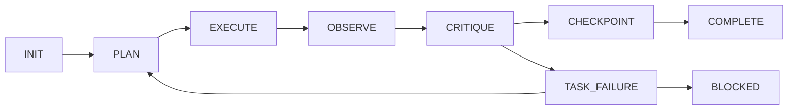

# ♾️ Darkzloop

**Reliable. Autonomous. Model-Agnostic.**  
*Stop hand-carrying cargo. Operate the locomotive.*

[](https://pypi.org/project/darkzloop/)
[](https://opensource.org/licenses/MIT)
[](https://www.python.org/downloads/)

## 📖 About

Darkzloop is a terminal-based agent runner that transforms **any Large Language Model** into a disciplined, autonomous software engineer. Instead of building a smarter agent, Darkzloop builds a **more disciplined one**—wrapping model outputs in a rigorous control system that prevents hallucinations, drift, and infinite loops.

**Core Architecture:**
- 🔄 **7-State FSM** — Enforced transitions through Plan → Execute → Observe → Critique → Checkpoint
- 🧠 **Context Grounding** — Agent receives Mermaid diagrams of its own control flow every iteration  
- ⚡ **Circuit Breakers** — Hard stop after 3 consecutive failures; no spiral of bad fixes
- 🔍 **Auto-Detection** — Scans for Rust/Python/Node/Go and runs appropriate quality gates
- 🔐 **BYOA (Bring Your Own Auth)** — Uses your existing CLI tools; no API keys required

Darkzloop is a terminal-based agent runner that turns **any LLM** into a rigorous software engineer. Built on the **Ralph Wiggum Loop** methodology, it uses a **Finite State Machine**, **Mermaid context diagrams**, and **Circuit Breakers** to prevent hallucinations and infinite loops.

**🔥 The Killer Feature: Bring Your Own Auth (BYOA)**  
Darkzloop doesn't need your API keys. It pipes context directly to the tools you're already logged into:

`Claude CLI` • `GitHub Copilot` • `Ollama` • `llm CLI` • `Aider`

---

## ⚡ Quick Start

### 1. Install
```bash
pip install darkzloop
```

### 2. Run
Navigate to your project and describe the task. Darkzloop auto-detects your stack.

```bash
darkzloop "Fix the retry logic in the webhook handler"
```

**That's it.** Darkzloop will:
- � **Darkz Loop** through Plan → Execute → Observe → Critique → Checkpoint
- 🔍 Auto-detect your project type (Rust/Python/Node/Go)
- 🛡️ Create a safety backup branch
- ⚡ Show animated spinner while working

```
🟡 [EXECUTING] iter=1 fails=0
⠴ 🔄 Darkz Looping...
```

### Optional: Verify Setup
```bash
darkzloop doctor
# ✓ Backend: claude
# ✓ Project: Python
#   Tier 1: ['ruff check .']
#   Tier 2: ['pytest -x']
```

---

## ⚡ Batch Processing (Parallel Workers)

Process multiple files concurrently with the new `batch` command:

```bash
# Process entire folder with 4 parallel workers
darkzloop batch ./src --workers 4 --task "Fix security vulnerabilities"

⚡ Batch Processing: 51 files with 4 workers
Processing... ━━━━━━━━━━━━━━━━━━━━━━━━━━━━━━━━━━━━━━━━ 100%

Results:
  ✓ Success: 51
  ✗ Failed: 0
```

### Batch Options
| Option | Description |
|--------|-------------|
| `--workers N` | Number of parallel Ralph workers (default: 4) |
| `--task "..."` | Task to apply to each file |
| `--backend X` | Override LLM backend |

---

## 🛡️ Why Darkzloop?

Most AI agents are just *"loops in a while(true) block."* They drift, hallucinate, and overwrite good code. Darkzloop is different:

| Feature | The Problem | The Darkzloop Solution |
|---------|-------------|------------------------|
| **Ralph Loop** | Agent runs aimlessly | **FSM-controlled** Plan→Execute→Observe→Critique→Checkpoint |
| **Circuit Breakers** | Agent tries the same wrong fix 10× | **Task Limits**: Hard stop after 3 failed attempts |
| **Tiered Gates** | Agent breaks the build | **Quality Control**: Tests must pass before loop completes |
| **Stdin Delivery** | Shell escaping mangles prompts | **Direct stdin**: Complex prompts with Mermaid diagrams work perfectly |
| **Git Safety** | Agent overwrites uncommitted work | **Backup Branches**: Auto-creates restore points |

---

## 🧠 Supported Backends

Darkzloop works with **any tool that accepts text via stdin**.

| Backend | Best For | Auto-Detected |
|---------|----------|---------------|
| **Claude CLI** | Complex refactors, high reasoning | ✓ |
| **Ollama** | Privacy, offline, free | ✓ |
| **GitHub Copilot** | Quick fixes with Enterprise license | ✓ |
| **llm CLI** | Universal adapter (50+ providers) | ✓ |

---

## 🛠️ Usage Examples

### Quick Fix
```bash
darkzloop "Login button not responding on mobile"
```

### With Backend Override
```bash
darkzloop "Add rate limiting" --backend ollama
```

### Skip Safety Prompts + Quality Gates (CI/CD)
```bash
darkzloop "Fix lint errors" --unattended --no-gates
```

### Batch Process Directory
```bash
darkzloop batch ./vulnerable-code --workers 8 --task "Fix SQL injection"
```

### Check Environment
```bash
darkzloop doctor
```

**Auto-detected quality gates by stack:**
- **Rust**: `cargo check` → `cargo test`
- **Python**: `ruff check .` → `pytest -x`
- **Node**: `npm run lint` → `npm test`
- **Go**: `go build ./...` → `go test ./...`

---

## 📦 Architecture

Darkzloop implements the **Ralph Wiggum Loop** methodology with industrial-grade hardening:

```
┌─────────────────────────────────────────────────────────────┐
│                    DARKZLOOP CONTROL PLANE                   │
│                                                              │
│  ┌──────────┐    ┌──────────┐    ┌──────────┐               │
│  │   FSM    │───▶│  Mermaid │───▶│  Gates   │               │
│  │  Engine  │    │ Context  │    │ (Tests)  │               │
│  └──────────┘    └──────────┘    └──────────┘               │
│        │              │               │                      │
│        ▼              ▼               ▼                      │
│  ┌─────────────────────────────────────────┐                │
│  │           Stdin Prompt Delivery          │                │
│  │   (Bypasses shell escaping entirely)     │                │
│  └─────────────────────────────────────────┘                │
└────────────────────────┬────────────────────────────────────┘
                         │
                         ▼
              ┌─────────────────────┐
              │   Executor Layer    │
              │  (Model-Agnostic)   │
              └──────────┬──────────┘
                         │
        ┌────────────────┼────────────────┐
        ▼                ▼                ▼
   ┌─────────┐     ┌──────────┐     ┌─────────┐
   │ Claude  │     │  Ollama  │     │   API   │
   │  CLI    │     │ (Local)  │     │ (SDK)   │
   └─────────┘     └──────────┘     └─────────┘
```

### The Ralph Loop FSM

The FSM enforces strict state transitions—no "hallucinated" jumps:



| State | Description | Exit Condition |
|-------|-------------|----------------|
| **PLAN** | Agent receives FSM context + Mermaid diagram | Plan ready |
| **EXECUTE** | Agent works on task (🔄 Darkz Looping...) | Changes made |
| **OBSERVE** | Run quality gates | Pass/Fail |
| **CRITIQUE** | Evaluate results | Success → CHECKPOINT |
| **CHECKPOINT** | Task complete | All done → COMPLETE |
| **TASK_FAILURE** | Max 3 retries, then → BLOCKED | Fix applied → retry |

### Context Reminder (Sent Every Iteration)

Each iteration, the agent receives structured context:

```markdown
# DARKZLOOP AGENT CONTEXT
FSM: EXECUTE | iter=2 | fails=1 | max_fails=3

## FSM State Diagram
graph LR; PLAN-->EXECUTE; EXECUTE-->OBSERVE...

## Current Task
Fix the SQL injection vulnerability

## Instructions
You are inside a Ralph Wiggum loop. Your changes persist between iterations.
```

---

## 📊 Commands

| Command | Description |
|---------|-------------|
| `darkzloop "task"` | Run a fix or feature (main usage) |
| `darkzloop batch path/` | Process files in parallel |
| `darkzloop batch path/ --workers 8` | Control parallelism |
| `darkzloop "task" --backend ollama` | Override LLM backend |
| `darkzloop "task" --unattended` | Skip safety prompts (for CI) |
| `darkzloop "task" --no-gates` | Skip quality gates (for testing) |
| `darkzloop doctor` | Verify environment and configuration |

---

## 🚨 Safety Features

Darkzloop is designed to **never lose your work**:

1. **Git Clean Check**: Warns before running with uncommitted changes
2. **Backup Branches**: Creates `darkzloop-backup-YYYYMMDD-HHMMSS` before execution
3. **Circuit Breakers**: Max 3 consecutive failures before stopping
4. **Attended Mode**: Requires approval at each major step
5. **Stdin Delivery**: Complex prompts with special characters work perfectly

---

## 🎯 Philosophy

> *"The goal is not to build a smarter agent. It's to build a more disciplined one."*

Darkzloop is based on the **Ralph Wiggum Loop** methodology:

1. **Plan**: Receive task + FSM context + Mermaid diagram
2. **Execute**: Let the agent work within strict boundaries
3. **Observe**: Run quality gates (linters, tests)
4. **Critique**: Evaluate results, decide next action
5. **Checkpoint**: Accept changes or retry

The agent is powerful. The **system** keeps it honest.

---

## 🔧 Development

```bash
git clone https://github.com/darkzOGx/darkzloop
cd darkzloop
pip install -e ".[dev]"
pytest
```

### Stress Testing

Generate a nightmare test suite:
```bash
cd vulnerable-api
python generate_nightmare_suite.py
# Creates 50 files with various vulnerabilities

darkzloop batch nightmare_suite --workers 4
# Processes all files in parallel
```

---

## 📄 License

MIT © 2025

---

<p align="center">
  <strong>Stop debugging your debugger. Start shipping.</strong><br>
  <code>pip install darkzloop && darkzloop "your bug here"</code>
</p>
