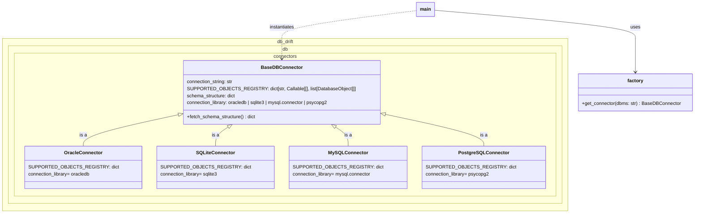

```mermaid
---
config:
    class:
        hideEmptyMembersBox: true
---

classDiagram

namespace db_drift.db.connectors {
    class BaseDBConnector {
        connection_string: str
        SUPPORTED_OBJECTS_REGISTRY: dict[str, Callable[[], list[DatabaseObject]]]
        schema_structure: dict
        connection_library: oracledb | sqlite3 | mysql.connector | psycopg2
        +fetch_schema_structure() dict
    }

    class OracleConnector {
        SUPPORTED_OBJECTS_REGISTRY: dict
        connection_library= oracledb
    }

    class SQLiteConnector {
        SUPPORTED_OBJECTS_REGISTRY: dict
        connection_library= sqlite3
    }

    class MySQLConnector {
        SUPPORTED_OBJECTS_REGISTRY: dict
        connection_library= mysql.connector
    }

    class PostgreSQLConnector {
        SUPPORTED_OBJECTS_REGISTRY: dict
        connection_library= psycopg2
    }
   
}

BaseDBConnector <|-- OracleConnector: is a
BaseDBConnector <|-- SQLiteConnector: is a
BaseDBConnector <|-- MySQLConnector: is a
BaseDBConnector <|-- PostgreSQLConnector: is a


class factory {
    +get_connector(dbms: str) BaseDBConnector
}

class main
main --> factory: uses
main ..> BaseDBConnector: instantiates
```