# Device Fingerprinting Library

[](https://www.python.org/downloads/)
[](https://badge.fury.io/py/device-fingerprinting-pro)
[](LICENSE)
[](tests/)
[](https://pepy.tech/project/device-fingerprinting-pro)

A Python library for hardware-based device fingerprinting with anomaly detection. Generates stable device identifiers from hardware characteristics, provides encrypted storage, and detects anomalous system behavior.

## Table of Contents

- [Overview](#overview)
- [Architecture](#architecture)
  - [Component Diagrams](#component-diagrams)
  - [Design Principles](#design-principles)
- [Features](#features)
- [Installation](#installation)
- [Usage](#usage)
  - [Quick Start Guide](#quick-start-guide)
  - [Basic Fingerprinting](#basic-fingerprinting)
  - [Device Fingerprinting & Dashboard Integration](#device-fingerprinting--dashboard-integration)
  - [Secure Storage](#secure-storage)
  - [Anomaly Detection](#anomaly-detection)
  - [Advanced Usage](#advanced-usage-complete-integration)
- [Technical Details](#technical-details)
  - [Device Fingerprinting](#device-fingerprinting)
  - [Cryptographic Primitives](#cryptographic-primitives)
  - [Secure Storage](#secure-storage-1)
  - [Anomaly Detection](#anomaly-detection-1)
- [Testing](#testing)
- [Dependencies](#dependencies)
- [Troubleshooting](#troubleshooting)
- [FAQ](#frequently-asked-questions)
- [Use Cases](#use-cases)
- [Contributing](#contributing)
- [License](#license)
- [Changelog](#changelog)
- [Support](#support)

## Overview

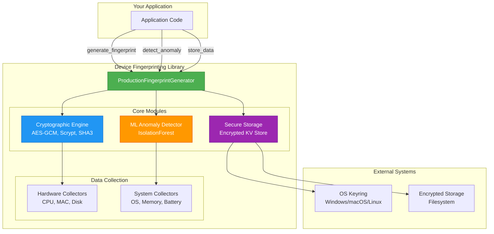
```mermaid
graph TB
    subgraph "Your Application"
        APP[Application Code]
    end
    
    subgraph "Device Fingerprinting Library"
        API[ProductionFingerprintGenerator]
        
        subgraph "Core Modules"
            CRYPTO[Cryptographic Engine<br/>AES-GCM, Scrypt, SHA3]
            ML[ML Anomaly Detector<br/>IsolationForest]
            STORAGE[Secure Storage<br/>Encrypted KV Store]
        end
        
        subgraph "Data Collection"
            HW[Hardware Collectors<br/>CPU, MAC, Disk]
            SYS[System Collectors<br/>OS, Memory, Battery]
        end
    end
    
    subgraph "External Systems"
        KEYRING[OS Keyring<br/>Windows/macOS/Linux]
        DISK[Encrypted Storage<br/>Filesystem]
    end
    
    APP -->|generate_fingerprint| API
    APP -->|detect_anomaly| API
    APP -->|store_data| API
    
    API --> CRYPTO
    API --> ML
    API --> STORAGE
    
    CRYPTO --> HW
    ML --> SYS
    STORAGE --> KEYRING
    STORAGE --> DISK
    
    style API fill:#4CAF50,stroke:#2E7D32,color:#fff
    style CRYPTO fill:#2196F3,stroke:#1565C0,color:#fff
    style ML fill:#FF9800,stroke:#E65100,color:#fff
    style STORAGE fill:#9C27B0,stroke:#6A1B9A,color:#fff
```

## Architecture

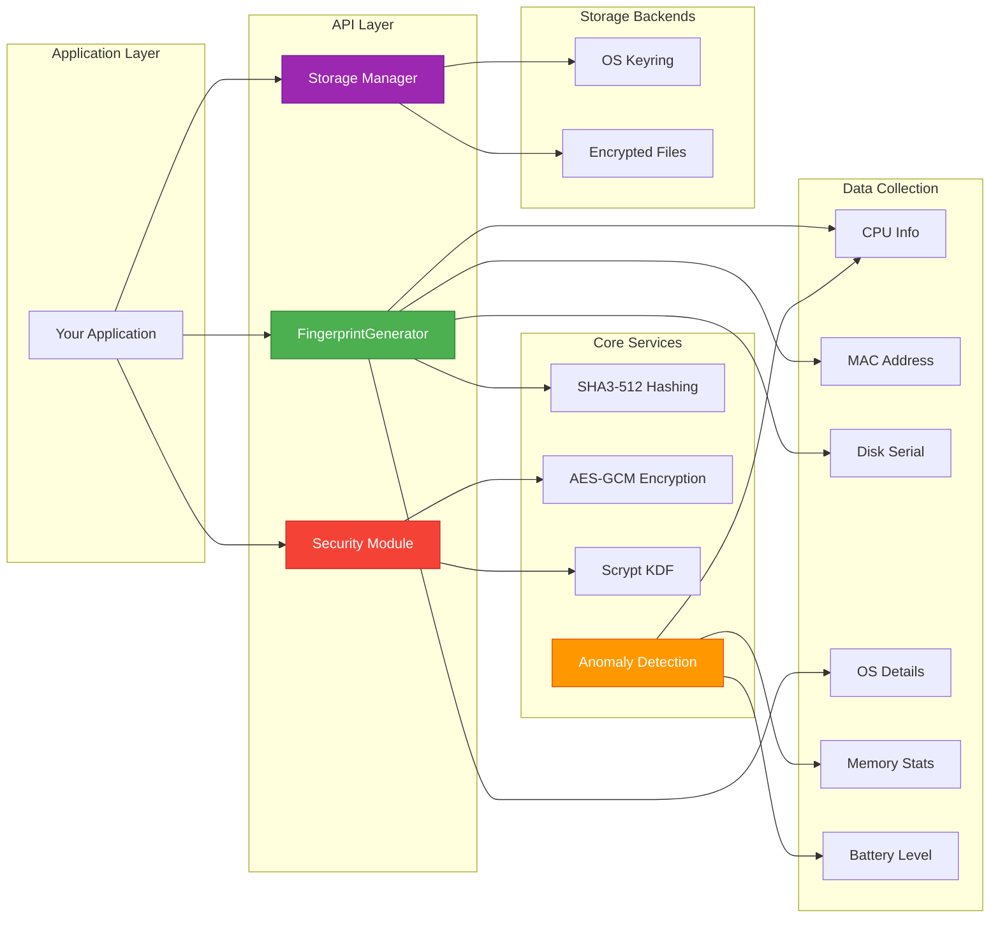
```mermaid
graph LR
    subgraph "Application Layer"
        USER[Your Application]
    end
    
    subgraph "API Layer"
        FP[FingerprintGenerator]
        SEC[Security Module]
        STORE[Storage Manager]
    end
    
    subgraph "Core Services"
        direction TB
        HASH[SHA3-512 Hashing]
        ENC[AES-GCM Encryption]
        KDF[Scrypt KDF]
        ML[Anomaly Detection]
    end
    
    subgraph "Data Collection"
        direction TB
        CPU[CPU Info]
        MAC[MAC Address]
        DISK[Disk Serial]
        OS[OS Details]
        MEM[Memory Stats]
        BAT[Battery Level]
    end
    
    subgraph "Storage Backends"
        direction TB
        KR[OS Keyring]
        FS[Encrypted Files]
    end
    
    USER --> FP
    USER --> SEC
    USER --> STORE
    
    FP --> HASH
    FP --> CPU
    FP --> MAC
    FP --> DISK
    FP --> OS
    
    SEC --> ENC
    SEC --> KDF
    
    STORE --> KR
    STORE --> FS
    
    ML --> MEM
    ML --> BAT
    ML --> CPU
    
    style FP fill:#4CAF50,stroke:#2E7D32,color:#fff
    style SEC fill:#F44336,stroke:#C62828,color:#fff
    style STORE fill:#9C27B0,stroke:#6A1B9A,color:#fff
    style ML fill:#FF9800,stroke:#E65100,color:#fff
```

### Component Diagrams

#### Device Fingerprinting Flow

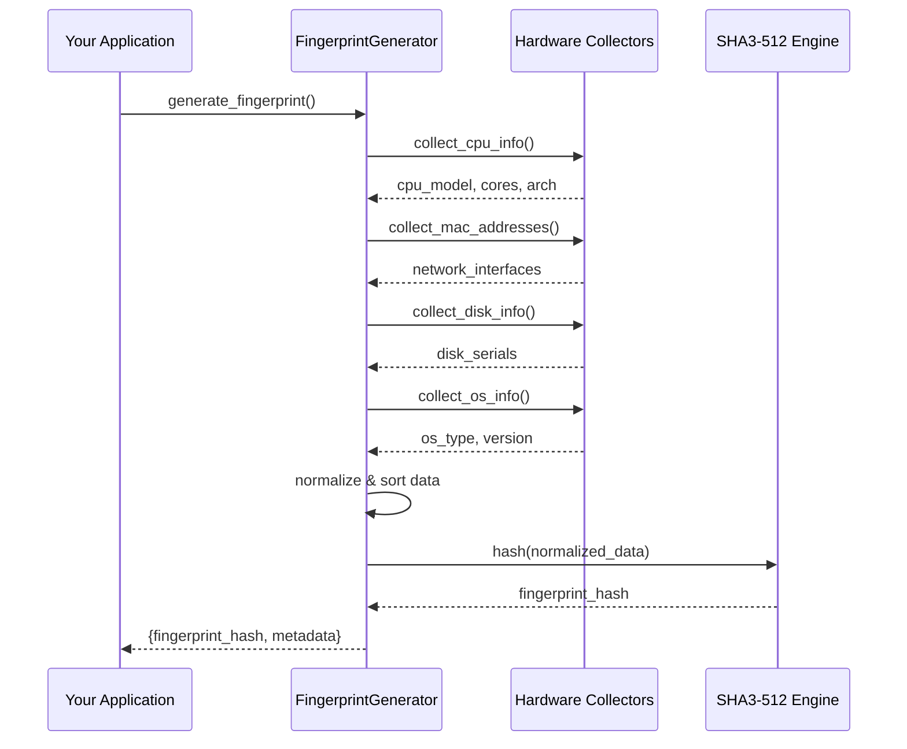
```mermaid
sequenceDiagram
    participant App as Your Application
    participant Gen as FingerprintGenerator
    participant Col as Hardware Collectors
    participant Hash as SHA3-512 Engine
    
    App->>Gen: generate_fingerprint()
    Gen->>Col: collect_cpu_info()
    Col-->>Gen: cpu_model, cores, arch
    Gen->>Col: collect_mac_addresses()
    Col-->>Gen: network_interfaces
    Gen->>Col: collect_disk_info()
    Col-->>Gen: disk_serials
    Gen->>Col: collect_os_info()
    Col-->>Gen: os_type, version
    
    Gen->>Gen: normalize & sort data
    Gen->>Hash: hash(normalized_data)
    Hash-->>Gen: fingerprint_hash
    Gen-->>App: {fingerprint_hash, metadata}
```

#### Encryption & Secure Storage Flow

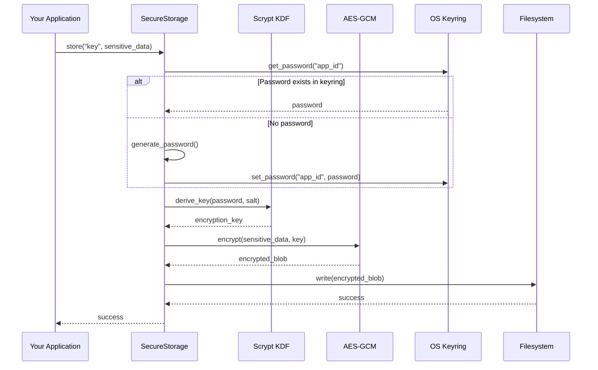
```mermaid
sequenceDiagram
    participant App as Your Application
    participant Store as SecureStorage
    participant KDF as Scrypt KDF
    participant Enc as AES-GCM
    participant Key as OS Keyring
    participant FS as Filesystem
    
    App->>Store: store("key", sensitive_data)
    Store->>Key: get_password("app_id")
    
    alt Password exists in keyring
        Key-->>Store: password
    else No password
        Store->>Store: generate_password()
        Store->>Key: set_password("app_id", password)
    end
    
    Store->>KDF: derive_key(password, salt)
    KDF-->>Store: encryption_key
    
    Store->>Enc: encrypt(sensitive_data, key)
    Enc-->>Store: encrypted_blob
    
    Store->>FS: write(encrypted_blob)
    FS-->>Store: success
    Store-->>App: success
```

#### ML Anomaly Detection Flow

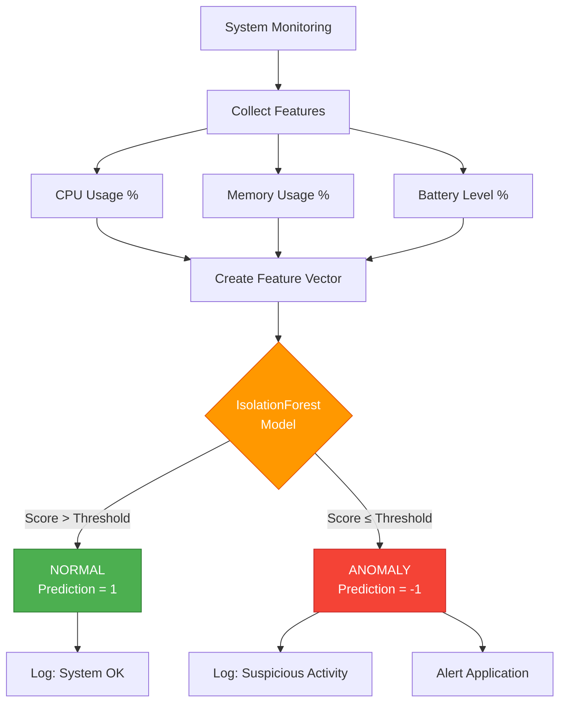
```mermaid
flowchart TD
    START[System Monitoring] --> COLLECT[Collect Features]
    
    COLLECT --> CPU[CPU Usage %]
    COLLECT --> MEM[Memory Usage %]
    COLLECT --> BAT[Battery Level %]
    
    CPU --> VECTOR[Create Feature Vector]
    MEM --> VECTOR
    BAT --> VECTOR
    
    VECTOR --> MODEL{IsolationForest<br/>Model}
    
    MODEL -->|Score > Threshold| NORMAL[NORMAL<br/>Prediction = 1]
    MODEL -->|Score ≤ Threshold| ANOMALY[ANOMALY<br/>Prediction = -1]
    
    NORMAL --> LOG_N[Log: System OK]
    ANOMALY --> LOG_A[Log: Suspicious Activity]
    
    ANOMALY --> ALERT[Alert Application]
    
    style MODEL fill:#FF9800,stroke:#E65100,color:#fff
    style NORMAL fill:#4CAF50,stroke:#2E7D32,color:#fff
    style ANOMALY fill:#F44336,stroke:#C62828,color:#fff
```

#### Complete System Data Flow

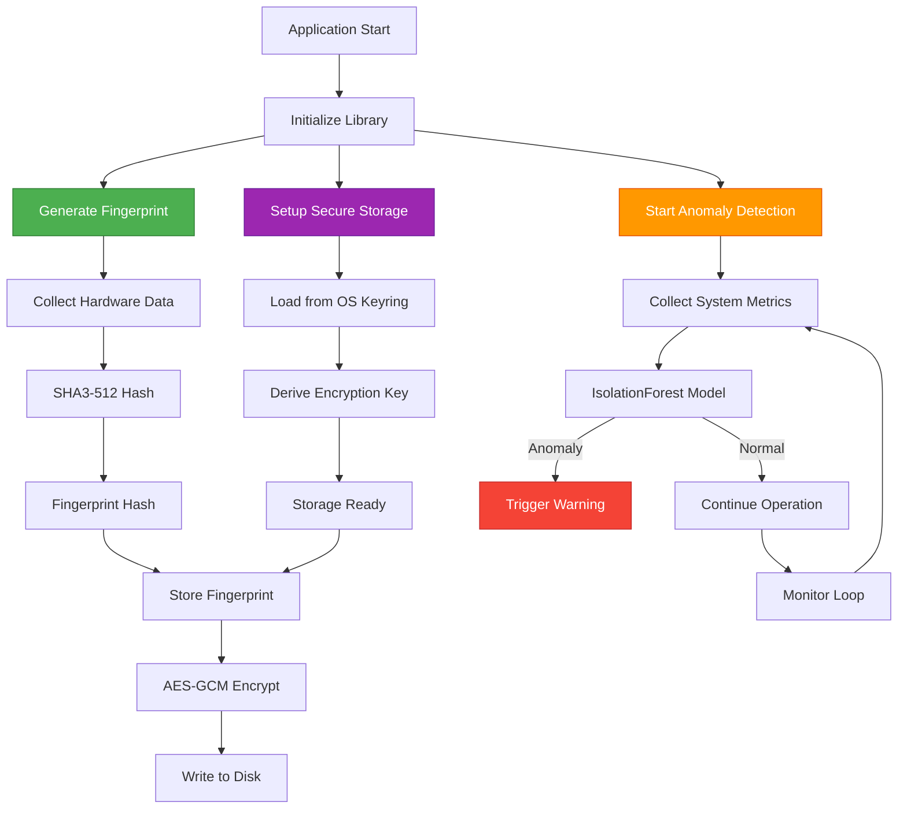
```mermaid
graph TD
    START[Application Start] --> INIT[Initialize Library]
    
    INIT --> FP[Generate Fingerprint]
    FP --> HWCOL[Collect Hardware Data]
    HWCOL --> HASH[SHA3-512 Hash]
    HASH --> FPOUT[Fingerprint Hash]
    
    INIT --> ML[Start Anomaly Detection]
    ML --> MLCOL[Collect System Metrics]
    MLCOL --> MODEL[IsolationForest Model]
    MODEL -->|Normal| CONT[Continue Operation]
    MODEL -->|Anomaly| WARN[Trigger Warning]
    
    INIT --> SEC[Setup Secure Storage]
    SEC --> KEYRING[Load from OS Keyring]
    KEYRING --> KDF[Derive Encryption Key]
    KDF --> READY[Storage Ready]
    
    FPOUT --> STORE[Store Fingerprint]
    READY --> STORE
    STORE --> ENC[AES-GCM Encrypt]
    ENC --> DISK[Write to Disk]
    
    CONT --> LOOP[Monitor Loop]
    LOOP --> MLCOL
    
    style FP fill:#4CAF50,stroke:#2E7D32,color:#fff
    style ML fill:#FF9800,stroke:#E65100,color:#fff
    style SEC fill:#9C27B0,stroke:#6A1B9A,color:#fff
    style WARN fill:#F44336,stroke:#C62828,color:#fff
```

### Design Principles

**Layered Architecture**
- Application layer provides high-level API
- Service layer implements core logic (fingerprinting, encryption, ML)
- Data layer handles hardware and system data collection

**Component Structure**
- `ProductionFingerprintGenerator`: Primary fingerprinting interface
- `Crypto`: Cryptographic operations (SHA3-512, AES-GCM, Scrypt)
- `MLFeatures`: Anomaly detection using IsolationForest
- `SecureStorage`: Encrypted storage with OS keyring support
- Hardware collectors: Platform-specific data gathering

**Security Implementation**
- AES-GCM encryption for data at rest
- Scrypt KDF for password-based key derivation
- OS keyring integration (Windows, macOS, Linux)
- No plaintext storage of sensitive data

**Extensibility**
- Pluggable backend system
- Optional feature modules (PQC, cloud storage)
- Interface-based design for custom implementations

## Features

**Device Fingerprinting**
- Generates consistent identifiers from hardware attributes (CPU, MAC address, disk serial)
- Uses SHA3-512 hashing for cryptographic fingerprint generation

**Security**
- AES-GCM authenticated encryption for data at rest
- Scrypt key derivation function (memory-hard, brute-force resistant)
- OS keyring integration (Windows Credential Manager, macOS Keychain, Linux Secret Service)

**Anomaly Detection**
- IsolationForest-based detection of abnormal system behavior
- Monitors CPU usage, memory, battery, and network metrics
- Baseline training for environment-specific detection

**Storage**
- Encrypted key-value store
- Cross-platform keyring support
- Secure credential management

**Testing**
- 57 test cases with pytest
- Automated CI/CD pipeline (GitHub Actions)
- Multi-platform support (Windows, macOS, Linux)

**Optional Features**
- Post-quantum cryptography (pqcdualusb with Dilithium/Kyber)
- Cloud storage backends (AWS S3, Azure Blob Storage)
- TPM/Secure Hardware with dual-mode enforcement (software/tpm_strict)

## Installation

### Install from PyPI (Recommended)

```bash
# Install the latest version from PyPI
pip install device-fingerprinting-pro
```

### Install from Source

```bash
# Clone the repository
git clone https://github.com/Johnsonajibi/DeviceFingerprinting.git
cd DeviceFingerprinting/device_fingerprinting

# Install core dependencies
pip install -r requirements.txt

# Install the package in editable mode
pip install -e .
```

### Installation with Optional Features

```bash
# Install with Post-Quantum Cryptography support
pip install device-fingerprinting-pro[pqc]

# Install with Cloud storage support
pip install device-fingerprinting-pro[cloud]

# Install with development tools (testing, linting, type checking)
pip install device-fingerprinting-pro[dev]

# Install all optional features
pip install device-fingerprinting-pro[pqc,cloud,dev]
```

To verify the installation, run the test suite:

```bash
python -m pytest
```

## Usage

### Quick Start Guide

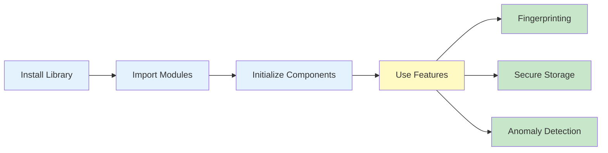
```mermaid
graph LR
    A[Install Library] --> B[Import Modules]
    B --> C[Initialize Components]
    C --> D[Use Features]
    
    D --> E[Fingerprinting]
    D --> F[Secure Storage]
    D --> G[Anomaly Detection]
    
    style A fill:#E3F2FD
    style B fill:#E3F2FD
    style C fill:#E3F2FD
    style D fill:#FFF9C4
    style E fill:#C8E6C9
    style F fill:#C8E6C9
    style G fill:#C8E6C9
```

### Basic Fingerprinting

```python
from device_fingerprinting.production_fingerprint import ProductionFingerprintGenerator

# Initialize generator
generator = ProductionFingerprintGenerator()

# Generate device fingerprint
fingerprint_data = generator.generate_fingerprint()

# Access fingerprint components
print(f"Fingerprint: {fingerprint_data['fingerprint_hash']}")
print(f"Platform: {fingerprint_data['system_info']['platform']}")
print(f"CPU: {fingerprint_data['hardware_info']['cpu_model']}")
print(f"Timestamp: {fingerprint_data['metadata']['timestamp']}")
```

**Output structure:**
```python
{
    'fingerprint_hash': 'sha3_512_hash_value',
    'hardware_info': {
        'cpu_model': 'Intel Core i7-9750H',
        'cpu_cores': 6,
        'mac_addresses': ['00:1B:44:11:3A:B7'],
        'disk_serials': ['S3Z3NY0M123456']
    },
    'system_info': {
        'platform': 'Windows-10-...',
        'python_version': '3.11.0'
    },
    'metadata': {
        'timestamp': '2025-10-18T10:30:45',
        'version': '1.0.0'
    }
}
```

### Device Fingerprinting & Dashboard Integration

This section demonstrates the complete workflow from generating a device fingerprint to visualizing analytics in a dashboard, ideal for monitoring device behavior and security insights.

#### Step 1: Install the Library

```bash
# Install from PyPI
pip install device-fingerprinting-pro

# Or install with additional dependencies for backend integration
pip install device-fingerprinting-pro requests
```

#### Step 2: Generate a Device Fingerprint

```python
from device_fingerprinting.production_fingerprint import ProductionFingerprintGenerator
import json
from datetime import datetime

# Initialize the fingerprint generator
generator = ProductionFingerprintGenerator()

# Generate device fingerprint
fingerprint_data = generator.generate_fingerprint()

# Access key information
device_id = fingerprint_data['fingerprint_hash']
platform = fingerprint_data['system_info']['platform']
cpu_model = fingerprint_data['hardware_info']['cpu_model']
timestamp = fingerprint_data['metadata']['timestamp']

print(f"Device ID: {device_id}")
print(f"Platform: {platform}")
print(f"CPU: {cpu_model}")
```

#### Step 3: Send Fingerprint Data to Backend for Dashboard Analytics

The following example shows how to send fingerprint data to a backend API that integrates with ClickHouse for real-time dashboard analytics:

```python
import requests
from device_fingerprinting.production_fingerprint import ProductionFingerprintGenerator
from device_fingerprinting.ml_features import FeatureExtractor, AnomalyDetector

# Initialize components
generator = ProductionFingerprintGenerator()
feature_extractor = FeatureExtractor()

# Generate fingerprint
fingerprint_data = generator.generate_fingerprint()

# Collect system metrics for anomaly detection
current_features = feature_extractor.collect_features()

# Prepare data payload for ClickHouse backend
payload = {
    'device_id': fingerprint_data['fingerprint_hash'],
    'timestamp': fingerprint_data['metadata']['timestamp'],
    'platform': fingerprint_data['system_info']['platform'],
    'cpu_model': fingerprint_data['hardware_info']['cpu_model'],
    'cpu_cores': fingerprint_data['hardware_info']['cpu_cores'],
    'mac_addresses': fingerprint_data['hardware_info'].get('mac_addresses', []),
    'disk_serials': fingerprint_data['hardware_info'].get('disk_serials', []),
    'cpu_usage_percent': current_features[0][0] if len(current_features) > 0 and len(current_features[0]) > 0 else 0,
    'memory_usage_percent': current_features[0][1] if len(current_features) > 0 and len(current_features[0]) > 1 else 0,
    'battery_level_percent': current_features[0][2] if len(current_features) > 0 and len(current_features[0]) > 2 else 0,
    'anomaly_score': 0.0  # This will be populated by your anomaly detector
}

# Send data to backend API
# NOTE: Replace with your actual backend endpoint and authentication token
backend_url = "https://your-api-endpoint.com/api/fingerprints"  # Replace with your API endpoint
headers = {
    'Content-Type': 'application/json',
    'Authorization': 'Bearer YOUR_API_TOKEN'  # Replace with your actual API token
}

try:
    response = requests.post(backend_url, json=payload, headers=headers)
    if response.status_code == 200:
        print("✓ Fingerprint data sent successfully to backend")
        print(f"Response: {response.json()}")
    else:
        print(f"⚠ Failed to send data. Status code: {response.status_code}")
except requests.exceptions.RequestException as e:
    print(f"✗ Error sending data: {e}")
```

**Note:** For ClickHouse integration, your backend should insert data into a ClickHouse table with a schema similar to:

```sql
CREATE TABLE device_fingerprints (
    device_id String,
    timestamp DateTime,
    platform String,
    cpu_model String,
    cpu_cores UInt32,
    mac_addresses Array(String),
    disk_serials Array(String),
    cpu_usage_percent Float32,
    memory_usage_percent Float32,
    battery_level_percent Float32,
    anomaly_score Float32
) ENGINE = MergeTree()
ORDER BY (timestamp, device_id);
```

#### Step 4: Set Up Your Dashboard

After sending fingerprint data to your backend, create a visualization dashboard to monitor your device analytics.

**Dashboard Setup Options:**

1. **ClickHouse + ClickPy**: Use ClickPy (ClickHouse's visualization tool) to create interactive dashboards
   - Example URL format: `https://your-clickpy-instance.com/dashboard/your-dashboard-id`
   
2. **Other Visualization Tools**: Integrate with Grafana, Tableau, or custom dashboards that can query your ClickHouse backend

**Your dashboard can provide real-time insights into your device fingerprinting data, powered by ClickHouse for high-performance analytics.**

#### Step 5: Dashboard Visualizations

Your dashboard can provide comprehensive analytics and visualizations including:

- **Device Fingerprints**: Unique device identifiers tracked over time
- **Platform Distribution**: Breakdown of devices by operating system (Windows, macOS, Linux)
- **Hardware Statistics**: CPU models, core counts, and hardware configurations
- **Temporal Analysis**: Device activity patterns and registration timestamps
- **Anomaly Scores**: Real-time monitoring of suspicious device behavior
- **Geographic Distribution**: Device locations (if IP geolocation is enabled)
- **Trend Analysis**: Historical trends in device registrations and activity
- **Security Alerts**: Anomaly detection triggers and security events

#### Step 6: Dashboard Screenshot

To enhance this documentation, you can add a screenshot of your dashboard here.

**Example markdown syntax (use this when ready):**


**Recommended screenshot location:** `./docs/dashboard-screenshot.png`

**Steps to add a screenshot:**
1. Create a `docs/` directory in your repository root (if it doesn't exist)
2. Take a screenshot of your dashboard showing key metrics
3. Save it as `dashboard-screenshot.png` in the `docs/` directory
4. Copy the markdown image reference shown above to your desired location in this section

**Pro tip:** Update the screenshot periodically to reflect the latest dashboard features and metrics.

### Secure Storage

```python
from device_fingerprinting.secure_storage import SecureStorage

# Initialize storage (password stored in OS keyring)
storage = SecureStorage(
    storage_path="./secure_data",
    service_name="my_app",
    username="device_id_001"
)

# Store encrypted data
storage.set_item("api_key", "secret_api_key_value")
storage.set_item("user_token", "user_session_token")

# Retrieve encrypted data
api_key = storage.get_item("api_key")
print(f"Retrieved: {api_key}")

# Delete data
storage.delete_item("api_key")

# List all keys
keys = storage.list_keys()
print(f"Stored keys: {keys}")
```

**Security flow:**
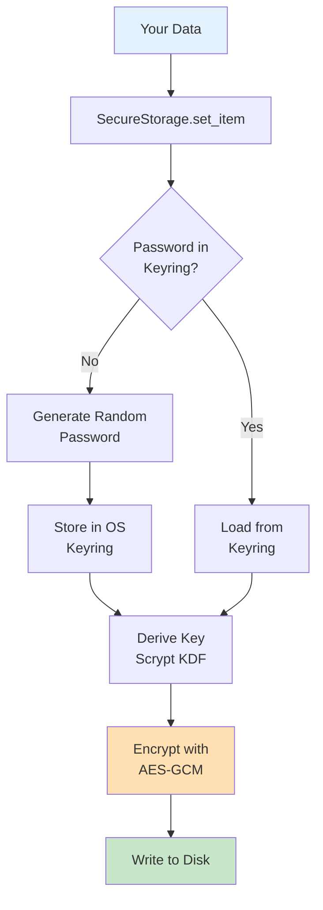
```mermaid
graph TD
    A[Your Data] --> B[SecureStorage.set_item]
    B --> C{Password in<br/>Keyring?}
    C -->|No| D[Generate Random<br/>Password]
    D --> E[Store in OS<br/>Keyring]
    E --> F[Derive Key<br/>Scrypt KDF]
    C -->|Yes| G[Load from<br/>Keyring]
    G --> F
    F --> H[Encrypt with<br/>AES-GCM]
    H --> I[Write to Disk]
    
    style A fill:#E3F2FD
    style I fill:#C8E6C9
    style H fill:#FFE0B2
```

### Anomaly Detection

```python
from device_fingerprinting.ml_features import FeatureExtractor, AnomalyDetector
import numpy as np

# Step 1: Train detector on baseline data (normal system behavior)
# In production, collect data over time during normal operation
normal_data = np.random.rand(100, 3)  # Example: [cpu%, mem%, battery%]
detector = AnomalyDetector()
detector.train(normal_data)

# Step 2: Monitor current system state
feature_extractor = FeatureExtractor()
current_features = feature_extractor.collect_features()

# Step 3: Detect anomalies
prediction, score = detector.predict(current_features)

if prediction == 1:
    print(f"✓ Normal behavior (score: {score:.2f})")
else:
    print(f"⚠ Anomaly detected (score: {score:.2f})")
    # Take action: log event, alert admin, restrict access, etc.

# Step 4: Save trained model for reuse
detector.save_model("baseline_model.pkl")

# Later: Load pre-trained model
detector.load_model("baseline_model.pkl")
```

**Anomaly detection workflow:**
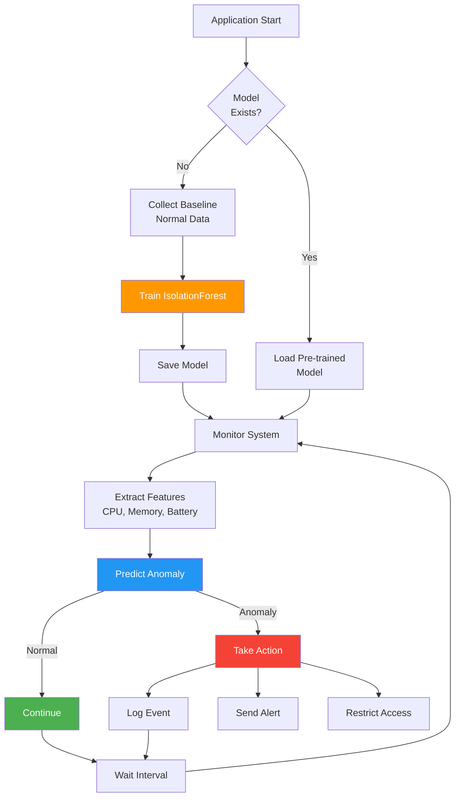
```mermaid
graph TD
    START[Application Start] --> TRAIN{Model<br/>Exists?}
    TRAIN -->|No| COLLECT[Collect Baseline<br/>Normal Data]
    COLLECT --> TRAINML[Train IsolationForest]
    TRAINML --> SAVE[Save Model]
    SAVE --> MONITOR
    
    TRAIN -->|Yes| LOAD[Load Pre-trained<br/>Model]
    LOAD --> MONITOR[Monitor System]
    
    MONITOR --> EXTRACT[Extract Features<br/>CPU, Memory, Battery]
    EXTRACT --> PREDICT[Predict Anomaly]
    
    PREDICT -->|Normal| CONT[Continue]
    PREDICT -->|Anomaly| ACTION[Take Action]
    
    ACTION --> LOG[Log Event]
    ACTION --> ALERT[Send Alert]
    ACTION --> RESTRICT[Restrict Access]
    
    CONT --> WAIT[Wait Interval]
    WAIT --> MONITOR
    
    LOG --> WAIT
    
    style TRAINML fill:#FF9800,color:#fff
    style PREDICT fill:#2196F3,color:#fff
    style ACTION fill:#F44336,color:#fff
    style CONT fill:#4CAF50,color:#fff
```

### TPM/Secure Hardware Fingerprinting

The library supports hardware-backed device identification using TPM (Trusted Platform Module) or platform-specific secure hardware through a dual-mode architecture.

#### Mode A: Software Fingerprint (Default)

Standard fingerprinting with optional TPM enhancement. Works on all platforms with graceful fallback.

```python
import device_fingerprinting as df

# Check TPM availability
status = df.get_tpm_status()

# Enable TPM if available (optional)
df.enable_tpm_fingerprinting(enabled=True)

# Generate fingerprint - uses TPM if available, falls back otherwise
fingerprint = df.generate_fingerprint(method="stable", mode="software")
```

#### Mode B: TPM-Strict Enforcement

Requires TPM hardware attestation. Fails explicitly if TPM is unavailable. Use this mode when hardware-backed security is mandatory.

```python
import device_fingerprinting as df

# Generate fingerprint with mandatory TPM requirement
try:
    fingerprint = df.generate_fingerprint(method="stable", mode="tpm_strict")
    # Success: TPM hardware attestation included
except RuntimeError as e:
    # TPM not available - deployment should be restricted
    print(f"TPM required but not available: {e}")
```

#### Adaptive Deployment

Choose mode based on deployment requirements:

```python
import device_fingerprinting as df

# Check TPM availability
status = df.get_tpm_status()

# Use strict mode if TPM available, fallback to software mode
if status['tpm_hardware_available']:
    mode = "tpm_strict"  # Enforce hardware attestation
else:
    mode = "software"    # Graceful fallback

fingerprint = df.generate_fingerprint(method="stable", mode=mode)
```

**Platform Support:**
- Windows: TPM 2.0 via PowerShell/WMI
- macOS: Secure Enclave (T2 chip or Apple Silicon)
- Linux: TPM 2.0 via `/sys/class/tpm`

**Configuration:**

```python
# Query TPM status
status = df.get_tpm_status()
# Returns: tpm_hardware_available, platform, version, manufacturer, error

# Check if TPM is enabled
if df.is_tpm_enabled():
    print("TPM fingerprinting active")

# Enable/disable TPM
df.enable_tpm_fingerprinting(enabled=True)
```

**Mode Comparison:**

| Feature | software | tpm_strict |
|---------|----------|------------|
| TPM Required | No | Yes |
| Fallback | Yes | No |
| Portability | All platforms | TPM-enabled only |
| Use Case | General purpose | High security |

See `examples/dual_mode_enforcement.py` for detailed examples.

### Advanced Usage: Complete Integration

```python
from device_fingerprinting.production_fingerprint import ProductionFingerprintGenerator
from device_fingerprinting.ml_features import FeatureExtractor, AnomalyDetector
from device_fingerprinting.secure_storage import SecureStorage
import numpy as np

class DeviceSecurityManager:
    def __init__(self):
        self.generator = ProductionFingerprintGenerator()
        self.storage = SecureStorage("./data", "my_app", "device_001")
        self.detector = AnomalyDetector()
        
    def initialize(self):
        """Initialize security system"""
        # Generate and store device fingerprint
        fp = self.generator.generate_fingerprint()
        self.storage.set_item("fingerprint", fp['fingerprint_hash'])
        
        # Train anomaly detector
        baseline_data = self._collect_baseline_data()
        self.detector.train(baseline_data)
        self.detector.save_model("./detector.pkl")
        
        return fp['fingerprint_hash']
    
    def verify_device(self):
        """Verify device hasn't changed"""
        current_fp = self.generator.generate_fingerprint()
        stored_fp = self.storage.get_item("fingerprint")
        
        return current_fp['fingerprint_hash'] == stored_fp
    
    def check_security(self):
        """Check for anomalous behavior"""
        extractor = FeatureExtractor()
        features = extractor.collect_features()
        prediction, score = self.detector.predict(features)
        
        return {
            'is_normal': prediction == 1,
            'score': score,
            'timestamp': extractor.get_timestamp()
        }
    
    def _collect_baseline_data(self, samples=100):
        """Collect baseline system behavior"""
        extractor = FeatureExtractor()
        data = []
        for _ in range(samples):
            data.append(extractor.collect_features())
        return np.array(data)

# Usage
manager = DeviceSecurityManager()
device_id = manager.initialize()

# Periodic checks
if manager.verify_device():
    security_status = manager.check_security()
    if not security_status['is_normal']:
        print(f"Security alert: Anomaly detected (score: {security_status['score']})")
```

## Technical Details

### Device Fingerprinting

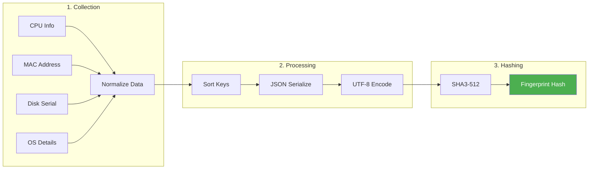
```mermaid
graph LR
    subgraph "1. Collection"
        A[CPU Info] --> N
        B[MAC Address] --> N
        C[Disk Serial] --> N
        D[OS Details] --> N
        N[Normalize Data]
    end
    
    subgraph "2. Processing"
        N --> S[Sort Keys]
        S --> J[JSON Serialize]
        J --> E[UTF-8 Encode]
    end
    
    subgraph "3. Hashing"
        E --> H[SHA3-512]
        H --> F[Fingerprint Hash]
    end
    
    style F fill:#4CAF50,color:#fff
```

Generates stable device identifiers from hardware characteristics:

**Data Collection:**
1. Hardware: CPU model, cores, architecture, MAC addresses, disk serials
2. System: OS type, version, Python version, hostname
3. Normalization: Consistent ordering for deterministic output
4. Hashing: SHA3-512 for cryptographic fingerprint generation

**Properties:**
- Stable across reboots
- Unique per device
- Deterministic (no randomness)
- Collision-resistant SHA3-512

**Hardware Sources:**

| Component | Information Collected | Platform Support |
|-----------|----------------------|------------------|
| CPU | Model, cores, architecture | Windows, macOS, Linux |
| Network | MAC addresses | Windows, macOS, Linux |
| Storage | Disk serial numbers | Windows, macOS, Linux |
| System | OS type, version, hostname | Windows, macOS, Linux |
| Python | Interpreter version | All platforms |
| TPM (optional) | Hardware attestation ID | Windows, macOS, Linux |

### TPM Dual-Mode Architecture

The library implements a dual-mode architecture for TPM-based fingerprinting:

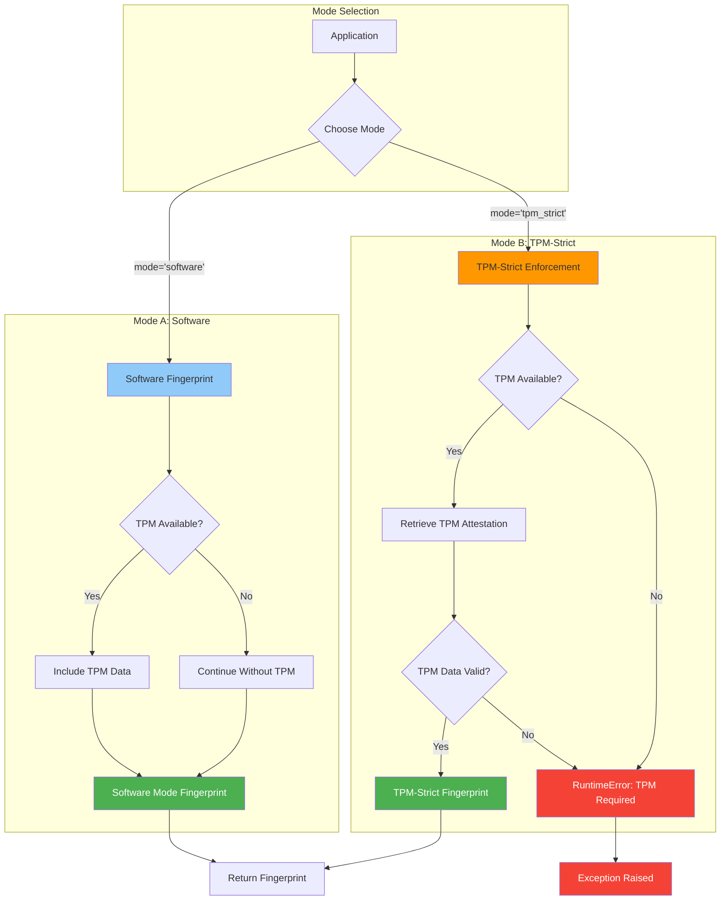
```mermaid
graph TB
    subgraph "Mode Selection"
        APP[Application] --> MODE{Choose Mode}
    end
    
    subgraph "Mode A: Software"
        MODE -->|mode='software'| SW[Software Fingerprint]
        SW --> TPMCHECK{TPM Available?}
        TPMCHECK -->|Yes| SWTPM[Include TPM Data]
        TPMCHECK -->|No| SWONLY[Continue Without TPM]
        SWTPM --> SWFP[Software Mode Fingerprint]
        SWONLY --> SWFP
    end
    
    subgraph "Mode B: TPM-Strict"
        MODE -->|mode='tpm_strict'| STRICT[TPM-Strict Enforcement]
        STRICT --> ENFORCE{TPM Available?}
        ENFORCE -->|Yes| TPMDATA[Retrieve TPM Attestation]
        ENFORCE -->|No| FAIL[RuntimeError: TPM Required]
        TPMDATA --> VERIFY{TPM Data Valid?}
        VERIFY -->|Yes| STRICTFP[TPM-Strict Fingerprint]
        VERIFY -->|No| FAIL
    end
    
    SWFP --> RETURN[Return Fingerprint]
    STRICTFP --> RETURN
    FAIL --> ERROR[Exception Raised]
    
    style SW fill:#90CAF9
    style STRICT fill:#FF9800
    style SWFP fill:#4CAF50,color:#fff
    style STRICTFP fill:#4CAF50,color:#fff
    style FAIL fill:#F44336,color:#fff
    style ERROR fill:#F44336,color:#fff
```

**Mode A: Software (Default)**
- TPM usage is optional
- Graceful fallback when TPM unavailable
- Portable across all systems
- API: `generate_fingerprint(mode="software")`

**Mode B: TPM-Strict**
- TPM hardware required
- No fallback behavior
- Explicit failure when TPM unavailable
- API: `generate_fingerprint(mode="tpm_strict")`

**Enforcement Logic:**

```
if mode == "tpm_strict":
    1. Verify TPM module available
    2. Verify TPM hardware present
    3. Retrieve TPM hardware ID
    4. Fail if any check fails
    5. Include TPM attestation in fingerprint
    
if mode == "software":
    1. Check for TPM availability
    2. Use TPM if available
    3. Continue without TPM if unavailable
    4. Include TPM data if present
```

**Platform-Specific Implementation:**

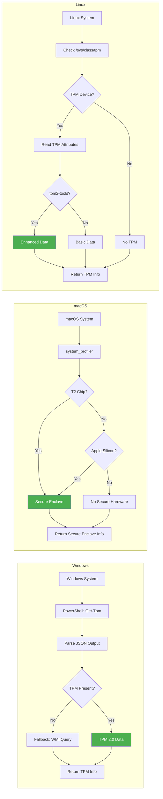
```mermaid
graph LR
    subgraph "Windows"
        W[Windows System] --> WPS[PowerShell: Get-Tpm]
        WPS --> WJSON[Parse JSON Output]
        WJSON --> WOK{TPM Present?}
        WOK -->|Yes| WTPM[TPM 2.0 Data]
        WOK -->|No| WWMI[Fallback: WMI Query]
        WWMI --> WDATA[Return TPM Info]
        WTPM --> WDATA
    end
    
    subgraph "macOS"
        M[macOS System] --> MSP[system_profiler]
        MSP --> MT2{T2 Chip?}
        MT2 -->|Yes| MSEC[Secure Enclave]
        MT2 -->|No| MAS{Apple Silicon?}
        MAS -->|Yes| MSEC
        MAS -->|No| MNONE[No Secure Hardware]
        MSEC --> MDATA[Return Secure Enclave Info]
        MNONE --> MDATA
    end
    
    subgraph "Linux"
        L[Linux System] --> LSYS[Check /sys/class/tpm]
        LSYS --> LTPM{TPM Device?}
        LTPM -->|Yes| LREAD[Read TPM Attributes]
        LTPM -->|No| LNONE[No TPM]
        LREAD --> LTOOL{tpm2-tools?}
        LTOOL -->|Yes| LENH[Enhanced Data]
        LTOOL -->|No| LBASIC[Basic Data]
        LENH --> LDATA[Return TPM Info]
        LBASIC --> LDATA
        LNONE --> LDATA
    end
    
    style WTPM fill:#4CAF50,color:#fff
    style MSEC fill:#4CAF50,color:#fff
    style LENH fill:#4CAF50,color:#fff
```

| Platform | TPM Type | Detection Method | Fallback |
|----------|----------|-----------------|----------|
| Windows | TPM 2.0 | PowerShell Get-Tpm, WMI | Yes (software mode) |
| macOS | Secure Enclave | system_profiler | Yes (software mode) |
| Linux | TPM 2.0 | /sys/class/tpm | Yes (software mode) |

**Use Cases:**
- Enterprise deployments: Use `tpm_strict` mode to ensure hardware attestation
- Consumer software: Use `software` mode for maximum compatibility
- Hybrid: Query TPM status and choose mode dynamically

### Cryptographic Primitives

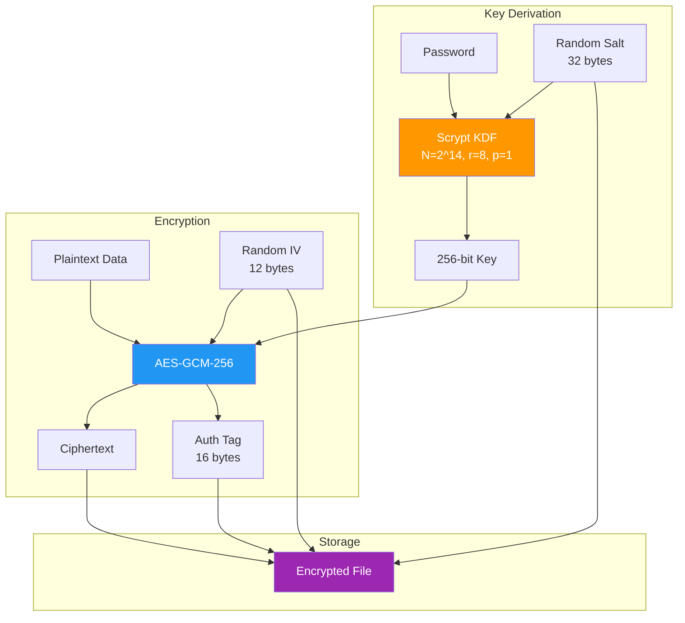
```mermaid
graph TB
    subgraph "Key Derivation"
        PWD[Password] --> SCRYPT[Scrypt KDF<br/>N=2^14, r=8, p=1]
        SALT[Random Salt<br/>32 bytes] --> SCRYPT
        SCRYPT --> KEY[256-bit Key]
    end
    
    subgraph "Encryption"
        DATA[Plaintext Data] --> AES[AES-GCM-256]
        KEY --> AES
        IV[Random IV<br/>12 bytes] --> AES
        AES --> CIPHER[Ciphertext]
        AES --> TAG[Auth Tag<br/>16 bytes]
    end
    
    subgraph "Storage"
        CIPHER --> STORE[Encrypted File]
        TAG --> STORE
        SALT --> STORE
        IV --> STORE
    end
    
    style SCRYPT fill:#FF9800,color:#fff
    style AES fill:#2196F3,color:#fff
    style STORE fill:#9C27B0,color:#fff
```

**Scrypt KDF**
- Memory-hard key derivation
- Password-based encryption key generation
- Resistant to GPU/ASIC attacks
- Configurable cost parameters (N=2^14, r=8, p=1)
- Output: 256-bit encryption key

**AES-GCM**
- Authenticated encryption (confidentiality + integrity)
- 256-bit keys with 128-bit authentication tags
- Automatic tamper detection
- NIST-approved algorithm (FIPS 197)
- Galois/Counter Mode for parallel processing

**SHA3-512**
- Keccak-based hashing (FIPS 202)
- 512-bit output (64 bytes)
- Collision-resistant (2^256 operations)
- Pre-image resistant

**Security Parameters:**

| Algorithm | Key Size | Block/Output Size | Security Level |
|-----------|----------|-------------------|----------------|
| AES-GCM | 256 bits | 128 bits | 256-bit |
| Scrypt | 256 bits | Configurable | Memory-hard |
| SHA3-512 | N/A | 512 bits | 256-bit |

### Secure Storage

**Implementation:**
- OS keyring integration (Windows, macOS, Linux)
- AES-GCM encryption at rest
- Key-value interface: `set_item()`, `get_item()`, `delete_item()`
- Automatic encryption/decryption
- Per-instance salt and IV

**Security Model:**
- No plaintext storage
- Memory-hard password protection
- Authenticated encryption (tamper-proof)
- Secure failure modes

### Anomaly Detection

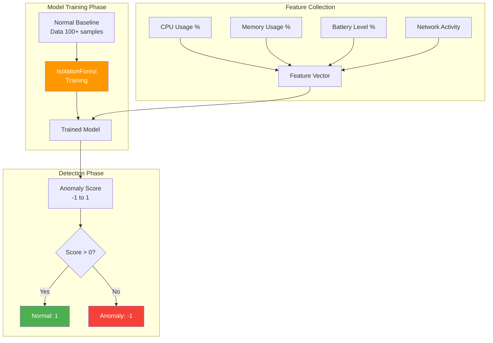
```mermaid
graph TD
    subgraph "Feature Collection"
        CPU[CPU Usage %] --> VEC[Feature Vector]
        MEM[Memory Usage %] --> VEC
        BAT[Battery Level %] --> VEC
        NET[Network Activity] --> VEC
    end
    
    subgraph "Model Training Phase"
        NORMAL[Normal Baseline<br/>Data 100+ samples] --> TRAIN[IsolationForest<br/>Training]
        TRAIN --> MODEL[Trained Model]
    end
    
    subgraph "Detection Phase"
        VEC --> MODEL
        MODEL --> SCORE[Anomaly Score<br/>-1 to 1]
        SCORE --> THRESHOLD{Score > 0?}
        THRESHOLD -->|Yes| N[Normal: 1]
        THRESHOLD -->|No| A[Anomaly: -1]
    end
    
    style TRAIN fill:#FF9800,color:#fff
    style N fill:#4CAF50,color:#fff
    style A fill:#F44336,color:#fff
```

**Detection Targets:**
- Debugging or reverse engineering attempts
- Virtual machine or emulator environments
- Abnormal system load or stress
- System tampering indicators

**Implementation:**
- Real-time system metrics (CPU, memory, battery, network)
- IsolationForest algorithm (scikit-learn)
- Baseline training on known-good behavior
- Deviation scoring from learned patterns
- Binary classification: -1 (anomaly) or 1 (normal)

**Applications:**
- Debugger detection during fingerprint generation
- VM/container environment identification
- System integrity monitoring
- Adaptive security policies

**Feature Extraction:**

| Feature | Range | Description |
|---------|-------|-------------|
| CPU Usage | 0-100% | Current CPU utilization |
| Memory Usage | 0-100% | RAM consumption percentage |
| Battery Level | 0-100% | Battery charge (if available) |
| Network Activity | 0-N Mbps | Network throughput |

**Model Parameters:**
- Algorithm: IsolationForest
- Contamination: 0.1 (10% expected anomalies)
- n_estimators: 100 trees
- max_samples: auto

## Testing

### Test Coverage Overview

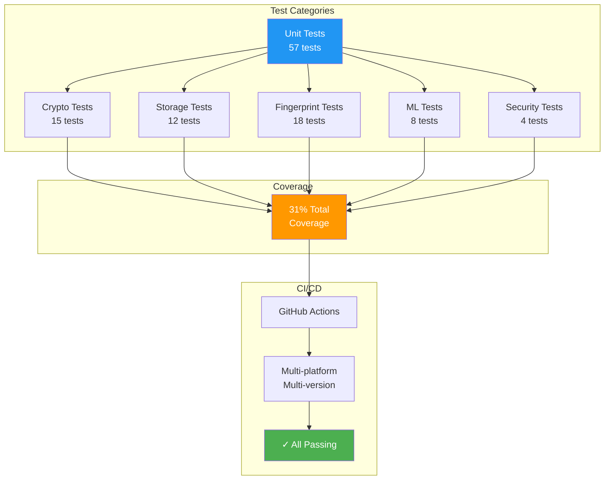
```mermaid
graph TD
    subgraph "Test Categories"
        UT[Unit Tests<br/>57 tests] --> CRYPTO[Crypto Tests<br/>15 tests]
        UT --> STORAGE[Storage Tests<br/>12 tests]
        UT --> FP[Fingerprint Tests<br/>18 tests]
        UT --> ML[ML Tests<br/>8 tests]
        UT --> SEC[Security Tests<br/>4 tests]
    end
    
    subgraph "Coverage"
        CRYPTO --> COV[31% Total<br/>Coverage]
        STORAGE --> COV
        FP --> COV
        ML --> COV
        SEC --> COV
    end
    
    subgraph "CI/CD"
        COV --> CI[GitHub Actions]
        CI --> MULTI[Multi-platform<br/>Multi-version]
        MULTI --> PASS[✓ All Passing]
    end
    
    style UT fill:#2196F3,color:#fff
    style COV fill:#FF9800,color:#fff
    style PASS fill:#4CAF50,color:#fff
```

### Test Suite
- **Total Tests:** 57 covering core functionality
- **Code Coverage:** 31%
- **Validated Modules:**
  - `crypto.py` - Encryption and hashing functions
  - `security.py` - Security utilities
  - `secure_storage.py` - Encrypted storage operations
  - `ml_features.py` - Anomaly detection
  - `production_fingerprint.py` - Fingerprint generation

### CI/CD Pipeline

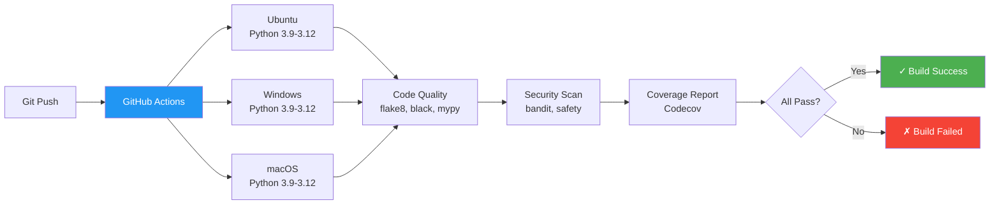
```mermaid
graph LR
    PUSH[Git Push] --> CI[GitHub Actions]
    
    CI --> TEST1[Ubuntu<br/>Python 3.9-3.12]
    CI --> TEST2[Windows<br/>Python 3.9-3.12]
    CI --> TEST3[macOS<br/>Python 3.9-3.12]
    
    TEST1 --> LINT[Code Quality<br/>flake8, black, mypy]
    TEST2 --> LINT
    TEST3 --> LINT
    
    LINT --> SEC[Security Scan<br/>bandit, safety]
    SEC --> COV[Coverage Report<br/>Codecov]
    
    COV --> RESULT{All Pass?}
    RESULT -->|Yes| SUCCESS[✓ Build Success]
    RESULT -->|No| FAIL[✗ Build Failed]
    
    style CI fill:#2196F3,color:#fff
    style SUCCESS fill:#4CAF50,color:#fff
    style FAIL fill:#F44336,color:#fff
```

**GitHub Actions automated testing:**
- **Platforms:** Ubuntu 22.04, Windows Server 2022, macOS 13
- **Python versions:** 3.9, 3.10, 3.11, 3.12 (12 combinations)
- **Code quality:** flake8 (linting), black (formatting), mypy (type checking)
- **Security scanning:** bandit (code security), safety (dependency vulnerabilities)
- **Coverage reporting:** pytest-cov with Codecov integration

### Running Tests Locally

```bash
# Install dependencies
pip install -r requirements.txt

# Run full test suite
python -m pytest

# Run with verbose output
python -m pytest -v

# Run specific test file
python -m pytest tests/test_device_fingerprinting.py

# Run with coverage report
python -m pytest --cov=device_fingerprinting --cov-report=term-missing

# Run with HTML coverage report
python -m pytest --cov=device_fingerprinting --cov-report=html
# Open htmlcov/index.html in browser
```

### Test Examples

**Unit Test Structure:**
```python
# tests/test_device_fingerprinting.py
import pytest
from device_fingerprinting.production_fingerprint import ProductionFingerprintGenerator

def test_fingerprint_generation():
    """Test basic fingerprint generation"""
    generator = ProductionFingerprintGenerator()
    result = generator.generate_fingerprint()
    
    assert 'fingerprint_hash' in result
    assert len(result['fingerprint_hash']) == 128  # SHA3-512 hex length
    assert 'hardware_info' in result
    assert 'system_info' in result

def test_fingerprint_stability():
    """Test fingerprint stability across calls"""
    generator = ProductionFingerprintGenerator()
    fp1 = generator.generate_fingerprint()
    fp2 = generator.generate_fingerprint()
    
    assert fp1['fingerprint_hash'] == fp2['fingerprint_hash']
```

## Dependencies

### Dependency Graph

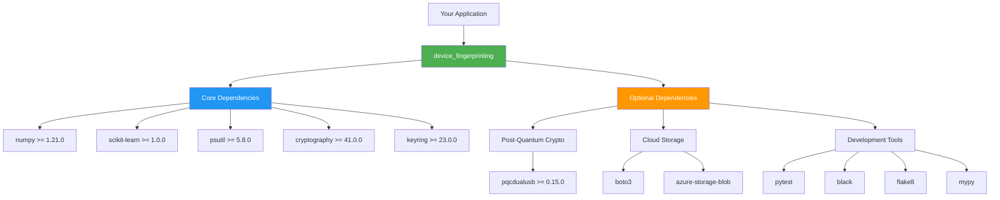
```mermaid
graph TD
    APP[Your Application] --> LIB[device_fingerprinting]
    
    LIB --> CORE[Core Dependencies]
    LIB --> OPT[Optional Dependencies]
    
    CORE --> NP[numpy >= 1.21.0]
    CORE --> SK[scikit-learn >= 1.0.0]
    CORE --> PS[psutil >= 5.8.0]
    CORE --> CR[cryptography >= 41.0.0]
    CORE --> KR[keyring >= 23.0.0]
    
    OPT --> PQC[Post-Quantum Crypto]
    OPT --> CLOUD[Cloud Storage]
    OPT --> DEV[Development Tools]
    
    PQC --> PQD[pqcdualusb >= 0.15.0]
    
    CLOUD --> B3[boto3]
    CLOUD --> AZ[azure-storage-blob]
    
    DEV --> PT[pytest]
    DEV --> BL[black]
    DEV --> FL[flake8]
    DEV --> MY[mypy]
    
    style LIB fill:#4CAF50,color:#fff
    style CORE fill:#2196F3,color:#fff
    style OPT fill:#FF9800,color:#fff
```

### Core Requirements

| Package | Version | Purpose | License |
|---------|---------|---------|---------|
| numpy | >= 1.21.0 | Numerical operations for ML | BSD |
| scikit-learn | >= 1.0.0 | IsolationForest anomaly detection | BSD |
| psutil | >= 5.8.0 | System metrics (CPU, memory, battery) | BSD |
| cryptography | >= 41.0.0 | AES-GCM encryption, Scrypt KDF | Apache 2.0 |
| keyring | >= 23.0.0 | OS keyring integration | MIT |

### Optional Packages

**Post-Quantum Cryptography:**
```bash
pip install -e .[pqc]
```
- `pqcdualusb >= 0.15.0` - Dilithium3/Kyber1024 quantum-resistant algorithms with power analysis protection

**Cloud Storage:**
```bash
pip install -e .[cloud]
```
- `boto3` - AWS S3 integration
- `azure-storage-blob` - Azure Blob Storage integration

**Development Tools:**
```bash
pip install -e .[dev]
```
- `pytest` - Testing framework
- `pytest-cov` - Coverage reporting
- `black` - Code formatting
- `flake8` - Linting
- `mypy` - Type checking
- `bandit` - Security scanning

**Install Everything:**
```bash
pip install -e .[pqc,cloud,dev]
```

## Troubleshooting

### Common Issues

**ImportError: No module named 'sklearn'**
```bash
# Solution: Install scikit-learn
pip install scikit-learn>=1.0.0
```

**KeyringError: No backend found**
```bash
# Linux: Install gnome-keyring or kwallet
sudo apt-get install gnome-keyring

# Or use a fallback backend
export PYTHON_KEYRING_BACKEND=keyring.backends.null.Keyring
```

**PermissionError: Cannot access disk serial**
```bash
# Windows: Run as administrator
# Linux: Add user to disk group
sudo usermod -a -G disk $USER

# Or disable disk serial collection in code
```

**Fingerprint changes after reboot**
- Ensure network interfaces are stable (disable/enable order)
- Check if MAC addresses are randomized (privacy features)
- Verify disk serials are accessible

**Anomaly detector always reports anomalies**
- Collect more baseline training data (100+ samples)
- Train during normal system operation
- Adjust contamination parameter (default 0.1)

### Performance Optimization

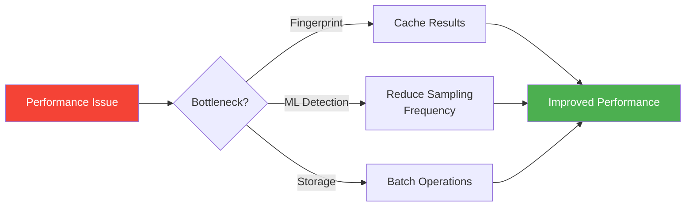
```mermaid
graph LR
    A[Performance Issue] --> B{Bottleneck?}
    B -->|Fingerprint| C[Cache Results]
    B -->|ML Detection| D[Reduce Sampling<br/>Frequency]
    B -->|Storage| E[Batch Operations]
    
    C --> F[Improved Performance]
    D --> F
    E --> F
    
    style A fill:#F44336,color:#fff
    style F fill:#4CAF50,color:#fff
```

**Fingerprint Generation:**
- Cache fingerprint after first generation (rarely changes)
- Skip hardware components that cause delays
- Use async collection for network operations

**Anomaly Detection:**
- Reduce feature collection frequency (e.g., every 60 seconds)
- Use smaller training datasets (minimum 50 samples)
- Load pre-trained models instead of training on startup

**Storage Operations:**
- Batch write operations when possible
- Use in-memory cache for frequently accessed items
- Compress large data before encryption

## Frequently Asked Questions

**Q: How stable is the fingerprint across system changes?**

A: The fingerprint is designed to be stable across:
- System reboots
- Software updates
- Minor configuration changes

It will change if:
- Hardware is replaced (CPU, network card, disk)
- Network interfaces are added/removed
- OS is reinstalled

**Q: Is the library thread-safe?**

A: Core fingerprinting operations are thread-safe. For storage and ML detection, create separate instances per thread or use appropriate locking mechanisms.

**Q: Can I use this for user authentication?**

A: Device fingerprinting should be used as an additional factor, not the sole authentication method. Combine with passwords, tokens, or biometrics for robust security.

**Q: How do I handle fingerprint collisions?**

A: SHA3-512 provides 256-bit security with 2^256 collision resistance. Collisions are computationally infeasible in practice. For additional uniqueness, include a UUID or timestamp in your application logic.

**Q: What data is collected and stored?**

A: Collected data includes:
- CPU model and core count
- MAC addresses
- Disk serial numbers
- OS type and version
- System metrics (CPU%, memory%, battery%)

All data is stored encrypted locally. No data is transmitted externally by the library.

**Q: How does anomaly detection work?**

A: The IsolationForest algorithm learns normal system behavior patterns from baseline data. It detects anomalies by identifying data points that are easily isolated (differ significantly from the baseline). Anomalies may indicate debugging, VM environments, or system stress.

**Q: Can I integrate this with existing authentication systems?**

A: Yes. Common integration patterns:

```python
# Example: Integration with JWT authentication
from device_fingerprinting.production_fingerprint import ProductionFingerprintGenerator
import jwt

def create_token(user_id):
    generator = ProductionFingerprintGenerator()
    device_fp = generator.generate_fingerprint()
    
    payload = {
        'user_id': user_id,
        'device_id': device_fp['fingerprint_hash'],
        'exp': datetime.utcnow() + timedelta(hours=24)
    }
    
    return jwt.encode(payload, SECRET_KEY, algorithm='HS256')

def verify_token_and_device(token):
    payload = jwt.decode(token, SECRET_KEY, algorithms=['HS256'])
    
    generator = ProductionFingerprintGenerator()
    current_device = generator.generate_fingerprint()
    
    if payload['device_id'] != current_device['fingerprint_hash']:
        raise SecurityError("Device mismatch")
    
    return payload['user_id']
```

## Use Cases

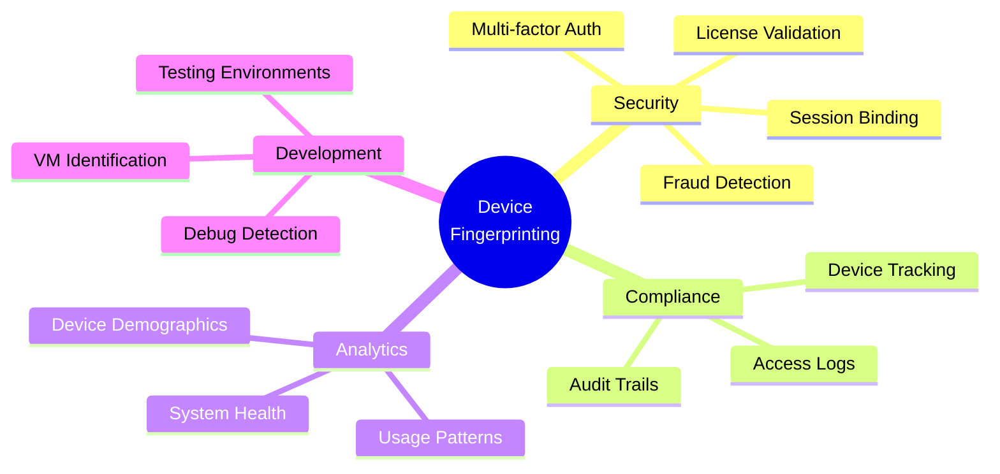
```mermaid
mindmap
  root((Device<br/>Fingerprinting))
    Security
      Multi-factor Auth
      Session Binding
      Fraud Detection
      License Validation
    Compliance
      Device Tracking
      Access Logs
      Audit Trails
    Analytics
      Device Demographics
      Usage Patterns
      System Health
    Development
      Testing Environments
      Debug Detection
      VM Identification
```

### Authentication & Authorization
- Bind user sessions to specific devices
- Detect account takeover attempts
- Implement device-based 2FA

### Fraud Prevention
- Detect credential sharing across devices
- Identify suspicious device changes
- Monitor for automated bot activity

### Licensing & DRM
- Enforce per-device licensing
- Prevent license key sharing
- Track software installations

### Security Monitoring
- Detect debugger attachment
- Identify virtual machine environments
- Monitor for system tampering

### Compliance & Auditing
- Maintain device access logs
- Track which devices accessed sensitive data
- Generate compliance reports

## Contributing

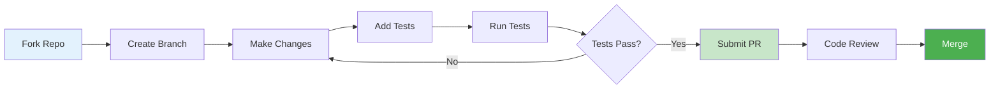
```mermaid
graph LR
    A[Fork Repo] --> B[Create Branch]
    B --> C[Make Changes]
    C --> D[Add Tests]
    D --> E[Run Tests]
    E --> F{Tests Pass?}
    F -->|Yes| G[Submit PR]
    F -->|No| C
    G --> H[Code Review]
    H --> I[Merge]
    
    style A fill:#E3F2FD
    style G fill:#C8E6C9
    style I fill:#4CAF50,color:#fff
```

Contributions are welcome. To contribute:

1. **Fork the repository**
2. **Create a feature branch:** `git checkout -b feature/your-feature`
3. **Make changes and add tests**
4. **Verify tests pass:** `python -m pytest`
5. **Check code quality:**
   ```bash
   black .
   flake8 .
   mypy device_fingerprinting/
   ```
6. **Submit a pull request**

### Development Setup

```bash
# Clone your fork
git clone https://github.com/YOUR_USERNAME/DeviceFingerprinting.git
cd DeviceFingerprinting/device_fingerprinting

# Install with development dependencies
pip install -e .[dev]

# Run tests
python -m pytest -v

# Check coverage
python -m pytest --cov=device_fingerprinting --cov-report=html
```

### Coding Standards
- Follow PEP 8 style guidelines
- Add type hints to all functions
- Write docstrings for public APIs
- Include unit tests for new features
- Maintain or improve code coverage

## License

This project is licensed under the MIT License - see the [LICENSE](LICENSE) file for details.

## Changelog

### Version 1.0.0 (2025-10-18)
- Initial release
- Core fingerprinting functionality
- AES-GCM encryption and secure storage
- ML-based anomaly detection
- Cross-platform support (Windows, macOS, Linux)
- Comprehensive test suite (57 tests)
- CI/CD pipeline with GitHub Actions

## Support

For issues, questions, or contributions:
- **GitHub Issues:** https://github.com/Johnsonajibi/DeviceFingerprinting/issues
- **Documentation:** This README
- **Email:** Contact repository owner

## Acknowledgments

Built with:
- [cryptography](https://cryptography.io/) - Modern cryptography library
- [scikit-learn](https://scikit-learn.org/) - Machine learning toolkit
- [psutil](https://github.com/giampaolo/psutil) - System monitoring
- [keyring](https://github.com/jaraco/keyring) - Secure credential storage
