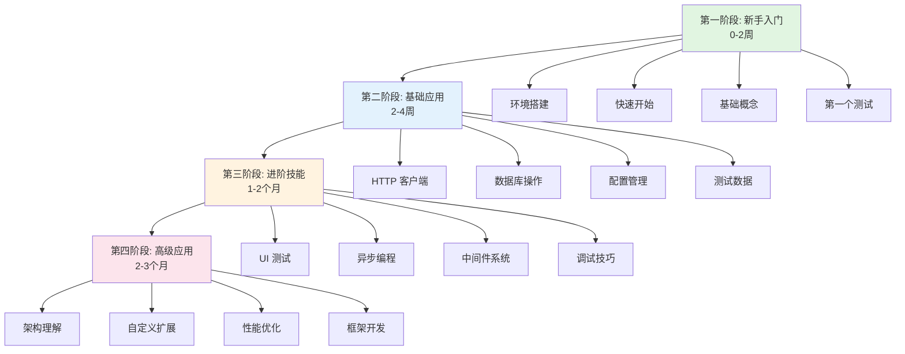

# DF Test Framework 学习路径

> **目标读者**: 从零开始学习框架的新手
> **更新日期**: 2026-01-19
> **框架版本**: v4.0.0

本文档提供系统化的学习路径，帮助您从新手逐步成长为框架专家。

---

## 📋 目录

- [学习路径概览](#学习路径概览)
- [第一阶段：新手入门（0-2周）](#第一阶段新手入门0-2周)
- [第二阶段：基础应用（2-4周）](#第二阶段基础应用2-4周)
- [第三阶段：进阶技能（1-2个月）](#第三阶段进阶技能1-2个月)
- [第四阶段：高级应用（2-3个月）](#第四阶段高级应用2-3个月)
- [学习建议](#学习建议)
- [常见问题](#常见问题)

---

## 🗺️ 学习路径概览

### 四个学习阶段



### 学习时间估算

| 阶段 | 时间 | 学习目标 | 能力水平 |
|------|------|---------|---------|
| **第一阶段** | 0-2周 | 能够运行基础测试 | 新手 |
| **第二阶段** | 2-4周 | 能够编写完整的API测试 | 初级 |
| **第三阶段** | 1-2个月 | 能够处理复杂测试场景 | 中级 |
| **第四阶段** | 2-3个月 | 能够扩展和优化框架 | 高级 |

> **注意**: 学习时间因人而异，以上仅供参考。建议根据自己的节奏调整。

---

## 🌱 第一阶段：新手入门（0-2周）

### 学习目标

- ✅ 完成环境搭建和框架安装
- ✅ 理解框架的基本概念和架构
- ✅ 能够运行第一个测试
- ✅ 掌握基础的 HTTP 请求测试

### 详细学习路径


### 1.1 环境准备（第1天）

**学习内容**：
- Python 3.12+ 安装
- uv 包管理器安装
- IDE 配置（VSCode/PyCharm）

**实践任务**：
```bash
# 检查 Python 版本
python --version  # 应该 >= 3.12

# 安装 uv
pip install uv

# 验证安装
uv --version
```

**参考文档**：
- [README.md - 安装](../README.md#安装)
- [FAQ.md - Q1-Q5](FAQ.md#安装和环境问题)

---

### 1.2 快速开始（第2-3天）

**学习内容**：
- 使用脚手架创建项目
- 理解项目结构
- 运行第一个测试

**实践任务**：
```bash
# 创建 API 测试项目
df-test init my-first-project

# 进入项目目录
cd my-first-project

# 配置环境变量
cp .env.example .env

# 运行示例测试
pytest -v
```

**预期结果**：
- ✅ 项目创建成功
- ✅ 示例测试通过
- ✅ 理解项目目录结构

**参考文档**：
- [快速开始指南](user-guide/QUICK_START.md)
- [快速参考](user-guide/QUICK_REFERENCE.md)

---

### 1.3 基础概念理解（第4-5天）

**核心概念**：

1. **Bootstrap 启动系统**
   ```python
   from df_test_framework import Bootstrap, FrameworkSettings

   runtime = Bootstrap().with_settings(FrameworkSettings).build().run()
   http_client = runtime.http_client()
   ```

2. **HTTP 客户端**
   ```python
   # 发送 GET 请求
   response = http_client.get("/api/users")
   assert response.status_code == 200
   ```

3. **配置管理**
   ```yaml
   # config/base.yaml
   http:
     base_url: "https://api.example.com"
     timeout: 30
   ```

**学习重点**：
- 理解 Bootstrap 的作用
- 理解 HTTP 客户端的基本用法
- 理解配置文件的作用

**参考文档**：
- [用户手册 - 核心概念](user-guide/USER_MANUAL.md#核心概念)
- [配置指南](guides/config_guide.md)

---

### 1.4 编写第一个测试（第6-7天）

**实践任务**：编写一个完整的 API 测试

```python
# tests/test_users.py
import pytest

def test_get_user(http_client):
    """测试获取用户信息"""
    # 发送请求
    response = http_client.get("/users/1")

    # 验证响应
    assert response.status_code == 200
    assert response.json()["id"] == 1
    assert "name" in response.json()

def test_create_user(http_client):
    """测试创建用户"""
    # 准备数据
    user_data = {
        "name": "Test User",
        "email": "test@example.com"
    }

    # 发送请求
    response = http_client.post("/users", json=user_data)

    # 验证响应
    assert response.status_code == 201
    assert response.json()["name"] == user_data["name"]
```

**运行测试**：
```bash
pytest tests/test_users.py -v
```

**学习重点**：
- 理解 pytest 的基本用法
- 理解 fixture 的概念
- 理解断言的写法

**参考文档**：
- [HTTP 客户端指南](guides/http_client_guide.md)
- [示例代码](user-guide/examples.md)

---

### 第一阶段检查清单

完成以下任务，即可进入第二阶段：

- [ ] 成功安装框架和依赖
- [ ] 使用脚手架创建项目
- [ ] 运行示例测试成功
- [ ] 理解 Bootstrap、HTTP 客户端、配置管理的基本概念
- [ ] 独立编写并运行一个简单的 API 测试
- [ ] 能够查看测试报告

**下一步**：进入[第二阶段：基础应用](#第二阶段基础应用2-4周)

---

## 📚 第二阶段：基础应用（2-4周）

### 学习目标

- ✅ 掌握 HTTP 客户端的高级用法
- ✅ 能够进行数据库操作和验证
- ✅ 理解并使用配置管理系统
- ✅ 掌握测试数据的构建和清理

### 详细学习路径


### 2.1 HTTP 客户端深入（第1-2周）

**学习内容**：
- 请求方法（GET/POST/PUT/DELETE/PATCH）
- 请求参数（query/json/data/files）
- 认证和授权
- 中间件使用

**实践任务1：完整的 CRUD 测试**

```python
# tests/test_user_crud.py
import pytest

class TestUserCRUD:
    """用户 CRUD 测试"""

    def test_create_user(self, http_client):
        """创建用户"""
        response = http_client.post("/users", json={
            "name": "Test User",
            "email": "test@example.com"
        })
        assert response.status_code == 201
        return response.json()["id"]

    def test_get_user(self, http_client):
        """获取用户"""
        user_id = 1
        response = http_client.get(f"/users/{user_id}")
        assert response.status_code == 200
        assert response.json()["id"] == user_id

    def test_update_user(self, http_client):
        """更新用户"""
        user_id = 1
        response = http_client.put(f"/users/{user_id}", json={
            "name": "Updated Name"
        })
        assert response.status_code == 200
        assert response.json()["name"] == "Updated Name"

    def test_delete_user(self, http_client):
        """删除用户"""
        user_id = 1
        response = http_client.delete(f"/users/{user_id}")
        assert response.status_code == 204
```

**实践任务2：认证测试**

```python
def test_with_auth(http_client):
    """带认证的请求"""
    # 方式1: 使用 token 参数
    response = http_client.get("/api/protected", token="your-token")
    assert response.status_code == 200

    # 方式2: 使用 headers
    response = http_client.get(
        "/api/protected",
        headers={"Authorization": "Bearer your-token"}
    )
    assert response.status_code == 200
```

**参考文档**：
- [HTTP 客户端指南](guides/http_client_guide.md)
- [中间件指南](guides/middleware_guide.md)

---

### 2.2 数据库操作（第2-3周）

**学习内容**：
- 数据库连接配置
- SQL 查询执行
- 事务和回滚
- 数据验证

**实践任务1：数据库查询**

```python
def test_database_query(database):
    """测试数据库查询"""
    # 查询单条记录
    user = database.fetch_one(
        "SELECT * FROM users WHERE id = :id",
        {"id": 1}
    )
    assert user is not None
    assert user["name"] == "Test User"

    # 查询多条记录
    users = database.fetch_all("SELECT * FROM users LIMIT 10")
    assert len(users) <= 10
```

**实践任务2：事务回滚**

```python
def test_with_transaction(database, db_transaction):
    """测试数据自动回滚"""
    # 插入测试数据
    user_id = database.execute(
        "INSERT INTO users (name, email) VALUES (:name, :email)",
        {"name": "Test", "email": "test@example.com"}
    )
    assert user_id > 0

    # 测试结束后自动回滚，数据不会保留
```

**参考文档**：
- [数据库指南](guides/database_guide.md)
- [FAQ - Q12-Q14](FAQ.md#数据库问题)

---

### 2.3 配置管理（第3周）

**学习内容**：
- YAML 分层配置系统
- 环境切换
- 配置优先级
- 敏感信息管理

**实践任务：多环境配置**

```yaml
# config/base.yaml
http:
  timeout: 30
  max_retries: 3

db:
  port: 3306
  charset: utf8mb4

# config/environments/dev.yaml
http:
  base_url: "http://dev-api.example.com"

db:
  host: "dev-db.example.com"
  database: "dev_db"

# config/environments/staging.yaml
http:
  base_url: "https://staging-api.example.com"

db:
  host: "staging-db.example.com"
  database: "staging_db"
```

**切换环境运行测试**：
```bash
# 在 dev 环境运行
pytest tests/ --env=dev

# 在 staging 环境运行
pytest tests/ --env=staging
```

**参考文档**：
- [配置指南](guides/config_guide.md)
- [FAQ - Q6-Q8](FAQ.md#配置问题)

---

### 2.4 测试数据管理（第4周）

**学习内容**：
- Builder 模式构建测试数据
- 数据清理策略
- Fixture 复用

**实践任务：使用 Builder 模式**

```python
# tests/builders/user_builder.py
from df_test_framework.testing.data.builders import BaseBuilder

class UserBuilder(BaseBuilder):
    """用户数据构建器"""

    def __init__(self):
        self.data = {
            "name": "Test User",
            "email": "test@example.com",
            "age": 25
        }

    def with_name(self, name: str):
        self.data["name"] = name
        return self

    def with_email(self, email: str):
        self.data["email"] = email
        return self

    def build(self):
        return self.data

# 使用 Builder
def test_create_user(http_client):
    user_data = (
        UserBuilder()
        .with_name("John Doe")
        .with_email("john@example.com")
        .build()
    )

    response = http_client.post("/users", json=user_data)
    assert response.status_code == 201
```

**参考文档**：
- [数据构建器指南](guides/data_builders.md)
- [测试数据管理](user-guide/test-data-management.md)

---

### 第二阶段检查清单

完成以下任务，即可进入第三阶段：

- [ ] 能够编写完整的 CRUD 测试
- [ ] 掌握 HTTP 认证和授权测试
- [ ] 能够进行数据库查询和验证
- [ ] 理解事务回滚机制
- [ ] 能够配置多环境并切换
- [ ] 掌握 Builder 模式构建测试数据
- [ ] 能够编写可维护的测试代码

**下一步**：进入[第三阶段：进阶技能](#第三阶段进阶技能1-2个月)

---

## 🚀 第三阶段：进阶技能（1-2个月）

### 学习目标

- ✅ 掌握 UI 自动化测试
- ✅ 理解并使用异步编程提升性能
- ✅ 深入理解中间件系统
- ✅ 掌握高级调试技巧

### 详细学习路径


### 3.1 UI 测试（第1-2周）

**学习内容**：
- Playwright 基础
- Page Object 模式
- 元素定位和操作
- 等待和断言

**实践任务：登录页面测试**

```python
# tests/pages/login_page.py
from df_test_framework.capabilities.drivers.web.playwright import BasePage

class LoginPage(BasePage):
    """登录页面"""

    def __init__(self, page):
        super().__init__(page)
        self.url = "/login"

    def login(self, username: str, password: str):
        """执行登录"""
        self.page.fill("#username", username)
        self.page.fill("#password", password)
        self.page.click("button[type='submit']")

    def get_error_message(self) -> str:
        """获取错误消息"""
        return self.page.text_content(".error-message")

# tests/test_login.py
def test_login_success(browser_manager):
    """测试登录成功"""
    page = browser_manager.new_page()
    login_page = LoginPage(page)

    login_page.navigate()
    login_page.login("testuser", "password123")

    # 验证跳转到首页
    assert page.url.endswith("/dashboard")

def test_login_failure(browser_manager):
    """测试登录失败"""
    page = browser_manager.new_page()
    login_page = LoginPage(page)

    login_page.navigate()
    login_page.login("invalid", "wrong")

    # 验证错误消息
    error = login_page.get_error_message()
    assert "Invalid credentials" in error
```

**参考文档**：
- [Web UI 测试指南](guides/web-ui-testing.md)
- [FAQ - Q15-Q17](FAQ.md#ui-测试问题)

---

### 3.2 异步编程（第3-4周）

**学习内容**：
- 异步 HTTP 客户端（AsyncHttpClient）
- 异步数据库（AsyncDatabase）
- 异步 UI 测试（AsyncAppActions）
- 性能对比

**实践任务：异步并发测试**

```python
import pytest
import asyncio
from df_test_framework import AsyncHttpClient

@pytest.mark.asyncio
async def test_concurrent_requests():
    """测试并发请求（性能提升 10-30 倍）"""
    async with AsyncHttpClient("https://api.example.com") as client:
        # 并发 100 个请求
        tasks = [
            client.get(f"/users/{i}")
            for i in range(1, 101)
        ]
        responses = await asyncio.gather(*tasks)

        # 验证所有请求成功
        assert len(responses) == 100
        assert all(r.status_code == 200 for r in responses)

@pytest.mark.asyncio
async def test_async_database(async_database):
    """测试异步数据库（性能提升 2-5 倍）"""
    # 并发查询
    tasks = [
        async_database.fetch_one(
            "SELECT * FROM users WHERE id = :id",
            {"id": i}
        )
        for i in range(1, 11)
    ]
    results = await asyncio.gather(*tasks)

    assert len(results) == 10
```

**性能对比**：
- 同步 HTTP：100 个请求需要 20 秒
- 异步 HTTP：100 个请求仅需 0.5 秒
- **性能提升：40 倍**

**参考文档**：
- [HTTP 客户端指南](guides/http_client_guide.md)
- [FAQ - Q22](FAQ.md#性能优化)

---

### 3.3 中间件系统（第5-6周）

**学习内容**：
- 中间件洋葱模型
- 内置中间件使用
- 自定义中间件开发
- 中间件链管理

**实践任务：自定义中间件**

```python
# middlewares/custom_middleware.py
from df_test_framework.core.middleware import BaseMiddleware

class CustomHeaderMiddleware(BaseMiddleware):
    """自定义请求头中间件"""

    def __init__(self, custom_header: str):
        self.custom_header = custom_header

    async def __call__(self, request, call_next):
        # 请求前处理：添加自定义头部
        request.headers["X-Custom-Header"] = self.custom_header

        # 调用下一个中间件
        response = await call_next(request)

        # 响应后处理：记录响应时间
        response.headers["X-Response-Time"] = str(response.elapsed.total_seconds())

        return response

# 使用自定义中间件
from df_test_framework import HttpClient

http_client = HttpClient(base_url="https://api.example.com")
http_client.add_middleware(CustomHeaderMiddleware("my-value"))

response = http_client.get("/users")
```

**参考文档**：
- [中间件指南](guides/middleware_guide.md)
- [架构设计 - 中间件系统](architecture/ARCHITECTURE_V4.0.md)

---

### 3.4 调试技巧（第7-8周）

**学习内容**：
- 统一调试系统（v3.28.0+）
- HTTP 请求调试
- 数据库查询调试
- 性能分析

**实践任务：使用调试工具**

```python
import pytest

# 方式1: 使用 @pytest.mark.debug
@pytest.mark.debug
def test_with_debug(http_client):
    """自动启用调试输出"""
    response = http_client.get("/api/users")
    # 终端显示彩色请求/响应详情

# 方式2: 使用 debug_mode fixture
def test_with_debug_mode(http_client, debug_mode):
    """使用 debug_mode fixture"""
    response = http_client.get("/api/users")

# 方式3: 环境变量全局启用
# OBSERVABILITY__DEBUG_OUTPUT=true pytest -v -s
```

**运行调试测试**：
```bash
# 开启 DEBUG 日志 + 调试输出
pytest tests/ --env=local --log-cli-level=DEBUG -v -s

# 失败时进入调试器
pytest tests/ --env=local --pdb -v
```

**参考文档**：
- [调试指南](user-guide/debugging.md)
- [FAQ - Q18-Q21](FAQ.md#调试和排错)

---

### 第三阶段检查清单

完成以下任务，即可进入第四阶段：

- [ ] 能够编写 UI 自动化测试
- [ ] 掌握 Page Object 模式
- [ ] 理解并使用异步编程提升性能
- [ ] 能够开发自定义中间件
- [ ] 掌握高级调试技巧
- [ ] 能够分析和优化测试性能
- [ ] 理解框架的核心架构

**下一步**：进入[第四阶段：高级应用](#第四阶段高级应用2-3个月)

---

## 🎓 第四阶段：高级应用（2-3个月）

### 学习目标

- ✅ 深入理解框架五层架构
- ✅ 能够开发自定义扩展和插件
- ✅ 掌握性能优化技巧
- ✅ 能够为框架贡献代码

### 详细学习路径


### 4.1 架构理解（第1-2周）

**学习内容**：
- 五层架构设计
- 依赖关系规则
- 核心设计模式
- 模块职责划分

**学习任务**：

1. **理解五层架构**
   ```
   Layer 4 ─── bootstrap/          # 引导层
   Layer 3 ─── testing/ + cli/     # 门面层
   Layer 2 ─── capabilities/       # 能力层
   Layer 1 ─── infrastructure/     # 基础设施
   Layer 0 ─── core/               # 核心层（无依赖）
   横切 ───── plugins/             # 插件
   ```

2. **依赖规则**
   - ✅ 高层可依赖低层
   - ❌ 低层不能依赖高层
   - ✅ Layer 0 无任何依赖

3. **核心设计模式**
   - 中间件系统（洋葱模型）
   - 事件总线（发布-订阅）
   - Provider 模式（依赖注入）

**参考文档**：
- [架构设计](architecture/ARCHITECTURE_V4.0.md)
- [代码结构导航](architecture/CODE_STRUCTURE.md)
- [贡献者指南](CONTRIBUTOR_GUIDE.md)

---

### 4.2 自定义扩展（第3-4周）

**学习内容**：
- Pluggy 插件系统
- Hook 机制
- 自定义 Provider
- 自定义 Fixture

**实践任务：开发自定义插件**

```python
# my_plugin.py
import pluggy

hookimpl = pluggy.HookimplMarker("df_test_framework")

class MyPlugin:
    """自定义插件"""

    @hookimpl
    def df_providers(self, registry):
        """注册自定义 Provider"""
        from my_providers import CustomProvider
        registry.register("custom", CustomProvider())

    @hookimpl
    def df_post_bootstrap(self, runtime):
        """Bootstrap 后处理"""
        print("Framework initialized with custom plugin")

# 注册插件
from df_test_framework.infrastructure.plugins import get_plugin_manager

pm = get_plugin_manager()
pm.register(MyPlugin())
```

**参考文档**：
- [插件开发指南](guides/plugin_development.md)
- [扩展系统](architecture/extension-system.md)

---

### 4.3 性能优化（第5-6周）

**学习内容**：
- 性能分析工具
- 异步优化策略
- 连接池优化
- 缓存策略

**实践任务：性能优化**

```python
# 1. 使用异步提升性能
import asyncio
from df_test_framework import AsyncHttpClient

@pytest.mark.asyncio
async def test_optimized():
    """优化后的测试（性能提升 40 倍）"""
    async with AsyncHttpClient("https://api.example.com") as client:
        tasks = [client.get(f"/users/{i}") for i in range(100)]
        responses = await asyncio.gather(*tasks)
        # 100 个请求仅需 0.5 秒

# 2. 数据库连接池优化
# config/base.yaml
db:
  pool_size: 20          # 增加连接池大小
  max_overflow: 10       # 增加溢出连接数
  pool_timeout: 30       # 连接超时时间

# 3. 批量操作优化
def test_batch_insert(database):
    """批量插入（比循环插入快 10 倍）"""
    users = [{"name": f"User{i}", "email": f"user{i}@example.com"}
             for i in range(1000)]
    database.execute_many("INSERT INTO users ...", users)
```

**性能对比**：
- 同步 → 异步：性能提升 10-40 倍
- 循环 → 批量：性能提升 5-10 倍
- 单连接 → 连接池：性能提升 2-5 倍

**参考文档**：
- [FAQ - 性能优化](FAQ.md#性能优化)
- [异步编程最佳实践](guides/async-best-practices.md)

---

### 4.4 框架开发（第7-8周）

**学习内容**：
- 代码贡献流程
- 测试覆盖率要求
- 代码规范
- PR 提交

**实践任务：为框架贡献代码**

```bash
# 1. Fork 并克隆仓库
git clone https://github.com/yourorg/df-test-framework.git
cd df-test-framework

# 2. 安装开发依赖
uv sync --all-extras

# 3. 创建特性分支
git checkout -b feature/my-feature

# 4. 编写代码和测试
# 确保测试覆盖率 ≥ 80%

# 5. 运行测试和代码检查
uv run pytest -v
uv run ruff check src/ tests/
uv run ruff format src/ tests/

# 6. 提交 PR
git add .
git commit -m "feat: add new feature"
git push origin feature/my-feature
```

**代码规范**：
- 使用现代类型注解（`list[str]` 而非 `List[str]`）
- 遵循五层架构依赖规则
- 测试覆盖率 ≥ 80%
- 通过 ruff 代码检查

**参考文档**：
- [贡献者指南](CONTRIBUTOR_GUIDE.md)
- [代码结构导航](architecture/CODE_STRUCTURE.md)
- [CONTRIBUTING.md](../CONTRIBUTING.md)

---

### 第四阶段检查清单

完成以下任务，即可成为框架专家：

- [ ] 深入理解五层架构和依赖规则
- [ ] 能够开发自定义插件和扩展
- [ ] 掌握性能分析和优化技巧
- [ ] 能够为框架贡献代码
- [ ] 理解框架的设计哲学
- [ ] 能够指导其他开发者使用框架

**恭喜**：您已经完成了所有学习阶段，成为 DF Test Framework 专家！🎉

---

## 💡 学习建议

### 学习方法

1. **循序渐进**
   - 不要跳过阶段，按顺序学习
   - 每个阶段都要完成检查清单
   - 确保理解概念后再进入下一阶段

2. **实践为主**
   - 理论学习占 30%，实践占 70%
   - 每学习一个概念，立即编写代码实践
   - 遇到问题先自己尝试解决，再查文档

3. **主动探索**
   - 阅读框架源代码
   - 尝试修改示例代码
   - 思考为什么这样设计

4. **记录总结**
   - 记录学习笔记
   - 总结常见问题和解决方案
   - 分享学习心得

### 学习资源

**必读文档**：
- [快速开始指南](user-guide/QUICK_START.md) - 5分钟上手
- [用户手册](user-guide/USER_MANUAL.md) - 完整功能介绍
- [FAQ](FAQ.md) - 常见问题解答

**进阶文档**：
- [架构设计](architecture/ARCHITECTURE_V4.0.md) - 深入理解架构
- [贡献者指南](CONTRIBUTOR_GUIDE.md) - 参与框架开发
- [代码结构导航](architecture/CODE_STRUCTURE.md) - 代码组织

**实践资源**：
- [示例代码](user-guide/examples.md) - 实际案例
- [脚手架模板](../README.md#快速开始) - 项目模板

### 学习时间规划

**全职学习**（每天 6-8 小时）：
- 第一阶段：1 周
- 第二阶段：2 周
- 第三阶段：3-4 周
- 第四阶段：4-6 周
- **总计：2.5-3 个月**

**兼职学习**（每天 2-3 小时）：
- 第一阶段：2 周
- 第二阶段：4 周
- 第三阶段：2 个月
- 第四阶段：3 个月
- **总计：5-6 个月**

### 学习里程碑

- ✅ **第 1 周**：完成环境搭建，运行第一个测试
- ✅ **第 1 个月**：能够编写完整的 API 测试
- ✅ **第 2 个月**：掌握 UI 测试和异步编程
- ✅ **第 3 个月**：理解框架架构，能够扩展框架

---

## ❓ 常见问题

### Q1: 我是完全的新手，能学会吗？

**A**: 可以！本学习路径专为新手设计。只要您：
- 有 Python 基础（了解基本语法）
- 愿意投入时间学习和实践
- 遇到问题主动查文档和提问

按照学习路径循序渐进，一定能掌握框架。

---

### Q2: 我应该先学哪些前置知识？

**A**: 建议先掌握以下基础知识：

**必须掌握**：
- Python 基础语法（变量、函数、类）
- 基本的命令行操作

**建议了解**：
- HTTP 协议基础
- 数据库基础（SQL）
- pytest 基础（会在学习中掌握）

---

### Q3: 学习过程中遇到问题怎么办？

**A**: 按以下顺序解决问题：

1. **查看 FAQ**：[FAQ.md](FAQ.md) 收录了常见问题
2. **查看文档**：在 [docs/](.) 目录中搜索相关文档
3. **查看示例**：[examples/](../examples/) 目录有实际案例
4. **提问**：在 GitHub Issues 中提问

---

### Q4: 我可以跳过某些阶段吗？

**A**: 不建议跳过阶段，原因：
- 每个阶段都有重要的基础知识
- 后面的阶段依赖前面的知识
- 跳过阶段可能导致理解困难

如果您已经有相关经验，可以快速浏览前面的阶段，但建议完成检查清单确认掌握。

---

### Q5: 学完后我能做什么？

**A**: 完成学习路径后，您将能够：

**基础能力**（第一、二阶段）：
- 编写完整的 API 自动化测试
- 进行数据库验证
- 管理多环境配置

**进阶能力**（第三阶段）：
- 编写 UI 自动化测试
- 使用异步编程提升性能
- 开发自定义中间件

**高级能力**（第四阶段）：
- 理解框架架构设计
- 开发自定义扩展和插件
- 为框架贡献代码

---

## 📚 相关文档

- [快速开始指南](user-guide/QUICK_START.md) - 5分钟快速上手
- [用户手册](user-guide/USER_MANUAL.md) - 完整功能介绍
- [FAQ](FAQ.md) - 常见问题解答
- [架构设计](architecture/ARCHITECTURE_V4.0.md) - 深入理解架构
- [贡献者指南](CONTRIBUTOR_GUIDE.md) - 参与框架开发

---

**最后更新**: 2026-01-19

祝您学习愉快！如有问题，欢迎在 [GitHub Issues](https://github.com/yourorg/test-framework/issues) 中提问。

