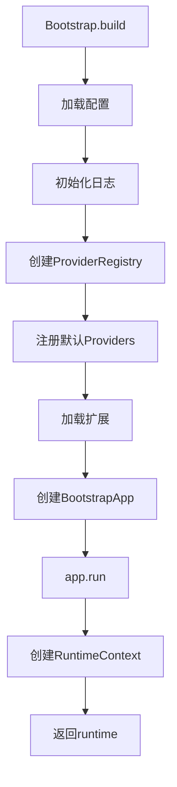
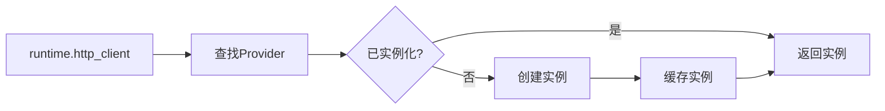

# 架构总览

> ⚠️ **版本说明**: 本文档描述的是旧版架构。最新架构请参考 [OVERVIEW_V3.17.md](./OVERVIEW_V3.17.md)

**历史版本**: v3.0 - v3.13
**当前版本**: v3.17.0
**架构变更**: v3.14.0 引入四层架构 → v3.16.0 引入五层架构

---

## 🔄 架构演进

### v3.0 - v3.13 架构（本文档）

```
Layer 4 ──────────── extensions/       # Pluggy 扩展系统 + 内置监控
Layer 3 ──────────── testing/          # Fixtures、调试、数据构建、插件
Layer 2 ──────────── infrastructure/   # Bootstrap、配置、日志、Provider、Runtime
Layer 1 ──────────── clients/ drivers/ databases/ …  # 能力层（技术能力）
Layer 0 ──────────── common/           # 异常、通用类型
```

### v3.16.0+ 架构（当前）

```
Layer 4 ──────────── bootstrap/        # 框架组装与初始化
Layer 3 ──────────── testing/ + cli/   # 测试工具 + CLI
Layer 2 ──────────── capabilities/     # HTTP/DB/MQ/Storage/Drivers
Layer 1 ──────────── infrastructure/   # Config/Events/Telemetry/Plugins
Layer 0 ──────────── core/            # 纯抽象（无第三方依赖）
```

**重要变更**:
- Layer 0: `common/` → `core/`（更清晰的命名）
- Layer 1: 能力层 → `infrastructure/`（基础设施）
- Layer 2: `infrastructure/` → `capabilities/`（能力层）
- Layer 4: `extensions/` → `bootstrap/`（引导层）

---

## 📖 查看最新架构

请参考以下文档了解最新架构：

- **[v3.17.0 架构总览](./OVERVIEW_V3.17.md)** ⭐ - 最新架构完整说明
- **[v3.16.0 发布说明](../releases/v3.16.0.md)** - Layer 4 Bootstrap 架构变更
- **[v3.14.0 发布说明](../releases/v3.14.0.md)** - 企业级平台架构升级
- **[架构演进历史](./archive/ARCHITECTURE_HISTORY.md)** - 详细演进记录

---

## 🎯 旧版设计目标

1. **语义驱动的能力分层**：按交互模式（HTTP、数据库、UI 等）组织代码，而非按技术栈或测试类型。
2. **解耦与可扩展**：Bootstrap、ProviderRegistry 与 Pluggy Hook 构成灵活的运行时装配线。
3. **类型安全 + 可观测性**：Pydantic v2 配置、结构化日志、HTTP/DB 调试器、性能监控。

---

## Layer 0 · 基础层（`common/` - 已废弃）

> ⚠️ v3.14.0+ 已迁移到 `core/`

- `exceptions.py`：统一异常层级（ConfigurationError、ResourceError、DatabaseError 等），用于高层异常转换。
- `types.py`：常用枚举与类型别名（HTTP 方法、环境、测试优先级等）。
- 作用：提供轻量、无依赖的基础构件，避免循环依赖。

---

## Layer 1 · 能力层（Capabilities）

### `clients/` — 请求-响应模式
- 当前实现：`clients/http/rest/httpx/` 提供 `HttpClient`、`BaseAPI`、认证拦截器与签名策略。  
- 特性：重试、敏感信息脱敏、Loguru 日志、与 `HTTPDebugger` 的自动集成。  
- 预留：GraphQL、SOAP、RPC 协议。

### `drivers/` — 会话式交互
- 默认实现 `drivers/web/playwright/`，封装 `BrowserManager`、`BasePage`、元素定位与等待工具。  
- 支持上下文管理、无头模式、截图等。

### `databases/`
- `Database` 基于 SQLAlchemy QueuePool，支持事务、保存点、表名白名单、防泄漏日志。  
- `RedisClient` 封装 redis-py。  
- `repositories/` 提供 `BaseRepository` 和 `QuerySpec`，支持常用 CRUD、批量查询。  
- 自动集成 `DBDebugger`，并可通过扩展接入 `SlowQueryMonitor`。

### `messengers/`、`storages/`、`engines/`
- v3 已创建目录结构并说明职责（消息队列、对象存储、计算引擎）；实现待补齐。  
- 可通过自定义 Provider/Hook 在运行时注册具体客户端。

---

## Layer 2 · 基础设施层（`infrastructure/`）

### 配置系统
- `FrameworkSettings`（Pydantic BaseSettings）内置 `http`、`db`、`redis`、`test`、`logging` 模块化配置，以及 `extras` 自定义命名空间。  
- `config/sources.py` 提供 `EnvVarSource`、`DotenvSource`、`DictSource`、`ArgSource` 等合并策略，支持嵌套键 `APP_HTTP__BASE_URL`。

### Bootstrap 管线
```python
from df_test_framework import Bootstrap, FrameworkSettings

runtime = (
    Bootstrap()
    .with_settings(MySettings, namespace="test")
    .with_plugin("my_project.plugins")
    .build()
    .run()
)
http = runtime.http_client()
```

执行流程：
1. 清理/加载 Settings（支持多命名空间与缓存）。  
2. 初始化 Loguru 策略（结构化输出、敏感字段脱敏、文件/控制台双通道）。  
3. 装配 ProviderRegistry（默认：`http_client`、`database`、`redis`），可被 Hook 扩展。  
4. 注册 Pluggy 扩展并触发 `df_post_bootstrap`。  
5. 构造不可变 `RuntimeContext`，用于 Fixture 与业务代码依赖注入。

### Provider 体系
- `SingletonProvider` 使用双重检查锁实现线程安全的惰性单例，并在 `shutdown` 时自动清理。  
- `ProviderRegistry` 统一注册、扩展与关闭资源；支持扩展返回 dict 合并。  
- 自定义扩展可通过 `df_providers` Hook 注册任意新资源（如自定义缓存、消息客户端等）。

---

## Layer 3 · 测试支持层（`testing/`）

- **Fixtures** (`testing/fixtures/`):  
  - `core.py` 注册 session 级 `runtime`、`http_client`、`database`、`redis_client`。  
  - UI Fixtures：`browser_manager`、`page` 等 Playwright 支持。  
  - 数据清理：`BaseTestDataCleaner` 与 `GenericTestDataCleaner` 提供注册 + 回调的清理机制。

- **数据构建** (`testing/data/builders/`):  
  - `BaseBuilder`、`DictBuilder` 支持链式构造与深拷贝。  
  - CLI 脚手架自动生成业务 Builder/Repository 模板。

- **调试与监控** (`testing/debug/`):  
  - `HTTPDebugger` / `DBDebugger` 提供请求、SQL 录制、慢调用提示、终端摘要。  
  - 全局开关 `enable_http_debug()` / `enable_db_debug()` 与 Fixture 自动注入。  

- **pytest 插件** (`testing/plugins/`):  
  - Allure 辅助：日志、JSON、截图附件与分类配置。  
  - 环境标记：`skip_if_prod`、`dev_only` 等便捷标记。

---

## Layer 4 · 扩展系统（`extensions/`）

- 基于 Pluggy：`hookimpl`, `hookspec`, `ExtensionManager`。  
- 默认 Hook：
  - `df_config_sources(settings_cls)` — 提供额外 ConfigSource。  
  - `df_providers(settings, logger)` — 注入自定义 Provider。  
  - `df_post_bootstrap(runtime)` — Bootstrap 完成后的回调。

- 内置扩展 (`extensions/builtin/`):
  - `APIPerformanceTracker`：记录调用次数、耗时分位数、慢请求提醒。  
  - `SlowQueryMonitor`：通过 SQLAlchemy 事件监控慢 SQL，提供统计 API。

---

## 运行时生命周期

1. **Bootstrap** 收集配置源（本地 sources + 插件贡献），创建 `FrameworkSettings`。  
2. **Logging** 按 `LoggingConfig` 初始化 Loguru（Console/File、Rotation、Retention、脱敏）。  
3. **Providers** 创建默认资源并合并扩展；资源以惰性模式实例化。  
4. **RuntimeContext** 将 `settings`、`logger`、`providers`、`extensions` 封装，供 Fixture、测试代码使用。  
5. **Cleanup**：`RuntimeContext.close()` 调用 ProviderRegistry.shutdown()，清理连接池、客户端。

---

## 与 v2 的主要差异

| 主题 | v2 | v3 |
|------|----|----|
| 目录组织 | `core/`, `patterns/`, `ui/` | 能力层（`clients/`, `drivers/`, `databases/` …）+ 测试层分离 |
| 资源获取 | `core` 内部直接实例化 | ProviderRegistry + Hook 扩展 |
| 配置 | 单一 BaseSettings | 多配置源合并、命名空间缓存、插件扩展 |
| 调试能力 | HTTP 日志 + 基础 SQL | HTTP/DB 调试器、性能追踪、慢查询监控 |
| 扩展机制 | Pluggy 初始版本 | Hook 语义重新定义，支持配置/Provider/生命周期 |

---

## 后续工作（2025-11 规划）

- 为 `messengers/`、`storages/`、`engines/` 添加首个实现（Kafka、MinIO、Spark 等）。  
- 将 CLI 生成模板中的 `db_transaction` Fixture 纳入框架核心。  
- 完成 `user-guide` 待补章节（配置、HTTP、数据库、扩展深入指南）。  
- 增补 Provider 级别的健康检查与连接自检能力。

---

更多细节请参阅：
- [V3 架构设计](V3_ARCHITECTURE.md) — 设计动机、能力矩阵、实施日志  
- [V3 实施指南](V3_IMPLEMENTATION.md) — 迁移路径、验证清单  
- [架构审计报告](ARCHITECTURE_AUDIT.md) — 文档与实现一致性验证
- `runtime`: RuntimeContext实例
- `http_client`: HttpClient实例
- `database`: Database实例
- `redis_client`: RedisClient实例

#### Plugins
```python
from df_test_framework.testing.plugins import attach_json, step

with step("创建用户"):
    response = http.post("/api/users", json=user_data)
    attach_json("用户数据", user_data)
```

功能:
- Allure报告支持
- 环境标记
- 数据附件
- 测试步骤

### 第五层：扩展系统 (Extensions)

通过Hook机制扩展框架功能。

#### Hook定义
```python
@hookspec
def before_http_request(request):
    """在HTTP请求前执行"""

@hookspec
def after_http_response(response):
    """在HTTP响应后执行"""
```

#### 内置扩展
- **APIPerformanceTracker**: 追踪API性能
- **SlowQueryMonitor**: 监控慢查询

#### 自定义扩展
```python
class MyExtension:
    @hookimpl
    def before_http_request(self, request):
        print(f"准备发送请求: {request.url}")
```

## 🔄 启动流程



## 🔌 依赖注入流程



## 📦 模块导入关系

```
df_test_framework/
├── __init__.py                 # 顶层导出
├── infrastructure/
│   ├── bootstrap.py            # → config, runtime, providers
│   ├── runtime.py              # → providers
│   ├── config.py               # 无依赖
│   └── providers.py            # 无依赖
├── core/
│   ├── http.py                 # → config
│   ├── database.py             # → config
│   └── redis.py                # → config
├── patterns/
│   ├── builders.py             # 无依赖
│   └── repositories.py         # → core.database
├── testing/
│   ├── fixtures.py             # → runtime
│   └── plugins.py              # → runtime
└── extensions/
    ├── core/                   # → runtime
    └── builtin/                # → extensions.core
```

## 🎨 设计模式应用

### 1. 单例模式
- **使用场景**: HttpClient, Database, RedisClient
- **实现方式**: SingletonProvider

### 2. 工厂模式
- **使用场景**: Provider创建服务实例
- **实现方式**: Provider基类

### 3. 建造者模式
- **使用场景**: Bootstrap, Builder类
- **实现方式**: 链式调用

### 4. 仓储模式
- **使用场景**: 数据访问层
- **实现方式**: BaseRepository

### 5. 策略模式
- **使用场景**: 日志策略
- **实现方式**: LoggerStrategy协议

### 6. 插件模式
- **使用场景**: 扩展系统
- **实现方式**: pluggy hooks

## 🔒 线程安全

- **ProviderRegistry**: 线程安全的单例管理
- **Database连接池**: SQLAlchemy管理
- **Redis连接池**: redis-py管理
- **HttpClient**: httpx原生支持

## 📊 性能优化

1. **延迟初始化**: Provider按需创建实例
2. **连接池**: 数据库和Redis使用连接池
3. **缓存**: 配置和资源实例缓存
4. **异步支持**: HttpClient支持异步操作

## 🔗 相关文档

- [v2.0架构详解](v2-architecture.md) - 完整的架构设计文档
- [扩展点设计](extension-points.md) - 扩展系统详细设计
- [测试类型支持](test-type-support.md) - API/UI测试架构
- [多项目复用](multi-project-reuse.md) - 跨项目共享设计
- [配置管理](../user-guide/configuration.md) - 配置系统使用指南
- [扩展系统](../user-guide/extensions.md) - 扩展系统使用指南

---

**返回**: [架构文档](README.md) | [文档首页](../README.md)
