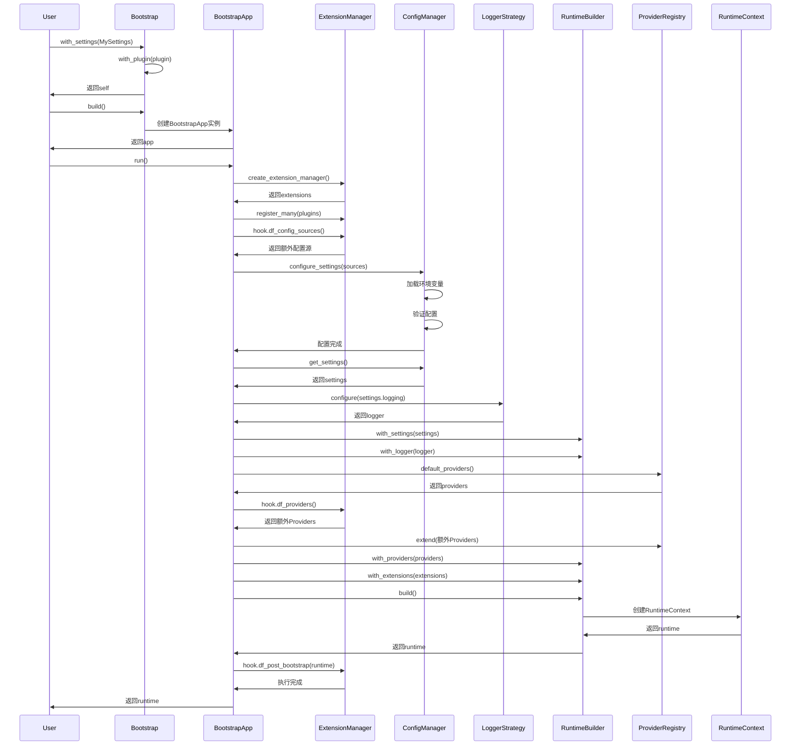
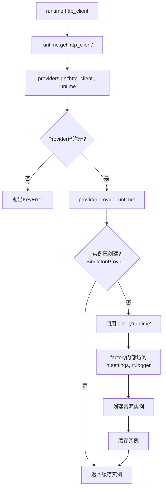

# DF Test Framework v2.0 架构详解

本文档深入解析DF Test Framework v2.0的核心架构设计和实现细节。

## 📋 目录

- [设计理念](#设计理念)
- [五层架构详解](#五层架构详解)
- [启动流程深入分析](#启动流程深入分析)
- [依赖注入机制](#依赖注入机制)
- [资源管理与生命周期](#资源管理与生命周期)
- [类型系统与泛型设计](#类型系统与泛型设计)
- [并发安全设计](#并发安全设计)
- [性能优化策略](#性能优化策略)

## 🎯 设计理念

### 核心原则

v2.0架构遵循以下设计原则：

1. **依赖反转原则 (DIP)**: 高层模块不依赖低层模块，两者都依赖抽象
2. **单一职责原则 (SRP)**: 每个类只有一个引起变化的原因
3. **开闭原则 (OCP)**: 对扩展开放，对修改封闭
4. **最少知识原则**: 减少组件之间的耦合
5. **组合优于继承**: 通过组合提供灵活性

### 与v1.x的根本差异

| 方面 | v1.x | v2.0 |
|------|------|------|
| **配置管理** | 字典 + 环境变量 | Pydantic模型 + 类型安全 |
| **资源管理** | 全局单例 | Provider模式 + 依赖注入 |
| **扩展性** | 硬编码 | Hook机制 + 插件系统 |
| **测试隔离** | 共享状态 | 独立RuntimeContext |
| **类型检查** | 无 | 完整类型标注 |

## 🏗️ 五层架构详解

### 层级关系

```
┌─────────────────────────────────────┐
│   Extensions (扩展系统)              │  Hook机制扩展功能
├─────────────────────────────────────┤
│   Testing (测试支持层)               │  Pytest fixtures & plugins
├─────────────────────────────────────┤
│   Patterns (设计模式层)              │  Builder, Repository
├─────────────────────────────────────┤
│   Core (核心功能层)                  │  HttpClient, Database, Redis
├─────────────────────────────────────┤
│   Infrastructure (基础设施层)        │  Bootstrap, Runtime, Config
└─────────────────────────────────────┘
```

### 第一层：基础设施层 (Infrastructure)

基础设施层是框架的基石，负责初始化、配置、日志和资源管理。

#### 模块组织

```
src/df_test_framework/infrastructure/
├── bootstrap/
│   └── bootstrap.py          # Bootstrap & BootstrapApp
├── runtime/
│   └── context.py            # RuntimeContext & RuntimeBuilder
├── config/
│   ├── schema.py             # FrameworkSettings
│   ├── manager.py            # configure_settings, get_settings
│   └── sources.py            # ConfigSource接口
├── logging/
│   └── strategies.py         # LoggerStrategy, LoguruStructuredStrategy
└── providers/
    ├── base.py               # Provider基类
    ├── registry.py           # ProviderRegistry
    └── defaults.py           # default_providers()
```

#### Bootstrap启动器

**设计目标**: 提供流畅的链式API配置框架启动流程

```python
@dataclass
class Bootstrap:
    settings_cls: Type[FrameworkSettings] = FrameworkSettings
    namespace: SettingsNamespace = "default"
    sources: Optional[Iterable[ConfigSource]] = None
    cache_enabled: bool = True
    logger_strategy: LoggerStrategy = field(default_factory=LoguruStructuredStrategy)
    provider_factory: Optional[ProviderFactory] = None
    plugins: list[Union[str, object]] = field(default_factory=list)
```

**使用示例**:

```python
# 基础用法
runtime = Bootstrap().with_settings(MySettings).build().run()

# 完整配置
runtime = (
    Bootstrap()
    .with_settings(MySettings, namespace="test", cache_enabled=False)
    .with_logging(CustomLoggerStrategy())
    .with_plugin(MonitoringPlugin())
    .with_provider_factory(custom_providers)
    .build()
    .run()
)
```

**关键流程**:

1. `Bootstrap`: 定义配置参数
2. `.with_*()`: 链式配置各个组件
3. `.build()`: 创建`BootstrapApp`实例
4. `.run()`: 执行启动流程，返回`RuntimeContext`

#### RuntimeContext运行时上下文

**设计目标**: 作为依赖注入容器，统一管理所有运行时资源

```python
@dataclass(frozen=True)
class RuntimeContext:
    settings: FrameworkSettings      # 配置对象
    logger: Logger                    # 日志对象
    providers: ProviderRegistry       # Provider注册表
    extensions: Optional[ExtensionManager] = None  # 扩展管理器
```

**资源访问API**:

```python
# 通用访问
resource = runtime.get("resource_name")

# 便捷方法
http = runtime.http_client()
db = runtime.database()
redis = runtime.redis()

# 生命周期管理
runtime.close()  # 释放所有资源
```

**不可变性设计**:

使用`@dataclass(frozen=True)`确保RuntimeContext创建后不可修改：

- **优点**: 线程安全、可预测的状态
- **实现**: 所有字段都是只读的
- **资源替换**: 需要重新build整个runtime

#### ProviderRegistry资源提供者

**设计目标**: 管理资源的创建、缓存和生命周期

```python
class ProviderRegistry:
    def __init__(self):
        self._providers: Dict[str, Provider] = {}
        self._instances: Dict[str, Any] = {}
        self._lock = threading.Lock()

    def register(self, name: str, provider: Provider):
        """注册Provider"""

    def get(self, name: str, runtime: RuntimeContext):
        """获取资源实例（带缓存）"""

    def shutdown(self):
        """释放所有资源"""
```

**Provider类型**:

```python
# 单例Provider
class SingletonProvider(Provider):
    def provide(self, runtime: RuntimeContext):
        # 创建并缓存单例
        if self._instance is None:
            self._instance = self._factory(runtime)
        return self._instance

# 工厂Provider
class FactoryProvider(Provider):
    def provide(self, runtime: RuntimeContext):
        # 每次调用都创建新实例
        return self._factory(runtime)
```

#### FrameworkSettings配置模型

**设计目标**: 类型安全的配置，自动验证和环境变量加载

```python
class FrameworkSettings(BaseSettings):
    model_config = SettingsConfigDict(
        env_file=".env",
        env_file_encoding="utf-8",
        env_prefix="DF_",
        extra="allow",
    )

    # 核心配置
    http: HTTPConfig = Field(default_factory=HTTPConfig)
    database: DatabaseConfig = Field(default_factory=DatabaseConfig)
    redis: RedisConfig = Field(default_factory=RedisConfig)
    logging: LoggingConfig = Field(default_factory=LoggingConfig)
```

**配置来源优先级**:

```
命令行参数 > 环境变量 > .env文件 > 默认值
```

**扩展配置**:

```python
class MyTestSettings(FrameworkSettings):
    # 项目特定配置
    api_key: str = Field(default="")
    timeout: int = Field(default=30, ge=1, le=300)

    # 环境检查
    @model_validator(mode="after")
    def check_api_key(self):
        if not self.api_key:
            raise ValueError("API key is required")
        return self
```

### 第二层：核心功能层 (Core)

核心功能层提供HTTP、数据库、Redis等基础能力。

#### 模块组织

```
src/df_test_framework/core/
├── http/
│   ├── client.py             # HttpClient
│   ├── auth.py               # 认证处理
│   └── retry.py              # 重试逻辑
├── database/
│   ├── client.py             # Database
│   ├── query.py              # QuerySpec
│   └── transaction.py        # 事务管理
└── redis/
    └── client.py             # RedisClient
```

#### HttpClient设计

**核心特性**:

- 基于httpx，支持HTTP/1.1和HTTP/2
- 自动重试与指数退避
- 请求/响应日志
- 数据脱敏（敏感字段自动隐藏）
- Cookie和Session管理

**实现细节**:

```python
class HttpClient:
    def __init__(
        self,
        base_url: str = "",
        timeout: float = 30.0,
        max_retries: int = 3,
        retry_delay: float = 1.0,
        logger: Optional[Logger] = None,
        sanitize_patterns: Optional[List[str]] = None,
    ):
        self._client = httpx.Client(
            base_url=base_url,
            timeout=timeout,
            follow_redirects=True,
        )
        self._max_retries = max_retries
        self._retry_delay = retry_delay
        self._logger = logger
        self._sanitize_patterns = sanitize_patterns or [
            "password", "token", "secret", "key", "auth"
        ]
```

**重试策略**:

```python
def _execute_with_retry(self, method: str, url: str, **kwargs):
    for attempt in range(self._max_retries + 1):
        try:
            response = self._client.request(method, url, **kwargs)
            if response.status_code < 500:  # 只重试5xx错误
                return response
        except httpx.RequestError as e:
            if attempt == self._max_retries:
                raise

        # 指数退避
        delay = self._retry_delay * (2 ** attempt)
        time.sleep(delay)
```

#### Database设计

**核心特性**:

- SQLAlchemy封装，支持多种数据库
- 连接池管理
- 事务支持（自动提交/回滚）
- 慢查询监控
- QuerySpec构建复杂查询

**连接池配置**:

```python
engine = create_engine(
    database_url,
    pool_size=10,          # 连接池大小
    max_overflow=20,       # 超出pool_size的最大连接数
    pool_timeout=30,       # 获取连接超时时间
    pool_recycle=3600,     # 连接回收时间（秒）
    pool_pre_ping=True,    # 连接前ping检查
)
```

**事务管理**:

```python
# 自动提交/回滚
with db.transaction():
    db.execute("INSERT INTO users ...")
    db.execute("INSERT INTO profiles ...")
    # 正常结束时自动commit，异常时自动rollback

# 在测试中自动回滚
@pytest.fixture
def db_transaction(database):
    with database.transaction() as trans:
        yield database
        trans.rollback()  # 测试结束后回滚
```

#### RedisClient设计

**核心特性**:

- redis-py封装
- 连接池管理
- 自动序列化/反序列化（支持JSON、pickle）
- Pipeline批量操作

**序列化策略**:

```python
class RedisClient:
    def set(self, key: str, value: Any, ex: Optional[int] = None):
        # 自动序列化
        serialized = json.dumps(value) if not isinstance(value, (str, bytes)) else value
        self._client.set(key, serialized, ex=ex)

    def get(self, key: str, default: Any = None) -> Any:
        value = self._client.get(key)
        if value is None:
            return default
        # 自动反序列化
        try:
            return json.loads(value)
        except (json.JSONDecodeError, TypeError):
            return value
```

### 第三层：设计模式层 (Patterns)

设计模式层提供常用模式的实现。

#### Builder模式

**DictBuilder**: 构建字典数据

```python
class DictBuilder:
    def __init__(self, initial: Optional[Dict] = None):
        self._data = initial.copy() if initial else {}

    def set(self, key: str, value: Any) -> "DictBuilder":
        self._data[key] = value
        return self

    def set_if(self, condition: bool, key: str, value: Any) -> "DictBuilder":
        if condition:
            self._data[key] = value
        return self

    def merge(self, other: Dict) -> "DictBuilder":
        self._data.update(other)
        return self

    def build(self) -> Dict:
        return self._data.copy()
```

**BaseBuilder**: 自定义Builder基类

```python
class UserBuilder(BaseBuilder):
    def __init__(self):
        super().__init__()
        self.set("id", self._generate_id())
        self.set("created_at", datetime.now().isoformat())

    def with_name(self, name: str):
        return self.set("name", name)

    def with_email(self, email: str):
        return self.set("email", email)

    def with_role(self, role: str):
        return self.set("role", role)
```

#### Repository模式

**BaseRepository**: 数据访问基类

```python
class BaseRepository:
    def __init__(self, database: Database):
        self.db = database
        self.table_name: str = ""  # 子类必须设置

    def find_by_id(self, id: Any) -> Optional[Dict]:
        return self.find_one({"id": id})

    def find_one(self, filters: Dict) -> Optional[Dict]:
        query = f"SELECT * FROM {self.table_name} WHERE "
        query += " AND ".join(f"{k} = :{k}" for k in filters.keys())
        query += " LIMIT 1"
        return self.db.execute(query, filters).first()

    def find_all(self, filters: Optional[Dict] = None, limit: Optional[int] = None):
        query = QuerySpec(self.table_name)
        if filters:
            for key, value in filters.items():
                query.where(key, "=", value)
        if limit:
            query.limit(limit)
        return self.db.query_with_spec(query)

    def create(self, data: Dict) -> Any:
        # 插入并返回ID

    def update(self, id: Any, data: Dict) -> bool:
        # 更新并返回是否成功

    def delete(self, id: Any) -> bool:
        # 删除并返回是否成功
```

**QuerySpec**: 复杂查询构建器

```python
# 构建复杂查询
query = (
    QuerySpec("orders")
    .select(["id", "user_id", "total_amount", "status"])
    .where("status", "=", "paid")
    .where("total_amount", ">", 100)
    .join("users", "orders.user_id = users.id")
    .order_by("created_at", "DESC")
    .limit(10)
    .offset(20)
)

results = db.query_with_spec(query)
```

### 第四层：测试支持层 (Testing)

测试支持层提供pytest集成和测试工具。

#### Pytest Fixtures

**自动依赖注入**:

```python
# tests/conftest.py
import pytest
from df_test_framework.testing.fixtures import *  # 导入所有fixtures

# 使用fixtures
def test_user_api(http_client, database, redis):
    # 自动注入http_client, database, redis
    response = http_client.post("/api/users", json={"name": "张三"})
    assert response.status_code == 200

    # 保存到数据库
    user_id = response.json()["id"]
    user = database.execute(
        "SELECT * FROM users WHERE id = :id",
        {"id": user_id}
    ).first()
    assert user["name"] == "张三"
```

**内置Fixtures列表**:

- `runtime`: RuntimeContext实例
- `settings`: FrameworkSettings实例
- `logger`: Logger实例
- `http_client`: HttpClient实例
- `database`: Database实例（带事务回滚）
- `redis`: RedisClient实例

#### Allure集成

```python
from df_test_framework.testing.plugins import step, attach_json, attach_text

def test_create_order(http_client):
    with step("准备订单数据"):
        order_data = {"product_id": 1, "quantity": 2}
        attach_json("订单数据", order_data)

    with step("创建订单"):
        response = http_client.post("/api/orders", json=order_data)
        attach_json("响应数据", response.json())

    with step("验证订单"):
        assert response.status_code == 200
        assert response.json()["status"] == "created"
```

### 第五层：扩展系统 (Extensions)

扩展系统通过Hook机制提供可插拔的功能扩展。

#### Hook规范

框架定义了3个核心Hook：

```python
class HookSpecs:
    @hookspec
    def df_config_sources(self, settings_cls: type[FrameworkSettings]) -> Iterable[ConfigSource]:
        """提供额外的配置源"""

    @hookspec
    def df_providers(self, settings: FrameworkSettings, logger) -> Dict[str, Provider]:
        """提供额外的资源Provider"""

    @hookspec
    def df_post_bootstrap(self, runtime: RuntimeContext) -> None:
        """在RuntimeContext创建后执行逻辑"""
```

#### 自定义扩展示例

```python
from df_test_framework.extensions import hookimpl

class MonitoringExtension:
    @hookimpl
    def df_providers(self, settings, logger):
        # 注册自定义Provider
        from .metrics import MetricsCollector
        return {
            "metrics": SingletonProvider(
                lambda rt: MetricsCollector(rt.logger)
            )
        }

    @hookimpl
    def df_post_bootstrap(self, runtime):
        # 初始化监控
        metrics = runtime.get("metrics")
        runtime.logger.info(f"监控系统已启动: {metrics}")

# 注册扩展
runtime = (
    Bootstrap()
    .with_settings(MySettings)
    .with_plugin(MonitoringExtension())
    .build()
    .run()
)
```

## 🔄 启动流程深入分析

### 完整启动流程图



### 关键步骤详解

#### 步骤1: 扩展系统初始化

```python
# BootstrapApp.run() 第1步
extensions = create_extension_manager()
extensions.register_many(self.plugins)
pm = extensions.manager
```

**作用**: 创建pluggy的PluginManager并注册所有插件

#### 步骤2: 收集配置源

```python
# 第2步
extra_sources = []
for contributed in pm.hook.df_config_sources(settings_cls=self.settings_cls):
    extra_sources.extend(contributed or [])

combined_sources = []
if self.sources:
    combined_sources.extend(self.sources)
combined_sources.extend(extra_sources)
```

**作用**: 允许扩展提供额外的配置源（如远程配置中心）

#### 步骤3: 配置Settings

```python
# 第3步
configure_settings(
    self.settings_cls,
    namespace=self.namespace,
    sources=combined_sources or None,
    cache_enabled=self.cache_enabled,
)
```

**作用**:
- 加载.env文件
- 加载环境变量
- 应用自定义ConfigSource
- 验证配置（Pydantic validation）
- 缓存配置实例

#### 步骤4: 初始化日志

```python
# 第4步
settings = get_settings(self.namespace)
logger = self.logger_strategy.configure(settings.logging)
```

**作用**: 根据LoggingConfig配置日志系统

#### 步骤5: 构建RuntimeContext

```python
# 第5步
builder = RuntimeBuilder().with_settings(settings).with_logger(logger)

# 第6步：获取默认Providers
providers_factory = self.provider_factory or default_providers
providers = providers_factory()

# 第7步：收集扩展提供的Providers
for contributed in pm.hook.df_providers(settings=settings, logger=logger):
    if contributed:
        providers.extend(contributed)

# 第8步：构建Runtime
builder.with_providers(lambda: providers)
builder.with_extensions(extensions)
runtime = builder.build()
```

**作用**:
- 创建ProviderRegistry
- 注册默认Providers（http_client, database, redis）
- 注册扩展Providers
- 创建不可变的RuntimeContext

#### 步骤6: Post-Bootstrap Hook

```python
# 第9步
pm.hook.df_post_bootstrap(runtime=runtime)
return runtime
```

**作用**: 允许扩展在RuntimeContext创建后执行初始化逻辑

## 🔌 依赖注入机制

### Provider模式实现

#### Provider基类

```python
from abc import ABC, abstractmethod
from typing import Any, TYPE_CHECKING

if TYPE_CHECKING:
    from ..runtime import RuntimeContext

class Provider(ABC):
    @abstractmethod
    def provide(self, runtime: "RuntimeContext") -> Any:
        """创建并返回资源实例"""
```

#### SingletonProvider实现

```python
class SingletonProvider(Provider):
    def __init__(self, factory: Callable[[RuntimeContext], Any]):
        self._factory = factory
        self._instance: Optional[Any] = None
        self._lock = threading.Lock()

    def provide(self, runtime: RuntimeContext) -> Any:
        if self._instance is None:
            with self._lock:
                if self._instance is None:
                    self._instance = self._factory(runtime)
        return self._instance

    def shutdown(self):
        if self._instance and hasattr(self._instance, "close"):
            self._instance.close()
        self._instance = None
```

**双重检查锁定**: 确保线程安全的延迟初始化

#### ProviderRegistry实现

```python
class ProviderRegistry:
    def __init__(self):
        self._providers: Dict[str, Provider] = {}

    def register(self, name: str, provider: Provider):
        self._providers[name] = provider

    def get(self, name: str, runtime: RuntimeContext) -> Any:
        if name not in self._providers:
            raise KeyError(f"Provider '{name}' not registered")
        return self._providers[name].provide(runtime)

    def extend(self, providers: Dict[str, Provider]):
        self._providers.update(providers)

    def shutdown(self):
        for provider in self._providers.values():
            if hasattr(provider, "shutdown"):
                provider.shutdown()
```

### 默认Providers注册

```python
def default_providers() -> ProviderRegistry:
    registry = ProviderRegistry()

    # HttpClient
    registry.register(
        "http_client",
        SingletonProvider(lambda rt: HttpClient(
            base_url=rt.settings.http.base_url,
            timeout=rt.settings.http.timeout,
            max_retries=rt.settings.http.max_retries,
            logger=rt.logger,
        ))
    )

    # Database
    registry.register(
        "database",
        SingletonProvider(lambda rt: Database(
            url=rt.settings.database.url,
            pool_size=rt.settings.database.pool_size,
            logger=rt.logger,
        ))
    )

    # RedisClient
    registry.register(
        "redis",
        SingletonProvider(lambda rt: RedisClient(
            host=rt.settings.redis.host,
            port=rt.settings.redis.port,
            db=rt.settings.redis.db,
            logger=rt.logger,
        ))
    )

    return registry
```

### 依赖解析流程



## 📦 资源管理与生命周期

### 资源创建时机

- **延迟初始化**: Provider在首次访问时才创建资源
- **按需加载**: 未使用的资源永远不会被创建

```python
# 示例：database只在实际使用时才创建连接
runtime = Bootstrap().with_settings(MySettings).build().run()
# 此时database尚未创建

db = runtime.database()  # 触发SingletonProvider.provide()
# 现在才创建Database实例和连接池
```

### 资源释放

#### 手动释放

```python
runtime = Bootstrap().with_settings(MySettings).build().run()
# ... 使用runtime
runtime.close()  # 调用所有Provider的shutdown()
```

#### Pytest自动释放

```python
# tests/conftest.py
@pytest.fixture(scope="session")
def runtime():
    rt = Bootstrap().with_settings(MySettings).build().run()
    yield rt
    rt.close()  # 测试会话结束时自动释放
```

### 资源隔离策略

#### Scope隔离

```python
# Session级别：所有测试共享
@pytest.fixture(scope="session")
def runtime_session():
    rt = Bootstrap().build().run()
    yield rt
    rt.close()

# Module级别：模块内测试共享
@pytest.fixture(scope="module")
def runtime_module():
    rt = Bootstrap().build().run()
    yield rt
    rt.close()

# Function级别：每个测试独立
@pytest.fixture(scope="function")
def runtime_function():
    rt = Bootstrap().build().run()
    yield rt
    rt.close()
```

#### 数据库事务隔离

```python
@pytest.fixture
def db_transaction(database):
    """每个测试在独立事务中运行，结束后回滚"""
    connection = database.engine.connect()
    transaction = connection.begin()

    # 创建临时session绑定到这个事务
    session = scoped_session(sessionmaker(bind=connection))

    yield session

    session.close()
    transaction.rollback()
    connection.close()
```

## 🔒 类型系统与泛型设计

### 泛型设置类

```python
TSettings = TypeVar("TSettings", bound=FrameworkSettings)

class Bootstrap:
    def with_settings(
        self,
        settings_cls: Type[TSettings],
        *,
        namespace: SettingsNamespace = "default",
    ) -> "Bootstrap":
        self.settings_cls = settings_cls
        return self
```

**优点**: IDE可以正确推导settings类型

```python
class MySettings(FrameworkSettings):
    api_key: str

runtime = Bootstrap().with_settings(MySettings).build().run()
# runtime.settings的类型被推导为MySettings
api_key = runtime.settings.api_key  # IDE自动补全
```

### 类型标注覆盖

框架所有公共API都有完整类型标注：

```python
# ✅ 完整类型标注
def find_by_id(self, id: int) -> Optional[Dict[str, Any]]:
    ...

# ✅ 泛型支持
class BaseRepository(Generic[T]):
    def find_by_id(self, id: int) -> Optional[T]:
        ...
```

## 🚀 并发安全设计

### 线程安全组件

#### SingletonProvider双重检查锁

```python
def provide(self, runtime: RuntimeContext) -> Any:
    if self._instance is None:  # 第一次检查（无锁）
        with self._lock:         # 加锁
            if self._instance is None:  # 第二次检查（有锁）
                self._instance = self._factory(runtime)
    return self._instance
```

#### RuntimeContext不可变性

```python
@dataclass(frozen=True)
class RuntimeContext:
    # 所有字段不可变，天然线程安全
```

### 非线程安全组件

以下组件需要用户确保线程安全：

- **SQLAlchemy Session**: 不应跨线程共享
- **httpx.Client**: 虽然内部线程安全，但建议每线程一个实例
- **Redis连接**: 连接池是线程安全的，但单个连接不应跨线程

## ⚡ 性能优化策略

### 1. 延迟初始化

```python
# ✅ 好：只在需要时创建
runtime = Bootstrap().build().run()
if need_database:
    db = runtime.database()  # 仅在条件满足时创建

# ❌ 避免：预先创建所有资源
db = runtime.database()
redis = runtime.redis()
http = runtime.http_client()
```

### 2. 连接池复用

```python
# Database连接池
engine = create_engine(
    url,
    pool_size=10,        # 保持10个连接
    max_overflow=20,     # 高峰时最多30个连接
    pool_recycle=3600,   # 每小时回收连接
)

# Redis连接池
redis_pool = redis.ConnectionPool(
    host=host,
    port=port,
    max_connections=50,  # 最大连接数
)
```

### 3. 配置缓存

```python
# 配置只加载一次
settings = get_settings("default")  # 从缓存读取
settings2 = get_settings("default") # 返回同一实例
assert settings is settings2
```

### 4. Batch操作

```python
# Database批量插入
db.bulk_insert("users", [
    {"name": "User1"},
    {"name": "User2"},
    # ... 1000条
])

# Redis Pipeline
with redis.pipeline() as pipe:
    for i in range(1000):
        pipe.set(f"key:{i}", f"value:{i}")
    pipe.execute()  # 一次性发送所有命令
```

## 🔗 相关文档

- [架构总览](overview.md)
- [多项目复用模式](multi-project-reuse.md)
- [扩展点文档](extension-points.md)
- [测试类型支持](test-type-support.md)

---

**返回**: [架构文档](README.md) | [文档首页](../README.md)
