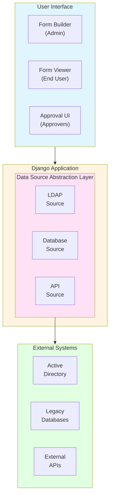

# Django Forms Workflows

**Enterprise-grade, database-driven form builder with approval workflows and external data integration**

[](https://www.gnu.org/licenses/lgpl-3.0)
[](https://www.python.org/downloads/)
[](https://www.djangoproject.com/)

## Overview

Django Forms Workflows bridges the gap between simple form libraries (like Crispy Forms) and expensive SaaS solutions (like JotForm, Formstack). It provides:

- 📝 **Database-Driven Forms** - Forms stored in database, not code
- 🔄 **Approval Workflows** - Multi-step approval engine with notifications
- 🔌 **External Data Integration** - Pull data from LDAP, databases, APIs
- 🔒 **Enterprise Security** - LDAP/AD authentication, complete audit trails
- 🏠 **Self-Hosted** - No SaaS fees, full data control
- 🎨 **Beautiful UI** - Built on Crispy Forms and Bootstrap

## Key Features

### 🎯 No-Code Form Creation
Business users can create and modify forms through Django Admin without touching code:
- Drag-and-drop field ordering
- 15+ field types (text, select, date, file upload, etc.)
- Validation rules (required, regex, min/max, etc.)
- Conditional field visibility
- Custom help text and placeholders

### 🔄 Powerful Approval Workflows
Built-in multi-step approval engine:
- Sequential or parallel approvals
- Configurable approval logic (any/all approvers)
- Email notifications and reminders
- Complete audit trail
- Approval delegation

### 🔌 Configurable Prefill Sources
Automatically populate form fields from external systems with flexible, reusable configurations:
- **User Model** - Current user's profile data (email, name, username)
- **LDAP/Active Directory** - Enterprise directory attributes (department, title, manager)
- **External Databases** - Pull from any SQL database with custom field mappings
- **REST APIs** - Integrate with external services
- **System Values** - Current date/time, previous submissions

**New in v1.1:** Prefill sources are now configurable database records with:
- ✅ **Dropdown Selection** - Form builders select from pre-configured sources
- ✅ **Custom Field Mappings** - Configure database lookup fields for different environments
- ✅ **Reusable Configurations** - Define once, use across multiple forms
- ✅ **Centralized Management** - All sources managed in Django Admin

Example database prefill configuration:
```python
# Admin → Prefill Sources → Add Prefill Source
Name: Student - First Name
Source Type: Database
DB Schema: dbo
DB Table: STBIOS
DB Column: FIRST_NAME
DB Lookup Field: ID_NUMBER  # Column to match against
DB User Field: employee_id   # UserProfile field to use for lookup
```

See [Prefill Sources Guide](docs/PREFILL_SOURCES.md) for detailed configuration.

### 🔄 Post-Submission Actions (NEW)
Automatically update external systems with form data after submission or approval:
- **Database Updates** - Write data back to external databases with custom field mappings
- **LDAP Updates** - Update Active Directory attributes
- **API Calls** - Send data to external services via HTTP APIs
- **Custom Handlers** - Execute custom Python code for complex integrations

**Trigger Types:**
- ✅ **On Submit** - Execute immediately when form is submitted
- ✅ **On Approve** - Execute when form is approved
- ✅ **On Reject** - Execute when form is rejected
- ✅ **On Complete** - Execute when workflow is complete

**Features:**
- Conditional execution based on form field values
- Automatic retries with configurable max attempts
- Error handling (fail silently or block submission)
- Execution ordering for dependent actions
- Complete audit logging

Example database update configuration:
```python
# Admin → Post-Submission Actions → Add
Name: Update HR Database
Action Type: Database Update
Trigger: On Approval
DB Field Mappings:
  [
    {"form_field": "email", "db_column": "EMAIL_ADDRESS"},
    {"form_field": "phone", "db_column": "PHONE_NUMBER"}
  ]
```

See [Post-Submission Actions Guide](docs/POST_SUBMISSION_ACTIONS.md) for detailed configuration.

### 🔒 Enterprise-Ready Security
- LDAP/Active Directory authentication
- Role-based permissions
- Complete audit logging (who, what, when, where)
- CSRF protection
- SQL injection prevention
- File upload validation

### 📊 Comprehensive Audit Trail
Track everything for compliance:
- Form creation/modification
- Form submissions
- Approval decisions
- Status changes
- Field value changes
- User actions with IP addresses

## Quick Start

### Installation

```bash
pip install django-forms-workflows
```

### Basic Setup

1. Add to `INSTALLED_APPS`:

```python
INSTALLED_APPS = [
    # ...
    'crispy_forms',
    'crispy_bootstrap5',
    'django_forms_workflows',
    # ...
]
```

2. Configure settings:

```python
# Crispy Forms
CRISPY_ALLOWED_TEMPLATE_PACKS = "bootstrap5"
CRISPY_TEMPLATE_PACK = "bootstrap5"

# Forms Workflows
FORMS_WORKFLOWS = {
    'ENABLE_APPROVALS': True,
    'ENABLE_AUDIT_LOG': True,
    'ENABLE_FILE_UPLOADS': True,
    'MAX_FILE_SIZE': 10 * 1024 * 1024,  # 10MB
}
```

3. Run migrations:

```bash
python manage.py migrate django_forms_workflows
```

4. Include URLs:

```python
urlpatterns = [
    path('forms/', include('django_forms_workflows.urls')),
]
```

5. Create your first form in Django Admin!

## Architecture



## Use Cases

Perfect for:
- **HR Departments** - Employee onboarding, time-off requests, expense reports
- **IT Departments** - Access requests, equipment requests, change management
- **Finance** - Purchase orders, invoice approvals, budget requests
- **Education** - Student applications, course registrations, facility requests
- **Healthcare** - Patient intake, referrals, insurance claims
- **Government** - Permit applications, FOIA requests, citizen services

## Documentation

- [Installation Guide](docs/installation.md)
- [Configuration Guide](docs/configuration.md)
- [Data Sources Guide](docs/data-sources.md)
- [Workflow Guide](docs/workflows.md)
- [API Reference](docs/api.md)
- [Architecture Overview](docs/ARCHITECTURE.md)

## Comparison

| Feature | Django Forms Workflows | Crispy Forms | FormStack | Django-Formtools |
|---------|----------------------|--------------|-----------|------------------|
| Database-driven forms | ✅ | ❌ | ✅ | ❌ |
| No-code form creation | ✅ | ❌ | ✅ | ❌ |
| Self-hosted | ✅ | ✅ | ❌ | ✅ |
| Approval workflows | ✅ | ❌ | ⚠️ | ❌ |
| External data prefill | ✅ | ❌ | ⚠️ | ❌ |
| LDAP/AD integration | ✅ | ❌ | ❌ | ❌ |
| Audit trail | ✅ | ❌ | ✅ | ❌ |
| Open source | ✅ | ✅ | ❌ | ✅ |

## Requirements

- Python 3.10+
- Django 5.1+
- PostgreSQL 12+ (recommended) or MySQL 8.0+
- Celery 5.0+ (for background tasks)
- Redis/Valkey (for Celery broker)

## Contributing

We welcome contributions! Please see [CONTRIBUTING.md](CONTRIBUTING.md) for details.

## License

GNU Lesser General Public License v3.0 (LGPLv3) - see [LICENSE](LICENSE) for details.

## Support

- 📖 [Documentation](https://django-forms-workflows.readthedocs.io/)
- 💬 [Discussions](https://github.com/opensensor/django-forms-workflows/discussions)
- 🐛 [Issue Tracker](https://github.com/opensensor/django-forms-workflows/issues)

## Roadmap

### Phase 1: Core (Current)
- [x] Database-driven form definitions
- [x] Dynamic form rendering
- [x] Approval workflows
- [x] LDAP integration
- [x] Database prefill
- [x] Audit logging

### Phase 2: Enhanced UX
- [ ] Form builder UI (drag-and-drop)
- [ ] Conditional field visibility (client-side)
- [ ] File upload validation
- [ ] Form templates/cloning
- [ ] Dashboard analytics

### Phase 3: Advanced Features
- [ ] REST API for form submission
- [ ] Webhook support
- [ ] Custom field types (signature, location, etc.)
- [ ] Advanced reporting
- [ ] Form versioning

### Phase 4: Enterprise
- [ ] Multi-tenancy support
- [ ] SSO integration (SAML, OAuth)
- [ ] Advanced RBAC
- [ ] White-label support
- [ ] Plugin marketplace

## Credits

Built with ❤️ by the Django community.

Special thanks to:
- [Django Crispy Forms](https://github.com/django-crispy-forms/django-crispy-forms)
- [Celery](https://github.com/celery/celery)
- [django-auth-ldap](https://github.com/django-auth-ldap/django-auth-ldap)


