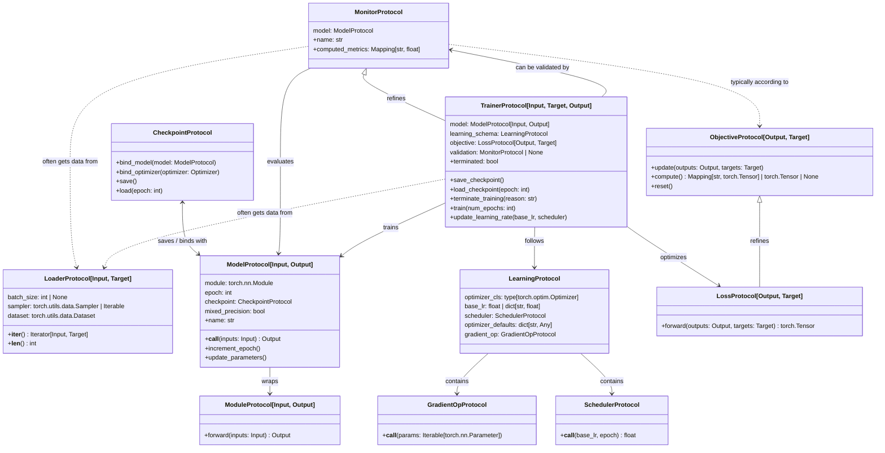

# Types and Protocols

## Core Types
Throughout drytorch, generic variables must satisfy these constraints:

- `Input` and `Target`: `torch.Tensor` | `MutableSequence[torch.Tensor]` | `NamedTuple`
- `Output`: no constraints
- `Data`: 2-tuple where both elements follow `Input`/`Target` constraints

**Note**: The notation for the generic variables has been simplified to ignore
subtype relationships.

## Diagram

The following diagram maps the dependencies between the core interfaces using UML-style notation:

- **Refinement (<|–):** Indicates one protocol extends or refines another (e.g.,
  an inheritance relationship).

- **Structural Association (–>):** Represents a structural requirement and is often implemented using Dependency Injection.

- **Dependency (..>):** Represents a logical dependency that is not enforced by the protocol but often necessary for its implementation.

