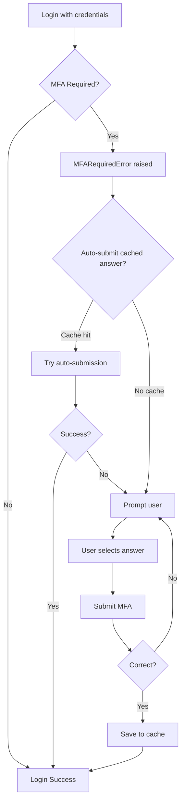

# MFA Handling Guide

Comprehensive guide to handling Multi-Factor Authentication (MFA) with `ecoledirecte-py-client`.

## Table of Contents

- [What is MFA in EcoleDirecte?](#what-is-mfa-in-ecoledirecte)
- [How MFA Works](#how-mfa-works)
- [Interactive MFA](#interactive-mfa)
- [Automated MFA](#automated-mfa)
- [MFA Cache Management](#mfa-cache-management)
- [Advanced Patterns](#advanced-patterns)
- [Security Considerations](#security-considerations)

---

## What is MFA in EcoleDirecte?

EcoleDirecte implements Multi-Factor Authentication (also called CNED or QCM) as an additional security layer. Instead of traditional SMS or app-based 2FA, EcoleDirecte asks personal questions that only the account holder should know.

**Example questions**:
- "Quelle est votre ville de résidence ?" (What is your city of residence?)
- "Quel est le niveau scolaire de <prénom> ?" (What is <name>'s grade level?)
- "Quelle est votre année de naissance ?" (What is your year of birth?)

---

## How MFA Works

### MFA Flow



### When MFA is Triggered

MFA can be triggered when:
- Logging in from a new device
- After clearing browser cookies
- After a certain period of inactivity
- Randomly for security purposes

---

## Interactive MFA

### Basic Interactive Flow

```python
import asyncio
from ecoledirecte_py_client import Client, MFARequiredError

async def login_with_interactive_mfa(username, password):
    """Handle MFA with interactive user prompts"""
    
    client = Client()
    
    try:
        # Attempt login
        session = await client.login(username, password)
        print("✓ Login successful (no MFA required)")
        return client, session
    
    except MFARequiredError as mfa_error:
        print("\n🔒 MFA Required")
        print(f"Question: {mfa_error.question}")
        print("\nOptions:")
        
        # Display options
        for idx, option in enumerate(mfa_error.propositions):
            print(f"  {idx}: {option}")
        
        # Get user input
        while True:
            choice = input("\nSelect option (number): ").strip()
            
            if not choice.isdigit():
                print("❌ Please enter a valid number")
                continue
            
            choice_idx = int(choice)
            if 0 <= choice_idx < len(mfa_error.propositions):
                answer = mfa_error.propositions[choice_idx]
                break
            else:
                print(f"❌ Please enter a number between 0 and {len(mfa_error.propositions)-1}")
        
        # Submit answer
        try:
            session = await client.submit_mfa(answer)
            print("✓ MFA verification successful!")
            return client, session
        
        except Exception as e:
            print(f"❌ MFA failed: {e}")
            await client.close()
            raise

# Usage
asyncio.run(login_with_interactive_mfa("username", "password"))
```

### Enhanced Interactive Flow with Retry

```python
async def login_with_mfa_retry(username, password, max_attempts=3):
    """Interactive MFA with retry logic"""
    
    client = Client()
    
    try:
        session = await client.login(username, password)
        return client, session
    
    except MFARequiredError as mfa_error:
        print(f"\n🔒 MFA Challenge: {mfa_error.question}")
        
        for attempt in range(max_attempts):
            print(f"\nAttempt {attempt + 1}/{max_attempts}")
            print("Options:")
            for idx, option in enumerate(mfa_error.propositions):
                print(f"  {idx}: {option}")
            
            choice = input("Select: ").strip()
            
            # Support both index and full text answer
            if choice.isdigit():
                idx = int(choice)
                if 0 <= idx < len(mfa_error.propositions):
                    answer = mfa_error.propositions[idx]
                else:
                    print("❌ Invalid option")
                    continue
            else:
                answer = choice
            
            try:
                session = await client.submit_mfa(answer)
                print("✓ Success!")
                return client, session
            
            except Exception as e:
                if attempt < max_attempts - 1:
                    print(f"❌ Incorrect answer. Try again.")
                else:
                    print(f"❌ Max attempts reached: {e}")
                    await client.close()
                    raise
```

---

## Automated MFA

### Using qcm.json Cache

The library can automatically handle MFA by caching successful answers in `qcm.json`.

#### qcm.json Format

```json
{
  "Quelle est votre ville de résidence ?": ["PARIS"],
  "Quel est le niveau scolaire de <prénom> ?": ["QUATRIEMES"],
  "Quelle est votre année de naissance ?": ["1970"]
}
```

**Key points**:
- Questions are exact matches (case-sensitive)
- Answers are stored in arrays (multiple possible answers)
- Most recent answer is typically the last in the array

### Auto-Submit with Fallback

```python
import json
import os
from ecoledirecte_py_client import Client, MFARequiredError

QCM_FILE = "qcm.json"

def load_qcm():
    """Load MFA cache from file"""
    if os.path.exists(QCM_FILE):
        try:
            with open(QCM_FILE, 'r') as f:
                return json.load(f)
        except:
            return {}
    return {}

def save_qcm(question, answer):
    """Save MFA answer to cache"""
    data = load_qcm()
    
    # Initialize question if not exists
    if question not in data:
        data[question] = []
    
    # Add answer if not already in list
    if answer not in data[question]:
        data[question].append(answer)
    
    with open(QCM_FILE, 'w') as f:
        json.dump(data, f, indent=2, ensure_ascii=False)

async def login_with_auto_mfa(username, password):
    """Login with automatic MFA submission"""
    
    client = Client()
    
    try:
        # Try normal login
        session = await client.login(username, password)
        return client, session
    
    except MFARequiredError as mfa_error:
        print(f"🔒 MFA Required: {mfa_error.question}")
        
        # Check cache
        qcm_data = load_qcm()
        cached_answers = qcm_data.get(mfa_error.question, [])
        
        # Try auto-submission with cached answer
        if cached_answers:
            answer = cached_answers[-1]  # Use most recent
            print(f"🤖 Auto-submitting cached answer: {answer}")
            
            try:
                session = await client.submit_mfa(answer)
                print("✓ Auto-MFA successful!")
                return client, session
            
            except Exception as e:
                print(f"❌ Auto-submit failed: {e}")
                print("Falling back to interactive mode...")
        
        # Fallback to interactive
        print("\nOptions:")
        for idx, option in enumerate(mfa_error.propositions):
            marker = " (cached)" if option in cached_answers else ""
            print(f"  {idx}: {option}{marker}")
        
        choice = int(input("Select: "))
        answer = mfa_error.propositions[choice]
        
        session = await client.submit_mfa(answer)
        
        # Save successful answer
        save_qcm(mfa_error.question, answer)
        print(f"✓ Answer saved to {QCM_FILE}")
        
        return client, session
```

### Fully Automated (No Interaction)

```python
async def login_auto_only(username, password):
    """Fully automated login - fails if MFA answer not cached"""
    
    client = Client()
    
    try:
        session = await client.login(username, password)
        return client, session
    
    except MFARequiredError as mfa_error:
        qcm_data = load_qcm()
        
        if mfa_error.question not in qcm_data:
            await client.close()
            raise Exception(f"MFA required but no cached answer for: {mfa_error.question}")
        
        answer = qcm_data[mfa_error.question][-1]
        
        try:
            session = await client.submit_mfa(answer)
            return client, session
        except Exception as e:
            await client.close()
            raise Exception(f"Auto-MFA failed: {e}")
```

---

## MFA Cache Management

### Validating Cache

```python
import json

def validate_qcm_cache(filename="qcm.json"):
    """Validate MFA cache structure"""
    
    try:
        with open(filename, 'r') as f:
            data = json.load(f)
        
        if not isinstance(data, dict):
            print("❌ Invalid format: not a dictionary")
            return False
        
        for question, answers in data.items():
            if not isinstance(answers, list):
                print(f"❌ Invalid answers for question: {question}")
                return False
            
            if not answers:
                print(f"⚠️  Warning: Empty answers for: {question}")
        
        print(f"✓ Cache valid: {len(data)} questions")
        return True
    
    except FileNotFoundError:
        print("⚠️  No cache file found")
        return False
    except json.JSONDecodeError:
        print("❌ Invalid JSON")
        return False
```

### Cleaning Cache

```python
def clean_qcm_cache(filename="qcm.json"):
    """Remove duplicate and empty entries"""
    
    with open(filename, 'r') as f:
        data = json.load(f)
    
    cleaned = {}
    
    for question, answers in data.items():
        # Remove duplicates while preserving order
        seen = set()
        unique_answers = []
        for answer in answers:
            if answer not in seen:
                seen.add(answer)
                unique_answers.append(answer)
        
        # Only keep non-empty
        if unique_answers:
            cleaned[question] = unique_answers
    
    with open(filename, 'w') as f:
        json.dump(cleaned, f, indent=2, ensure_ascii=False)
    
    print(f"✓ Cleaned: {len(cleaned)} questions")
```

### Merging Caches

```python
def merge_qcm_caches(file1, file2, output="qcm_merged.json"):
    """Merge two MFA cache files"""
    
    with open(file1, 'r') as f:
        data1 = json.load(f)
    
    with open(file2, 'r') as f:
        data2 = json.load(f)
    
    merged = data1.copy()
    
    for question, answers in data2.items():
        if question in merged:
            # Merge answers
            for answer in answers:
                if answer not in merged[question]:
                    merged[question].append(answer)
        else:
            merged[question] = answers
    
    with open(output, 'w') as f:
        json.dump(merged, f, indent=2, ensure_ascii=False)
    
    print(f"✓ Merged into {output}")
```

---

## Advanced Patterns

### MFA Manager Class

```python
import json
from pathlib import Path
from typing import Optional, List

class MFAManager:
    """Manages MFA cache and auto-submission"""
    
    def __init__(self, cache_file="qcm.json"):
        self.cache_file = Path(cache_file)
        self.cache = self.load()
    
    def load(self) -> dict:
        """Load cache from file"""
        if self.cache_file.exists():
            try:
                with open(self.cache_file, 'r') as f:
                    return json.load(f)
            except:
                return {}
        return {}
    
    def save(self):
        """Save cache to file"""
        with open(self.cache_file, 'w') as f:
            json.dump(self.cache, f, indent=2, ensure_ascii=False)
        
        # Set restrictive permissions
        self.cache_file.chmod(0o600)
    
    def get_answer(self, question: str) -> Optional[str]:
        """Get cached answer for question"""
        answers = self.cache.get(question, [])
        return answers[-1] if answers else None
    
    def get_all_answers(self, question: str) -> List[str]:
        """Get all cached answers for question"""
        return self.cache.get(question, [])
    
    def add_answer(self, question: str, answer: str):
        """Add answer to cache"""
        if question not in self.cache:
            self.cache[question] = []
        
        if answer not in self.cache[question]:
            self.cache[question].append(answer)
            self.save()
    
    def remove_question(self, question: str):
        """Remove question from cache"""
        if question in self.cache:
            del self.cache[question]
            self.save()
    
    def clear(self):
        """Clear all cache"""
        self.cache = {}
        self.save()

# Usage
async def login_with_manager(username, password):
    manager = MFAManager()
    client = Client()
    
    try:
        session = await client.login(username, password)
        return client, session
    
    except MFARequiredError as e:
        # Try cached answer
        answer = manager.get_answer(e.question)
        
        if answer:
            try:
                session = await client.submit_mfa(answer)
                return client, session
            except:
                pass
        
        # Interactive fallback
        print(f"Question: {e.question}")
        # ... handle interactively
        
        # Save answer
        manager.add_answer(e.question, selected_answer)
```

---

## Security Considerations

### File Permissions

```python
import os
import stat

def secure_qcm_file(filename="qcm.json"):
    """Ensure MFA cache has secure permissions"""
    
    # Check current permissions
    file_stat = os.stat(filename)
    current_mode = stat.filemode(file_stat.st_mode)
    
    # Should be -rw------- (0600)
    if file_stat.st_mode & (stat.S_IRWXG | stat.S_IRWXO):
        print(f"⚠️  Warning: {filename} is readable by group/others!")
        print(f"Current permissions: {current_mode}")
        
        # Fix permissions
        os.chmod(filename, 0o600)
        print(f"✓ Fixed permissions to: -rw-------")
```

### Encryption (Optional)

```python
import json
from cryptography.fernet import Fernet
import base64

class EncryptedMFACache:
    """MFA cache with encryption"""
    
    def __init__(self, cache_file="qcm.json.enc", key_file=".qcm.key"):
        self.cache_file = cache_file
        self.key_file = key_file
        self.key = self._load_or_create_key()
        self.cipher = Fernet(self.key)
    
    def _load_or_create_key(self):
        """Load or create encryption key"""
        if os.path.exists(self.key_file):
            with open(self.key_file, 'rb') as f:
                return f.read()
        else:
            key = Fernet.generate_key()
            with open(self.key_file, 'wb') as f:
                f.write(key)
            os.chmod(self.key_file, 0o600)
            return key
    
    def load(self):
        """Load and decrypt cache"""
        if not os.path.exists(self.cache_file):
            return {}
        
        with open(self.cache_file, 'rb') as f:
            encrypted = f.read()
        
        decrypted = self.cipher.decrypt(encrypted)
        return json.loads(decrypted.decode())
    
    def save(self, data):
        """Encrypt and save cache"""
        json_data = json.dumps(data, ensure_ascii=False).encode()
        encrypted = self.cipher.encrypt(json_data)
        
        with open(self.cache_file, 'wb') as f:
            f.write(encrypted)
        
        os.chmod(self.cache_file, 0o600)
```

### Best Practices

1. **Never commit cache files**: Add `qcm.json` to `.gitignore`
2. **Use restrictive file permissions**: `chmod 600 qcm.json`
3. **Consider encryption**: For sensitive environments
4. **Regular cleanup**: Remove old/unused entries
5. **Backup carefully**: If backing up, encrypt first
6. **Monitor access**: Log MFA cache access in production

---

## Troubleshooting

### Cache Not Working

**Problem**: Cached answers not auto-submitting

**Solutions**:
- Verify JSON format is valid
- Check question text matches exactly (including case and accents)
- Ensure answers array is not empty
- Check file permissions allow reading

### Wrong Answer Cached

**Problem**: Incorrect answer is cached

**Solutions**:
```python
# Remove the incorrect entry
manager = MFAManager()
manager.remove_question("Quelle est votre ville de résidence ?")

# Or edit qcm.json directly
```

### MFA Required Every Time

**Problem**: MFA is triggered on every login

**Possible causes**:
- EcoleDirecte security policy
- Logging in from different IPs
- Account flagged for additional security
- Cache not being persisted

---

## Next Steps

- See [Usage Guide](usage.md) for integration patterns
- See [Troubleshooting](troubleshooting.md) for more issues
- See [API Reference](api.md) for method documentation
