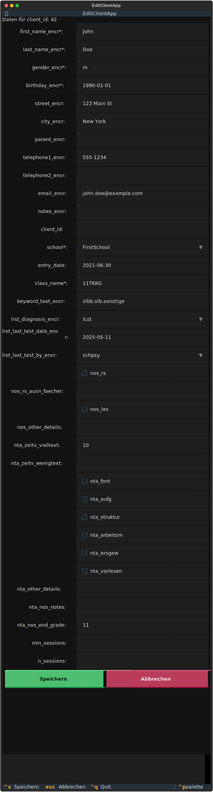

Klienten bearbeiten, hinzufügen und anzeigen
=============================================

Starte die TUI mit folgendem Befehl:

.. code-block:: console

  $ edupsyadmin tui

Du siehst jetzt die Hauptansicht, die wir uns im :doc:`letzten Kapitel <tui>`
kurz angesehen haben. Links die Liste (noch leer), rechts das Formular.

Einen neuen Klienten anlegen
----------------------------

Um eine*n erste*n Klient*in anzulegen:

#.  Drücke in der Hauptansicht :kbd:`Strg+n`.
#.  Auf der rechten Seite erscheint ein leeres Formular. Fülle die Felder aus.
    Mit der :kbd:`Tab`-Taste springst du bequem von einem Feld zum nächsten.
#.  Speichere den neuen Eintrag mit :kbd:`Strg+s`.

Der neue Klient sollte nun links in der Liste erscheinen. In folgender
Abbildung findest du ein Beispiel, das du eingeben könntest:

Einen Klienten bearbeiten
-------------------------

So bearbeitest du einen Eintrag:

#.  Wähle mit den Pfeiltasten oder der Maus eine*n Klient*in aus der Liste links
    aus. Die Details erscheinen rechts im Formular.
#.  Klicke in die Felder, die du ändern möchtest und gib die neuen
    Informationen ein.
#.  **Speichern**: Drücke :kbd:`Strg+s`, um deine Änderungen zu sichern.
#.  **Verwerfen**: Wenn du dich vertippt hast oder die Änderungen doch nicht
    speichern willst, drücke einfach :kbd:`Escape`. Das Formular wird
    zurückgesetzt.

Klienten löschen
-----------------

So löschst du eine*n Klient*in:

#.  Wähle mit den Pfeiltasten oder der Maus eine*n Klient*in aus der Liste links
    aus.
#.  Drücke die Taste :kbd:`Entf`.
#.  Ein Dialogfenster zur Bestätigung erscheint. Bestätige mit :kbd:`Enter`
    (Standard ist "Yes") oder wähle mit der :kbd:`Tab`-Taste "No" und drücke
    :kbd:`Enter`, um den Vorgang abzubrechen.
