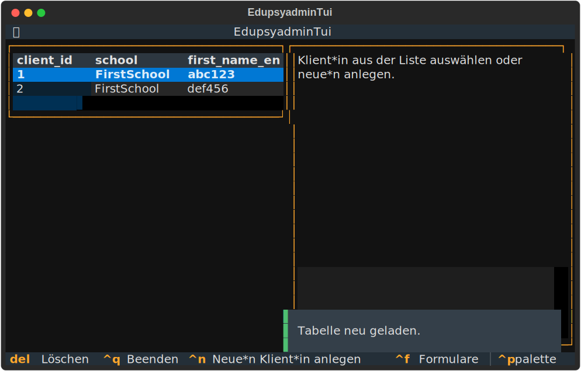

Interaktive Benutzeroberfläche (TUI)
=====================================

``edupsyadmin`` bietet eine interaktive Benutzeroberfläche (TUI), um die
Verwaltung von Klientendaten zu vereinfachen.

Starten der TUI
---------------

Um die interaktive Benutzeroberfläche zu starten, führe den folgenden Befehl
aus:

.. code-block:: console

    $ edupsyadmin tui

Wie du siehst, ist die TUI in zwei Hauptbereiche unterteilt:

- **Links**: Eine Übersichtstabelle aller Klienten in der Datenbank.
- **Rechts**: Ein Formular zur Anzeige und Bearbeitung der Daten des
  ausgewählten Klienten.

Ansicht beim Start anpassen
---------------------------

Die in der Übersicht angezeigten Klienten können bereits beim Start der TUI
gefiltert werden.

Der folgende Befehl filtert die Klienten so, dass nur die Klienten angezeigt
werden, die Nachteilsausgleich oder Notenschutz haben und der ``TutorialSchule``
angehören:

.. code-block:: console

    $ edupsyadmin tui --nta_nos --school TutorialSchule

Zusätzlich können die angezeigten Spalten mit ``--columns`` angepasst werden.
Eine Auswahl an Spalten wird immer angezeigt (``client_id``, ``school``,
``last_name_encr``, ``first_name_encr``, ``class_name``). Mit ``--columns``
können weitere Spalten hinzugefügt werden.

Folgender Befehl zeigt zusätzlich die Spalte für ``notes_encr`` und
``lrst_diagnosis_encr`` an:

.. code-block:: console

    $ edupsyadmin tui --columns notes_encr lrst_diagnosis_encr

Navigation und Steuerung
------------------------

Die TUI erlaubt die Bedienung mit der Maus, aber die folgenden Tastenkürzel
beschleunigen die Bedienung erheblich:

.. list-table:: Wichtige Tastenkürzel
   :widths: 20 80
   :header-rows: 1

   * - Taste(n)
     - Aktion
   * - :kbd:`Strg-q`
     - Beendet die TUI.
   * - :kbd:`Pfeiltasten`
     - Navigation in der Klientenübersicht.
   * - :kbd:`Tab`
     - Springt zum nächsten Eingabefeld oder Button.
   * - :kbd:`Strg+n`
     - Öffnet ein leeres Formular, um eine*n neue*n Klient*in anzulegen.
   * - :kbd:`Strg+s`
     - Speichert die Änderungen am aktuell angezeigten Klienten.
   * - :kbd:`Escape`
     - Bricht die Bearbeitung ab und leert das Formular.
   * - :kbd:`Strg+f`
     - Öffnet den Dialog zum Ausfüllen von Formularen für den ausgewählten
       Klienten.
   * - :kbd:`Strg+r`
     - Lädt die Klientenliste neu aus der Datenbank.

Sortieren der Übersicht
-----------------------

Die Klientenübersicht kann zur besseren Orientierung nach verschiedenen Spalten
sortiert werden:

.. list-table:: Sortier-Tastenkürzel
   :widths: 20 80
   :header-rows: 1

   * - Taste(n)
     - Sortiert nach
   * - :kbd:`i`
     - Klienten-ID (``client_id``)
   * - :kbd:`n`
     - Nachname (``last_name_encr``)
   * - :kbd:`s`
     - Schule (``school``) und dann Nachname
   * - :kbd:`c`
     - Klasse (``class_name``) und dann Nachname

Nächste Schritte
----------------

Jetzt weißt du, wie die TUI aufgebaut ist. In den nächsten Kapiteln werden wir
damit arbeiten:

- :doc:`editingclients`
- :doc:`creatingdocumentation`
