# Visualizing Pipelines with Mermaid

The `flujo` library provides advanced pipeline visualization capabilities through the `visualize()` function, which generates comprehensive [Mermaid](https://mermaid.js.org/) graph definitions. This feature helps developers understand complex pipeline structures, debug issues, and create documentation.

You can visualize any `Pipeline` as a Mermaid diagram using the `visualize_with_detail_level()` helper to control the level of detail.

## Detail Levels

You can control the amount of detail in the generated diagram:

- **high**: Full detail, all subgraphs, annotations, and control flow. Best for small or medium pipelines.
- **medium**: Simplified, uses emojis for step types, no subgraphs. Good for moderately complex pipelines.
- **low**: Minimal, groups steps, high-level overview. Best for very large or complex pipelines.
- **auto**: Selects the best level based on pipeline complexity.

## Usage Example

```python
from flujo import Step, Pipeline
from flujo.visualization.visualize import visualize_with_detail_level

pipeline = Step("Extract", agent) >> Step("Transform", agent) >> Step("Load", agent)

# High detail
print(visualize_with_detail_level(pipeline, "high"))

# Medium detail
print(visualize_with_detail_level(pipeline, "medium"))

# Low detail
print(visualize_with_detail_level(pipeline, "low"))

# Auto (selected by complexity)
print(visualize_with_detail_level(pipeline, "auto"))
```

## Choosing the Right Level

- For simple pipelines, use `high` for maximum insight.
- For moderately complex pipelines, `medium` balances clarity and detail.
- For very large or deeply nested pipelines, `low` gives a readable overview.
- `auto` is recommended for most cases: it analyzes the pipeline and selects the best level.

## Rendering the Diagram

The output is a Mermaid code block. You can:
- Paste it into the [Mermaid Live Editor](https://mermaid.live/)
- Use the Mermaid CLI to generate images
- Use IDE plugins or GitHub markdown rendering

---

For more, see the [API Reference](../api/index.md).

## Basic Usage

Use `visualize(pipeline)` to generate a Mermaid diagram for any `Pipeline` object:

```python
from flujo import Step, Pipeline
from flujo.visualization.visualize import visualize

# Create a simple pipeline
step1 = Step("Extract", my_agent)
step2 = Step("Transform", my_agent)
step3 = Step("Load", my_agent)

pipeline = step1 >> step2 >> step3

# Generate the Mermaid diagram
mermaid_diagram = visualize(pipeline)
print(mermaid_diagram)
```

This generates a Mermaid graph definition that you can render in various tools:
- GitHub markdown files
- [Mermaid Live Editor](https://mermaid.live)
- IDE plugins that support Mermaid
- Documentation tools like MkDocs

## Visual Elements

### Step Types and Shapes

The visualization uses different shapes to represent different step types:

| Step Type | Mermaid Shape | Example |
|-----------|---------------|---------|
| **Standard `Step`** | Rectangle | `["Extract Data"]` |
| **`LoopStep`** | Stadium | `("Loop: Refine")` |
| **`ConditionalStep`** | Diamond | `{"Branch: Route"}` |
| **`ParallelStep`** | Hexagon | `{{"Parallel: Process"}}` |
| **`HumanInTheLoopStep`** | Parallelogram | `[/Human: Approve/]` |

### Configuration Annotations

#### Validation Steps
Steps with plugins or validators are annotated with a shield emoji (🛡️):

```python
step = Step("Validate", agent, plugins=[my_plugin])
# Renders as: ["Validate 🛡️"]
```

#### Retry Configuration
Steps with retry policies are indicated by dashed edges:

```python
step = Step("Process", agent, max_retries=3)
# The edge leading to this step will be dashed: -.-> ["Process"]
```

## Control Flow Visualization

### Loop Steps

Loop steps show their internal pipeline structure in a subgraph:

```python
loop_step = Step.loop_until(
    name="RefinementLoop",
    loop_body_pipeline=inner_pipeline,
    exit_condition_callable=lambda out, ctx: out.is_complete,
    max_loops=5,
)
```

This generates a visualization with:
- A stadium-shaped loop node
- The loop body pipeline in a labeled subgraph
- An exit path from the loop

### Conditional Steps

Conditional steps show each branch in separate subgraphs:

```python
conditional_step = Step.branch_on(
    name="TaskRouter",
    condition_callable=lambda out, ctx: "code" if "code" in str(out) else "qa",
    branches={
        "code": code_pipeline,
        "qa": qa_pipeline,
    },
)
```

This generates:
- A diamond-shaped conditional node
- Each branch in its own subgraph
- Labeled edges showing the branch selection
- A join node where all branches converge

### Parallel Steps

Parallel steps show concurrent execution:

```python
parallel_step = Step.parallel(
    name="ParallelProcess",
    branches={
        "Analysis": analysis_pipeline,
        "Summary": summary_pipeline,
    },
)
```

This generates:
- A hexagon-shaped parallel node
- Each branch in its own subgraph
- Unlabeled edges indicating concurrent execution
- A join node where all branches converge

## Complex Example

Here's a complex pipeline that demonstrates all features:

```python
from flujo import Step, Pipeline

# Create a complex pipeline
extract_step = Step("Extract", extract_agent)
validate_step = Step("Validate", validate_agent, plugins=[validation_plugin], max_retries=3)
transform_step = Step("Transform", transform_agent)

# Loop step
refine_step = Step("Refine", refine_agent)
loop_body = Pipeline.from_step(refine_step)
loop_step = Step.loop_until(
    name="RefinementLoop",
    loop_body_pipeline=loop_body,
    exit_condition_callable=lambda out, ctx: out.is_complete,
    max_loops=5,
)

# Conditional step
code_step = Step("GenerateCode", code_agent)
qa_step = Step("AnswerQuestion", qa_agent)
conditional_step = Step.branch_on(
    name="TaskRouter",
    condition_callable=lambda out, ctx: "code" if "code" in str(out) else "qa",
    branches={
        "code": Pipeline.from_step(code_step),
        "qa": Pipeline.from_step(qa_step),
    },
)

# Parallel step
parallel_step = Step.parallel(
    name="ParallelProcess",
    branches={
        "Analysis": Pipeline.from_step(Step("Analyze", analyze_agent)),
        "Summary": Pipeline.from_step(Step("Summarize", summarize_agent)),
    },
)

# Human-in-the-loop step
hitl_step = Step.human_in_the_loop("UserApproval", "Please review the result")

# Assemble the pipeline
complex_pipeline = (
    extract_step >>
    validate_step >>
    transform_step >>
    loop_step >>
    conditional_step >>
    parallel_step >>
    hitl_step
)

# Generate visualization
mermaid_diagram = visualize(complex_pipeline)
print(mermaid_diagram)
```

This generates a comprehensive visualization showing:
- Linear flow from extract to transform
- Validation step with shield annotation and retry configuration
- Loop step with internal refinement pipeline
- Conditional step with code/qa branches
- Parallel step with concurrent analysis and summary
- Human-in-the-loop approval step

## Integration with Documentation

### GitHub README

You can include pipeline visualizations in your GitHub README:

```markdown
# My Pipeline

Here's a visualization of our data processing pipeline:

```mermaid
graph TD
    s1["Extract"] --> s2["Validate 🛡️"]
    s2 -.-> s3["Transform"]
    s3 --> s4("Loop: Refine")
    subgraph "Loop Body: Refine"
        s5["Refine"]
    end
    s4 --> s5
    s5 --> s4
    s4 --> s6(("Exit"))
    s6 --> s7{"Branch: Route"}
    subgraph "Branch: code"
        s8["Generate Code"]
    end
    subgraph "Branch: qa"
        s9["Answer Question"]
    end
    s7 --> |"code"| s8
    s7 --> |"qa"| s9
    s8 --> s10(( ))
    s9 --> s10(( ))
    style s10 fill:none,stroke:none
    s10 --> s11{{"Parallel: Process"}}
    subgraph "Parallel: Analysis"
        s12["Analyze"]
    end
    subgraph "Parallel: Summary"
        s13["Summarize"]
    end
    s11 --> s12
    s11 --> s13
    s12 --> s14(( ))
    s13 --> s14(( ))
    style s14 fill:none,stroke:none
    s14 --> s15[/Human: UserApproval/]
```



### MkDocs Integration

For MkDocs documentation, you can use the `mkdocs-mermaid2` plugin:

```yaml
# mkdocs.yml
plugins:
  - mermaid2
```

Then in your documentation:

```markdown
# Pipeline Overview

```mermaid
{{ visualize(pipeline) }}
```
```

## Best Practices

1. **Use descriptive step names**: Clear names make the visualization more readable
2. **Group related steps**: Use subgraphs to organize complex pipelines
3. **Document configuration**: The visualization automatically shows validation and retry settings
4. **Keep it readable**: For very complex pipelines, consider breaking them into smaller visualizations
5. **Version control**: Include pipeline visualizations in your documentation to track changes over time

## Troubleshooting

### Invalid Mermaid Syntax
If you encounter issues with the generated Mermaid syntax:
- Check that step names don't contain special characters that might break Mermaid
- Ensure all steps have valid names
- Verify that the pipeline structure is valid

### Large Diagrams
For very large pipelines:
- Consider generating separate diagrams for different sections
- Use the visualization to identify opportunities for refactoring
- Focus on the high-level structure rather than every detail

The `visualize()` function provides a powerful way to understand and communicate complex pipeline structures, making it easier to debug issues, onboard new team members, and maintain clear documentation.
