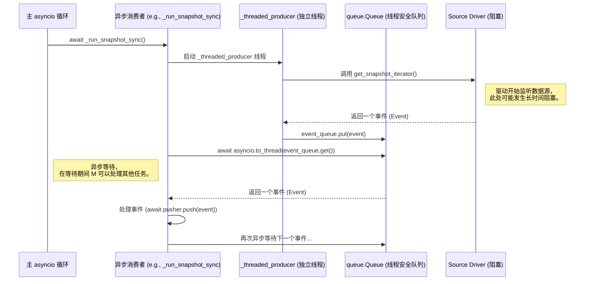
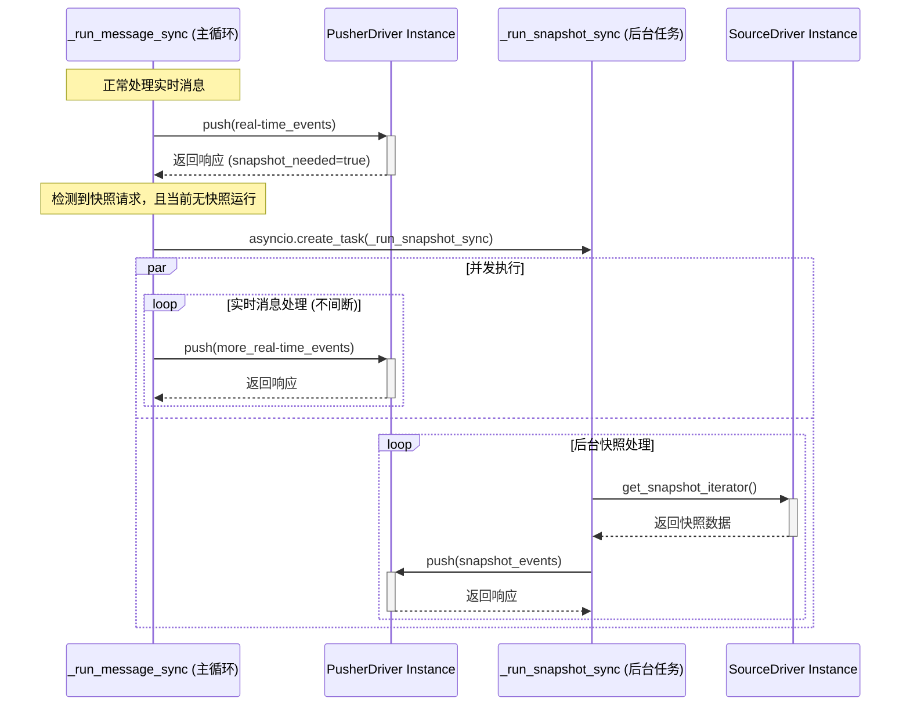

# Fustor Agent 异步与并发设计

## 1\. 核心挑战

Fustor Agent 的核心是基于 `asyncio` 构建的异步应用，它必须能同时高效地处理 Web API 请求、管理多个同步任务的生命周期以及执行内部逻辑。`asyncio` 的高效运行依赖于一个核心原则：**任何任务都不能长时间阻塞事件循环**。

然而，`Source` 驱动中的 `get_snapshot_iterator` 和 `get_message_iterator` 方法，通常被设计为**同步的、可能发生阻塞的生成器**。如果直接在主 `asyncio` 事件循环中调用这些方法，将会导致整个应用程序被“冻结”。

本文档详细阐述了 Fustor Agent 如何通过分层的并发模型来优雅地解决这一系列问题。

## 2\. 底层并发模型：解耦阻塞式 I/O

在 `EventBus` 和 `_run_snapshot_sync` 的内部，我们都采用了一种结合 `threading.Thread` 和线程安全队列 `queue.Queue` 的“生产者-消费者”模型，来将阻塞操作与主事件循环解耦。

### 工作原理

### 关键组件解析

1.  **专用的工作线程 (`_threaded_producer`)**: 当需要从一个阻塞式的迭代器（如驱动的 `get_..._iterator`）中获取数据时，我们会创建一个标准的 `threading.Thread`。这个线程的唯一职责就是去调用那个会阻塞的方法。由于它运行在独立的线程中，它的阻塞**完全不会影响主 `asyncio` 事件循环**。

2.  **线程安全的桥梁 (`queue.Queue`)**: 生产者线程获取到数据后，通过一个线程安全的 `queue.Queue` 将数据传递给主 `asyncio` 循环中的消费者。

3.  **异步消费者 (`asyncio.to_thread`)**: 主循环中的异步消费者通过 `await asyncio.to_thread(event_queue.get)` 来获取数据。这告诉 `asyncio` 调度器：“请将这个阻塞的 `get()` 操作放到工作线程池中执行，当它拿到结果时再来唤醒我。” 这样，主事件循环就**永远不会被 I/O 等待所阻塞**。

## 3\. 上层并发模型：并发快照回填

在我们新的“消息优先”架构下，系统引入了一种更高级的、基于 `asyncio.Task` 的并发模型，以实现在不中断实时同步的前提下，执行补充性质的快照。

### 工作原理

### 关键组件解析

1.  **主任务 (`_run_message_sync`)**: 这是 `SyncInstance` 的主控制循环，它永远以最高优先级运行，负责处理实时消息流。

2.  **信号检测**: 在每次 `push` 实时数据后，主任务会检查来自远端消费者的响应，看是否包含 `snapshot_needed: true` 的请求。

3.  **并发任务创建 (`asyncio.create_task`)**: 当收到快照请求，且当前没有其他快照在运行时（通过 `_is_snapshot_running` 标志判断），主任务会调用 `asyncio.create_task(self._run_snapshot_sync())`。这会**立即**创建一个新的 `Task` 并将其交给 `asyncio` 事件循环去调度，而主任务**不会等待**它，而是继续自己的循环，处理下一批实时消息。

4.  **后台任务 (`_run_snapshot_sync`)**: 这个 `async` 方法现在作为一个独立的、并发的后台任务运行。它内部依然使用第2节描述的“生产者-消费者”模型来拉取数据和推送数据。它的运行完全独立，不影响主任务。

5.  **状态同步 (`_is_snapshot_running` 标志)**: 这个布尔标志起到了一个简单的互斥锁（Mutex）的作用，确保在任何时候，对于同一个 `SyncInstance`，最多只有一个补充快照任务在运行。

通过这种两层并发模型的组合，Fustor Agent 既解决了底层驱动的 I/O 阻塞问题，又实现了上层业务逻辑的“实时不中断，后台异步回填”的高级功能。

## 4\. 资源管理与状态恢复

### 4.1 基于源签名的事件总线共享机制

为优化资源利用，Fustor Agent 引入了基于“源签名”的事件总线共享机制。如果多个同步任务实际指向同一个物理数据源，它们将共享同一个 `EventBusInstanceRuntime`，从而避免重复建立连接和拉取数据。

### 4.2 状态持久化与恢复的增强

`SyncInstanceDTO` 中持久化的 `bus_id` 字段，确保了在应用重启后，`SyncInstance` 能够恢复并重新连接到它之前所属的正确事件总线上。

### 4.3 总线分裂机制

当一个总线上存在消费速度差异过大的任务时，为防止“慢消费者”拖累“快消费者”，系统会自动触发总线分裂，为“快消费者”创建一个全新的独立总线，实现隔离。