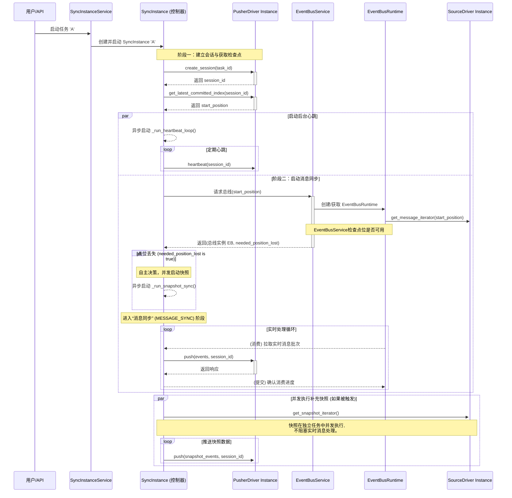
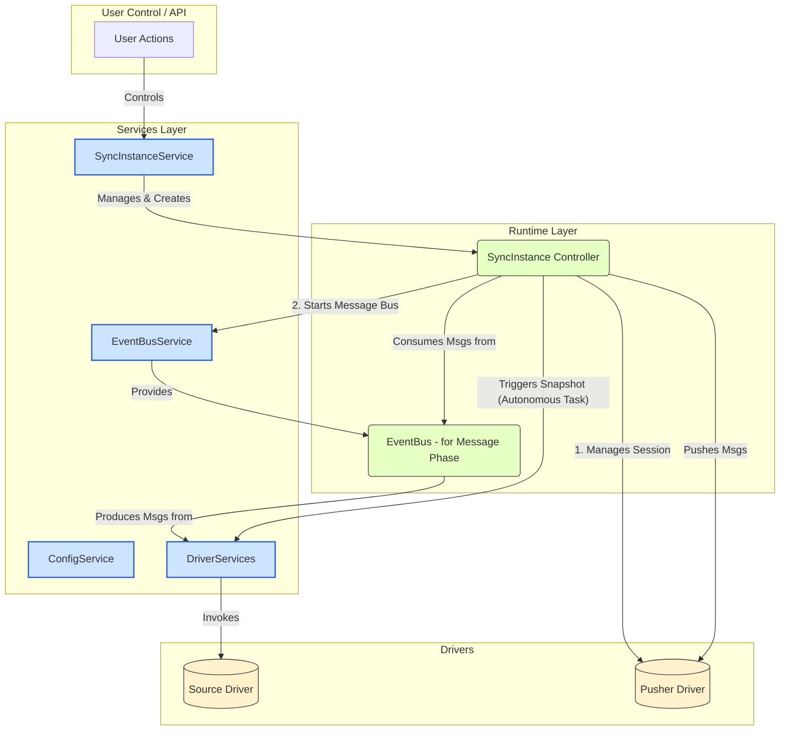

# Fustor Agent 核心架构与运行时设计

## 1\. 核心设计思想：服务编排与控制器实例

Fustor Agent 的运行时核心是围绕两大服务 (`SyncInstanceService`, `EventBusService`) 和一个核心控制器 (`SyncInstance`) 构建的。

1.  **`SyncInstanceService`**: 这是所有用户操作的**主入口**和**生命周期管理器**。它负责根据配置创建、启动、停止和管理 `SyncInstance` 的生命周期。

2.  **`SyncInstance`**: 这是同步任务的**总控制器**。它内部实现了一个状态机，负责管理与消费端的会话、心跳，并协调实时消息流与后台快照任务。

3.  **`EventBusService`**: 这是一个**主动的、专门的资源管理服务**。它在 `SyncInstance` 启动时，为其创建并运行一个 `EventBusInstanceRuntime`，该总线实例在后台独立地从源驱动拉取实时事件。

4.  **消息优先，自主快照 (Message-First, Autonomous Snapshot)**: 这是当前架构的核心原则，旨在为实时数据提供最低的延迟。
    *   **会话与检查点优先**: 任务启动后，首先与消费端建立一个**会话(Session)**，并获取上次同步的**检查点(Checkpoint)**。
    *   **默认启动消息同步**: `SyncInstance` 总是优先进入 `MESSAGE_SYNC` 阶段，立即开始监听和推送实时发生的变更。
    *   **自主决策快照**: 如果 `EventBusService` 在准备事件流时，发现源端无法满足所请求的检查点（即历史数据丢失），`SyncInstance` 会**自主地**、**并发地**启动一个补充性质的快照任务，无需消费端介入决策。

这种**服务编排**与**控制器实例**相结合的设计模式，带来了清晰的职责划分和强大的控制力。

## 2\. 核心运行时对象

  * **`EventBusInstanceRuntime`**: 事件总线的运行时实例。它封装了底层的 `MemoryEventBus`，并管理着一个后台生产者任务，该任务负责从 `Source` 驱动中拉取**实时消息**。

  * **`SyncInstance`**: 同步任务的运行时控制器。它负责：
      * 在初始化时，创建和持有其自身的**驱动实例**。
      * 管理与消费端的会话生命周期，包括创建会话(`create_session`)、获取会话ID(`session_id`)，以及通过一个后台任务(`_heartbeat_task`)定期发送心跳。
      * 管理核心状态标志和任务引用：`_snapshot_task` (持有后台快照任务的引用，通过检查其是否存在来判断快照是否在运行)、以及各种同步阶段的状态标识（`MESSAGE_SYNC`, `SNAPSHOT_SYNC` 等）。
      * 作为**主任务**，在消息阶段作为消费者从其分配到的 `EventBusInstanceRuntime` 中拉取实时事件。
      * 在检测到点位丢失时，作为**后台并发任务**，调用 `source_driver_instance.get_snapshot_iterator()` 来执行批量数据同步。
      * 实现状态机逻辑以跟踪任务生命周期，包括启动、运行、停止和错误状态的管理。

## 3\. 核心交互流程

以下是根据最终的“消息优先，自主快照”架构梳理出的核心运行时交互流程。

### A. 同步任务启动与自主快照流程

`SyncInstance` 作为控制器，在与消费端建立会话后，总是优先启动实时消息流。补充性质的快照是一个完全独立的、由Agent自身根据点位丢失情况自主触发的并发任务。

1.  **请求入口与创建**: 用户操作触发 `SyncInstanceService.start_one(sync_id)`，服务实例化一个 `SyncInstance` 控制器并启动其主控制循环。
2.  **建立会话与获取检查点**: `SyncInstance` 启动后，首先调用 `pusher_driver.create_session()` 与消费端建立会话，然后使用返回的 `session_id` 调用 `get_latest_committed_index()` 获取上次的同步点位 `start_position`。
3.  **启动心跳**: `SyncInstance` 并发启动一个后台心跳任务 `_run_heartbeat_loop`，定期向消费端发送心跳以保持会话有效。
4.  **请求总线与点位检查**: `SyncInstance` 带着 `start_position` 调用 `EventBusService` 请求事件总线。`EventBusService` 在此过程中会检查源驱动是否能从该点位提供数据。如果不能，它会返回 `needed_position_lost=True`。
5.  **自主触发并发快照**: 如果 `EventBusService` 返回 `needed_position_lost=True`，`SyncInstance` 会立即使用 `asyncio.create_task()` **异步启动**一个 `_run_snapshot_sync` 任务进行数据回填，然后**不等待其完成**，继续执行下一步。
6.  **执行消息同步**: `SyncInstance` 的主任务进入 `_run_message_sync` 方法，从 `EventBus` 获取从**最新可用点位**开始的实时事件流，并持续推送到消费端。
7.  **并发执行**: 实时消息同步和后台快照回填两个任务并发执行，互不阻塞。

### B. 总线分裂与任务停止

这两个机制基本保持不变，它们与核心的同步逻辑解耦。

## 4\. 总体架构图

