# Architecture

This document explains how Bag works internally, removing the "magic" and showing the underlying mechanisms.

## Core Data Model

A Bag is a container of `BagNode` objects. Each node has a label, a value, and optional attributes.

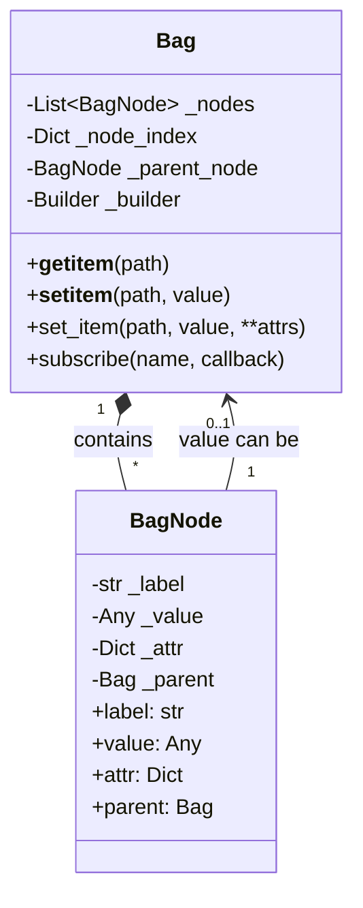

## Node Structure

Each `BagNode` holds:
- **label**: The node's name (key)
- **value**: Any Python object, including another Bag for nesting
- **attr**: Dictionary of metadata attributes

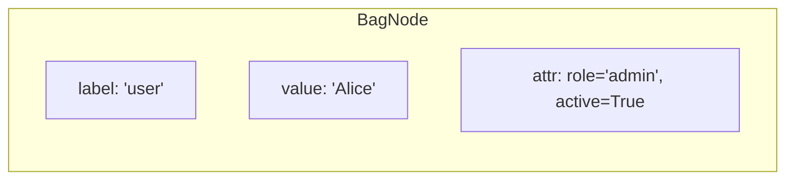

## Path Resolution

When you access `bag['a.b.c']`, the path is parsed and resolved step by step.

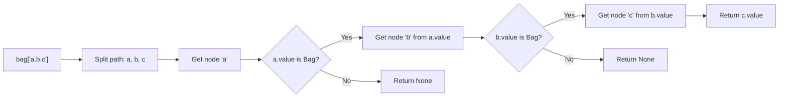

### Path Syntax

| Syntax | Meaning | Example |
|--------|---------|---------|
| `a.b.c` | Nested path | `bag['config.db.host']` |
| `#0` | Index access | `bag['#0']` (first node) |
| `key?attr` | Attribute access | `bag['user?role']` |
| `?attr` | Root attribute | `bag['?version']` |

## Attribute Access

Attributes are accessed using the `?` syntax in paths.

```mermaid
flowchart TB
    A["bag['user?role']"] --> B[Parse: key='user', attr='role']
    B --> C[Get node 'user']
    C --> D[Return node.attr['role']]

    E["bag.set_item('user', 'Alice', role='admin')"] --> F[Create/update node]
    F --> G[Set node.value = 'Alice']
    F --> H[Set node.attr['role'] = 'admin']
```

## Resolvers

Resolvers provide lazy loading. When a node's value is a Resolver, accessing it triggers resolution.

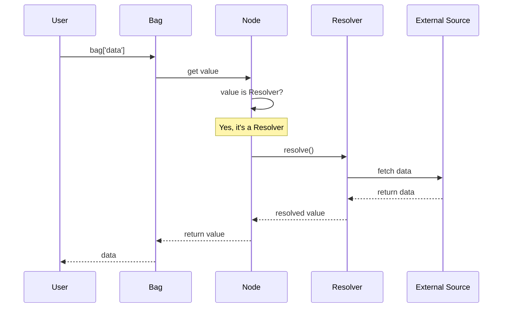

### Resolver Types

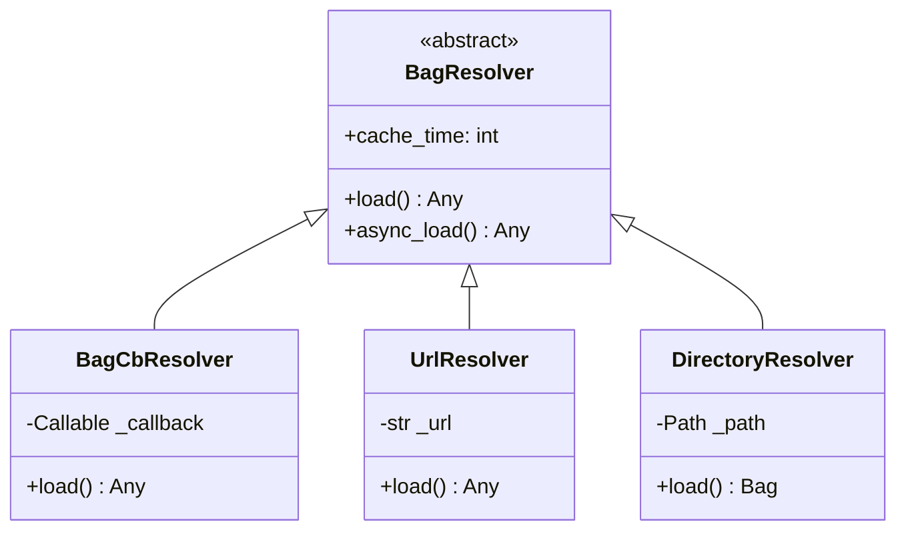

### Caching

Resolvers support caching to avoid repeated expensive operations.

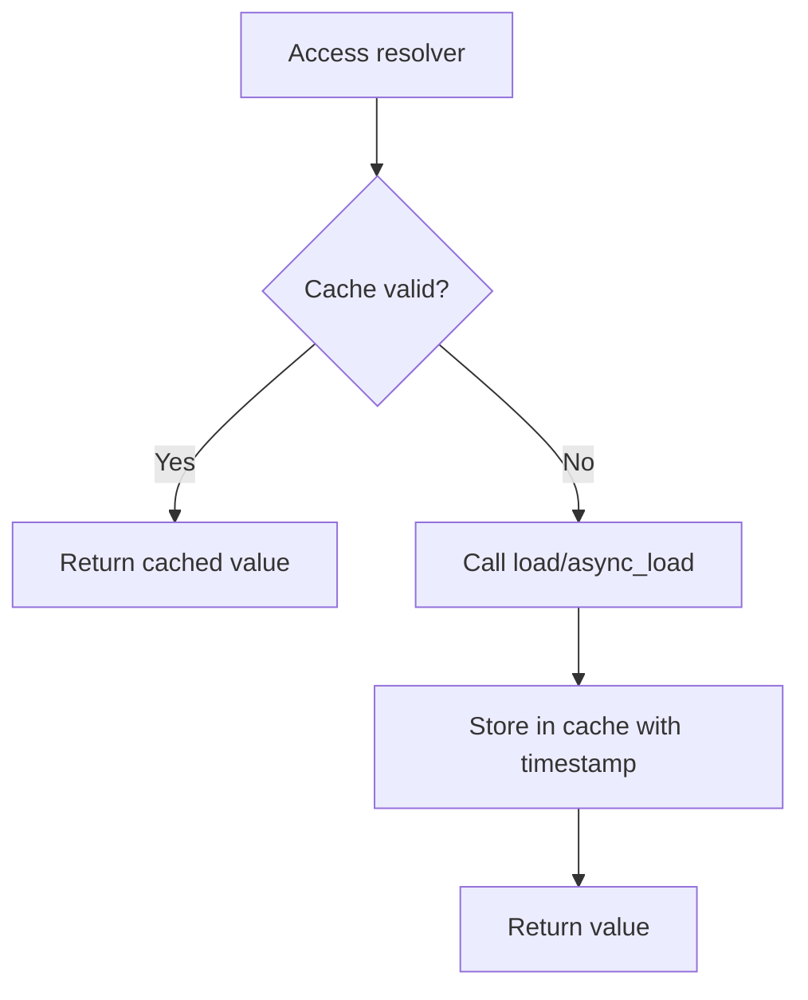

## Subscriptions

Subscriptions enable reactive programming by notifying callbacks when nodes change.

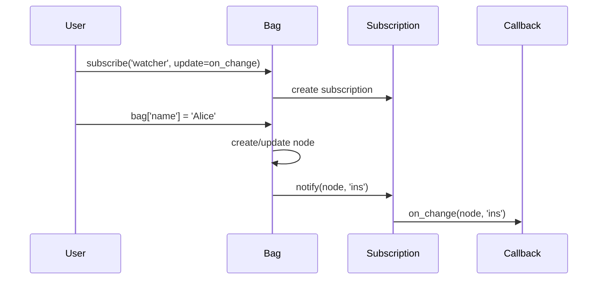

### Event Types

| Event | Trigger |
|-------|---------|
| `ins` | New node inserted |
| `upd_value` | Node value changed |
| `upd_attr` | Node attribute changed |
| `del` | Node deleted |

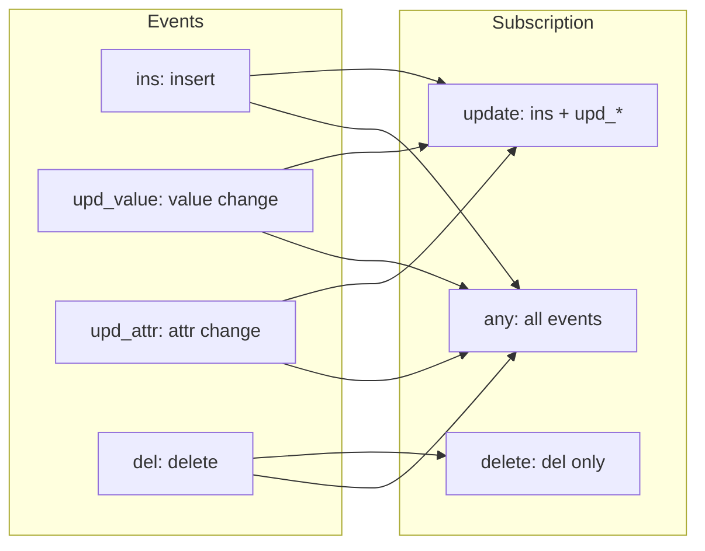

## Builders

Builders provide a fluent API for constructing Bags with structural validation.

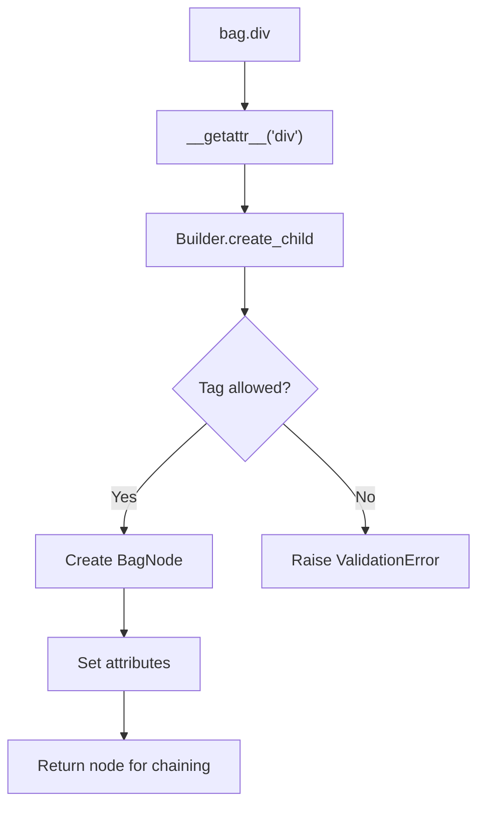

### Builder Hierarchy

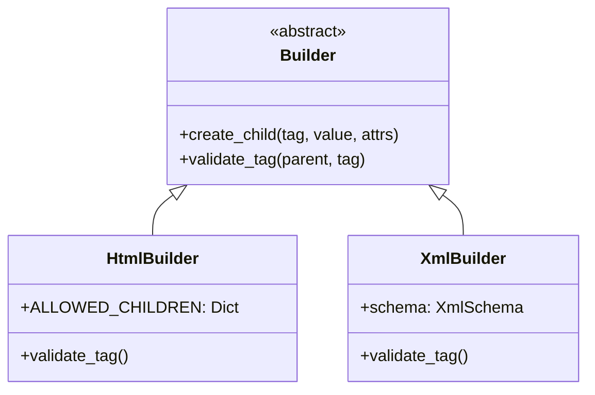

## Serialization

Bag supports multiple serialization formats.

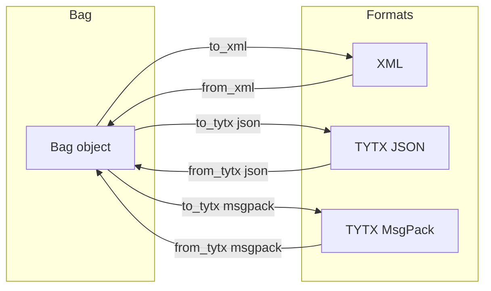

### TYTX Format

TYTX (Type-preserving Transfer) maintains Python types across serialization.

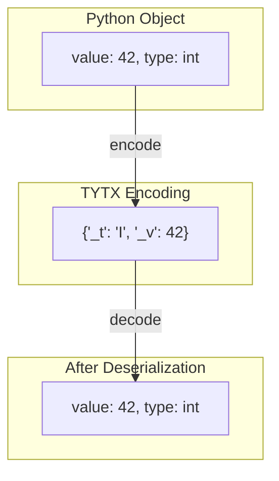

## Memory Layout

Understanding memory usage helps optimize for large Bags.

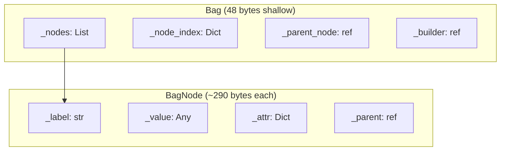

### Memory Scaling

| Items | Dict | Bag | Per-item |
|-------|------|-----|----------|
| 100 | 7.7 KB | 36 KB | ~290 bytes |
| 10,000 | 975 KB | 3.7 MB | ~289 bytes |
| 100,000 | 11.4 MB | 38.8 MB | ~288 bytes |

## Thread Safety

Bag is **not thread-safe** by default. For concurrent access:

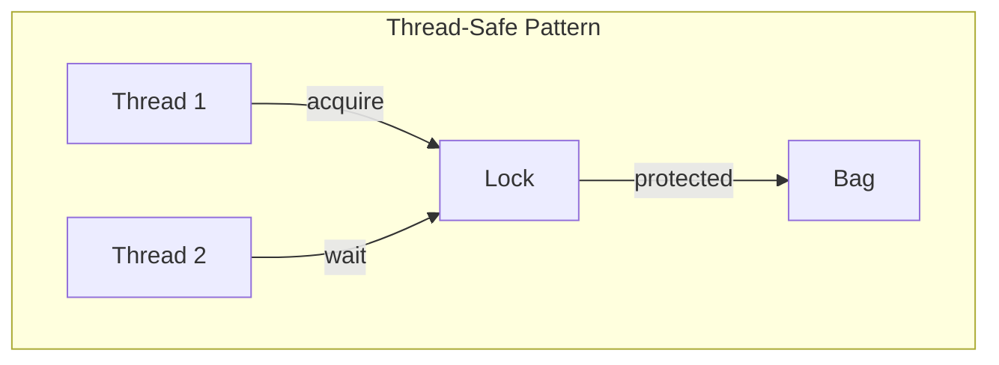

Recommended approach:
- Use a threading.Lock for write operations
- Or use separate Bag instances per thread
- Or use async with proper await patterns

## Complete Data Flow

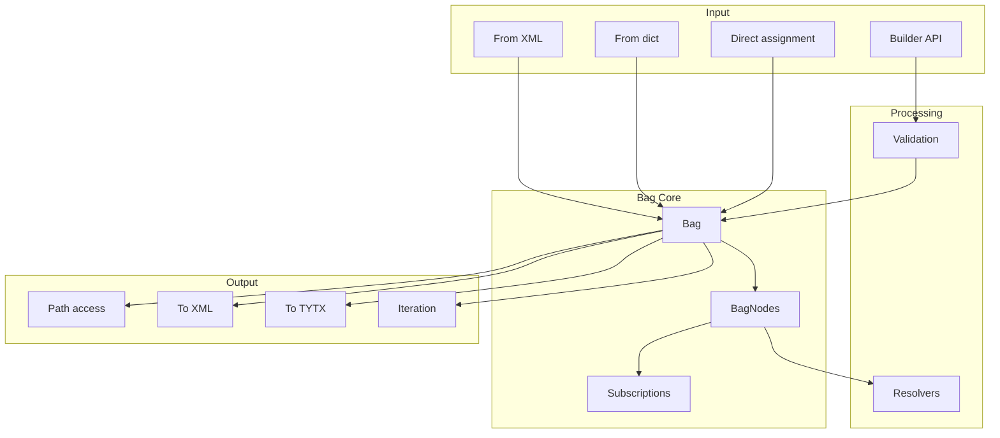

## Performance Characteristics

| Operation | Time Complexity | Notes |
|-----------|-----------------|-------|
| Direct access `bag['key']` | O(1) | Hash lookup |
| Path access `bag['a.b.c']` | O(n) | n = path depth |
| Index access `bag['#0']` | O(1) | List index |
| Insert | O(1) amortized | Creates BagNode |
| Delete | O(n) | n = number of nodes |
| Iteration | O(n) | n = number of nodes |
| Subscribe | O(1) | Register callback |
| Event dispatch | O(s) | s = number of subscribers |
