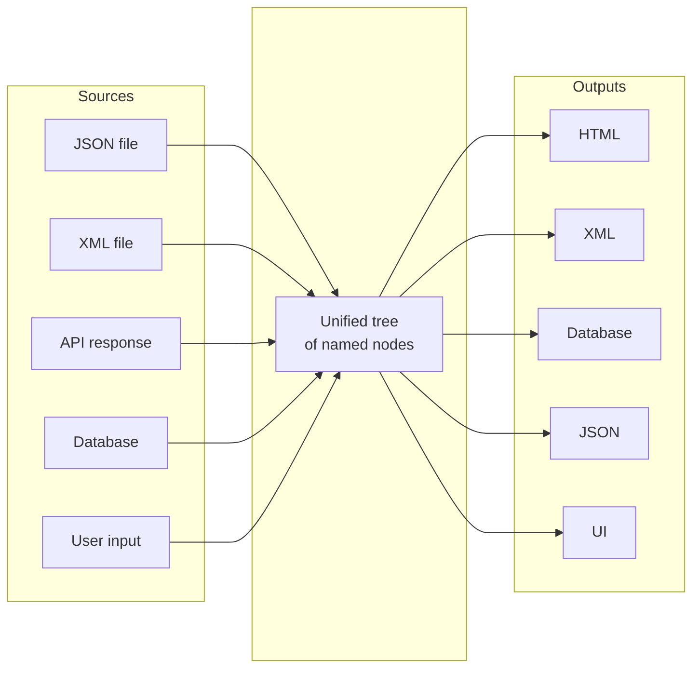

# genro-bag

[](https://pypi.org/project/genro-bag/)
[](https://github.com/genropy/genro-bag/actions/workflows/tests.yml)
[](https://codecov.io/gh/genropy/genro-bag)
[](https://genro-bag.readthedocs.io/)
[](https://www.python.org/downloads/)
[](https://opensource.org/licenses/Apache-2.0)

## An Intermediate Representation for Structured Data

A **Bag** is an intermediate representation (IR) for hierarchical data in Python.

### What is an Intermediate Representation?

In compiler design, an IR is a data structure that sits between source code and machine code. It captures the essential structure while abstracting away format-specific details, making it easier to analyze, transform, and generate output.

The same principle applies to data: configuration files, API responses, documents, and UI structures all share a common shape—**named things containing values, organized hierarchically, with metadata attached**—but we typically scatter this across dictionaries, classes, JSON, XML, and database rows.

A Bag provides a **canonical representation** for this common pattern:



### Why an IR?

**Decoupling**: Your application logic works with one structure, regardless of input/output formats. Change your data source from XML to JSON? Your code doesn't change.

**Uniformity**: One access pattern (`bag['path.to.value']`), one way to attach metadata, one subscription model—instead of learning different APIs for each library.

**Transformation**: Operate on the structure itself: walk the tree, filter nodes, transform values, validate structure—without knowing if it came from a file, an API, or a database.

**Round-tripping**: Serialize to XML, JSON, or MessagePack and back, preserving types, attributes, and structure—including lazy-loaded values (resolvers).

### The Core Model

Every node in a Bag has:

| Component | Purpose |
|-----------|---------|
| **Label** | The node's name (key in the hierarchy) |
| **Value** | The data it holds (any Python value, or another Bag) |
| **Attributes** | Metadata attached to the node |
| **Tag** | Optional semantic type (like XML elements) |

Access is path-based: `bag['config.database.host']` navigates the hierarchy using dot notation.

### Progressive Capability

Bag provides four layers—use only what you need:

| Layer | Purpose | Use When |
|-------|---------|----------|
| **Core Bag** | Paths, values, attributes, serialization | Always |
| **Resolvers** | Lazy-loaded, computed values | API calls, DB queries, expensive computations |
| **Subscriptions** | React to changes | Validation, logging, sync, computed properties |
| **Builders** | Domain-specific languages | HTML, Markdown, XML with structure validation |

## Interactive Notebooks

Try genro-bag directly in your browser with Google Colab:

| Notebook | Topics |
|----------|--------|
| [](https://colab.research.google.com/github/genropy/genro-bag/blob/main/notebooks/01-core-bag.ipynb) | **Core Bag** — Paths, values, attributes, serialization |
| [](https://colab.research.google.com/github/genropy/genro-bag/blob/main/notebooks/02-resolvers.ipynb) | **Resolvers** — Lazy loading, caching, custom resolvers |
| [](https://colab.research.google.com/github/genropy/genro-bag/blob/main/notebooks/03-subscriptions.ipynb) | **Subscriptions** — Events, validation, computed properties |
| [](https://colab.research.google.com/github/genropy/genro-bag/blob/main/notebooks/04-builders.ipynb) | **Builders** — DSL, structure validation, cardinality |

## Install

```bash
pip install genro-bag
```

## Documentation

| Resource | Description |
|----------|-------------|
| [**Full Documentation**](https://genro-bag.readthedocs.io/) | Complete guide with examples |
| [**Why Bag?**](https://genro-bag.readthedocs.io/en/latest/reference/why-bag.html) | Detailed comparison with alternatives |
| [**Getting Started**](https://genro-bag.readthedocs.io/en/latest/getting-started.html) | Learn the core concepts |

### In This Repository

| Directory | Description |
|-----------|-------------|
| [`src/genro_bag/`](src/genro_bag/) | Core implementation |
| [`src/genro_bag/resolvers/`](src/genro_bag/resolvers/) | Built-in resolvers (URL, Directory, OpenAPI) |
| [`src/genro_bag/builders/`](src/genro_bag/builders/) | Built-in builders (HTML, Markdown, XSD) |
| [`examples/`](examples/) | Usage examples |
| [`tests/`](tests/) | Test suite (1500+ tests) |
| [`docs/`](docs/) | Sphinx documentation source |

## Development

```bash
pip install -e ".[dev]"
pytest
```

## License

Apache License 2.0 — see [LICENSE](LICENSE) for details.

Copyright 2025 Softwell S.r.l. — Genropy Team
