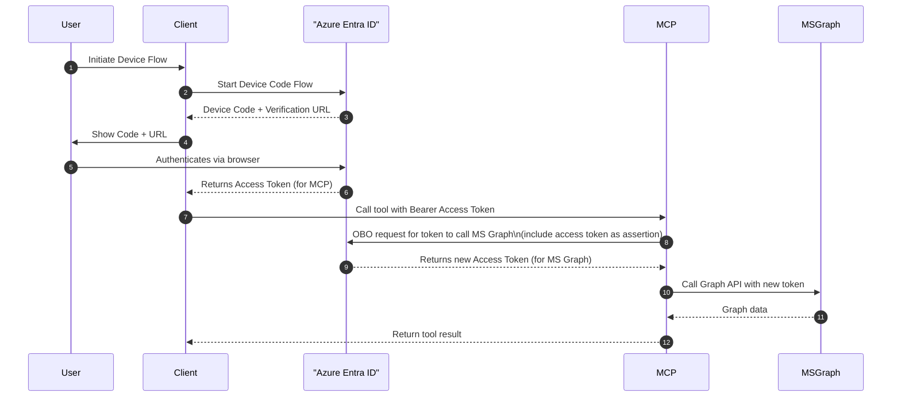

# On-behalf-of flow with Entra ID and FastMCP

Blog post: https://baeke.info/2025/07/29/end-to-end-authorization-with-entra-id-and-mcp/

## Instructions

### 1. Create and activate a Python virtual environment

```bash
python3 -m venv .venv
source .venv/bin/activate
```

### 2. Install dependencies

```bash
pip install -r requirements.txt
```

### 3. Set up environment variables

Create a `.env` file in the project root with the required Azure and API credentials (see example files for required variables).

### 4. Start the MCP server

```bash
python -m mcp.main
```

### 5. Run the MCP client

In a new terminal (with the virtual environment activated):

```bash
python mcp_client.py
```


## Diagrams

