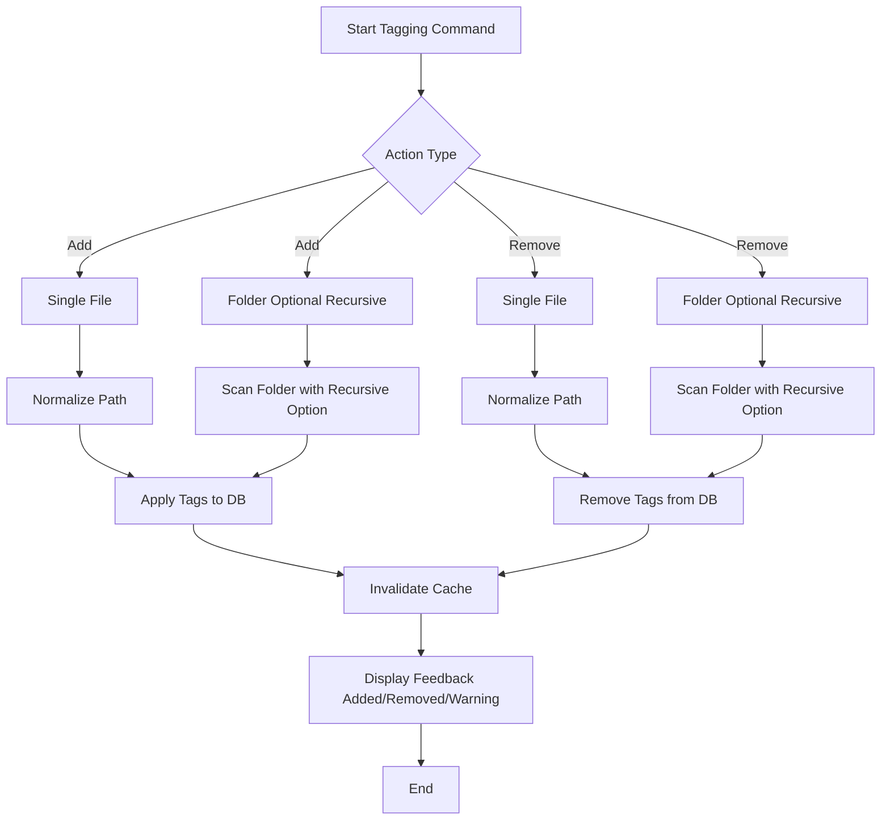

Here’s a complete, ready-to-use Markdown documentation for your tagging system, including a Mermaid diagram, examples, tips, and error handling:

````markdown
# Indexly Tagging System Documentation

The **Indexly Tagging System** allows you to add, remove, and list tags for files and folders. Tags can be applied to single files, multiple files, or recursively to entire folders.

---

## 🚀 Quick Start

1. **Index your folder** (if not already indexed):

```bash
indexly index "/path/to/folder"
````

2. **Add tags** to files or folders:

```bash
# Single file
indexly tag add --files "/path/to/file.txt" --tags important

# Multiple files
indexly tag add --files "/path/to/file1.txt" "/path/to/file2.txt" --tags report

# Entire folder, top-level only
indexly tag add --files "/path/to/folder" --tags projectX

# Entire folder recursively
indexly tag add --files "/path/to/folder" --tags projectX --recursive
```

3. **Remove tags**:

```bash
# Single file
indexly tag remove --files "/path/to/file.txt" --tags important

# Folder recursively
indexly tag remove --files "/path/to/folder" --tags projectX --recursive
```

4. **List tags**:

```bash
indexly tag list --file "/path/to/file.txt"
```

---

## ⚡ CLI Command Overview

| Action | Target         | Example Command                                                    | Notes                                     |
| ------ | -------------- | ------------------------------------------------------------------ | ----------------------------------------- |
| Add    | Single file    | `indexly tag add --files "file.txt" --tags tag1`                   | ✅ Adds tag1 to file.txt                   |
| Add    | Multiple files | `indexly tag add --files "file1.txt" "file2.txt" --tags tag1 tag2` | ✅ Adds tags to multiple files             |
| Add    | Folder         | `indexly tag add --files "/folder" --tags tag1`                    | Only top-level files unless `--recursive` |
| Remove | Single file    | `indexly tag remove --files "file.txt" --tags tag1`                | ❌ Removes tag1 from file.txt              |
| Remove | Folder         | `indexly tag remove --files "/folder" --tags tag1 --recursive`     | Removes tag1 from all files recursively   |
| List   | Single file    | `indexly tag list --file "file.txt"`                               | Displays tags on the file                 |

---

## 🖼️ Workflow Diagram



---

## 📝 Tips & Best Practices

* **Tag Naming**: Use lowercase, no spaces, or underscores (e.g., `project_x`).
* **Folder Tagging**: Use `--recursive` for large folders to include subfolders.
* **Positive Feedback**: ✅ Tags added, ❌ Tags removed, ⚠️ Warnings.
* **Cache Awareness**: Changes are reflected immediately in search results.

---

## ⚠️ Error Handling

* Adding tags without specifying `--tags` → warning: `"⚠️ No tags provided, nothing to do."`
* Removing tags that don’t exist → warning: `"⚠️ Tag 'example' not found for file.txt"`
* Folder provided without `--recursive` → only top-level files are processed.
* Listing tags for non-existing files → displays `"No tags"`.

---

## Example Workflow

```bash
# Index folder
indexly index "/projects/docs"

# Add tag to single file
indexly tag add --files "/projects/docs/report1.md" --tags important

# Add tag to entire folder recursively
indexly tag add --files "/projects/docs" --tags projectX --recursive

# Remove a tag from a folder recursively
indexly tag remove --files "/projects/docs" --tags projectX --recursive

# List tags of a file
indexly tag list --file "/projects/docs/report1.md"
```

---

## ✅ Summary

The tagging system supports:

* Single-file tagging (`add`, `remove`, `list`)
* Multi-file tagging
* Folder tagging with optional recursive flag
* Automatic database updates
* Cache invalidation for immediate effect
* Clear CLI feedback

This unified approach makes it easy to manage metadata and organize your indexed files effectively.

```

---

If you want, I can **also create a smaller “visual quick reference” Mermaid diagram showing single vs. folder tagging at a glance** that could go at the top of the doc for immediate understanding.  

Do you want me to add that?
```
