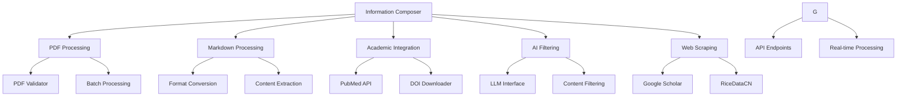

# Information Composer

<div align="center">

**A comprehensive toolkit for collecting, composing, and filtering information from various web resources with AI-powered markdown processing**

[](https://www.python.org/downloads/)
[](https://opensource.org/licenses/MIT)
[](https://information-composer.readthedocs.io/en/latest/?badge=latest)

[Installation](installation.md){ .md-button .md-button--primary }
[Quick Start](quickstart.md){ .md-button }
[API Reference](api/){ .md-button }

</div>

## 🚀 Features

### 📄 PDF Processing
- **Format Validation**: Verify PDF file integrity and format
- **Batch Processing**: Process multiple PDFs efficiently
- **Error Reporting**: Detailed error information and statistics

### 📝 Markdown Processing
- **Format Conversion**: Convert between Markdown and JSON
- **Content Extraction**: Extract headings, links, images, tables
- **Format Cleaning**: Clean and standardize Markdown format

### 🔬 Academic Literature Processing
- **PubMed Integration**: Query and process PubMed literature data
- **DOI Management**: Download and manage DOI references
- **Keyword Filtering**: Filter literature based on keywords

### 🤖 AI-Powered Filtering
- **LLM Integration**: Use Large Language Models for intelligent filtering
- **Content Analysis**: Smart analysis of document content
- **Automatic Classification**: Auto-classify and tag documents

### 🌐 Web Scraping
- **Google Scholar**: Crawl and process Google Scholar papers
- **RiceDataCN**: Parse gene data from RiceDataCN
- **Custom Crawlers**: Extensible web scraping framework


## 🏗️ Architecture



## 🚀 Quick Start

### Installation

```bash
# Clone the repository
git clone https://github.com/yourusername/information-composer.git
cd information-composer

# Create virtual environment
python -m venv .venv
source .venv/bin/activate  # Linux/macOS
# or
.venv\Scripts\activate     # Windows

# Install the package
pip install -e .
```

### Basic Usage

```bash
# Validate PDF files
pdf-validator document.pdf

# Filter markdown with LLM
md-llm-filter input.md output.md

# Search PubMed
pubmed-cli search "machine learning" -e your@email.com

```

## 📚 Documentation

### User Guides
- [Installation Guide](installation.md) - Setup and configuration
- [Quick Start](quickstart.md) - Get started in 5 minutes
- [Configuration](configuration.md) - Detailed configuration options

### Feature Guides
- [PDF Validation](guides/pdf-validator.md) - PDF processing and validation
- [Markdown Processing](guides/markdown-processing.md) - Markdown tools and utilities
- [DOI Download](guides/doi-download.md) - Download academic papers
- [PubMed Integration](guides/pubmed-integration.md) - Academic literature search
- [Google Scholar](guides/google-scholar-integration.md) - Web scraping
- [LLM Filtering](guides/llm-filtering.md) - AI-powered content filtering
- [RiceDataCN Integration](guides/ricedatacn-integration.md) - Rice gene data parsing

### Examples
- [Examples Overview](examples/README.md) - All code examples overview
- [PubMed Examples](examples/pubmed-examples.md) - PubMed query and data processing
- [DOI Download Examples](examples/doi-download-examples.md) - Academic paper downloads
- [Google Scholar Examples](examples/google-scholar-examples.md) - Scholar search examples
- [Markdown Processing Examples](examples/markdown-processing-examples.md) - Markdown conversion and filtering
- [LLM Filter Examples](examples/llm-filter-examples.md) - AI-powered content filtering
- [PDF Validator Examples](examples/pdf-validator-examples.md) - PDF validation examples
- [RiceDataCN Examples](examples/ricedatacn-examples.md) - Rice gene data parsing

### API Reference
- [Core API](api/core/) - Core functionality
- [PDF API](api/pdf/) - PDF processing
- [Markdown API](api/markdown/) - Markdown processing
- [PubMed API](api/pubmed/) - Academic literature
- [Sites API](api/sites/) - Web scraping
- [LLM Filter API](api/llm_filter/) - AI filtering

## 🛠️ Development

### Code Quality
- **Ruff**: Fast Python linter and formatter
- **MyPy**: Static type checking
- **Pytest**: Comprehensive testing framework
- **Coverage**: Code coverage analysis

### Contributing
- [Contributing Guide](development/contributing.md) - How to contribute
- [Code Quality](development/code-quality.md) - Development standards
- [Changelog](development/changelog.md) - Version history

## 📊 Performance

- **Concurrent Processing**: Multi-threaded operations
- **Caching**: Intelligent caching for expensive operations
- **Memory Efficient**: Optimized for large datasets
- **Error Recovery**: Graceful handling of failures

## 🌟 Use Cases

### Academic Research
- Literature collection and organization
- Document quality validation
- Content filtering and analysis
- Data standardization

### Document Management
- Batch document processing
- Format conversion
- Content extraction
- Quality assessment

### Information Processing
- Data cleaning
- Format standardization
- Content filtering
- Intelligent analysis

## 🤝 Community

- **GitHub**: [information-composer](https://github.com/yourusername/information-composer)
- **Issues**: [Report bugs or request features](https://github.com/yourusername/information-composer/issues)
- **Discussions**: [Community discussions](https://github.com/yourusername/information-composer/discussions)

## 📄 License

This project is licensed under the MIT License - see the [LICENSE](../LICENSE) file for details.

## 🙏 Acknowledgments

- [MkDocs Material](https://squidfunk.github.io/mkdocs-material/) for documentation
- [pypdfium2](https://github.com/pypdfium2-team/pypdfium2) for PDF processing
- [DashScope](https://dashscope.aliyun.com/) for LLM integration
- [PubMed](https://pubmed.ncbi.nlm.nih.gov/) for academic literature

---

<div align="center">

**Information Composer** - Making information processing simpler, smarter, and more efficient!

[Get Started Now](quickstart.md){ .md-button .md-button--primary }

</div>
