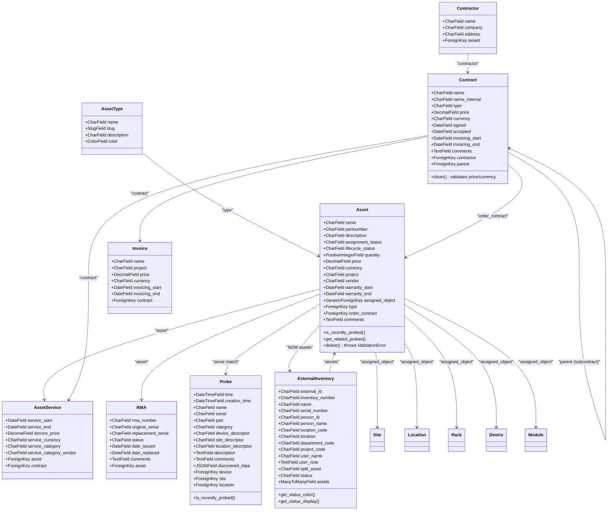

# NetBox Inventory Monitor Plugin

A comprehensive NetBox plugin for asset management with semi-automatic discovery processes. This plugin extends NetBox with powerful inventory tracking capabilities, including asset lifecycle management, probe monitoring, contract tracking, and RMA (Return Merchandise Authorization) processing.

[](https://github.com/CESNET/inventory-monitor-plugin)
[](https://github.com/netbox-community/netbox)
[](https://www.python.org/)

---

## Features

- **🏷️ Asset Management**: Track physical and logical assets with detailed metadata
- **📊 Probe Monitoring**: Visual status indicators for discovery data populated by external scripts (e.g., SNMP scans)
- **📝 Contract Tracking**: Manage contracts, contractors, and invoicing with multi-currency support
- **🔄 RMA Processing**: Complete RMA workflow with serial number tracking
- **🏢 External Inventory**: Integration with external inventory systems with configurable status mappings
- **🛠️ Asset Services**: Track maintenance and service contracts with multi-currency pricing
- **📈 Lifecycle Management**: Full asset lifecycle status tracking
- **🔍 Advanced Search**: Powerful filtering and search capabilities with GraphQL support
- **🎨 Visual Interface**: Rich UI with status indicators and color coding
- **🔌 NetBox Integration**: Native NetBox plugin following best practices
- **💱 Multi-Currency Support**: Configurable currency support for all financial fields (assets, contracts, invoices, services)

---

## Table of Contents

- [Features](#features)
- [Data Model Overview](#data-model-overview)
- [Data Models](#data-models)
- [Installation](#installation)
- [Upgrade Guide](#upgrade-guide)
- [Configuration](#configuration)
- [Usage](#usage)
- [Development](#development)
- [License](#license)
- [Acknowledgments](#acknowledgments)

---

## Data Model Overview



---

## Data Models

### String Representations & Readability

All models have optimized `__str__` methods designed for **human readability** and **easy searching** without relying on primary keys. The format is intuitive and includes contextual information relevant to each model type.

**Design Principles:**
- **Natural key first**: Most distinguishing identifier appears first (e.g., RMA number before asset)
- **Context in parentheses**: Related information in `(parentheses)` for clarity
- **Hierarchy in brackets**: Parent/child or relationship context in `[brackets]`
- **No PK prefix**: Primary keys omitted for cleaner, more searchable text
- **Status visibility**: Important status information included where relevant

**String Representation Examples:**

| Model | Format | Example |
|-------|--------|---------|
| **Asset** | `partnumber [serial] (vendor)` | `PROD-123 [SN12345] (Dell)` |
| **Probe** | `serial - name` | `SN12345 - Server-01` |
| **Contractor** | `name (company) [tenant]` | `John Doe (ACME Corp) [Tenant1]` |
| **Contract** | `name (internal_name) [Sub: parent] via contractor` | `Main Contract (MC-001) via ACME Corp` |
| **Invoice** | `name (contract_name) [project] price currency` | `Invoice-Q1 (Main Contract) [PRJ-001] 5000.00 EUR` |
| **AssetService** | `asset_serial (contract_name) [category]` | `SN12345 (Service Contract) [Maintenance]` |
| **RMA** | `RMA#number asset_serial [status]` | `RMA#12345 PROD-123 [SN12345] [Approved]` |
| **AssetType** | `name (description)` | `Server (High-performance computing)` |
| **ExternalInventory** | `inventory_number name [SN: serial] → person_name` | `INV-001 Server Hardware [SN: ABC123] → John Smith` |

**Search Optimization:**
These representations are optimized for text-based searching in:
- NetBox admin UI dropdowns and choice fields
- Search bars and filters
- API response bodies
- Logs and audit trails
- Reports and exports

The absence of primary key prefixes makes searching by name, serial number, or other identifying fields significantly easier.

### Description Fields & UI Display

Most models in the Inventory Monitor plugin include a **description** field that provides additional context and details. These descriptions are automatically displayed in form choice fields (dropdowns) thanks to NetBox's built-in JavaScript functionality.

**Models with Description Fields:**
- **Asset**: Asset description
- **AssetType**: Asset type description  
- **Probe**: Discovery information and probe notes
- **Contractor**: Contractor company/vendor description
- **Contract**: Contract terms and conditions summary
- **Invoice**: Invoice notes and project references
- **AssetService**: Service scope and terms

**How It Works:**
When you're selecting from a choice field in a form (e.g., selecting an Asset Type, selecting a Contract, or selecting a linked Probe record), the description field is automatically shown as secondary text below the primary identifier in the dropdown. This makes it easier to identify and select the correct item without having to navigate to the detail page.

**Example:**
```
Asset Type Dropdown:
┌─────────────────────────────────────┐
│ #1: Server                          │
│ High-performance computing          │  ← Description shown in gray
│                                     │
│ #2: Network Equipment               │
│ Networking devices                  │  ← Description shown in gray
└─────────────────────────────────────┘
```

**String Representations:**
All models use optimized string representations for human readability and searchability (see [String Representations & Readability](#string-representations--readability) section above):
- Format varies by model type to show the most relevant identifying information
- Natural keys appear first (serial numbers, contract names, RMA numbers)
- Related context is shown in parentheses or brackets
- Primary keys are omitted for cleaner text display

### Core Models

#### **Asset**
The central model representing physical or logical inventory items.

**Key Fields:**
- `serial`: Unique identifier for the asset (**required**)
- `partnumber`: Manufacturer part number
- `description`: Asset description
- `assignment_status`: Current assignment status (reserved, deployed, loaned, stocked)
- `lifecycle_status`: Lifecycle stage (new, in_stock, in_use, in_maintenance, retired, disposed)
- `assigned_object`: Generic foreign key to NetBox objects (Device, Site, Location, Rack, Module)
- `type`: Link to AssetType for categorization
- `order_contract`: Associated purchase contract
- `project`: Project identifier
- `vendor`: Vendor name
- `quantity`: Number of items (default: 1, must be ≥ 0)
- `price`: Asset purchase price (DecimalField, nullable, must be ≥ 0)
- `currency`: Price currency (CharField, nullable - required only when price is set and non-zero)
- `warranty_start/end`: Warranty period tracking
- `comments`: Additional notes

**Special Features:**
- Probe status integration with `is_recently_probed()` method
- Generic assignment to Site, Location, Rack, Device, Module via GenericForeignKey
- Integration with External Inventory systems via many-to-many relationship
- Multi-currency support with configurable currency codes and symbols
- Currency validation enforced: *if price is set (non-zero), currency is required*
- **Deletion protection**: Cannot delete an Asset with an `order_contract` (prevents orphaned contract references). User must clear the contract first. Also prevents deletion when linked to external inventory items.
- External inventory assignment management with dedicated form
- Comprehensive filtering including external inventory number search
- Probe matching via serial number (current and RMA serials)

#### **Probe**
Discovery and monitoring data collection points populated by external scripts (e.g., SNMP discovery tools).

**Key Fields:**
- `time`: Timestamp of the probe data collection (last probe time)
- `creation_time`: Timestamp when the probe was first discovered (first discovery)
- `serial`: Device serial number - links to Asset via serial number matching
- `name`: Device name or description
- `part`: Part number or model identifier
- `category`: Probe type/category classification
- `device_descriptor`, `site_descriptor`, `location_descriptor`: Context information from discovery
- `device`, `site`, `location`: Foreign keys to actual NetBox objects (if resolved)
- `description`: Additional discovery information
- `comments`: User notes about the probe
- `discovered_data`: JSON field for flexible data storage from external tools

**Features:**
- Many-to-many probe matching: matches by current serial, original RMA serial, and replacement RMA serial
- `is_recently_probed()` method for status indicators
- Used to find: what's actually deployed vs. what's in inventory
- Helps detect duplicates and unrecorded assets
- First discovery and last probe times tracked separately

**Note**: Probe data is populated by external discovery scripts, not generated by the plugin itself.

#### **Contract & Contractor**
Business relationship management with full currency support.

**Contractor Features:**
- `name`: Contractor/vendor name (**required**)
- `company`: Company legal name
- `address`: Business address
- `description`: Contractor description and notes
- `tenant`: Optional NetBox tenant association for multi-tenant deployments
- `comments`: Additional contractor information
- Searchable by name, company, address, description, and tenant

**Contract Features:**
- `name`: Contract identifier (**required**)
- `name_internal`: Internal reference name (**required**)
- `type`: Contract type (supply, order, service, other)
- `description`: Contract description and terms summary
- `price`: Contract value (DecimalField, nullable)
- `currency`: Contract currency (CharField, nullable - required only when price > 0)
- `signed`: Date contract was signed
- `accepted`: Date contract was accepted
- `invoicing_start/end`: Invoicing period dates
- `contractor`: Foreign key to Contractor/Vendor
- `parent`: Self-referential FK for subcontracts (one level only)
- `comments`: Contract notes

**Validation Rules:**
- Hierarchical contracts (parent/child relationships) - **one level only** (subcontract cannot itself have a parent)
- Subcontract can have a different contractor than the parent (allows complex procurement hierarchies)
- **Price-Currency validation**: If price is set (non-zero), currency is required; if currency is set, price must be set
- `invoicing_start` must not be after `invoicing_end`
- Convenience properties: `contract_type` returns "subcontract" vs "contract"

**Invoice Tracking:**
- Invoice records tied to contracts with name, internal name, project, and description
- Multi-currency support for invoices (invoice_price, currency)
- Invoicing date range tracking (invoicing_start, invoicing_end)
- Full searchability across all invoice fields

#### **RMA (Return Merchandise Authorization)**
Complete RMA workflow management with serial number tracking.

**Key Fields:**
- `rma_number`: RMA reference number (unique when provided, optional for draft RMAs)
- `asset`: Foreign key to Asset being returned/replaced (**required**)
- `original_serial`: Serial number of the failed/returned hardware
- `replacement_serial`: Serial number of the replacement hardware
- `status`: RMA status (pending, shipped, received, investigating, approved, rejected, completed)
- `date_issued`: When the RMA was created
- `date_replaced`: When the replacement was installed/received
- `issue_description`: Description of the issue with the asset (**required**)
- `vendor_response`: Vendor response/resolution details

**Key Features:**
- **Flexible RMA numbering**: `rma_number` supports NULL values for draft RMAs, enforces uniqueness only on non-empty values (via `UniqueConstraint`)
- Automatic serial tracking: `original_serial` auto-populated from asset when RMA created
- Automatic probe matching: both original and replacement serials are used for probe matching
- Asset lifecycle tracking: helps maintain historical record of hardware replacements
- Bidirectional serial tracking: enables finding all probes related to an asset through its RMA history
- Auto-update asset serial: When RMA status changes to COMPLETED, asset serial is automatically updated to replacement_serial
- Status workflow: move through RMA lifecycle states (pending → shipped → received → investigating → approved/rejected → completed)
- Composite display using `str_no_pk()` to avoid ID duplication in string representation
- Integration with Asset: allows viewing all RMAs for an asset including serial changes

#### **AssetService**
Service and maintenance contract tracking with multi-currency support.

**Key Fields:**
- `service_start`: Service contract start date
- `service_end`: Service contract end date
- `service_price`: Service cost (DecimalField, nullable)
- `service_currency`: Service currency (CharField, nullable - required only when service_price > 0)
- `service_category`: Service category/type classification
- `service_category_vendor`: Vendor for the service category
- `description`: Service scope and terms description
- `asset`: Foreign key to Asset being serviced
- `contract`: Foreign key to related Contract
- `comments`: Service notes

**Features:**
- Service period management with date tracking
- Pricing with multi-currency support (service_price, service_currency)
- Category and vendor tracking for service classification
- **Price-Currency validation**: Currency is required only when service price is set
- Links to both Assets and Contracts for complete service history
- Date status tracking for service lifecycle (upcoming, active, completed)
- Composite display using `str_no_pk()` to avoid ID duplication when both asset and contract are linked
- Searchable by asset, contract, description, dates, and price ranges

#### **ExternalInventory**
Integration with external inventory management systems.

**Key Fields:**
- `external_id`: Unique identifier from external system
- `inventory_number`: Asset number from external system
- `name`: Item name or description
- `serial_number`: Serial or production number
- `person_id/person_name`: Responsible person information
- `location_code/location`: Location information
- `department_code`: Department code
- `project_code`: Project code
- `user_name/user_note`: User information and notes
- `split_asset`: Whether this is a split/shared asset
- `status`: Current status code (configurable via plugin settings)
- `assets`: Many-to-many relationship with Assets (handles splits and mappings)

**Features:**
- Many-to-many relationship with Assets (one external record can map to multiple internal assets for splits)
- Configurable status display with labels and colors (via plugin settings)
- Dynamic status tooltips with customizable templates
- Project code tracking for accounting/billing
- RMA integration: external_id used for RMA matching and display
- Comprehensive filtering by all fields
- Status methods: `get_status_color()` and `get_status_display()` for UI rendering
- **Deletion protection**: Cannot delete external inventory items that have associated assets (prevents orphaned references)

---

## Installation

### Compatibility

| Plugin Version | NetBox Version | Tested on |
| ------------- |:-------------| :-----------:|
| 7.0.0+        | 3.7.x        | 3.7.x        |
| 8.0.0+        | 4.0.x        | 4.0.x        |
| 9.0.0+        | 4.1.x        | 4.1.x        |
| 10.0.0 - 10.1.x | 4.2.x      | 4.2.x        |
| 10.2.0 - 10.3.x | 4.3.x      | 4.3.x        |
| 11.0.0+       | 4.4.x        | 4.4.0        |
| 12.0.0+       | 4.4.x        | 4.4.0        |
| 13.0.0+       | 4.5.x        | 4.5.0        |

### Requirements

- NetBox 4.5.0 or higher
- Python 3.12 or higher

### From PyPI (Recommended)

```bash
pip install inventory-monitor
```

### From Source

```bash
git clone https://github.com/CESNET/inventory-monitor-plugin.git
cd inventory-monitor-plugin
pip install .
```

### NetBox Configuration

1. Add the plugin to your NetBox `configuration.py`:

```python
PLUGINS = [
    "inventory_monitor",
]
```

2. Run database migrations:

```bash
python manage.py migrate
```

3. Restart NetBox services:

```bash
sudo systemctl restart netbox netbox-rq
```

---

## Upgrade Guide

### Upgrading to v12.0.0

**Version 12.0.0** brings full **NetBox v4 compatibility** with significant internal changes:

#### Breaking Changes

None - this version maintains full backward compatibility with existing data and APIs.

#### Migration Details

**NetBox v4 API Update (ObjectType Migration)**

Starting with NetBox v4, the plugin has been updated to use NetBox's new `ObjectType` API instead of Django's deprecated `ContentType`. This is an internal change with **no user-facing impact**:

- ✅ All asset assignments continue to work as before (Device, Site, Location, Rack, Module)
- ✅ All API endpoints remain compatible and functional
- ✅ All existing data is automatically compatible
- ✅ Search functionality expanded to include Module in searchable object types
- ✅ Database schema unchanged - no data migration required

**Technical Details:**

The following components have been updated for NetBox v4 compatibility:
- API Serializers: Updated to use `ObjectType` for assigned object handling
- Filtersets: Enhanced asset search now includes Module filtering
- Forms: Updated assignment object handling for NetBox v4 API
- Template Tags: Updated for ObjectType-based model lookups
- Template Content: Updated caching system for hierarchical asset views

**Plugin Compatibility Fix**

The plugin now properly handles tag field reverse accessor conflicts when multiple inventory plugins are installed simultaneously. All models now use unique `related_name` values for their tags fields to prevent Django's `fields.E304` reverse accessor clash errors.

- ✅ Resolves conflicts with other inventory plugins (e.g., ARNES netbox_inventory)
- ✅ Maintains full tagging functionality
- ✅ No user-facing changes required

#### Upgrade Steps

1. **Backup your database** (recommended)
2. **Update the plugin:**
   ```bash
   pip install --upgrade inventory-monitor
   ```
3. **No manual migration required** - the plugin automatically handles the transition
4. **Restart NetBox services:**
   ```bash
   sudo systemctl restart netbox netbox-rq
   ```

#### Verification

After upgrading, verify that:
- Assets display correctly in the NetBox interface
- Asset search returns expected results including Module assignments
- API requests to asset endpoints work as expected
- No errors appear in NetBox logs

---

## Configuration

### Plugin Settings

Configure the plugin in your NetBox `configuration.py`:

```python
PLUGINS_CONFIG = {
    "inventory_monitor": {
        # Probe Status Settings
        "probe_recent_days": 7,  # Days to consider probe "recent"
        
        # Currency Settings
        "currencies": [
            ("CZK", "Czech Koruna", "Kč"),
            ("EUR", "Euro", "€"),
            ("USD", "US Dollar", "$"),
            ("GBP", "British Pound", "£"),
            ("JPY", "Japanese Yen", "¥"),
        ],
        "default_currency": "EUR",  # Default currency for new records
        
        # External Inventory Status Configuration (Optional)
        "external_inventory_status_config": {
            "1": {"label": "Active", "color": "success"},
            "0": {"label": "Pending Activation", "color": "warning"},
            "2": {"label": "Decommissioned", "color": "danger"},
        },
        
        # Custom tooltip template for status display (Optional)
        "external_inventory_tooltip_template": "<span class='badge text-bg-{color}'>{code}</span> {label}",
    }
}
```

### Configuration Options

#### Probe Status Settings
- **`probe_recent_days`** (default: 7): Number of days to consider a probe "recent". Affects visual indicators and status badges.

#### Currency Settings
- **`currencies`** (default: see example above): List of available currencies for all financial models (Assets, Contracts, Invoices, AssetServices). Each item is a tuple of `(currency_code, display_name, symbol)`. 
  - `currency_code`: Currency identifier (e.g., "EUR", "USD", "CZK") - no length restrictions
  - `display_name`: Human-readable name shown in forms
  - `symbol`: Currency symbol for display (e.g., "€", "$", "Kč") - **optional** (if omitted, currency code is used)
- **`default_currency`** (default: "EUR"): Default currency code used when creating new records. Must match one of the codes in the `currencies` list.

**Price and Currency Validation:**
- Price fields are DecimalField (max_digits=19, decimal_places=2, nullable)
- **`price = None`**: No pricing information - currency optional
- **`price = 0`**: Free/no charge - currency optional  
- **`price > 0`**: Actual cost - currency **required** and validated in model's clean() method
- Applies to: Asset.price, Contract.price, Invoice.price, AssetService.service_price

#### External Inventory Status Configuration
- **`external_inventory_status_config`** (optional): Maps status codes to display labels and Bootstrap colors. If not configured, status displays as-is without special formatting.
- **`external_inventory_tooltip_template`** (optional, default: `"<span class='badge text-bg-{color}'>{code}</span> {label}"`): Template string for formatting status tooltips

**Status Configuration Structure:**
```python
{
    "status_code": {
        "label": "Human readable label",
        "color": "bootstrap_color_class"  # primary, secondary, success, danger, warning, info, light, dark
    }
}
```

**Template Variables:**
- `{code}`: The status code
- `{label}`: The display label from configuration
- `{color}`: The Bootstrap color class

**How it works:**
- ExternalInventory model provides `get_status_color()` and `get_status_display()` methods
- Status badge shown in tables using configured colors
- Tooltip generated dynamically from all configured statuses
- Form help text automatically populated with available status codes
- If not configured, displays raw status value without special formatting

### Integration with NetBox Attachments

For file attachments, install and configure [netbox-attachments](https://github.com/Kani999/netbox-attachments):

```bash
pip install netbox-attachments
```

### Customizing Field Choices

The plugin provides several configurable choice fields that can be customized via NetBox's `FIELD_CHOICES` configuration. This allows you to replace default choices or extend them with additional options.

#### Available Choice Fields

**Asset Model:**
- `inventory_monitor.Asset.assignment_status`: Assignment status (Reserved, Deployed, Loaned, Stocked)
- `inventory_monitor.Asset.lifecycle_status`: Lifecycle status (New, In Stock, In Use, In Maintenance, Retired, Disposed)

**Contract Model:**
- `inventory_monitor.Contract.type`: Contract type (Supply, Order, Service, Other)

**RMA Model:**
- `inventory_monitor.RMA.status`: RMA status (Pending, Shipped to Vendor, Received by Vendor, Under Investigation, Approved, Rejected, Completed)

#### Default Choices Reference

**Asset Assignment Status** (`inventory_monitor.Asset.assignment_status`):
```python
[
    ('reserved', 'Reserved', 'cyan'),
    ('deployed', 'Deployed', 'green'),
    ('loaned', 'Loaned', 'blue'),
    ('stocked', 'Stocked', 'gray'),
]
```

**Asset Lifecycle Status** (`inventory_monitor.Asset.lifecycle_status`):
```python
[
    ('new', 'New', 'green'),
    ('in_stock', 'In Stock', 'blue'),
    ('in_use', 'In Use', 'cyan'),
    ('in_maintenance', 'In Maintenance', 'orange'),
    ('retired', 'Retired', 'red'),
    ('disposed', 'Disposed', 'gray'),
]
```

**Contract Type** (`inventory_monitor.Contract.type`):
```python
[
    ('supply', 'Supply Contract', 'green'),
    ('order', 'Order', 'red'),
    ('service', 'Service Contract', 'orange'),
    ('other', 'Other', 'blue'),
]
```

**RMA Status** (`inventory_monitor.RMA.status`):
```python
[
    ('pending', 'Pending', 'yellow'),
    ('shipped', 'Shipped to Vendor', 'blue'),
    ('received', 'Received by Vendor', 'blue'),
    ('investigating', 'Under Investigation', 'blue'),
    ('approved', 'Approved', 'green'),
    ('rejected', 'Rejected', 'red'),
    ('completed', 'Completed', 'green'),
]
```

#### Customization Examples

**Replace Asset Assignment Status choices** (in `configuration.py`):
```python
FIELD_CHOICES = {
    'inventory_monitor.Asset.assignment_status': (
        ('reserved', 'Reserved for Order', 'info'),
        ('active', 'Active/Deployed', 'success'),
        ('storage', 'In Storage', 'warning'),
        ('disposal', 'Pending Disposal', 'danger'),
    )
}
```

**Extend (append to) Asset Lifecycle Status choices**:
```python
FIELD_CHOICES = {
    'inventory_monitor.Asset.lifecycle_status+': (
        ('quarantine', 'Quarantine', 'dark'),
        ('damaged', 'Damaged', 'danger'),
    )
}
```

**Replace Contract Type choices**:
```python
FIELD_CHOICES = {
    'inventory_monitor.Contract.type': (
        ('purchase', 'Purchase Agreement', 'success'),
        ('maintenance', 'Maintenance Contract', 'info'),
        ('warranty', 'Warranty', 'primary'),
        ('lease', 'Lease Agreement', 'warning'),
    )
}
```

**Extend RMA Status choices**:
```python
FIELD_CHOICES = {
    'inventory_monitor.RMA.status+': (
        ('refund', 'Refunded', 'success'),
        ('warranty_claim', 'Warranty Claim', 'info'),
    )
}
```

**Available Colors**: `blue`, `indigo`, `purple`, `pink`, `red`, `orange`, `yellow`, `green`, `teal`, `cyan`, `gray`, `black`, `white`

Alternatively, Bootstrap semantic colors are also supported: `primary`, `secondary`, `success`, `danger`, `warning`, `info`, `light`, `dark`

For more information on NetBox field choice configuration, see the [NetBox documentation](https://netboxlabs.com/docs/netbox/configuration/data-validation/#field_choices).

---

## Usage

### Accessing the Plugin

After installation, the plugin adds an "Inventory Monitor" section to the NetBox navigation menu with the following sections:

#### Assets
- **Assets**: Main asset inventory management
- **Asset Types**: Asset categorization and classification
- **RMA**: Return Merchandise Authorization tracking
- **External Inventory**: External system integration
- **Services**: Asset service and maintenance contracts

#### Network Probe
- **Probes**: Discovery and monitoring data
- **Data Locations**: Probe data organization

#### Contracts
- **Contractors**: Vendor and service provider management
- **Contracts**: Business agreement tracking
- **Invoices**: Billing and invoice management

### Basic Workflow

1. **Set up Asset Types**: Define categories for your assets
2. **Add Contractors**: Register vendors and service providers
3. **Create Contracts**: Define business agreements
4. **Register Assets**: Add inventory items with full metadata
5. **Populate Probe Data**: Use external scripts (SNMP, discovery tools) to populate monitoring data
6. **Track Services**: Manage maintenance and service contracts
7. **Process RMAs**: Handle return merchandise authorizations

### Probe Status Monitoring

The plugin provides visual feedback for probe status:
- **Green indicators**: Recent probes (within configured days)
- **Red indicators**: Stale probes (older than configured threshold)
- **Status badges**: Clear visual indicators in asset lists and details

### Asset Assignment

Assets can be assigned to any NetBox object using GenericForeignKey:
- Devices
- Sites
- Locations
- Racks
- Modules

### External Inventory Assignment

The plugin provides a dedicated form (`AssetExternalInventoryAssignmentForm`) for managing the many-to-many relationship between Assets and External Inventory items. This form:

- **Skips unrelated model validation** - Overrides `_post_clean()` to avoid validating price/currency when only managing external inventory relationships
- **Uses `clean_fields()` instead of `full_clean()`** - Prevents cross-field validation errors for fields not in the form
- **Manages only the many-to-many relationship** - Doesn't modify other Asset fields like price, currency, serial, etc.
- **Creates snapshots** - Automatically creates snapshots of ExternalInventory items when relationships change
- **Accessible via Asset detail page** - "Edit External Inventory" button provides direct access

This specialized form prevents validation errors like `'AssetExternalInventoryAssignmentForm' has no field named 'currency'` that would occur if the full Asset model validation ran.

---

## Development

### Architecture Overview

The plugin follows NetBox plugin best practices:

#### Models Architecture
```
Asset ←→ Probe (via serial number matching)
Asset → AssetType
Asset → Contract (order_contract)
Asset ← GenericForeignKey (assigned to Device, Site, Location, Rack, Module)
Asset ←→ RMA (via serial numbers: original_serial, replacement_serial)
Asset ←→ ExternalInventory (many-to-many via assets field)
Asset ← AssetService (via asset ForeignKey)

Contract → Contractor (via contractor ForeignKey)
Contract → Contract (parent, self-referential for hierarchical contracts)
Contract ← Invoice (via contract ForeignKey)
Contract ← AssetService (via contract ForeignKey)

ExternalInventory ←→ Asset (many-to-many relationship)
ExternalInventory ← RMA (matched via external_id for display)
```

#### Key Components
1. **Models**: Core business logic with probe status methods, currency validation, date status mixins
2. **Views**: Standard NetBox generic views (ObjectView, ObjectListView, ObjectEditView, ObjectDeleteView, BulkEditView, BulkImportView, BulkDeleteView)
3. **Tables**: Django-tables2 with probe status indicators, color-coded status badges, custom column templates
4. **Forms**: NetBox forms with custom validation, currency choices, specialized assignment forms
5. **Filtersets**: Comprehensive filtering for all models with custom lookups
6. **Templates**: Custom templates with integrated status visualization, HTMX support for dynamic updates
7. **API**: DRF-based REST API following NetBox patterns with full CRUD operations
8. **GraphQL**: Strawberry GraphQL schema with queries for all models
9. **Template Tags**: Custom template tags for status display and external inventory tooltips
10. **Settings Helpers**: Centralized configuration access via settings.py module

### Performance Considerations

- **Database Optimizations**: Proper indexing on frequently queried fields (serial, inventory_number, status, etc.)
- **Query Optimization**: Use of `select_related()` and `prefetch_related()` in views and tables
- **Caching**: Consider caching probe status for large asset lists
- **M2M Relationships**: External inventory assignments use efficient many-to-many queries

### Settings Access Pattern

```python
# Recommended approach - use helper functions
from inventory_monitor.settings import (
    get_probe_recent_days,
    get_currency_choices,
    get_external_inventory_status_config_safe,
    get_external_inventory_tooltip_template,
)

days = get_probe_recent_days()
currencies = get_currency_choices()
status_config, is_configured = get_external_inventory_status_config_safe()
tooltip_template = get_external_inventory_tooltip_template()

# Alternative approach - direct settings access
from inventory_monitor.settings import get_plugin_settings
settings = get_plugin_settings()
days = settings.get("probe_recent_days", 7)
```

---

## License

This project is licensed under the Apache License 2.0. See the LICENSE file for more details.

---

## Acknowledgments

- Built for the [NetBox](https://github.com/netbox-community/netbox) ecosystem
- Part of the CESNET infrastructure management toolkit