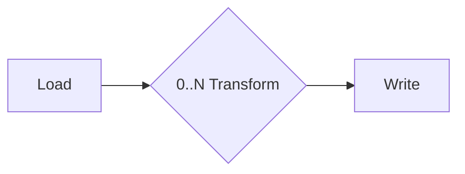

# Lakehouse Plumber

<div align="center" ">
  
</div>
<div align="center">

[](https://badge.fury.io/py/lakehouse-plumber)
[](https://github.com/Mmodarre/Lakehouse_Plumber/actions/workflows/python_ci.yml)
[](https://opensource.org/licenses/Apache-2.0)
[](https://github.com/Mmodarre/Lakehouse_Plumber)
[](https://codecov.io/gh/Mmodarre/Lakehouse_Plumber)
[](https://lakehouse-plumber.readthedocs.io/)
[](https://www.databricks.com/product/data-engineering)
[](https://pepy.tech/projects/lakehouse-plumber)

</div>

*Because every Lakehouse needs a good plumber to keep the flows running smoothly!* 🚰

- Metadata-driven frameworks that does not want to become your next enterprise blackbox.

- The YAML-driven Metadata framework for Databricks Lakeflow Spark Declarative Pipelines (formerly Lakeflow Pipeliness).

- The only Metadata framework that generates production ready Pyspark code for Lakeflow Spark Declarative Pipelines

## 🆕 What's New

- **Long live Lakeflow Spark Declarative Pipelines!**: LHP now fully refactored to use Lakeflow Spark Declarative Pipelines (SDP) instead of Lakeflow Spark Declarative Pipelines (SDP) API, as per Databricks latest update to unify the API for both Lakeflow and Lakeflow Spark Declarative Pipelines (Formerly Delta Live Tables).

- **Lakeflow Spark Declarative Pipelines Sink Support**: Write data to external systems (JDBC, REST APIs, Kafka) and Delta tables. Perfect for integrating your lakehouse with downstream systems.

- **Multi-FlowGroup Support**: Organize your data pipelines with multiple flowgroup YAML files within a single pipeline. (e.g., `customers.yaml`, `orders.yaml`, `products.yaml`) Perfect for when multiple flows are usign the same template to further avoide boilerplate config and reduce file count.

- **Customizable Pipeline Configuration**: Configure DLT pipeline settings (compute, runtime, notifications) via YAML files with support for project-level defaults and pipeline-specific overrides. Perfect for managing different requirements across dev/test/prod environments.

- **Customizable Job Configuration**: Generate orchestration jobs with custom configuration for concurrency, performance targets, notifications, schedules, and permissions. Use environment-specific configs (e.g., `job_config-dev.yaml`, `job_config-prod.yaml`) to maintain appropriate settings across your SDLC.

## 📚 Documentation 
Full [documentation](https://lakehouse-plumber.readthedocs.io/) is available on ReadTheDocs.

## ⚡ Why Lakehouse Plumber?

**Core principles of a good Metadata framework:**

✅ **It should…**

- **Eliminate repetitive boiler-plate** so you spend time on business logic, not plumbing.

- **Standardise Lakehouse platform and quality** – For instance, all tables in Bronze layer should have the same Delta table properties.

- **Remain transparent** – the generated Python files are readable, version-controlled and exactly what runs in production.

- **Fit naturally into DataOps workflows** (CI/CD, automated testing, environments).

- **Be easy to debug** – The generated Python code is readable and can be debugged in the Databricks IDE for faster troubleshooting and development cycles.

- **Provide a pathway to data democratisation** – Allow power users and non-technical teams to create artifacts while upholding platform standards.

❌ **And it should NOT…**

- **Introduce runtime overhead** (no compiling configurations at runtime to generate pipelines).

- **Obscure or wrap Databricks features** – you still work with notebooks, Unity Catalog, DLT UI.

- **Make debugging harder** – any failures can be debugged using Databricks' IDE and AI (Databricks Assistant).

- **Lock you in** – the output is plain Python & SQL that you control.

Transform repetitive data pipeline development with action-based configurations. Generate production-ready Python code from simple YAML definitions while maintaining full transparency and Databricks native features.

### Real-World Example

Instead of repeating load code like this **50 times for 50 tables**:

```python

   # Generated by LakehousePlumber
   from pyspark.sql import functions as F
   from pyspark import pipelines as dp
   
   @dp.temporary_view()
   def v_customer_raw():
       """Load customer table from raw schema"""
       df = spark.readStream \
           .table("acmi_edw_dev.edw_raw.customer")
       df = df.withColumn('_processing_timestamp', F.current_timestamp())
       return df
   
   @dp.temporary_view(comment="SQL transform: customer_bronze_cleanse")
   def v_customer_bronze_cleaned():
       """SQL transform: customer_bronze_cleanse"""
       return spark.sql("""SELECT
         c_custkey as customer_id,
         c_name as name,
         c_address as address,
         -- ... 50+ more lines of transformations
       FROM stream(v_customer_raw)""")
   
   # ... 50+ more lines of data quality, table creation, etc.
```

We create **one reusable template**:

```yaml
   name: csv_ingestion_template
   description: "Standard template for ingesting CSV files"
   
   parameters:
     - name: table_name
       required: true
     - name: landing_folder
       required: true
   
   actions:
     - name: load_{{ table_name }}_csv
       type: load
       source:
         type: cloudfiles
         path: "{landing_volume}/{{ landing_folder }}/*.csv"
         format: csv
         options:
           header: True
           delimiter: "|"
           cloudFiles.schemaEvolutionMode: "addNewColumns"
       target: v_{{ table_name }}_cloudfiles
   
     - name: write_{{ table_name }}_cloudfiles
       type: write
       source: v_{{ table_name }}_cloudfiles
       write_target:
         type: streaming_table
         database: "{catalog}.{raw_schema}"
         table: "{{ table_name }}"
```

And our pipeline code becomes this simple **5-line configuration per table**:

```yaml
   pipeline: raw_ingestions
   flowgroup: customer_ingestion
   
   use_template: csv_ingestion_template
   template_parameters:
     table_name: customer
     landing_folder: customer
```

**Result:** 4,300 lines of repetitive Python → 250 lines total (1 template + 50 simple configs)

## Core Workflow

The execution model is deliberately simple:



1. **Load**    Ingest raw data from CloudFiles, Delta, JDBC, SQL, or custom Python.
2. **Transform**   Apply *zero or many* transforms (SQL, Python, schema, data-quality, temp-tables…).
3. **Write**   Persist results as Streaming Tables, Materialized Views, or Snapshots.

## Features at a Glance

- **Actions** – Load | Transform | Write with many sub-types.
- **Presets & Templates** – reuse patterns without copy-paste.
- **Substitutions** – environment-aware tokens & secret references.
- **CDC & SCD** – change-data capture SCD type 1 and 2 and snapshot ingestion.
- **Append Flows** – append data to existing streaming tables.(multi source write to single target table)
- **Data-Quality** – declarative expectations integrated into transforms.
- **Operational Metadata** – custom audit columns and metadata.
- **Smart State Management** – regenerate only what changed; cleanup orphaned code. (Terraform-like state management)
- **IntelliSense** – VS Code schema hints & YAML completion.
- **Seeding** – seed data from existing tables using Lakeflow native features.

## What is the output of Lakehouse Plumber?

LHP is designed as a transparent "white box" system, ensuring that all generated code and logic are fully accessible and easy to understand. This approach allows users to leverage the advantages of Databricks Lakeflow Spark Declarative Pipelines (LDP) while upholding enterprise-level code quality avoid repetitive boilerplate code...

As such, the output of LHP is a set of Python files that can be used to create Databricks Lakeflow Spark Declarative Pipelines.

```python

   # Generated by LakehousePlumber
   # Pipeline: raw_ingestions
   # FlowGroup: customer_ingestion

   from pyspark.sql import functions as F
   from pyspark import pipelines as dp

   # Pipeline Configuration
   PIPELINE_ID = "raw_ingestions"
   FLOWGROUP_ID = "customer_ingestion"

   # ============================================================================
   # SOURCE VIEWS
   # ============================================================================

   # Schema hints for customer_cloudfiles table
   customer_cloudfiles_schema_hints = """
      c_custkey BIGINT,
      c_name STRING,
      c_address STRING,
      c_nationkey BIGINT,
      c_phone STRING,
      c_acctbal DECIMAL(18,2),
      c_mktsegment STRING,
      c_comment STRING
      """.strip().replace("\n", " ")


   @dp.temporary_view()
   def v_customer_cloudfiles():
    """Load customer CSV files from landing volume"""
    df = spark.readStream \
        .format("cloudFiles") \
        .option("cloudFiles.format", "csv") \
        .option("header", True) \
        .option("delimiter", "|") \
        .option("cloudFiles.maxFilesPerTrigger", 11) \
        .option("cloudFiles.inferColumnTypes", False) \
        .option("cloudFiles.schemaEvolutionMode", "addNewColumns") \
        .option("cloudFiles.rescuedDataColumn", "_rescued_data") \
        .option("cloudFiles.schemaHints", customer_cloudfiles_schema_hints) \
        .load("/Volumes/acmi_edw_dev/edw_raw/landing_volume/customer/*.csv")


      # Add operational metadata columns
      df = df.withColumn('_record_hash', F.xxhash64(*[F.col(c) for c in df.columns]))
      df = df.withColumn('_source_file_size', F.col('_metadata.file_size'))
      df = df.withColumn('_source_file_modification_time', F.col('_metadata.file_modification_time'))
      df = df.withColumn('_source_file_path', F.col('_metadata.file_path'))

    return df


   # ============================================================================
   # TARGET TABLES
   # ============================================================================

   # Create the streaming table
   dp.create_streaming_table(
      name="acmi_edw_dev.edw_raw.customer",
      comment="Streaming table: customer",
      table_properties={"delta.autoOptimize.optimizeWrite": "true", "delta.enableChangeDataFeed": "true"})


   # Define append flow(s)
   @dp.append_flow(
      target="acmi_edw_dev.edw_raw.customer",
      name="f_customer_cloudfiles",
      comment="Append flow to acmi_edw_dev.edw_raw.customer"
   )
   def f_customer_cloudfiles():
      """Append flow to acmi_edw_dev.edw_raw.customer"""
      # Streaming flow
      df = spark.readStream.table("v_customer_cloudfiles")

      return df
```

## Core Features

### Action-Based Architecture

LHP has 100% coverage of Databricks Lakeflow Spark Declarative Pipelines (ETL) through **Load**, **Transform**, **Write**, and **Test** actions:

#### Load Actions

- **CloudFiles**: Auto Loader for streaming files (JSON, Parquet, CSV, Avro, ORC, XML)
- **Delta**: Read from existing Delta tables with CDC support
- **JDBC**: Connect to external databases
- **SQL**: Execute custom SQL queries
- **Python**: Custom Python data sources

#### Transform Actions

- **SQL**: Standard SQL transformations
- **Python**: Custom Python transformations
- **Data Quality**: Apply expectations and validation rules
- **Schema**: Column mapping and type casting
- **Temp Table**: Create reusable temporary streaming tables

#### Write Actions

- **Streaming Table**: Live tables with change data capture
- **Materialized View**: Batch-computed analytics views
- **Append Flow**: Append data to streaming tables from multiple sources
- **CDC**: Change Data Capture Type 1 and 2 and from snapshots

#### Test Actions (🆕 New!)

- **Row Count**: Compare record counts between sources with tolerance
- **Uniqueness**: Validate primary key and unique constraints
- **Referential Integrity**: Check foreign key relationships
- **Completeness**: Ensure required fields are populated
- **Range**: Validate values are within expected bounds
- **Schema Match**: Compare schema consistency across tables
- **All Lookups Found**: Validate dimension lookups succeed
- **Custom SQL**: User-defined test queries with expectations
- **Custom Expectations**: Apply complex business rules as DLT expectations

### Template & Preset System

- **Templates**: Parameterized action patterns for common use cases
- **Presets**: Reusable configuration snippets for standardization
- **Environment Management**: Multi-environment support with variable substitution

### Advanced Capabilities  

- **Append Flow API**: Efficient multi-stream ingestion with automatic table creation management
- **Smart Generation**: Content-based file writing - only regenerate what actually changed
- **Databricks Asset Bundles**: Full integration for enterprise deployment workflows
- **VS Code IntelliSense**: Complete auto-completion and validation for YAML configurations
- **Secret Management**: Secure credential handling with scope-based organization and `dbutils.secrets`
- **Operational Metadata**: Flexible metadata column creation

## Get started in 5 minutes

### Installation & Setup

```bash
# Install Lakehouse Plumber
pip install lakehouse-plumber

# Initialize new project
lhp init my_lakehouse_project --bundle
cd my_lakehouse_project

```

### Create Your First Pipeline

```yaml
# pipelines/bronze_ingestion/customers.yaml
  pipeline: tpch_sample_ingestion  # Grouping of generated python files in the same folder
   flowgroup: customer_ingestion   # Logical grouping for generated Python file

   actions:
      - name: customer_sample_load     # Unique action identifier
        type: load                     # Action type: Load
        readMode: stream              # Read using streaming CDF
        source:
           type: delta                # Source format: Delta Lake table
           database: "samples.tpch"   # Source database and schema in Unity Catalog
           table: customer_sample     # Source table name
        target: v_customer_sample_raw # Target view name (temporary in-memory)
        description: "Load customer sample table from Databricks samples catalog"

      - name: transform_customer_sample  # Unique action identifier
        type: transform                  # Action type: Transform
        transform_type: sql             # Transform using SQL query
        source: v_customer_sample_raw   # Input view from previous action
        target: v_customer_sample_cleaned  # Output view name
        sql: |                          # SQL transformation logic
           SELECT
           c_custkey as customer_id,    # Rename key field for clarity
           c_name as name,              # Simplify column name
           c_address as address,        # Keep address as-is
           c_nationkey as nation_id,    # Rename for consistency
           c_phone as phone,            # Simplify column name
           c_acctbal as account_balance, # More descriptive name
           c_mktsegment as market_segment, # Readable column name
           c_comment as comment         # Keep comment as-is
           FROM stream(v_customer_sample_raw)  # Stream from source view
        description: "Transform customer sample table"

      - name: write_customer_sample_bronze  # Unique action identifier
        type: write                         # Action type: Write
        source: v_customer_sample_cleaned   # Input view from previous action
        write_target:
           type: streaming_table            # Output as streaming table
           database: "{catalog}.{bronze_schema}"  # Target database.schema with substitutions
           table: "tpch_sample_customer"    # Final table name
        description: "Write customer sample table to bronze schema"
```

### Configure & Generate

```bash
# Configure environment variables
# Edit substitutions/dev.yaml with your settings

# Validate configuration
lhp validate --env dev

# Generate production-ready Python code
lhp generate --env dev 

# Deploy with Databricks Bundles (optional)
databricks bundle deploy --target dev
```

## Enterprise Features

### Databricks Asset Bundles Integration

Full integration with Databricks Asset Bundles for enterprise-grade deployment:

```yaml
# databricks.yml - automatically detected
targets:
  dev:
    mode: development
    workspace:
      host: https://your-workspace.cloud.databricks.com
  prod:
    mode: production
    workspace:
      host: https://your-prod-workspace.cloud.databricks.com

resources:
  pipelines:
    bronze_ingestion:
      name: "bronze_ingestion_${bundle.target}"
      libraries:
        - file:
            path: ./generated/bronze_load
```

### Multi-Environment DataOps Workflow

```bash
# Development
lhp generate --env dev
databricks bundle deploy --target dev

# Staging  
lhp generate --env staging
databricks bundle deploy --target staging

# Production
lhp generate --env prod
databricks bundle deploy --target prod
```

## Project Structure

LakehousePlumber organizes your data pipeline code for maximum reusability and maintainability:

```
my_lakehouse_project/
├── lhp.yaml                    # Project configuration
├── presets/                    # Reusable configuration standards
│   ├── bronze_layer.yaml          #   Bronze layer defaults  
│   ├── silver_layer.yaml          #   Silver layer standards
│   └── gold_layer.yaml            #   Analytics layer patterns
├── templates/                  # Parameterized pipeline patterns
│   ├── standard_ingestion.yaml    #   Common ingestion template
│   └── scd_type2.yaml             #   Slowly changing dimension template
├── pipelines/                  # Your pipeline definitions  
│   ├── bronze_ingestion/          #   Raw data ingestion
│   │   ├── customers.yaml         #     Customer data flow
│   │   └── orders.yaml            #     Order data flow
│   ├── silver_transforms/         #   Business logic transformation
│   │   └── customer_dimension.yaml#     Customer dimensional model
│   └── gold_analytics/            #   Analytics and reporting
│       └── customer_metrics.yaml  #     Customer analytics
├── substitutions/              # Environment-specific values
│   ├── dev.yaml                   #   Development settings
│   ├── staging.yaml               #   Staging settings  
│   └── prod.yaml                  #   Production settings
├── expectations/               # Data quality rules
│   └── customer_quality.yaml      #   Customer data validation
└── generated/                  # Generated Python code (auto-managed)
    ├── bronze_load/               #   Generated bronze pipelines
    ├── silver_load/               #   Generated silver pipelines  
    └── gold_load/                 #   Generated analytics pipelines
```

## VS Code IntelliSense Support

**Automatically configured** when you run `lhp init` - no additional setup required!

### What You Get

- **Smart Auto-completion** - Context-aware suggestions for all fields
- **Real-time Validation** - Immediate error detection and feedback  
- **Inline Documentation** - Hover descriptions for every configuration option
- **Schema Validation** - Ensures correct YAML structure
- **Always Up-to-date** - Latest schema definitions included with every new project

### Supported Files

- Pipeline configurations (`pipelines/**/*.yaml`)
- Templates (`templates/**/*.yaml`)
- Presets (`presets/**/*.yaml`)
- Environment settings (`substitutions/**/*.yaml`)
- Project configuration (`lhp.yaml`)

### How It Works

When you create a new project, LHP automatically:
1. Creates `.vscode/settings.json` with schema associations
2. Copies the latest JSON schema files to `.vscode/schemas/`
3. Configures YAML validation, completion, and formatting

Simply open your project in VS Code and start editing YAML files!

### Generated Optimized Code

```python
# Single table creation
dp.create_streaming_table(name="orders", ...)

# Multiple append flows (high performance)
@dp.append_flow(target="orders", name="f_orders_primary")
def f_orders_primary():
    return spark.readStream.table("v_orders_primary")

@dp.append_flow(target="orders", name="f_orders_secondary") 
def f_orders_secondary():
    return spark.readStream.table("v_orders_secondary")
```

### Benefits

✅ **Conflict Prevention** - Automatic validation ensures exactly one table creator  
✅ **High Performance** - Native Databricks Append Flow API  
✅ **Smart Generation** - Only regenerate files that actually changed  
✅ **Clear Error Messages** - Actionable validation feedback

## Real-World Examples

### Bronze: Raw Data Ingestion

```yaml
pipeline: bronze_ingestion
flowgroup: orders
presets: [bronze_layer]

actions:
  - name: load_orders_autoloader
    type: load
    source:
      type: cloudfiles
      path: "{{ landing_path }}/orders/*.parquet"
      schema_evolution_mode: addNewColumns
    target: v_orders_raw
    
  - name: write_orders_bronze
    type: write
    source: v_orders_raw
    write_target:
      type: streaming_table
      table: "orders"
      cluster_columns: ["order_date"]
```

### Silver: Business Logic & Transformations  

```yaml
pipeline: silver_transforms
flowgroup: customer_dimension

actions:
  - name: cleanse_customers
    type: transform
    transform_type: sql
    source: "{{ bronze_schema }}.customers"
    sql: |
      SELECT 
        customer_key,
        TRIM(UPPER(customer_name)) as customer_name,
        REGEXP_REPLACE(phone, '[^0-9]', '') as phone_clean,
        market_segment,
        account_balance
      FROM STREAM(LIVE.customers)
      WHERE customer_key IS NOT NULL
          
  - name: write_customer_dimension
    type: write
    source: v_customers_cleansed
    write_target:
      type: streaming_table
      table: "dim_customers"
      table_properties:
        quality: "silver"
```

### Gold: Analytics & Reporting

```yaml
pipeline: gold_analytics  
flowgroup: customer_metrics

actions:
  - name: customer_lifetime_value
    type: transform
    transform_type: sql
    source: 
      - "{{ silver_schema }}.dim_customers"
      - "{{ silver_schema }}.fact_orders"
    sql: |
      SELECT 
        c.customer_key,
        c.customer_name,
        COUNT(o.order_key) as total_orders,
        SUM(o.total_price) as lifetime_value
      FROM LIVE.dim_customers c
      LEFT JOIN LIVE.fact_orders o USING (customer_key)
      WHERE c.__is_current = true
      GROUP BY c.customer_key, c.customer_name
      
  - name: write_customer_metrics
    type: write
    source: v_customer_ltv
    write_target:
      type: materialized_view
      table: "customer_metrics"
      refresh_schedule: "0 2 * * *"  # Daily at 2 AM
```

### Data Quality Tests

```yaml
pipeline: data_quality_tests
flowgroup: pipeline_validation

actions:
  # Validate no data loss between layers
  - name: test_bronze_to_silver_count
    type: test
    test_type: row_count
    source: ["{{ bronze_schema }}.orders", "{{ silver_schema }}.fact_orders"]
    tolerance: 0
    on_violation: fail
    description: "Ensure no data loss in silver transformation"

  # Check primary key uniqueness
  - name: test_customer_key_unique
    type: test
    test_type: uniqueness
    source: "{{ silver_schema }}.dim_customers"
    columns: [customer_key]
    on_violation: fail
    description: "Validate customer surrogate key is unique"

  # Verify referential integrity
  - name: test_orders_customer_fk
    type: test
    test_type: referential_integrity
    source: "{{ silver_schema }}.fact_orders"
    reference: "{{ silver_schema }}.dim_customers"
    source_columns: [customer_key]
    reference_columns: [customer_key]
    on_violation: fail
    description: "All orders must have valid customer references"

  # Custom business rule validation
  - name: test_order_amounts
    type: test
    test_type: custom_expectations
    source: "{{ silver_schema }}.fact_orders"
    expectations:
      - name: positive_amounts
        expression: "total_price > 0"
        on_violation: fail
      - name: reasonable_discount
        expression: "discount_percent <= 50"
        on_violation: warn
    description: "Validate order business rules"
```

## Community & Support

- [📚 **Documentation**](https://lakehouse-plumber.readthedocs.io/) - Complete guides and API reference
- [🐛 **Issues**](https://github.com/Mmodarre/Lakehouse_Plumber/issues) - Bug reports and feature requests  
- [💭 **Discussions**](https://github.com/Mmodarre/Lakehouse_Plumber/discussions) - Community Q&A and best practices

### Contributing  

We welcome contributions from the community! See our [development guide](https://lakehouse-plumber.readthedocs.io/en/latest/advanced.html#development) for:

- Setting up local development environment
- Running the comprehensive test suite  
- Contributing documentation and examples
- Submitting features and improvements

## License & Acknowledgments

**Apache 2.0 License** - See [LICENSE](LICENSE) for details

<div align="center">

Built with ❤️ for Lakeflow Spark Declarative Pipelines(SDP).

</div>
