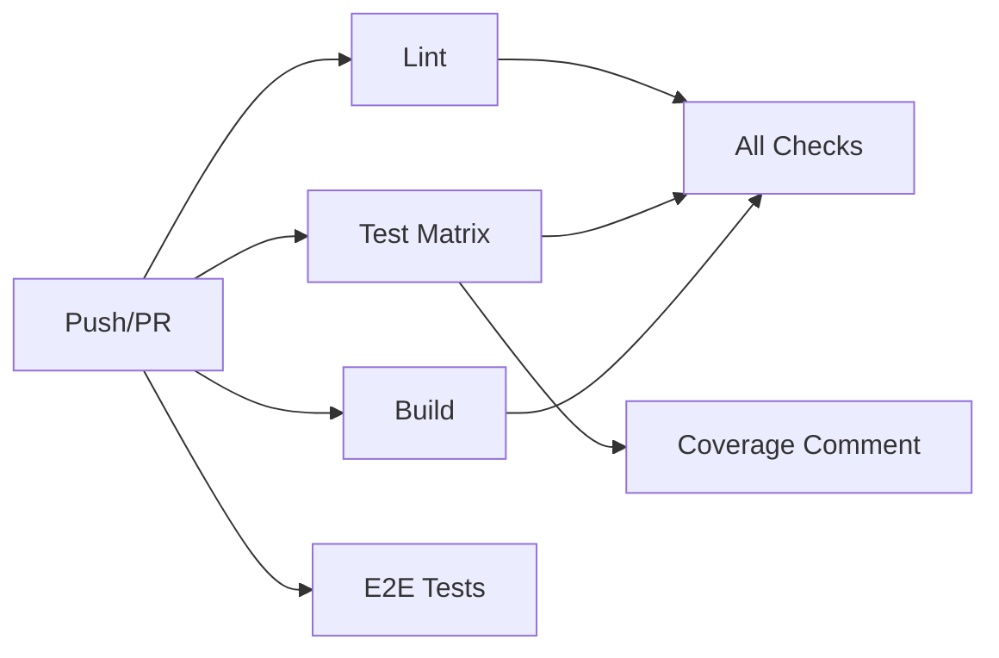

# CI/CD Best Practices

This document explains the best practices implemented in our GitHub Actions CI/CD pipeline.

## 🎯 Overview

Our CI workflow (`<boltAction type="file" filePath=".github/workflows/ci.yml">.github/workflows/ci.yml</boltAction>`) implements industry best practices for Python projects, optimized for the `uv` package manager and pytest.

## 🏗️ Architecture

### Job Separation (Parallel Execution)



**Why:** Parallel execution reduces CI runtime. Jobs run simultaneously instead of sequentially.

**Jobs:**
1. **lint** - Ruff linting, formatting, Pyright type checking
2. **test** - pytest with coverage on multiple Python versions and OSes
3. **build** - Package building and verification
4. **e2e** - End-to-end tests (main branch only)
5. **coverage-comment** - PR comment with coverage report
6. **all-checks** - Final status gate

## ✨ Best Practices Implemented

### 1. Concurrency Control

```yaml
concurrency:
  group: ${{ github.workflow }}-${{ github.event.pull_request.number || github.ref }}
  cancel-in-progress: true
```

**What:** Cancels outdated workflow runs when new commits are pushed.

**Why:**
- Saves compute resources
- Reduces queue times
- Prevents wasted CI minutes on obsolete code

**Example:** Push commit A (CI starts) → Push commit B → CI for A is cancelled, only B runs.

### 2. Matrix Testing

```yaml
strategy:
  fail-fast: false
  matrix:
    os: [ubuntu-latest]
    python-version: ["3.12", "3.13"]
    include:
      - os: macos-latest
        python-version: "3.13"
      - os: windows-latest
        python-version: "3.13"
```

**What:** Tests across multiple Python versions and operating systems.

**Why:**
- **Cross-platform compatibility** - Catches OS-specific bugs
- **Version compatibility** - Ensures code works on supported Python versions
- **fail-fast: false** - Runs all combinations even if one fails

**Result:** 4 test jobs run in parallel (ubuntu-3.12, ubuntu-3.13, macos-3.13, windows-3.13)

### 3. Dependency Caching

```yaml
- name: Install uv
  uses: astral-sh/setup-uv@v4
  with:
    enable-cache: true
    cache-dependency-glob: "pyproject.toml"
```

**What:** Caches `uv` dependencies between runs.

**Why:**
- **Speed** - 2-3x faster installs (5s vs 15s)
- **Reliability** - Less network dependency
- **Cost** - Fewer PyPI requests

**How:** Cache invalidates when `pyproject.toml` changes.

### 4. Multiple Coverage Formats

```yaml
- name: Run tests with coverage
  run: |
    uv run pytest \
      --cov=src \
      --cov-report=term-missing \
      --cov-report=xml \
      --cov-report=html \
      --cov-report=json \
      --junit-xml=pytest-report.xml \
      -v
```

**What:** Generates coverage in 4 formats.

**Formats:**
- **term-missing** - Shows uncovered lines in logs
- **xml** - For Codecov integration
- **html** - Visual browsing (uploaded as artifact)
- **json** - Programmatic access (for PR comments)

**Why:**
- Different tools consume different formats
- HTML reports help developers visualize gaps
- JSON enables automated analysis

### 5. Coverage Threshold Enforcement

```yaml
- name: Check coverage threshold
  run: |
    COVERAGE=$(uv run coverage report --precision=2 | grep TOTAL | awk '{print $NF}' | sed 's/%//')
    echo "Current coverage: $COVERAGE%"

    THRESHOLD=79.0
    if (( $(echo "$COVERAGE < $THRESHOLD" | bc -l) )); then
      echo "❌ Coverage $COVERAGE% is below threshold $THRESHOLD%"
      exit 1
    else
      echo "✅ Coverage $COVERAGE% meets threshold $THRESHOLD%"
    fi
```

**What:** Fails CI if coverage drops below 79%.

**Why:**
- **Prevents regression** - Coverage can't decrease
- **Quality gate** - Enforces test discipline
- **Visibility** - Clear failure message

**Note:** Threshold matches current project coverage (79%). Adjust as coverage improves.

### 6. Codecov Integration

```yaml
- name: Upload coverage to Codecov
  uses: codecov/codecov-action@v4
  with:
    file: ./coverage.xml
    flags: unittests
    fail_ci_if_error: false
    token: ${{ secrets.CODECOV_TOKEN }}
```

**What:** Uploads coverage to [Codecov](https://codecov.io).

**Why:**
- **PR annotations** - Shows uncovered lines in PR diffs
- **Trend tracking** - Visualizes coverage over time
- **Badge** - README badge for coverage percentage
- **Diff coverage** - Shows coverage delta per PR

**Setup:**
1. Sign up at https://codecov.io with GitHub
2. Add repository
3. Add `CODECOV_TOKEN` to GitHub Secrets
4. Badge: `[](https://codecov.io/gh/USER/REPO)`

### 7. Artifact Uploads

```yaml
- name: Upload coverage HTML report
  uses: actions/upload-artifact@v4
  with:
    name: coverage-report-html
    path: htmlcov/
    retention-days: 30
```

**What:** Saves test outputs as downloadable artifacts.

**Artifacts:**
- **coverage-report-html** - Interactive HTML coverage report
- **coverage-report-json** - Machine-readable coverage data
- **pytest-results-{os}-{version}** - JUnit XML test results
- **dist** - Built package files

**Why:**
- **Debugging** - Download and inspect locally
- **Auditing** - Historical record of test runs
- **Integration** - Feed into other tools

**Access:** GitHub Actions → Workflow run → Artifacts section

### 8. PR Coverage Comments

```yaml
- name: Comment PR with coverage
  uses: actions/github-script@v7
  with:
    script: |
      const totalCoverage = coverageJson.totals.percent_covered.toFixed(2);
      const body = `## 📊 Coverage Report
      **Total Coverage: ${totalCoverage}%**
      ...`;
```

**What:** Posts/updates a comment on PRs with coverage summary.

**Why:**
- **Visibility** - No need to check Actions tab
- **Review context** - See coverage impact during code review
- **Update in place** - Edits existing comment instead of spamming

**Example Comment:**
```
## 📊 Coverage Report

**Total Coverage: 79.45%**

<details>
<summary>📋 Detailed Coverage Report</summary>

Name                                     Stmts   Miss  Cover   Missing
----------------------------------------------------------------------
src/langsmith_cli/__init__.py                0      0   100%
src/langsmith_cli/commands/auth.py          19      0   100%
...
----------------------------------------------------------------------
TOTAL                                      671    142    79%

</details>

✅ Coverage meets the threshold!
```

### 9. Separate E2E Tests

```yaml
e2e:
  name: E2E Tests
  if: github.ref == 'refs/heads/main' || github.event_name == 'workflow_dispatch'
  steps:
    - name: Run E2E tests
      env:
        LANGSMITH_API_KEY: ${{ secrets.LANGSMITH_API_KEY }}
      run: uv run pytest tests/test_e2e.py -v
      continue-on-error: true
```

**What:** E2E tests run separately from unit tests.

**Why:**
- **Cost** - Only run on main branch (not every PR)
- **Speed** - Don't slow down PRs
- **Reliability** - API failures don't block merges (`continue-on-error`)
- **Security** - API key only exposed when needed

**Trigger:**
- Automatically: On pushes to `main`
- Manually: `workflow_dispatch` (Actions → Run workflow button)

### 10. Final Status Gate

```yaml
all-checks:
  name: All Checks Passed
  needs: [lint, test, build]
  if: always()
  steps:
    - name: Check all jobs
      run: |
        if [ "${{ needs.lint.result }}" != "success" ] || \
           [ "${{ needs.test.result }}" != "success" ] || \
           [ "${{ needs.build.result }}" != "success" ]; then
          echo "❌ Some checks failed"
          exit 1
        fi
```

**What:** Single job that depends on all others.

**Why:**
- **Branch protection** - Set single required check instead of 3+
- **Clarity** - One green checkmark means everything passed
- **if: always()** - Runs even if dependencies fail (to report status)

**Setup:** GitHub → Settings → Branches → Require status checks → Select "All Checks Passed"

### 11. Frozen Dependencies

```yaml
- name: Install dependencies
  run: uv sync --frozen
```

**What:** `--frozen` fails if `uv.lock` is out of sync with `pyproject.toml`.

**Why:**
- **Reproducibility** - Uses exact versions from lockfile
- **CI/CD parity** - Same versions locally and in CI
- **Catches errors** - Fails if developer forgot to update lockfile

**Alternative:** `uv sync` (auto-updates lockfile, but less strict)

### 12. GitHub Output Format

```yaml
- name: Run Ruff linter
  run: uv run ruff check . --output-format=github
```

**What:** Ruff outputs errors in GitHub's annotation format.

**Why:**
- **PR annotations** - Errors show inline in Files Changed view
- **Click to file** - Annotations link directly to problem lines
- **Better UX** - Don't parse logs manually

**Example:** Error at `src/main.py:45` shows as annotation on that line in PR.

### 13. Colored Output

```yaml
env:
  FORCE_COLOR: "1"
```

**What:** Forces colored output in CI logs.

**Why:**
- **Readability** - Errors stand out in red
- **Pytest** - Colored test results (PASSED=green, FAILED=red)
- **Works in CI** - Some tools disable colors by default

### 14. Workflow Dispatch

```yaml
on:
  push:
    branches: [main]
  pull_request:
    branches: [main]
  workflow_dispatch:
```

**What:** Enables manual workflow triggering.

**Why:**
- **Testing** - Re-run without new commits
- **E2E tests** - Trigger on-demand
- **Debugging** - Test CI changes before committing

**Use:** Actions tab → CI workflow → Run workflow button

## 🚀 Performance Optimizations

### Job Parallelization

All independent jobs run simultaneously:
- `lint`, `test`, `build` run in parallel
- Matrix tests (4 combinations) run in parallel
- Total runtime: ~3-5 minutes (vs 10-15 minutes sequential)

### Caching Strategy

```yaml
enable-cache: true
cache-dependency-glob: "pyproject.toml"
```

**Cache hits:**
- First run: 15s install
- Subsequent runs (cache hit): 3s install
- **5x speedup** on dependency installation

### Conditional Execution

**Coverage uploads** only on `ubuntu-latest` + Python 3.12:
```yaml
if: matrix.os == 'ubuntu-latest' && matrix.python-version == '3.12'
```

**Why:** Avoid duplicate uploads, save time

**E2E tests** only on main branch:
```yaml
if: github.ref == 'refs/heads/main'
```

**Why:** Save API quota, faster PRs

## 📊 Metrics & Monitoring

### What We Track

1. **Coverage percentage** - Must stay ≥79%
2. **Test count** - Currently 116 tests
3. **Test duration** - Track performance regressions
4. **Build artifacts** - Size of distribution packages
5. **E2E test health** - Monitor API integration

### Where to Find Metrics

- **Coverage trend**: Codecov dashboard
- **Test results**: Actions → Workflow run → Summary
- **Artifacts**: Actions → Workflow run → Artifacts section
- **Historical data**: Actions → CI workflow → Filter by branch

## 🔒 Security Best Practices

### Secrets Management

```yaml
env:
  LANGSMITH_API_KEY: ${{ secrets.LANGSMITH_API_KEY }}
```

**What:** Secrets stored in GitHub repository settings.

**Best practices:**
- ✅ Never commit secrets to code
- ✅ Use `secrets.SECRET_NAME` syntax
- ✅ Rotate secrets regularly
- ✅ Limit secret scope (repo-level, not org-level)

**Setup:** GitHub → Settings → Secrets and variables → Actions → New repository secret

### Permission Scoping

```yaml
permissions:
  contents: read
  pull-requests: write
```

**What:** Minimal permissions for each workflow.

**Why:**
- **Principle of least privilege** - Only grant what's needed
- **Security** - Limits damage if token is compromised
- **Clarity** - Documents what workflow can access

### Pinned Action Versions

```yaml
- uses: actions/checkout@v4
- uses: actions/setup-python@v5
- uses: codecov/codecov-action@v4
```

**What:** Uses major version tags (v4, v5).

**Why:**
- **Stability** - No breaking changes
- **Security** - Reviewed by GitHub
- **Updates** - Auto-receives patch updates

**Alternative:** Pin to SHA for maximum security (but no auto-updates)

## 🐛 Debugging Failed Workflows

### Common Issues

**1. Coverage threshold failure**
```
❌ Coverage 78.5% is below threshold 79.0%
```

**Solution:** Add tests to increase coverage, or adjust threshold in workflow.

**2. Ruff formatting failure**
```
error: 2 files would be reformatted
```

**Solution:** Run `uv run ruff format .` locally and commit.

**3. Type checking failure**
```
error: Type "None" cannot be assigned to type "str"
```

**Solution:** Fix type errors locally with `uv run pyright`.

**4. E2E test failure**
```
Error: LANGSMITH_API_KEY not set
```

**Solution:** Add `LANGSMITH_API_KEY` to GitHub Secrets (main branch only).

### Debugging Tools

**Re-run with debug logging:**
```yaml
env:
  ACTIONS_RUNNER_DEBUG: true
  ACTIONS_STEP_DEBUG: true
```

**SSH into runner (self-hosted only):**
```yaml
- name: Debug with tmate
  uses: mxschmitt/action-tmate@v3
```

## 📝 Maintenance

### Updating Dependencies

When `pyproject.toml` changes:
1. Run `uv sync` locally
2. Commit updated `uv.lock`
3. CI will use `uv sync --frozen` to verify lockfile is current

### Updating Coverage Threshold

When coverage improves (e.g., 79% → 85%):
1. Edit `.github/workflows/ci.yml`
2. Update `THRESHOLD=79.0` to `THRESHOLD=85.0`
3. Commit and push

### Updating Action Versions

Check for updates monthly:
```bash
# List all action versions in workflows
grep "uses:" .github/workflows/*.yml
```

Update to latest major versions (v4 → v5) when available.

## 🎓 Learning Resources

- [GitHub Actions Documentation](https://docs.github.com/en/actions)
- [pytest Coverage Documentation](https://pytest-cov.readthedocs.io/)
- [Codecov Documentation](https://docs.codecov.com/)
- [uv Documentation](https://docs.astral.sh/uv/)
- [GitHub Script Action](https://github.com/actions/github-script)

## 🤝 Contributing

When adding new features to CI:

1. **Test locally first** - Use `act` to run workflows locally
2. **Document changes** - Update this file
3. **Keep it fast** - Avoid unnecessary steps
4. **Add conditionals** - Don't run everything everywhere
5. **Update thresholds** - Adjust coverage/performance targets as needed

## 📈 Future Improvements

Potential enhancements:

1. **Parallel pytest** - Use `pytest-xdist` for faster tests
2. **Coverage diff** - Show coverage change vs base branch
3. **Performance benchmarks** - Track CLI startup time, memory usage
4. **Dependency scanning** - Automated security audits
5. **Release automation** - Auto-publish to PyPI on tags
6. **Docker testing** - Test CLI in containerized environments
7. **Mutation testing** - Use `mutmut` to verify test quality
