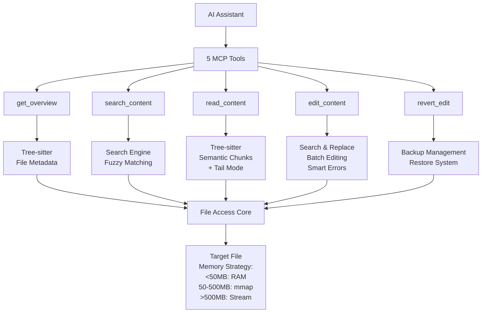
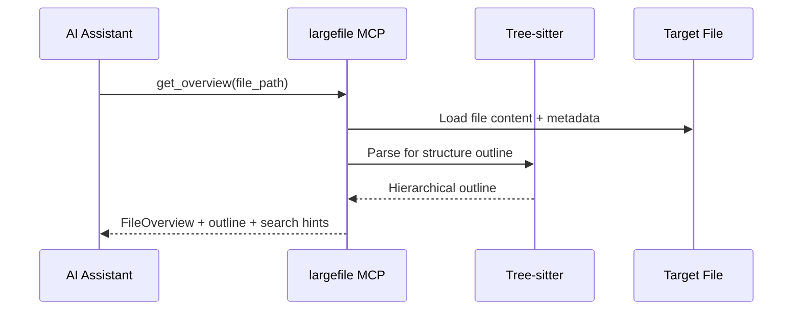
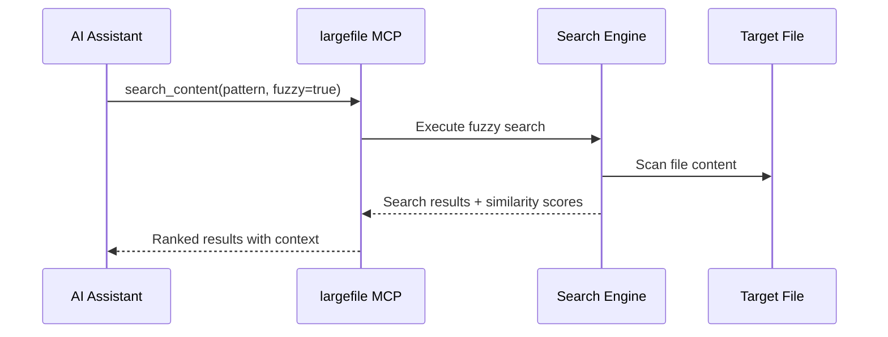
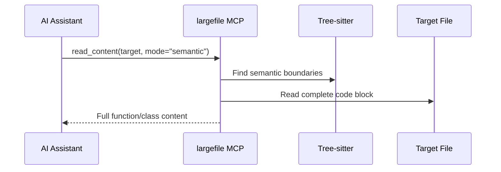
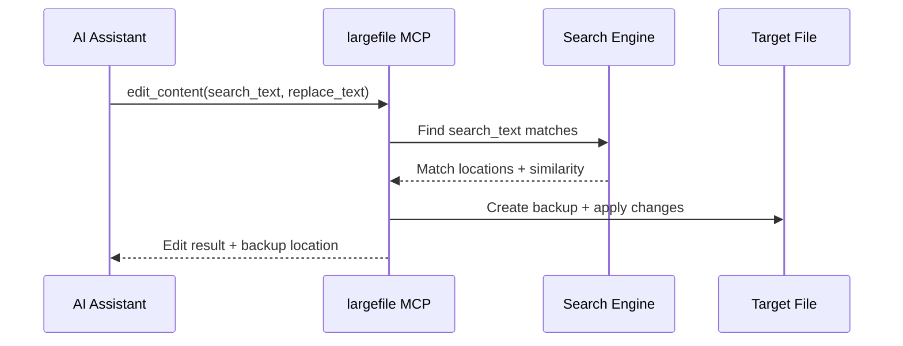
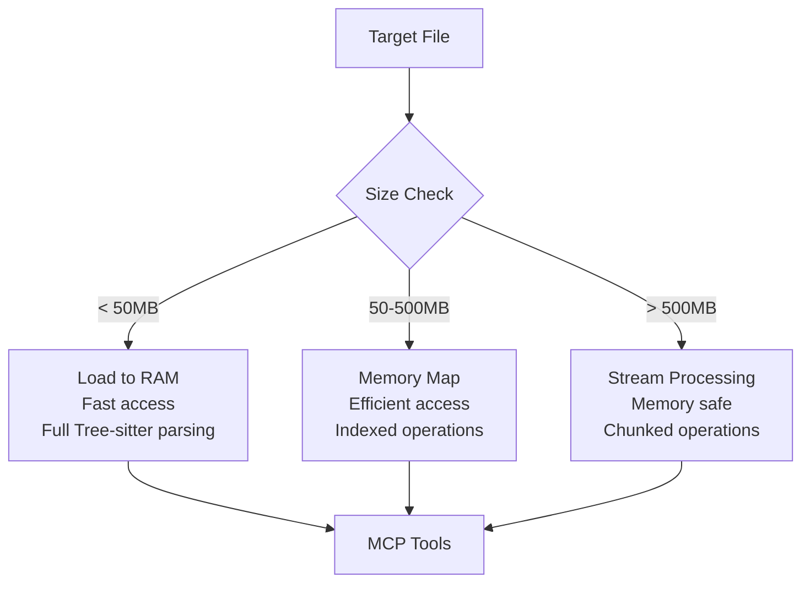

# Largefile Design

## Problem

LLMs cannot work with large files due to context window limitations. Research shows **line-based editing is fundamentally problematic** for LLMs, causing 3x more errors than search/replace patterns.

## Solution

MCP server using **search/replace blocks** (proven by Aider, Cline, RooCode) with **fuzzy matching** and **semantic awareness**.

## High-Level Architecture



## Tool Workflow Sequences

### Overview Workflow


### Search Workflow


### Read Workflow


### Edit Workflow


## File Size Handling Strategy



## Architecture

### Interface

**MCP Server**: `largefile-mcp` (stdio transport only - CLI removed for simplicity)

### Core Components

```
File � Canonicalize � Hash � Session Management � Tools
                                     �
        File Access + AST Caching (Tree-sitter)
                     �
    [Overview] [Search+Fuzzy] [Semantic Read] [Search/Replace Edit]
```

## Tools (5 Total)

### Research-Backed Progressive Workflow

**1. Overview Tool** - Enhanced with hierarchical structure:

```python
@mcp.tool()
def get_overview(absolute_file_path: str) -> FileOverview
```

Auto-generates hierarchical outline via Tree-sitter. Detects long lines for truncation. Returns semantic structure and search hints for efficient exploration.

**2. Search Tool** - Fuzzy matching by default:

```python
@mcp.tool()
def search_content(
    absolute_file_path: str,
    pattern: str,
    max_results: int = 20,
    context_lines: int = 2,
    fuzzy: bool = True
) -> List[SearchResult]
```

**Key improvement**: Fuzzy matching via Levenshtein distance handles real-world formatting variations. Returns semantic context and smart line truncation.

**3. Read Tool** - Semantic chunks and tail mode:

```python
@mcp.tool()
def read_content(
    absolute_file_path: str,
    target: Union[int, str],  # Line number or pattern
    mode: str = "lines"       # lines|semantic|tail
) -> dict
```

Uses Tree-sitter to return complete functions/classes/blocks. **Tail mode** reads last N lines efficiently using `deque` for log file analysis.

**4. Edit Tool** - Search/replace with batch support:

```python
@mcp.tool()
def edit_content(
    absolute_file_path: str,
    search_text: str = None,     # Single edit mode
    replace_text: str = None,    # Single edit mode
    changes: list[dict] = None,  # Batch edit mode
    fuzzy: bool = True,
    preview: bool = True
) -> dict
```

**Primary editing method** using search/replace blocks. Supports **batch editing** for multiple changes atomically. **Enhanced error messages** return similar match suggestions when patterns aren't found.

**5. Revert Tool** - Backup restoration:

```python
@mcp.tool()
def revert_edit(
    absolute_file_path: str,
    backup_id: str = None  # Defaults to most recent
) -> dict
```

**Recovery tool** that reverts files to previous backup states. Current state is preserved as new backup before reverting, ensuring no work is lost.

### Enhanced Data Models

```python
@dataclass
class FileOverview:
    line_count: int
    file_size: int
    encoding: str  # Auto-detected file encoding
    has_long_lines: bool  # >1000 chars (triggers truncation)
    outline: List[OutlineItem]  # Hierarchical via Tree-sitter
    search_hints: List[str]  # Common patterns for exploration

@dataclass
class OutlineItem:
    name: str
    type: str  # "function", "class", "method", "import"
    line_number: int
    end_line: int
    children: List[OutlineItem]  # Nested structure
    line_count: int

@dataclass
class SearchResult:
    line_number: int
    match: str  # Truncated if >500 chars
    context_before: List[str]
    context_after: List[str]
    semantic_context: str  # "inside function foo()", "class Bar"
    similarity_score: float  # For fuzzy matches (0.0-1.0)
    truncated: bool
    submatches: List[Dict[str, int]]  # [{"start": 10, "end": 15}]

@dataclass
class EditResult:
    success: bool
    preview: str  # Shows before/after diff
    changes_made: int
    line_number: int  # Where change occurred
    similarity_used: float  # If fuzzy matching was used
```

## File Handling

### Access Strategy

- **<50MB**: Memory loading with Tree-sitter AST caching
- **50-500MB**: Memory-mapped access with streaming search
- **>500MB**: Streaming processing for very large files
- **AST caching**: Parse once per session, reuse for semantic operations
- **Line truncation**: Auto-truncate lines >1000 chars for overview
- **Atomic operations**: File writes use temp file + rename for integrity
- **Automatic backups**: Created before edits in `.largefile/backups/`

### Sessions

- Key: `canonical_path + SHA-256(content)`
- **AST caching**: Cache Tree-sitter parses for semantic features
- **Fuzzy search caching**: Cache search indices for performance
- Change detection via content hashing
- Auto-loading with research-backed defaults

### Path Requirements

- **Absolute paths only** with canonicalization
- Home directory expansion (`~/file` → `/home/user/file`)
- Cross-platform compatibility

## MCP Configuration

```json
{
  "mcpServers": {
    "largefile": {
      "command": "uvx",
      "args": ["--from", "largefile", "largefile-mcp"]
    }
  }
}
```

## Project Structure

```
src/
├── server.py        # MCP server entry point
├── tools.py         # 5 MCP tools (get_overview, search_content, read_content, edit_content, revert_edit)
├── search_engine.py # Fuzzy search engine (rapidfuzz) + similar match suggestions
├── tree_parser.py   # Tree-sitter integration + AST caching
├── editor.py        # Search/replace engine with batch support
├── file_access.py   # File management + backup system + tail mode
├── data_models.py   # Dataclass definitions (BackupInfo, Change, ChangeResult, etc.)
└── config.py        # Environment-based configuration
```

## Implementation Phases

**Phase 1**: Core search/replace engine
**Phase 2**: Fuzzy matching (rapidfuzz integration)
**Phase 3**: Tree-sitter semantic features
**Phase 4**: Performance optimization + line truncation
**Phase 5** (v0.2.0): Enhanced errors, tail mode, backup management, revert_edit, batch editing

## Scope

**In**: Text files (auto-detected encoding), **search/replace editing**, fuzzy pattern matching, semantic structure, hierarchical navigation, **batch operations**, **backup/revert**
**Out**: Binary files, multi-file ops, collaboration, version control, **line-based editing**

## LLM Usage Patterns

**Design Philosophy**: 5 focused, composable tools that LLMs can chain creatively.

### Common Workflows

**Code Analysis**
```
1. get_overview() → See file structure and search hints
2. search_content("def ") → Find all functions  
3. read_content(line_42) → Examine specific function
4. search_content("TODO") → Find improvement areas
```

**Bug Fixing**
```
1. search_content("error_pattern") → Locate problem area
2. read_content("function_name") → Get full context
3. search_content("similar_function") → Find reference implementation
4. edit_content(old_code, fixed_code) → Apply fix
```

**Refactoring**
```
1. search_content("old_function_name") → Find all usages
2. read_content(each_match) → Understand each context  
3. edit_content(old_name, new_name) → Rename iteratively
4. search_content("new_function_name") → Verify changes
```

**Code Review**
```
1. get_overview() → Understand file structure
2. search_content("class ") → Review all classes
3. read_content(class_line) → Examine implementation
4. search_content("FIXME|TODO") → Check for issues
```

### Multi-Call Strategies

**Batch Search Pattern**
```python
# LLM can make parallel calls for efficiency
patterns = ["def ", "class ", "import ", "TODO"]
for pattern in patterns:
    results = search_content(file_path, pattern)
    # Process each result set
```

**Iterative Editing Pattern** 
```python
# Find all instances, edit one by one with verification
matches = search_content(file_path, "old_pattern")
for match in matches:
    context = read_content(file_path, match.line_number)
    if should_edit(context):
        edit_content(file_path, old_code, new_code)
```

**Progressive Refinement**
```python
# Start broad, narrow down with more specific searches
overview = get_overview(file_path)
functions = search_content(file_path, "def ")
specific_func = search_content(file_path, "def process_data")
implementation = read_content(file_path, specific_func[0].line_number)
```

**Safe Refactoring (v0.2.0)**
```
1. search_content("old_name") → Find all usages
2. edit_content(changes=[...]) → Batch rename with preview
3. If something breaks: revert_edit() → Instant recovery
```

**Log Analysis (v0.2.0)**
```
1. read_content(file, 1000, mode="tail") → Last 1000 lines
2. search_content("ERROR") → Find issues in recent entries
3. read_content(error.line_number) → Get context
```

## Research Validation

- **Search/replace blocks**: 3x more reliable than line numbers (Aider, Cline, RooCode)
- **Fuzzy matching**: Essential for real-world formatting variations
- **Semantic chunks**: Tree-sitter beats arbitrary line ranges
- **Progressive disclosure**: Proven workflow pattern maintained
- **Simple composability**: LLMs excel at chaining focused tools
- **Error recovery** (v0.2.0): Similar match suggestions reduce retry cycles
- **Batch operations** (v0.2.0): Atomic multi-edit prevents drift and token waste
