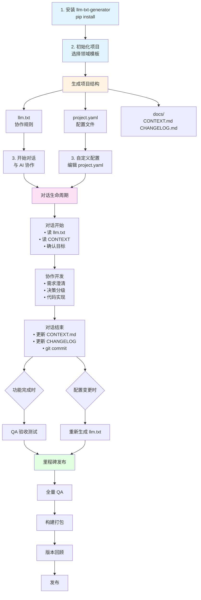
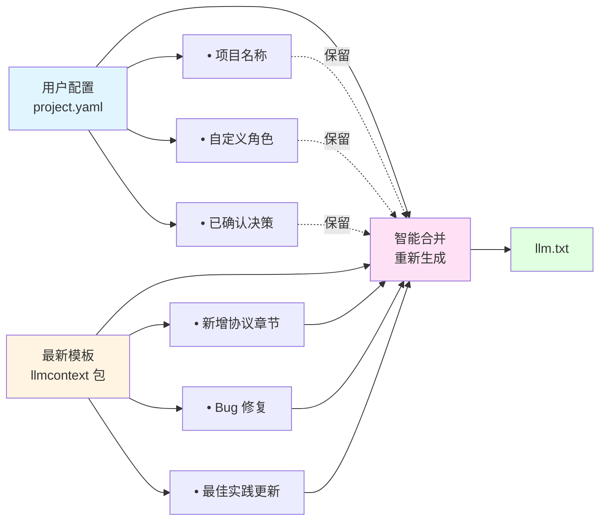

# LLMContext

[](https://badge.fury.io/py/llm-txt-generator)
[](https://www.python.org/downloads/)
[](https://opensource.org/licenses/MIT)

**从 YAML 配置生成标准化的 AI 协作规则文档 (llm.txt)**

将 Vibe Development 哲学和 LLM 协作协议抽象为可配置、可复用的框架，支持快速在不同领域部署工程化的人机协作流程。

> 本项目自身也使用生成的协作规则进行开发（元实现），并支持与 [llmstxt.org](https://llmstxt.org) 标准无缝集成

---

## 工作流程图



---

## 特性

- **完整协议覆盖**: 决策分级、迭代管理、QA验收、Prompt工程最佳实践
- **领域扩展**: 支持 game/web/data 等领域的定制扩展
- **钩子机制**: 在对话流程节点自动注入上下文
- **Cursor Skill**: 可作为 IDE Skill 使用，提供结构化协作流程
- **自举实现**: 本项目使用自身生成的 llm.txt 进行开发

---

## 安装

```bash
pip install llm-txt-generator
```

或从源码安装：

```bash
git clone https://github.com/flashpoint493/LLMTXTGenerator.git
cd LLMTXTGenerator
pip install -e .
```

---

## 快速开始

### 初始化新项目

```bash
# 通用项目
llmcontext init -n "MyProject" -d generic -o ./my-project

# 游戏项目（含 GM 命令注入）
llmcontext init -n "MyGame" -d game -o ./my-game

# Web 项目（含 API 文档注入）
llmcontext init -n "MyWebApp" -d web -o ./my-webapp

# 数据项目（含数据处理流程）
llmcontext init -n "MyDataProject" -d data -o ./my-data-project
```

### 生成的项目结构

```
my-project/
├── CONTRIBUTING_AI.md         # AI 协作规则文档
├── llms.txt                   # 项目上下文文档（已集成协作规则引用）
├── project.yaml                # 项目配置 (可编辑)
└── docs/
    ├── CONTEXT.md              # 当前上下文 (每次对话更新)
    ├── DECISIONS.md            # 决策记录
    ├── CHANGELOG.md            # 变更日志
    ├── ROADMAP.md              # 路线图 + 迭代建议池
    └── QA_TEST_CASES.md        # 产品QA测试用例
```

> **💡 llms.txt 集成**：工具会自动检测项目中是否已有 `llms.txt` 文件。如果存在，会在其中添加 AI Collaboration 章节引用协作规则；如果不存在，会创建一个符合 [llmstxt.org](https://llmstxt.org) 标准的 `llms.txt` 文件。

### 文档体系说明

项目初始化后会生成一套完整的文档体系，每个文档都有明确的用途和更新时机：

#### 📄 `CONTRIBUTING_AI.md` - AI 协作规则文档
- **用途**: 项目的顶层协作规则，定义 AI 与开发者的协作方式
- **内容**: 包含核心理念、角色定义、决策分级、流程协议等完整协议
- **更新时机**: 当协作方式演进时（通过 `llmcontext generate` 重新生成）
- **特点**: 由 `project.yaml` 配置自动生成，是 AI 理解项目规则的主要依据
- **与 llms.txt 的关系**: 在 `llms.txt` 中通过引用链接指向此文档

#### 📄 `llms.txt` - 项目上下文文档（可选）
- **用途**: 符合 [llmstxt.org](https://llmstxt.org) 标准的项目上下文文档
- **内容**: 项目概述、快速开始、文档索引等
- **生成方式**: 
  - 如果项目已存在 `llms.txt`，工具会自动在其中添加 AI Collaboration 章节引用
  - 如果不存在，工具会创建一个新的 `llms.txt` 文件
- **特点**: 与 `CONTRIBUTING_AI.md` 互补，前者描述"项目是什么"，后者定义"如何协作"

#### 📝 `docs/CONTEXT.md` - 当前开发上下文
- **用途**: 记录当前开发进度、正在进行的工作、待解决的问题
- **内容**: 
  - 当前任务状态
  - 最近完成的工作
  - 下一步计划
  - 技术债务和已知问题
- **更新时机**: **每次对话结束时必须更新**
- **重要性**: ⭐ AI 在对话开始时必须读取此文件以恢复上下文

#### 📋 `docs/DECISIONS.md` - 重要决策记录
- **用途**: 记录所有 S/A 级重要决策，形成项目决策历史
- **内容格式**:
  ```markdown
  ## DECISION-001: 技术框架选择
  - **等级**: A
  - **角色**: [ARCH]
  - **问题**: 选择前端框架
  - **决策**: React + TypeScript
  - **理由**: 团队熟悉，生态完善
  - **日期**: 2026-01-20
  - **状态**: CONFIRMED
  ```
- **更新时机**: 每次 S/A 级决策确认后
- **价值**: 为后续决策提供参考，避免重复讨论

#### 📊 `docs/CHANGELOG.md` - 版本变更日志
- **用途**: 记录每次对话的产出和变更
- **内容**: 
  - 新增功能
  - Bug 修复
  - 配置变更
  - 文档更新
- **更新时机**: **每次有效对话后**
- **格式**: 遵循 [Keep a Changelog](https://keepachangelog.com/) 规范

#### 🗺️ `docs/ROADMAP.md` - 路线图与迭代建议池
- **用途**: 规划项目里程碑和收集迭代建议
- **内容结构**:
  - **路线图**: 当前里程碑计划
  - **迭代建议池**: QA/用户反馈的功能建议
    - ✅ 纳入当前里程碑
    - ⏳ 延后到下个里程碑
    - ❌ 拒绝（不符合方向）
    - 🔄 合并其他迭代
- **更新时机**: 里程碑规划时、收到反馈时
- **价值**: 帮助 PM 管理需求优先级

#### ✅ `docs/QA_TEST_CASES.md` - 产品QA测试用例
- **用途**: 从用户视角编写的功能验收测试用例
- **内容格式**:
  ```markdown
  ## TC-MODULE-001: 用户登录功能
  - **功能**: 用户登录
  - **前置条件**: 用户已注册
  - **测试步骤**:
    1. 打开登录页面
    2. 输入用户名和密码
    3. 点击登录按钮
  - **预期结果**: 登录成功，跳转到主页
  - **状态**: 🟢 PASS
  ```
- **更新时机**: 每个功能完成时
- **特点**: 与单元测试互补，关注功能完整性而非代码正确性

#### ⚙️ `project.yaml` - 项目配置文件
- **用途**: 项目的核心配置文件，定义所有协作规则
- **内容**: 
  - 项目基本信息
  - 角色定义
  - 决策分级
  - 任务单元配置
  - 对话流程协议
  - 测试体系配置
  - 里程碑定义
  - 领域扩展配置
- **更新时机**: 需要调整协作规则时
- **特点**: 修改后通过 `llmcontext generate` 重新生成 `llm.txt`

### 自定义后重新生成

```bash
# 编辑 project.yaml 后重新生成（默认输出 CONTRIBUTING_AI.md 并集成 llms.txt）
llmcontext generate -c project.yaml

# 指定输出文件
llmcontext generate -c project.yaml -o CONTRIBUTING_AI.md

# 不集成 llms.txt
llmcontext generate -c project.yaml --no-llmstxt

# 验证配置
llmcontext validate -c project.yaml
```

---

## 生成的 CONTRIBUTING_AI.md 包含章节

| 章节 | 说明 |
|------|------|
| 核心理念 | Vibe Development 哲学、决策质量观 |
| 职能角色定义 | 可自定义的角色体系 (DESIGN/ARCH/DEV/PM/QA/TEST) |
| 决策分级制度 | S/A/B/C 四级决策及 Review 要求 |
| 开发流程协议 | 对话开始/结束时的强制流程 |
| **需求澄清协议** | **模糊需求 → 结构化描述转化** |
| **任务单元管理** | **对话任务单元定义、状态流转、依赖管理** ⭐ |
| 迭代建议管理协议 | QA 建议 → PM 评审 → 纳入/延后/拒绝 |
| 版本回顾协议 | 里程碑验收后的回顾流程 |
| 构建打包协议 | 全量验收前的 CheckList |
| 配置级迭代协议 | 无需审批的快速配置修改 |
| QA 验收协议 | 测试用例要素、快速验收模板 |
| Git 协作规范 | 分支策略、Commit 前缀 |
| 测试体系 | Unit Test + Product QA 双轨 |
| 里程碑定义 | 生命周期、Bug 优先级 |
| Prompt 工程最佳实践 | 有效提问模板、高价值引导词 |
| 符号学标注系统 | 统一的状态/优先级符号 |
| 已确认决策汇总 | 项目决策记录表 |
| 文档迭代日志 | CONTRIBUTING_AI.md 自身版本历史 |

---

## CLI 命令

```bash
llmcontext --help                              # 查看帮助
llmcontext --version                           # 查看版本
llmcontext init -n <name> -d <domain> -o <dir> # 初始化项目
llmcontext generate -c <config> -o <output>    # 生成协作规则文档（默认集成 llms.txt）
llmcontext validate -c <config>                # 验证配置
llmcontext upgrade                             # 升级协议到最新版本
llmcontext domains                             # 列出支持的领域
llmcontext templates                           # 列出可用模板
```

---

## 协议版本升级

当 llmcontext 包有新版本时，已有项目可以无缝升级：

```bash
# 升级当前项目的协议
pip install --upgrade llm-txt-generator
cd your-project
llmcontext upgrade

# 预览变更（不实际修改）
llmcontext upgrade --dry-run

# 指定配置文件
llmcontext upgrade -c project.yaml
```

**升级原理**：



**保留的用户配置**：
- `project.name`, `project.version`, `project.domain`
- `roles` - 自定义角色体系
- `confirmed_decisions` - 已确认的决策记录
- `domain_extensions` - 领域扩展配置

---

## 核心概念

### Vibe Development 哲学

> **最珍贵的是对话过程本身，不追求直接出结果，而是步步为营共同规划。**

- AI 不是执行者，而是**协作伙伴**
- 不急于产出代码，先**对齐理解**
- 每个决策都是**共同思考**的结果
- 对话本身就是**设计过程**的一部分

### 任务单元 (Task Unit) ⭐

> **开发不按日期，按对话任务单元推进**

任务单元是项目管理的核心概念，每个任务单元代表一次完整的对话协作周期：

```
任务单元 (Task Unit):
├── ID: TASK-{role}-{seq}      # 如 TASK-DEV-001
├── role: DESIGN/ARCH/DEV/PM/QA/TEST
├── feature: {关联的功能模块}
├── dependencies: {依赖的任务ID}
├── output: {预期输出}
├── status: TODO / IN_PROGRESS / REVIEW / DONE
└── dialogue_rounds: {完成所需的对话轮数}
```

**任务单元的优势**：
- ✅ **对话驱动**：以对话为单位推进，而非时间线
- ✅ **状态清晰**：每个任务都有明确的状态流转
- ✅ **依赖管理**：支持任务间的依赖关系
- ✅ **可追溯**：每个任务单元都有完整的对话历史

**使用场景**：
- 开始新功能开发时，创建 `TASK-DEV-001`
- 需要架构决策时，创建 `TASK-ARCH-001`
- QA 验收时，创建 `TASK-QA-001`

### 决策分级制度

| 等级 | 类型 | 影响范围 | Review 要求 |
|-----|------|---------|------------|
| **S** | 战略决策 | 整体方向 | 必须人工确认 |
| **A** | 架构决策 | 系统设计 | 人工 Review |
| **B** | 实现决策 | 具体方案 | 可快速确认 |
| **C** | 细节决策 | 参数命名 | AI 自主决策 |

### 双轨测试体系

| 维度 | Unit Test | Product QA |
|------|-----------|------------|
| 视角 | 开发者 | 用户 |
| 目标 | 代码正确性 | 功能完整性 |
| 粒度 | 函数/模块级 | 功能/流程级 |
| 执行 | 自动化 | 可自动+人工 |

---

## 扩展机制

> **扩展 = 流程钩子 + 上下文注入 + 引用文档**

```yaml
domain_extensions:
  game:
    hooks:
      - trigger: "qa.list_test_cases"
        action: "inject_context"
        context_id: "gm_commands"
        condition: "files.exists('docs/GM_COMMANDS.md')"
    
    contexts:
      gm_commands:
        type: "reference"
        source: "docs/GM_COMMANDS.md"
```

### 钩子触发点

| 触发点 | 时机 |
|-------|------|
| `dialogue.start` | 对话开始 |
| `dialogue.end` | 对话结束 |
| `qa.list_test_cases` | QA 列测试用例 |
| `dev.feature_complete` | 功能完成 |
| `build.pre` / `build.post` | 构建前后 |

### 上下文类型

| 类型 | 说明 |
|-----|------|
| `reference` | 引用外部文档 |
| `template` | 内联模板 |
| `computed` | 动态计算 |
| `file_list` | 文件列表 |

---

## Cursor Skill 使用

本项目包含 Cursor IDE Skill，位于 `.cursor/skills/llmcontext/`：

```bash
# 复制到你的项目
cp -r .cursor/skills/llmcontext your-project/.cursor/skills/

# 或解压 dist/llmcontext-skill.zip
```

Skill 会在对话中自动：
1. 读取 llm.txt 和 CONTEXT.md 恢复上下文
2. 遵循决策分级制度
3. 对话结束时更新文档并 git commit

---

## 工作流程

### 开始新对话

```
继续项目开发。
请先读取 llm.txt 和 docs/CONTEXT.md 恢复上下文。
本次对话目标: {你的目标}
```

### 结束对话（必须）

```
请更新 docs/CONTEXT.md 保存当前进度。
更新 docs/CHANGELOG.md 记录产出。
然后 git commit 记录本次对话。
```

### Vibe Check

```
在继续之前，确认一下：
- 我们对齐理解了吗？
- 这个方向对吗？
- 有什么我没考虑到的？
```

---

## 项目结构

```
LLMContextGenerator/
├── llm.txt                      # 本项目的协作规则（自举）
├── project.yaml                 # 本项目的配置
├── pyproject.toml               # 包配置
├── src/llmcontext/
│   ├── cli.py                   # CLI 命令
│   ├── generator.py             # 文档生成器
│   ├── extension.py             # 扩展处理器
│   ├── project.py               # 项目管理
│   ├── templates.py             # 模板管理
│   └── templates/
│       ├── default.project.yaml
│       └── domains/             # 领域扩展
├── schema/
│   ├── project.schema.yaml      # 项目配置 Schema
│   └── extension.schema.yaml    # 扩展机制 Schema
├── .cursor/skills/llmcontext/    # Cursor Skill
├── docs/
│   ├── CONTEXT.md
│   └── CHANGELOG.md
└── tests/
```

---

## 开发

```bash
# 安装开发依赖
pip install -e ".[dev]"

# 运行测试
pytest

# 重新生成本项目的 llm.txt
python -c "from llmcontext import LLMContextGenerator; import yaml; from pathlib import Path; \
  config = yaml.safe_load(open('project.yaml', encoding='utf-8')); \
  g = LLMContextGenerator(config, Path('.')); \
  Path('llm.txt').write_text(g.generate(), encoding='utf-8')"
```

---

## License

MIT

---

*本框架源自游戏开发实践，用 llm.txt 来开发 llm.txt 生成器。*
