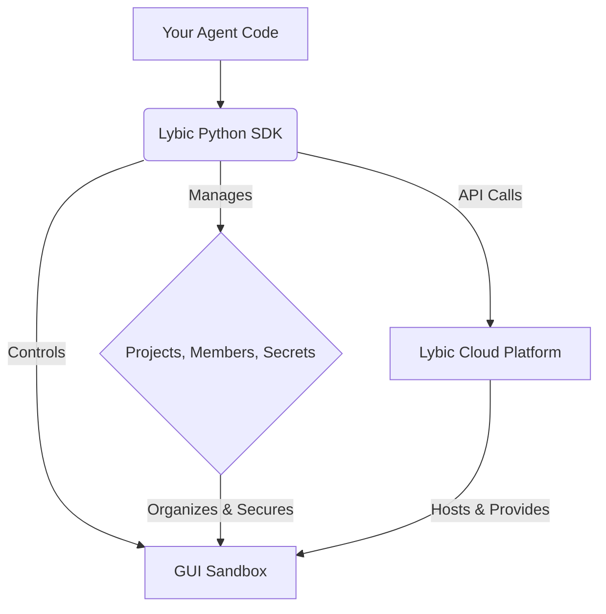

<p align="center">
  <a href="https://lybic.ai/">
    
  </a>
</p>

<h1 align="center">Lybic SDK for Python</h1>

<p align="center">
  <a href="https://pypi.org/project/lybic/"></a>
  <a href="https://github.com/lybic/lybic-sdk-python/blob/master/LICENSE"></a>
  <a href="https://lybic.ai/docs"></a>
  <a href="https://github.com/lybic/lybic-sdk-python/actions/workflows/pylint.yml"></a>
</p>

## Table of Contents

- [How It Works](#how-it-works)
- [✨ Why Lybic?](#-why-lybic)
- [🏝️ Sandbox Core Capabilities](#-sandbox-core-capabilities)
- [🚀 Getting Started](#-getting-started)
  - [1. Installation & Setup](#1-installation--setup)
  - [2. Core Workflow](#2-core-workflow)
  - [3. Synchronous Usage](#3-synchronous-usage)
  - [4. Debug Request](#4-debug-request)
  - [5. Exception Handling](#5-exception-handling)
- [🌒 Adapt LLM output pyautogui format](#-adapt-llm-output-pyautogui-format)
- [📔 Examples](#-examples)
- [📚 Full Documentation & API Reference](#-full-documentation--api-reference)
- [🤝 Contributing](#-contributing)
- [📄 License](#-license)

Developing, testing, and deploying GUI-based AI agents is complex. Developers waste precious time wrestling with cloud instances, VNC servers, and environment configurations instead of focusing on what matters: building intelligent agents.

**Lybic is the infrastructure layer for your GUI agents.**

**Lybic** (/ˈlaɪbɪk/) provides a robust, on-demand infrastructure platform designed specifically for the AI agent development lifecycle. This SDK for Python is your command center for programmatically controlling the entire Lybic ecosystem, empowering you to build, test, and scale your agents with unprecedented speed and simplicity.

## How It Works

The Lybic ecosystem is designed for clarity and control. Your code, powered by the Lybic SDK, interacts with the Lybic Cloud Platform to manage your resources and run your agents in secure, isolated GUI sandboxes.



## ✨ Why Lybic?

Lybic is a complete ecosystem designed to eliminate infrastructure friction and accelerate your agent development workflow.

#### 🚀 Focus on Your Agent, Not Infrastructure
Forget about managing virtual machines, display drivers, and remote desktop software. Lybic provides clean, on-demand GUI sandboxes in the cloud. Spin up a fresh environment in seconds and dedicate your time to your agent's core logic.

#### 🔐 Execute the code securely.
You can safely run the code generated by the agent in the Lybic sandbox without worrying about security vulnerabilities or jailbreaking issues.

#### 👥 Built for Teams, Ready for Scale
Organize your work with **Projects** and manage team access with fine-grained **Member Roles**. Whether you're a solo developer or part of a large team, Lybic provides the structure and security you need to collaborate and scale effectively.

#### 🤖 Observe and Interact in Real-Time
Every GUI sandbox includes a live, accessible desktop stream. This allows you to monitor your agent's actions in real-time for debugging, or to step in and provide guidance, making it perfect for developing complex tasks and implementing human-in-the-loop workflows.

## 🏝️ Sandbox Core Capabilities

Lybic sandboxes are secure, isolated GUI environments where your AI agents execute code and interact with applications. The SDK provides comprehensive APIs to create, manage, and interact with sandboxes.

**Sandbox Lifecycle Management:**
- **Create**: Launch new isolated sandbox environments with configurable names, lifetime, and resource shapes
- **From-existing-Create**: Create new sandboxes from existing ones(image) to clone environments
- **List**: Query all your sandboxes with metadata (creation date, expiration, project association)
- **Get**: Retrieve detailed information about a specific sandbox
- **Delete**: Clean up sandboxes to manage resources and costs
- **Extend Lifetime**: Prolong sandbox sessions when needed (default: 1 hour, max: 1 day)
- **Restart**: Reboot sandboxes to reset their state without full deletion

**Sandbox Interaction:**
- **Screenshots**: Capture real-time GUI screenshots for monitoring and debugging agent actions
- **Action Execution**: Execute mouse clicks, keyboard inputs, and other GUI automation actions
- **Code/Process Execution**: Run scripts and commands within the sandbox environment and run processes in the sandbox with stdin/stdout/stderr capture
- **File Transfer**: Bidirectional file transfer between sandbox and external storage (HTTP, S3, MinIO)

## 🚀 Getting Started

### 1. Installation & Setup

Getting started is simple. First, install the package from PyPI:

```bash
pip install lybic
```

To use features like the `Mcp` client, you need to install the optional dependencies:
```bash
pip install 'lybic[mcp]'
```

Then, initialize the client in your Python application. For better security, we recommend using environment variables (`LYBIC_ORG_ID`, `LYBIC_API_KEY`).

```python
import asyncio
from lybic import LybicClient, LybicAuth

# The LybicClient automatically picks up credentials from your environment
# def __init__(self,
#             auth: LybicAuth(
#               org_id: str = os.getenv("LYBIC_ORG_ID"),
#               api_key: str = os.getenv("LYBIC_API_KEY"),
#               endpoint: str = os.getenv("LYBIC_API_ENDPOINT", "https://api.lybic.cn"),
#               extra_headers: dict | None = None
#             ) | None = None,
#             timeout: int = 10,
#             max_retries: int = 3) -> None
async def main():
    # Initialize with environment variables
    async with LybicClient() as client:
        pass

    # Or, initialize with explicit credentials
    async with LybicClient(
        LybicAuth(
            org_id="your_org_id", # Lybic organization ID
            api_key="your_api_key", # Lybic API key
            endpoint="https://api.lybic.cn", # Lybic API endpoint
            extra_headers={"User-Agent": "MyAgent/1.0"}, # Custom headers
         ),
        timeout=10, # Timeout for API requests
        max_retries=3, # Maximum number of request retries
    ) as client:
        pass

if __name__=='__main__':
    asyncio.run(main())
```

Then, you can start using the `client`.

```python
import asyncio
from lybic import LybicClient

async def main():
    async with LybicClient() as client:
        # The create method returns a GetSandboxResponseDto object
        new_sandbox_response = await client.sandbox.create(name="my-sandbox", shape="xxx")
        print(new_sandbox_response.sandbox)

if __name__ == '__main__':
    asyncio.run(main())
```

Completed, you're ready to start building your agent!

### 2. Core Workflow

With the client initialized, the typical workflow follows these logical steps:

1. **Register(Or be invited into) an Organization**: Lybic allows you to register a new organization to manage your projects and resources.

2. **Create a `Project`**: Projects are the primary way to organize your work. They act as containers for your sandboxes, team members, and secrets.

3. **Launch a `Sandbox`**: Within a project, you can launch a GUI sandbox. This is your agent's secure, cloud-based home.

4. **Automate and Interact**: Once the sandbox is running, your agent can begin its work. The SDK provides all the necessary tools to interact with the sandbox, from executing commands to capturing screenshots.

### 3. Synchronous Usage

The Lybic SDK supports both **asynchronous** and **synchronous** usage patterns. The synchronous client (`lybic_sync`) provides the same API interface as the async client but without requiring `async`/`await` syntax, making it ideal for scripts, notebooks, or environments where async code is not preferred.

#### Using the Synchronous Client

```python
from lybic_sync import LybicSyncClient, LybicAuth

# Initialize with environment variables (LYBIC_ORG_ID, LYBIC_API_KEY)
with LybicSyncClient() as client:
    # List sandboxes - no await needed!
    sandboxes = client.sandbox.list()
    print(f"Found {len(sandboxes)} sandboxes")

# Or with explicit credentials
with LybicSyncClient(
    LybicAuth(
        org_id="your_org_id",
        api_key="your_api_key",
        endpoint="https://api.lybic.cn"
    ),
    timeout=10,
    max_retries=3
) as client:
    # Create a sandbox
    new_sandbox = client.sandbox.create(name="my-sandbox", shape="standard")
    print(f"Created: {new_sandbox.sandbox.id}")
    
    # Get organization stats
    stats = client.stats.get()
    print(f"Sandboxes: {stats.sandboxes}")
```

#### Synchronous vs Asynchronous API

The synchronous and asynchronous clients have **identical method signatures** - the only difference is that async methods require `await`:

#### When to Use Synchronous vs Asynchronous

**Use Synchronous (`lybic_sync`):**
- Simple scripts and automation tasks
- Jupyter notebooks or interactive Python shells
- Legacy codebases not using async/await
- When you want simpler, more straightforward code

**Use Asynchronous (`lybic`):**
- When you need high concurrency (managing many sandboxes simultaneously)
- In async web frameworks (FastAPI, aiohttp, etc.)
- When integrating with other async libraries
- For maximum performance in I/O-bound operations

### 4. Debug Request

You can set logging level to debug request.

```python
import logging

logging.basicConfig(level=logging.DEBUG)
logger = logging.getLogger('lybic')
```

### 5. Exception Handling

To ensure that each method in the SDK has **valid and definite** return content, we **DO NOT** handle any errors for 
exception requests.

For the robustness of the program code, all exceptions need to be handled by the user themselves.

Where will the exception occur?

1. init LybicClient()
  
   If you do not pass in a valid `org_id` and `endpoint`, an exception will occur.

2. call all `http` and `mcp` methods

   If the request fails(HTTPCode is 4xx or 5xx, or the request timeout), an exception will occur.

How to handle exceptions?

you can catch exceptions in the `try` block

```python
import asyncio
from lybic import LybicClient

async def main():
    # Use async with to ensure the client is properly managed.
    async with LybicClient() as client:
        try:
            # `await` the asynchronous method call inside the async function.
            preview_result = await client.sandbox.preview('sandbox_id')
            print(preview_result)
        except Exception as e:
            # Handle potential exceptions from the API call.
            print(f"An error occurred: {e}")

if __name__ == "__main__":
    asyncio.run(main())
```

## 🌒 Adapt LLM output pyautogui format

To facilitate the execution of GUI automation scripts generated by Large Language Models (LLMs), which are often trained using the popular `pyautogui` library, the Lybic SDK provides a `Pyautogui` compatibility class. This class mirrors the `pyautogui` interface, allowing you to execute LLM-generated code with minimal changes.

The SDK provides **synchronous** (`PyautoguiSync`) versions with identical APIs.

Note that if you use this module (lybic.pyautogui) in an asynchronous context, it will block the event loop.

### Usage

For simple scripts and synchronous code, use `PyautoguiSync`:

```python
from lybic_sync import LybicSyncClient, PyautoguiSync

sandbox_id = "your_sandbox_id"

client = LybicSyncClient()
# Create a PyautoguiSync instance
pyautogui = PyautoguiSync(client, sandbox_id)

# Execute pyautogui-style commands - no await needed!
llm_output = "pyautogui.moveTo(100, 150)"

# Warning: Using eval() on untrusted input is a security risk.
# Always sanitize and validate LLM output.
eval(llm_output)

# Or call methods directly
pyautogui.click(x=200, y=200)
pyautogui.write("Hello from Lybic!")
pyautogui.press("enter")

# Manual cleanup
pyautogui.close()
client.close()
```

### Context Manager Support

Both synchronous and asynchronous versions support context managers for automatic cleanup:

**Synchronous with context manager:**

```python
from lybic_sync import LybicSyncClient, PyautoguiSync

with LybicSyncClient() as client:
    sandbox_id = "your_sandbox_id"
    
    with PyautoguiSync(client, sandbox_id) as pyautogui:
        pyautogui.moveTo(100, 150)
        pyautogui.click(x=200, y=200)
        pyautogui.write("Hello from Lybic!")
        pyautogui.press("enter")
```

**Asynchronous with context manager:**

```python
import asyncio
from lybic import LybicClient, Pyautogui

client = LybicClient()
sandbox_id = "your_sandbox_id"

with Pyautogui(client, sandbox_id) as pyautogui:
    llm_output = "pyautogui.moveTo(100, 150)"
    eval(llm_output)
    pyautogui.click(x=200, y=200)
    pyautogui.write("Hello from Lybic!")
    pyautogui.press("enter")
    
asyncio.run(client.close())
```

**Fully asynchronous pattern:**

```python
import asyncio
from lybic import LybicClient, Pyautogui

async def main():
    async with LybicClient() as client:
        # Assume you have a sandbox
        sandbox_id = "your_sandbox_id"

        # Create a Pyautogui instance
        with Pyautogui(client, sandbox_id) as pyautogui:
            # Now you can execute pyautogui-style commands
            # For example, if an LLM outputs the following string:
            llm_output = "pyautogui.moveTo(100, 150)"
    
            # You can execute it like this:
            # Warning: Using eval() on untrusted input is a security risk.
            # Always sanitize and validate LLM output.
            eval(llm_output)
    
            # Or call methods directly
            pyautogui.click(x=200, y=200)
            pyautogui.write("Hello from Lybic!")
            pyautogui.press("enter")

if __name__ == "__main__":
    asyncio.run(main())
```

### Supported Functions

The `lybic.Pyautogui` class supports a subset of the most common `pyautogui` mouse and keyboard functions.

| Function | Supported | Notes |
| :--- | :---: | :--- |
| `position()` | ✅ | |
| `moveTo()` | ✅ | |
| `move()` | ✅ | |
| `click()` | ✅ | |
| `rightClick()` | ✅ | |
| `middleClick()` | ✅ | |
| `doubleClick()` | ✅ | |
| `tripleClick()` | ✅ | |
| `dragTo()` | ✅ | Only supports left-button dragging. |
| `scroll()` | ✅ | |
| `write()` | ✅ | A wrapper for `typewrite()`. |
| `typewrite()` | ✅ | Supports both strings and lists of strings. |
| `press()` | ✅ | Supports single key and list of keys. |
| `hotkey()` | ✅ | |
| `keyDown()` | ✅ | |
| `keyUp()` | ✅ | |

## 📔 Examples:

Please read our [SDK example](docs/example.md) for full usage examples.

If you are using the `Mcp` client, you can read our [Mcp Documentation](docs/mcp.md).

## 📚 Full Documentation & API Reference

This README provides a high-level overview of Lybic's capabilities. For detailed, up-to-date code examples, tutorials, and a complete API reference, please visit our **[official documentation site](https://lybic.ai/docs)**.

## 🤝 Contributing

We welcome contributions from the community! Please see our [Contributing Guidelines](https://github.com/lybic/lybic-sdk-python/blob/master/CONTRIBUTING.md) for more details on how to get involved.

## 📄 License

This project is licensed under the MIT License. See the [LICENSE](https://github.com/lybic/lybic-sdk-python/blob/master/LICENSE) file for details.
