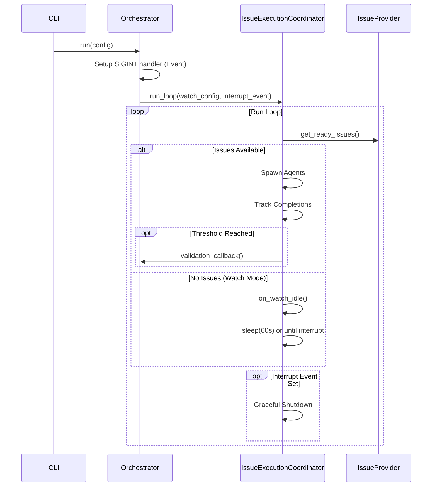

# Implementation Plan: Watch Mode (`--watch`)

## Context & Goals
- **Spec**: `/home/cyou/mala/docs/2026-01-05-persistent-run-mode-spec.md`
- Implement a persistent `--watch` mode for the orchestrator, enabling it to poll for new issues every 60 seconds instead of exiting when idle.
- Introduce periodic validation via `--validate-every N` to ensure system health during long-running sessions.
- This feature improves the workflow for continuous processing of issues without manual restarts.

## Scope & Non-Goals
- **In Scope**
  - `--watch` boolean flag and `--validate-every N` integer flag (default 10).
  - Watch loop logic in `IssueExecutionCoordinator.run_loop()`: sleep and re-poll when idle.
  - Graceful shutdown on SIGINT (Ctrl+C) via `asyncio.Event`.
  - Periodic run-level validation blocking new spawns until completion.
  - Specific exit codes: 0 (success/clean exit), 1 (validation fail), 2 (invalid args), 3 (poll fail), 130 (SIGINT).
  - New event `on_watch_idle` for observability.
  - Rate-limited idle logging (once on transition to idle, then every 5 minutes while idle).
- **Out of Scope (Non-Goals)**
  - Changing logic for issue readiness detection (uses existing providers).
  - Modifying agent spawning or finalization logic (reuse existing).
  - Changes to gate or review retry mechanisms.
  - Parallelizing validation (must block new work).
  - Configurable poll interval (hardcoded to 60 seconds per spec).

## Assumptions & Constraints
- The `IssueExecutionCoordinator` is the central place for the run loop; modifications here are sufficient to control the flow.
- The system must remain responsive to SIGINT during the 60-second sleep.
- Validation is a "stop-the-world" event regarding new issue fetching.

### Implementation Constraints
- **Pattern**: Use functional composition for watch state. Pass a `WatchState` dataclass into the loop rather than extending `OrchestratorState`.
- **Location**: `WatchState` and `WatchConfig` dataclasses live in `src/orchestration/types.py` alongside `OrchestratorConfig` and other config types (follows existing pattern).
- **Async**: Use `asyncio.Event` for interrupt signaling. The loop must check this event in its termination conditions.
- **Injection**: Inject `sleep_fn` into `run_loop` for testability (avoiding real wall-clock waits).
- **Interruptible sleep**: Default sleep implementation uses `asyncio.wait([interrupt_event.wait()], timeout=poll_interval)` pattern to break immediately on SIGINT rather than waiting for timeout to expire.
- **Validation callback**: Use callback function pattern (matches existing `SpawnCallback`, `FinalizeCallback` patterns in coordinator). Pass `validation_callback: Callable[[], Awaitable[bool]]` into `run_loop()` that orchestrator provides. The orchestrator wraps `RunCoordinator.run_validation()` in this callback.

### Testing Constraints
- **Time**: Tests must not rely on real wall-clock time; use mocked clocks/sleeps.
- **Signals**: Integration tests must verify `SIGINT` handling without killing the test runner.
- **Coverage**: Must verify that validation triggers exactly at thresholds and handles failures by aborting.
- **File organization**: Create dedicated `test_watch_mode.py` files to keep watch-specific tests separated from existing coordinator tests.

## Prerequisites
- [ ] No external dependencies or approvals needed.
- [ ] Existing `RunCoordinator.run_validation()` is available and sufficient.
- [ ] `FakeIssueProvider` exists for simulating empty/non-empty queues in tests.

## High-Level Approach
1. **CLI & Config**: Add flags to `cli.py` and pipe them into `OrchestratorConfig` via `run_config.py`.
2. **Orchestrator Setup**: In `Orchestrator.run()`, install a signal handler that sets an `asyncio.Event`. Pass this event and the watch config to the coordinator.
3. **Coordinator Loop**: Refactor `IssueExecutionCoordinator.run_loop()`:
   - Accept `WatchConfig` and `interrupt_event`.
   - Initialize `WatchState` (tracking completions, validation thresholds).
   - When no issues are ready: check if watch enabled. If so, emit `on_watch_idle`, await `sleep_fn` (interruptible), and continue loop.
   - On issue completion: increment counter. If threshold crossed, pause fetching, await active agents, run validation.
4. **Validation Logic**: If periodic validation fails, set the abort flag and return exit code 1.
5. **Exit Handling**: Ensure correct exit code is returned based on termination reason (interrupt vs. error vs. success).

## Technical Design

### Architecture

The `Orchestrator` remains the entry point but delegates the long-running loop control to `IssueExecutionCoordinator`.



Key boundaries:
- Orchestrator owns signal handling and validation execution
- Coordinator owns the run loop and watch state
- WatchState is a simple dataclass composed into the loop

### Data Model

**New Dataclasses in `src/orchestration/types.py`**:

```python
@dataclass
class WatchConfig:
    """Configuration for watch mode behavior."""
    enabled: bool = False
    validate_every: int = 10
    poll_interval_seconds: float = 60.0  # Internal, not CLI-exposed

@dataclass
class WatchState:
    """Runtime state for watch mode (internal to Coordinator)."""
    completed_count: int = 0
    last_validation_at: int = 0
    next_validation_threshold: int = 10
    consecutive_poll_failures: int = 0
    last_idle_log_time: float = 0.0  # For rate-limited logging
    was_idle: bool = False  # Tracks previous loop iteration state for transition detection
```

- `completed_count`: Total issues finalized in this session (success OR failure).
- `last_validation_at`: `completed_count` when validation last ran.
- `next_validation_threshold`: Target count for next validation.
- `consecutive_poll_failures`: Tracks errors during `get_ready_issues` for abort logic (abort after 3).
- `last_idle_log_time`: Timestamp of last idle log for rate limiting (every 5 minutes).
- `was_idle`: Boolean to detect transition to idle state. Enables "log once on transition, then rate-limit" behavior.

### API/Interface Design

**CLI**:
- `--watch`: Boolean, default False.
- `--validate-every`: Integer, default 10. Must be >= 1 (exit code 2 if 0 or negative).

**Protocol (EventSink)**:
- `on_watch_idle(wait_seconds: float, issues_blocked: int | None)`: Emitted when entering sleep. `issues_blocked` is count of issues that exist but aren't ready, or `None` if unknown.

**IssueProvider protocol extension**:
- Add optional `get_blocked_count_async() -> int | None` method to `IssueProvider` protocol with default `None` return (not all providers can answer this).
- `BeadsClient` implementation: call `bd list --status blocked --json | wc -l` or similar to get count.
- If provider returns `None`, console sink logs "Idle: no ready issues" (without distinction).

**Coordinator signature update**:
```python
async def run_loop(
    self,
    spawn_callback: SpawnCallback,
    finalize_callback: FinalizeCallback,
    abort_callback: AbortCallback,
    watch_config: WatchConfig | None = None,
    interrupt_event: asyncio.Event | None = None,
    validation_callback: Callable[[], Awaitable[bool]] | None = None,
    sleep_fn: Callable[[float], Awaitable[None]] = asyncio.sleep,
) -> RunResult
```

**New return type**:
```python
@dataclass
class RunResult:
    """Result of a coordinator run loop."""
    issues_spawned: int
    exit_code: int  # 0, 1, 2, 3, or 130
    exit_reason: str  # "success", "validation_failed", "poll_failed", "interrupted"
```

### File Impact Summary

| Path | Status | Description |
|------|--------|-------------|
| `src/cli/cli.py` | Modified | Add `--watch` and `--validate-every` flags; use exit code from result. |
| `src/orchestration/types.py` | Modified | Add `WatchConfig`, `WatchState`, `RunResult` dataclasses. |
| `src/pipeline/issue_execution_coordinator.py` | Modified | Implement watch loop, sleep logic, validation triggers; return `RunResult`. |
| `src/orchestration/orchestrator.py` | Modified | Handle SIGINT setup, pass events/config to coordinator; propagate exit code. |
| `src/core/protocols.py` | Modified | Add `on_watch_idle` to `MalaEventSink`; add `get_blocked_count_async` to `IssueProvider`. |
| `src/infra/io/base_sink.py` | Modified | Add no-op `on_watch_idle` default implementation. |
| `src/infra/io/console_sink.py` | Modified | Implement `on_watch_idle` logging with rate limiting. |
| `src/infra/clients/beads_client.py` | Modified | Implement `get_blocked_count_async()` method. |
| `tests/unit/pipeline/test_watch_mode.py` | **New** | Focused unit tests for watch logic/state. |
| `tests/integration/test_watch_mode.py` | **New** | Integration tests for signal handling and long-running flows. |

## Risks, Edge Cases & Breaking Changes

### Edge Cases & Failure Modes
- **Poll Failures**: If `get_ready_issues()` fails, log error. Reset counter on success. Abort with exit code 3 after 3 consecutive failures.
- **Validation Failure**: If periodic validation fails, the system must abort immediately (drain active agents, then exit 1).
- **Interrupt during Validation**: If SIGINT received during validation, defer until validation completes (then exit 130).
- **Interrupt during Sleep**: Break sleep immediately, run final validation if needed, then exit 130.
- **Zero Interval**: `--validate-every 0` rejected with error message and exit code 2.
- **Parallel completions**: Counter may jump 9->12; trigger validation once when `completed_count >= next_threshold`, then advance threshold by N.
- **Final validation skip**: Skip if validation just ran at threshold (avoids redundant), or if aborting due to validation failure.

### Breaking Changes & Compatibility
- **None**: Watch mode is opt-in. Default behavior remains "run until done and exit".
- **Signature Change**: `run_loop` signature changes, but all new parameters are optional with defaults maintaining current behavior.
- **Return Type Change**: `run_loop` changes from `-> int` to `-> RunResult`. Callers must update:
  - `orchestrator.py:_run_main_loop()` returns `RunResult` instead of `int`
  - `orchestrator.py:run()` extracts `result.exit_code` and returns it
  - CLI's `run()` command uses this exit code for `sys.exit()`
  - Existing tests asserting on `int` return must be updated to check `result.issues_spawned`

## Testing & Validation Strategy

### Unit Tests (`tests/unit/pipeline/test_watch_mode.py`)
- Inject `sleep_fn` that returns immediately and records calls.
- Use `FakeIssueProvider` (already exists) to control ready issue sequence.
- **Watch loop behavior**:
  - Verify loop sleeps and retries when provider returns empty (watch enabled).
  - Verify loop exits immediately when provider returns empty (watch disabled - current behavior).
  - Verify loop exits when `interrupt_event` is set.
  - Verify `on_watch_idle` event emitted with correct parameters.
- **Validation triggers**:
  - Verify `validate_every` triggers `validation_callback` at correct counts.
  - Verify validation not called redundantly on exit if just ran.
  - Verify threshold advances correctly after validation (10->20->30).
- **Error handling**:
  - Verify 3 consecutive poll failures result in abort (exit code 3).
  - Verify poll failure counter resets on success.
  - Verify validation failure results in abort (exit code 1).
- **Exit codes**:
  - Verify exit code 0 on normal completion.
  - Verify exit code 130 on interrupt.

### Integration Tests (`tests/integration/test_watch_mode.py`)
- Use `asyncio.timeout` to bound test duration.
- Inject short poll interval (0.1s) via test-only parameter for fast iteration.
- **Signal handling**:
  - Send `SIGINT` (via `os.kill(os.getpid(), signal.SIGINT)`) and verify clean exit code 130.
  - Verify active agents finish before exit.
- **Full flow**:
  - Simulate "no issues" -> "new issue added" -> "processed" flow.
  - Verify new issues picked up after sleep.

### Acceptance Criteria Coverage
| Spec AC | Covered By |
|---------|------------|
| Watch stays running when idle | Unit: verify sleep called, loop continues |
| Re-polls after 60s | Unit: verify provider call after sleep |
| Idle state = no ready + no active | Unit: verify both conditions checked |
| `--validate-every` triggers validation | Unit: verify callback at threshold |
| Completion counting (terminal states only) | Unit: verify counter logic |
| Exit code 0 on success | Unit: verify return value |
| Exit code 1 on validation failure | Unit: verify return value |
| Exit code 2 on invalid args | Unit: CLI argument validation |
| Exit code 3 on poll failure | Unit: verify retry logic and abort |
| Exit code 130 on SIGINT | Integration: signal handling |
| Rate-limited idle logging | Unit: verify 5-minute throttle |

## Open Questions
- **Resolved**: WatchState location -> `src/orchestration/types.py` (follows existing pattern).
- **Resolved**: Validation callback mechanism -> Callback function pattern (matches existing `SpawnCallback`).
- **Resolved**: Poll interval configurability -> Hardcoded to 60s per spec (not exposed to CLI).
- **Resolved**: Test file organization -> Dedicated `test_watch_mode.py` files.
- **Resolved**: Console output during idle -> Event sink `on_watch_idle` with rate limiting (once on transition, every 5 min thereafter).
- **Resolved**: Idle log message format -> Per spec: "Idle: no ready issues" vs "Idle: N issues exist but none ready".

## Next Steps
After this plan is approved, run `/create-tasks` to generate:
- `--beads` -> Beads issues with dependencies for multi-agent execution
- (default) -> TODO.md checklist for simpler tracking
